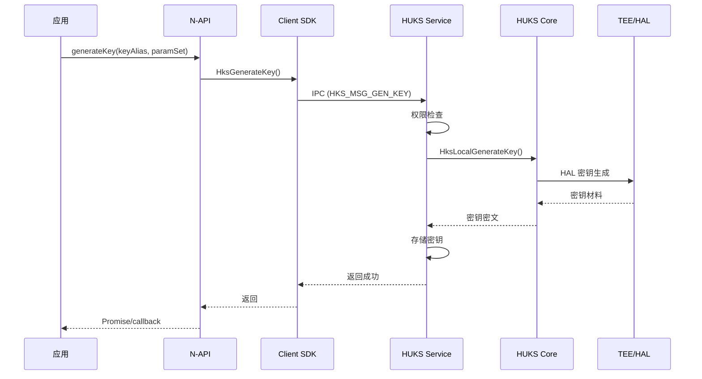
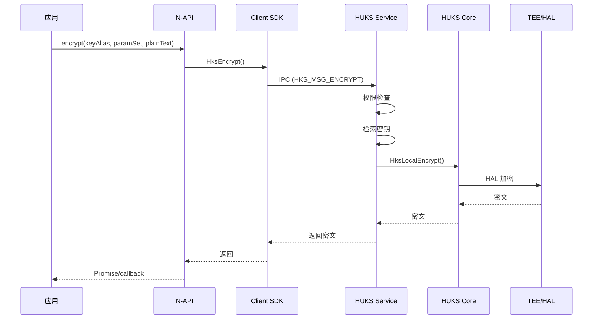
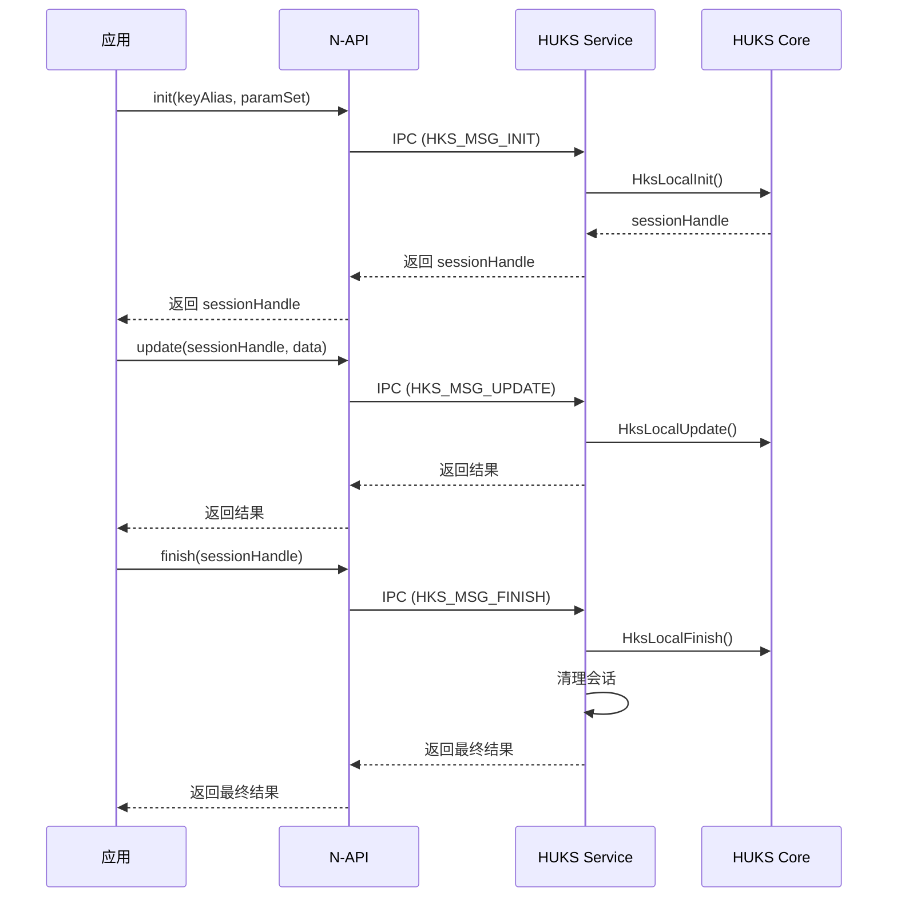
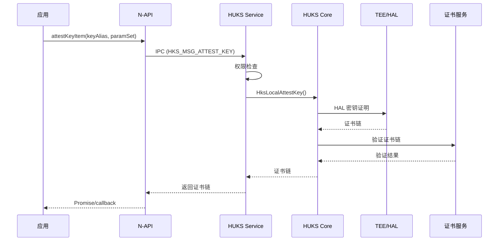
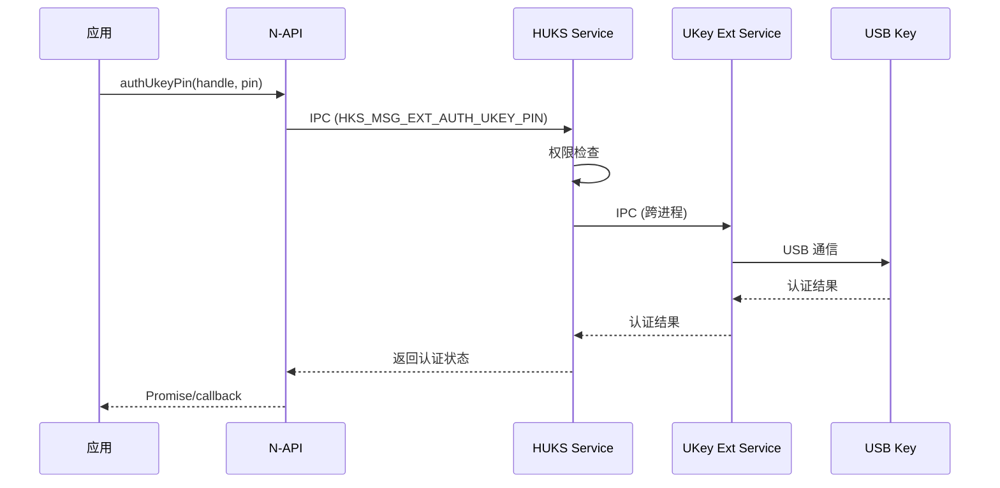

# 架构说明

> HUKS 的架构设计、组件关系、数据流和线程模型

**目的**: 理解 HUKS 的三层架构、组件关系和数据流
**适用范围**: 系统开发者、架构师
**相关文档**: [项目概览](./00_Overview.md) | [目录结构](./01_Directory_Structure.md) | [对外 API](./03_External_API.md)

---

## 1. 架构概览

### 1.1 三层架构

**证据**: `README_zh.md:13-19`

```
┌─────────────────────────────────────────────────────────┐
│  HUKS SDK 层                                          │
│  - 提供 HUKS API 供应用调用                          │
│  - N-API / C API / CJ API                             │
└─────────────────────────────────────────────────────────┘
                        ↓ IPC (Binder / Samgr Lite)
┌─────────────────────────────────────────────────────────┐
│  HUKS Service 层                                      │
│  - 实现 HUKS 密钥管理、存储等功能                    │
│  - System Ability (SA ID: 3510)                      │
└─────────────────────────────────────────────────────────┘
                        ↓
┌─────────────────────────────────────────────────────────┐
│  HUKS Core 层                                         │
│  - HUKS 核心模块，负责密钥生成以及加解密等工作        │
│  - 运行在安全环境（TEE）                              │
└─────────────────────────────────────────────────────────┘
```

### 1.2 架构层次说明

| 层级 | 位置 | 功能 | 运行环境 |
|-----|------|------|---------|
| **SDK 层** | `interfaces/kits/` | 提供 API 给应用 | 普通执行环境 |
| **Service 层** | `services/huks_standard/huks_service/` | 密钥会话管理、存储管理 | 普通执行环境 |
| **Core 层** | `services/huks_standard/huks_engine/` | 密钥生成、加解密、访问控制 | **TEE/安全芯片** |

---

## 2. 组件关系

### 2.1 SDK 层组件

```
interfaces/kits/
├── napi/               # JS/TS N-API
│   ├── huks_napi.cpp  # 主模块注册 (security.huks)
│   └── huks_napi_ukey_module.cpp  # UKey 模块 (security.huksExternalCrypto)
├── c/                  # Native C API (NDK)
│   └── huks_ndk.so    # 输出动态库
└── cj/                 # Cangjie FFI
    └── cj_huks_ffi.so # 输出动态库
```

**证据**: `interfaces/kits/*/BUILD.gn`

### 2.2 Service 层组件

```
services/huks_standard/huks_service/main/
├── core/                        # 服务核心
│   ├── hks_client_service.c     # 客户端服务主逻辑
│   ├── hks_storage_manager.c    # 存储管理
│   └── hks_session_manager.c    # 会话管理
├── os_dependency/sa/            # System Ability
│   ├── hks_sa.h                # SA 定义 (SA ID: 3510)
│   ├── hks_sa.cpp              # SA 实现
│   └── hks_sa_interface.h      # IPC 接口
├── os_dependency/idl/ipc/      # IPC 通信
│   └── hks_permission_check.cpp # 权限检查
└── systemapi_wrap/             # 系统 API 包装
    ├── at_wrapper/             # Access Token
    └── bms/                    # Bundle Manager
```

**证据**: `services/huks_standard/huks_service/main/*/BUILD.gn`

### 2.3 Core 层组件

```
services/huks_standard/huks_engine/main/
└── core/                       # 引擎核心
    ├── huks_engine_core.c     # 引擎核心逻辑
    └── core_dependency/        # HAL API

frameworks/huks_standard/main/crypto_engine/
├── mbedtls/                   # MbedTLS 引擎
└── openssl/                   # OpenSSL 引擎
```

**证据**: `services/huks_standard/huks_engine/main/core/BUILD.gn`

---

## 3. 数据流

### 3.1 密钥生成数据流



### 3.2 加密操作数据流



### 3.3 三阶段操作数据流



---

## 4. IPC 通信

### 4.1 IPC 机制

**标准系统 (L2)**: Binder IPC
- SA ID: 3510
- 类: `HksService` (继承 `SystemAbility`)
- 接口: `IHksService`, `HksStub`, `HksProxy`

**证据**: `services/huks_standard/huks_service/main/os_dependency/sa/hks_sa.h:41`

**轻量系统 (L1)**: Samgr Lite IPC
- 服务名: "huks_service"
- Feature 名: "huks_feature"

**证据**: `services/huks_standard/huks_service/main/os_dependency/sa/sa_mgr/hks_samgr_service.c`

### 4.2 IPC 接口码

**证据**: `frameworks/huks_standard/main/common/include/huks_service_ipc_interface_code.h`

| 接口码 | 操作 | 处理函数 |
|--------|------|---------|
| HKS_MSG_GEN_KEY | 生成密钥 | HksIpcServiceGenerateKey |
| HKS_MSG_IMPORT_KEY | 导入密钥 | HksIpcServiceImportKey |
| HKS_MSG_EXPORT_PUBLIC_KEY | 导出公钥 | HksIpcServiceExportPublicKey |
| HKS_MSG_DELETE_KEY | 删除密钥 | HksIpcServiceDeleteKey |
| HKS_MSG_ENCRYPT | 加密 | HksIpcServiceEncrypt |
| HKS_MSG_DECRYPT | 解密 | HksIpcServiceDecrypt |
| HKS_MSG_SIGN | 签名 | HksIpcServiceSign |
| HKS_MSG_VERIFY | 验签 | HksIpcServiceVerify |
| HKS_MSG_INIT | 三阶段初始化 | HksIpcServiceInit |
| HKS_MSG_UPDATE | 三阶段更新 | HksIpcServiceUpdate |
| HKS_MSG_FINISH | 三阶段完成 | HksIpcServiceFinish |
| HKS_MSG_ABORT | 三阶段中止 | HksIpcServiceAbort |

### 4.3 IPC 消息处理

**证据**: `services/huks_standard/huks_service/main/os_dependency/sa/hks_sa.cpp:321`

```cpp
int HksService::OnRemoteRequest(uint32_t code, MessageParcel &data,
                               MessageParcel &reply, MessageOption &option)
{
    // 1. 权限检查
    // 2. 消息分发
    // 3. 返回结果
}
```

---

## 5. 线程模型

### 5.1 标准系统线程模型

```
┌─────────────────────────────────────────────────────────┐
│  应用进程                                             │
│  - 主线程: JS/TS 执行                                │
│  - 工作线程: N-API 异步操作                           │
└─────────────────────────────────────────────────────────┘
                        ↓ IPC (Binder)
┌─────────────────────────────────────────────────────────┐
│  HUKS Service 进程                                    │
│  - IPC 线程池: 处理客户端请求                        │
│  - 工作线程: 异步密钥操作                            │
│  - 存储线程: 密钥存储 I/O                             │
└─────────────────────────────────────────────────────────┘
                        ↓
┌─────────────────────────────────────────────────────────┐
│  HUKS Core (TEE)                                       │
│  - 加密引擎线程: 密钥运算                             │
└─────────────────────────────────────────────────────────┘
```

### 5.2 异步操作模式

**证据**: `interfaces/kits/napi/src/v9/huks_napi_common_item.h`

N-API 异步操作支持两种模式：
1. **Promise 模式**: 返回 Promise 对象
2. **Callback 模式**: 传入回调函数

**判断方式**: 根据是否传入 Callback 函数
- 不传 Callback → Promise 模式
- 传入 Callback → Callback 模式

### 5.3 工作队列

N-API 使用 `napi_queue_async_work()` 将异步任务加入工作队列。

**证据**: `interfaces/kits/napi/src/v9/huks_napi_common_item.cpp`

---

## 6. 关键时序

### 6.1 密钥证明时序



### 6.2 UKey 扩展操作时序



---

## 7. 安全设计

### 7.1 密钥保护

**核心原则**: 密钥明文仅在安全环境（TEE）中访问

**证据**: `README_zh.md:19`

### 7.2 访问控制

**多层权限检查**:
1. **Token 类型检查**: 区分原生应用、HAP 应用、Shell
2. **系统应用检查**: 某些操作仅允许系统应用
3. **Access Token 验证**: 验证应用权限
4. **UID 白名单**: 某些敏感操作仅允许特定 UID
5. **跨账户权限**: 跨用户访问需要特殊权限

**证据**: `services/huks_standard/huks_service/main/os_dependency/idl/ipc/hks_permission_check.cpp`

### 7.3 密钥存储

**存储级别**:
- **DE (Device Encrypted)**: 设备加密
- **CE (Credential Encrypted)**: 凭证加密
- **ECE (Enhanced CE)**: 增强凭证加密

**证据**: `services/huks_standard/huks_service/main/hks_storage/src/hks_storage_manager.c`

---

## 8. 扩展机制

### 8.1 UKey 扩展

**能力**: 支持 USB Key 密钥操作

**组件**:
- `interfaces/kits/napi/src/huks_napi_ukey_module.cpp` - N-API 模块
- `services/huks_standard/huks_service/extension/ukey/` - UKey 服务
- `services/huks_standard/huks_service/extension/ukey/common/IHuksAccessExtBase.idl` - IDL 接口

**证据**: `interfaces/kits/napi/src/huks_napi_ukey_module.cpp`, `services/huks_standard/huks_service/extension/ukey/common/IHuksAccessExtBase.idl`

### 8.2 插件模块加载

**能力**: 动态加载加密扩展模块

**证据**: `services/huks_standard/huks_service/extension/module_loader/`

---

## 9. 相关文档

- [项目概览](./00_Overview.md) - HUKS 定位和核心能力
- [目录结构](./01_Directory_Structure.md) - 代码组织和模块职责
- [对外 API](./03_External_API.md) - API 接口详细说明
- [安全风险评审](./07_Security_Audit.md) - 安全设计和风险点
