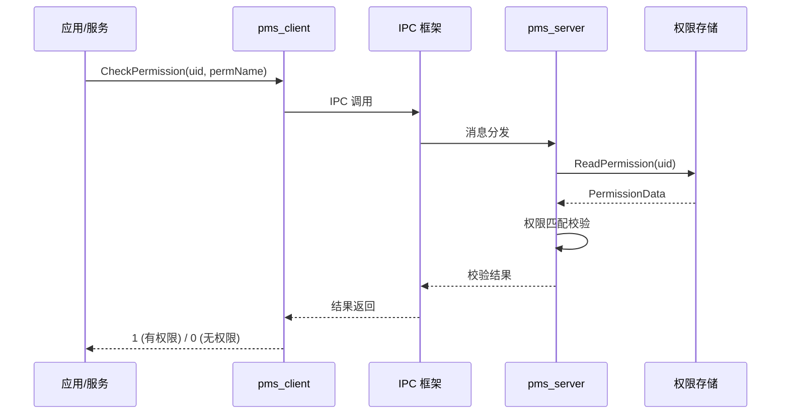
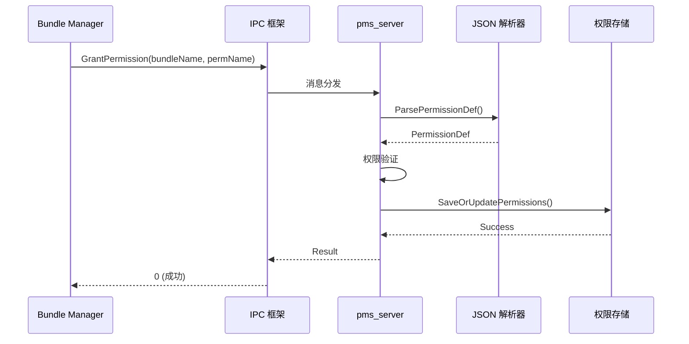
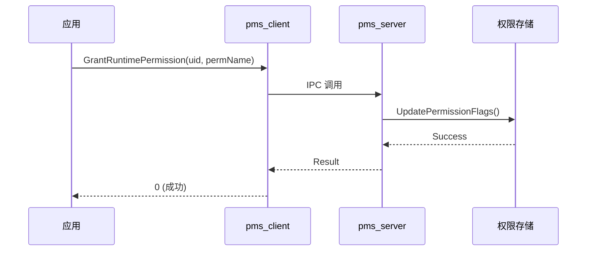
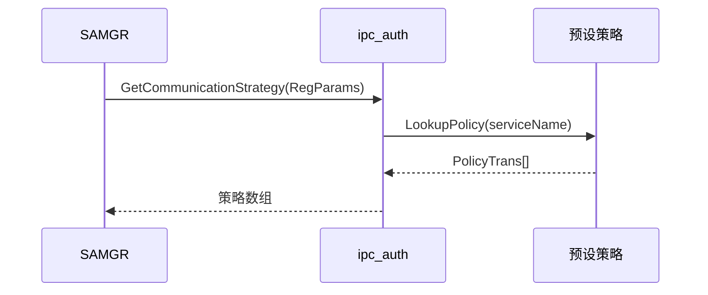
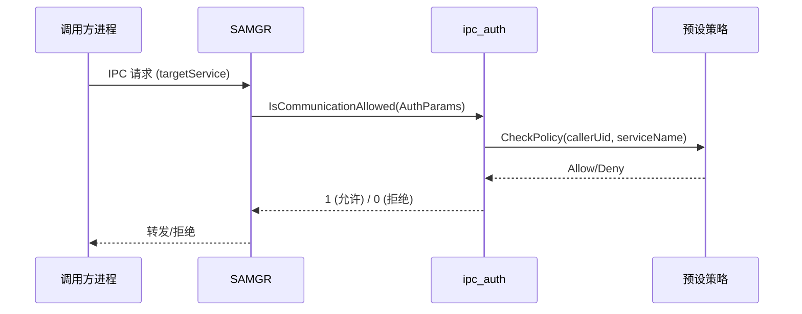
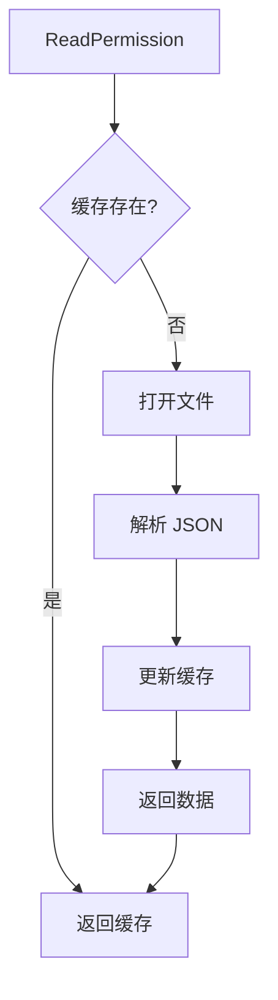
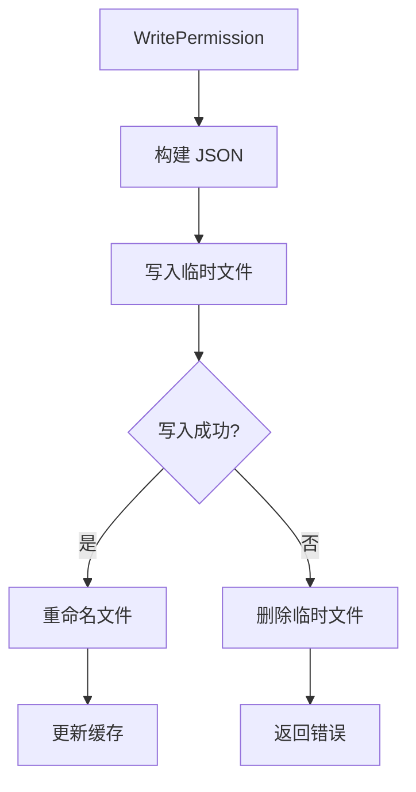
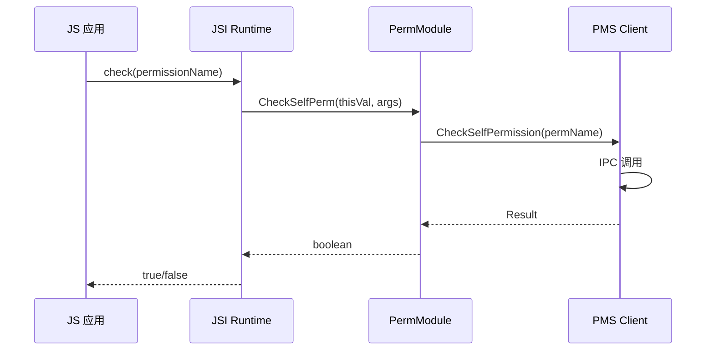
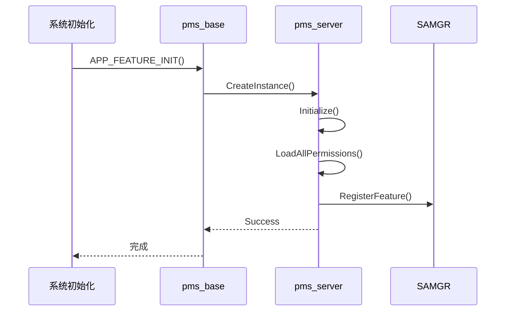

# 调用链图谱

## 概述

本文档展示 Permission Lite 的关键调用链，包括权限校验流程、IPC 认证流程和权限管理流程。

---

## 权限校验调用链

### 同步校验流程



### 代码路径

| 步骤 | 文件 | 函数 |
|------|------|------|
| 入口 | `interfaces/kits/pms_interface.h` | `CheckPermission()` |
| 客户端 | `services/pms_client/perm_client.c` | `PermClientCheckPermission()` |
| 服务端 | `services/pms/src/pms_impl.c` | `PmsCheckPermission()` |
| 存储 | `services/pms/src/pms_inner.c` | `ReadPermissionFromFile()` |

---

## 权限授予调用链

### 安装时授予



### 运行时授予



### 代码路径

| 步骤 | 文件 | 函数 |
|------|------|------|
| 入口 | `interfaces/kits/pms_interface.h` | `GrantPermission()` |
| 实现 | `services/pms/src/pms_impl.c` | `GrantPermission()` |
| 存储 | `services/pms/src/pms_inner.c` | `SavePermission()` |

---

## IPC 认证调用链

### 策略查询流程



### 访问校验流程



### 代码路径

| 步骤 | 文件 | 函数 |
|------|------|------|
| 策略查询 | `services/ipc_auth/src/ipc_auth_impl.c` | `GetCommunicationStrategy()` |
| 策略校验 | `services/ipc_auth/src/ipc_auth_impl.c` | `IsCommunicationAllowed()` |
| 策略配置 | `services/ipc_auth/include/policy_preset.h` | `g_presetPolicies[]` |

---

## 权限存储调用链

### 读取权限



### 写入权限



### 代码路径

| 操作 | 文件 | 函数 |
|------|------|------|
| 读取 | `services/pms/src/pms_inner.c` | `ReadPermissionFromFile()` |
| 写入 | `services/pms/src/pms_inner.c` | `WritePermissionToFile()` |
| 解析 | `services/pms/src/pms_inner.c` | `ParsePermissionJson()` |

---

## JS API 调用链

### ACE Lite JSI 调用



### 代码路径

| 步骤 | 文件 | 函数 |
|------|------|------|
| 入口 | `services/js_api/src/perm_module.cpp` | `CheckSelfPerm()` |
| 实现 | `services/js_api/src/perm_module.cpp` | `PermModule::CheckSelfPerm()` |

---

## 服务初始化调用链



### 代码路径

| 步骤 | 文件 | 函数 |
|------|------|------|
| 初始化 | `services/pms_base/src/permission_service.c` | `Init()` |
| 实例创建 | `services/pms_base/src/permission_service.c` | `PermissionService::GetInstance()` |
| 服务注册 | `services/pms/src/pms_server.c` | `Init()` |

---

## 完整调用链视图

```
┌─────────────────────────────────────────────────────────────────────────────┐
│                              权限校验完整调用链                                │
├─────────────────────────────────────────────────────────────────────────────┤
│                                                                              │
│  ┌──────────┐                                                               │
│  │   App    │  (调用方)                                                     │
│  └───┬──────┘                                                               │
│      │                                                                      │
│      ▼  C API 调用                                                         │
│  ┌──────────┐     ┌──────────┐     ┌──────────┐     ┌──────────┐          │
│  │   C API  │────▶│Client    │────▶│   IPC    │────▶│  Server  │          │
│  │ Interface│     │Stub      │     │Framework │     │Dispatcher│          │
│  └───┬──────┘     └──────────┘     └──────────┘     └────┬─────┘          │
│      │                                                   │                 │
│      │                                                   ▼                 │
│      │                                           ┌──────────────┐          │
│      │                                           │ 权限校验逻辑 │          │
│      │                                           │(PmsCheck)    │          │
│      │                                           └──────┬───────┘          │
│      │                                                  │                  │
│      │                                                  ▼                  │
│      │                                          ┌──────────────┐          │
│      │                                          │  权限存储    │          │
│      │                                          │(JSON 文件)   │          │
│      │                                          └──────────────┘          │
│      │                                                                          │
│      ◀────────────────────────────────────────────────────────────────────────┘
│                                      │
│                              返回校验结果 (1/0)
│
└─────────────────────────────────────────────────────────────────────────────┘
```

---

## 相关文档

- 架构说明 → `02_Architecture.md`
- API 接口 → `03_APIs.md`
- 内部 API → `appendix/06_Inner_APIs.md`
