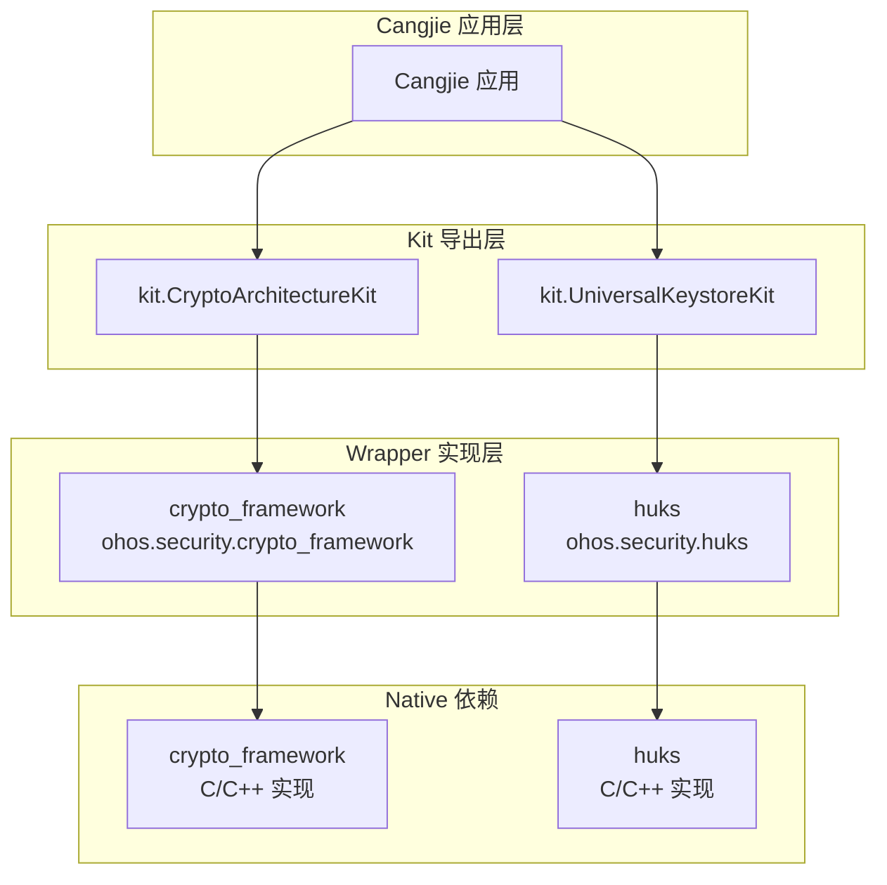

# 项目概览

## 项目定位

`security_cangjie_wrapper` 是 OpenHarmony 安全子系统的 **Cangjie 语言封装层**，为上层应用提供加密算法和密钥管理（HUKS）能力。

**证据来源**：`README.md:1-5`（项目介绍）

### 核心职责

| 职责 | 说明 |
|------|------|
| API 桥接 | 将 Native 层 Crypto Framework/HUKS 能力暴露给 Cangjie 应用 |
| 类型转换 | 处理 Cangjie ↔ C 数据结构转换（HcfBlob、OhosHksBlob） |
| 错误映射 | 将 Native 错误码转换为 Cangjie BusinessException |
| Kit 导出 | 提供符合 OpenHarmony Kit 规范的模块导出 |

## 核心能力

### Crypto Architecture Kit

提供**基础加密算法能力**，包括：

| 功能 | 支持算法 | 文件位置 |
|------|----------|----------|
| 对称密钥生成 | AES、3DES、SM4、HMAC | `sym_key_generator.cj:45-54` |
| 加密/解密 | AES、3DES、RSA、SM4 | `cipher.cj:64-73` |
| 消息摘要 | SHA256、SHA384、SHA512、SM3 | `md.cj:45-54` |
| 随机数生成 | CTR_DRBG | `random.cj:44-51` |
| 消息认证码 | HMAC | `mac.cj:47-56` |

**约束**：仅提供密钥操作能力，不管理密钥生命周期。应用需自行管理密钥存储。

### Universal Keystore Kit

提供**完整密钥生命周期管理**，基于 HUKS 实现：

| 功能 | 说明 | 文件位置 |
|------|------|----------|
| 密钥生成/导入 | 支持 RSA/ECC/AES/HMAC 等 | `huks_key_item.cj:364-391` |
| 密钥使用 | 加密/解密/签名/验证/密钥协商 | `huks_session.cj:49-98` |
| 密钥删除 | 安全销毁密钥 | `huks_key_item.cj:414-443` |
| 密钥证明 | Attestation 能力 | `huks_key_item.cj:157-211` |
| 密钥属性查询 | 获取密钥元数据 | `huks_key_item.cj:103-129` |

**证据来源**：`README.md:28-58`（功能列表）

## 运行环境

### 系统要求

| 要求 | 说明 |
|------|------|
| 系统类型 | 仅支持 **Standard** 设备 |
| 最低 API | API Level 22 |
| 依赖子系统 | `cangjie_ark_interop`、`hiviewdfx_cangjie_wrapper`、`crypto_framework`、`huks` |

**证据来源**：`bundle.json:19-25`（adapted_system_type）、`bundle.json:29-35`（deps）

### 资源占用

| 资源 | 大小 |
|------|------|
| ROM | ~600 KB |
| RAM | ~604 KB |

**证据来源**：`bundle.json:26-27`（rom/ram）

## 约束与限制

相比 ArkTS 实现，以下功能**暂不支持**：

| 功能 | 状态 | 说明 |
|------|------|------|
| 程序访问控制 | ❌ 未实现 | `huks_enum.cj:985-1009` 仅定义，未使用 |
| 证书模块 | ❌ 未实现 | 无对应导出 |
| 用户认证 | ❌ 未实现 | UserAuth 枚举存在，未集成 |
| 加密插件功能 | ❌ 未实现 | Plugin 机制未封装 |

**证据来源**：`README.md:75-82`（Constraints 章节）

## 模块关系

**关键路径**：
- Kit → Wrapper：`kit/CryptoArchitectureKit/index.cj:18-20`（public import ohos.security.crypto_framework）
- Wrapper → Native：`ohos/security/crypto_framework/cj_crypto_native.cj:23-130`（FFI 数据结构）

## 版本信息

| 项目 | 版本 |
|------|------|
| 组件名称 | `security_cangjie_wrapper` |
| 子系统 | `security` |
| 版本号 | 6.1 |
| License | Apache License 2.0 |

**证据来源**：`bundle.json:2-7`（name、version、license）
