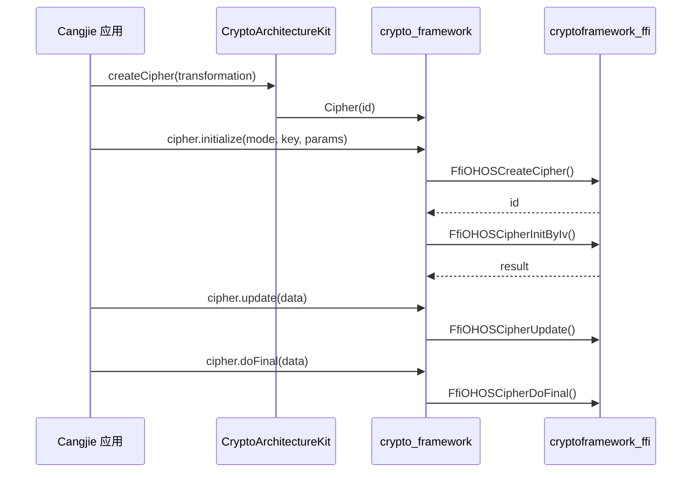
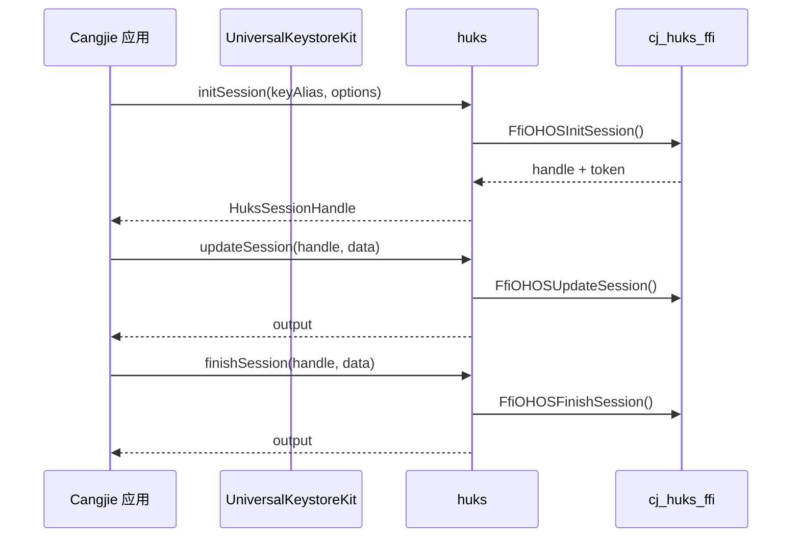

# 架构说明

## 整体架构

```
┌─────────────────────────────────────────────────────────────────┐
│                      Cangjie 应用层                              │
│  ┌─────────────────────┐  ┌─────────────────────┐               │
│  │ CryptoArchitectureKit │  │ UniversalKeystoreKit │               │
│  └─────────────────────┘  └─────────────────────┘               │
└─────────────────────────────────────────────────────────────────┘
                              │ FFI
┌─────────────────────────────────────────────────────────────────┐
│                      Wrapper 实现层                               │
│  ┌─────────────────────┐  ┌─────────────────────┐               │
│  │ crypto_framework    │  │ huks                │               │
│  │  - Cipher           │  │  - Session           │               │
│  │  - SymKey           │  │  - KeyItem           │               │
│  │  - Md               │  │  - Attestation       │               │
│  │  - Random           │  │                     │               │
│  │  - Mac              │  │                     │               │
│  └─────────────────────┘  └─────────────────────┘               │
│                              │ IPC / FFI                         │
└─────────────────────────────────────────────────────────────────┘
┌─────────────────────────────────────────────────────────────────┐
│                      Native 依赖层                               │
│  ┌─────────────────────┐  ┌─────────────────────┐               │
│  │ crypto_framework    │  │ huks                 │               │
│  │ (C/C++ 实现)        │  │ (C/C++ 实现)         │               │
│  └─────────────────────┘  └─────────────────────┘               │
└─────────────────────────────────────────────────────────────────┘
```

**证据来源**：`README.md:10-26`（Architecture 章节）、`figures/security_cangjie_wrapper_architecture_en.png`

---

## FFI 桥接机制

### 1. 声明式 FFI

使用 `foreign` 声明 C 函数接口：

```cj
// 证据来源：ohos/security/huks/huks_ffi.cj:20-103
foreign {
    func FfiOHOSInitSession(
        keyAlias: CString,
        paramSet: CPointer<OhosHksParamSet>,
        retHandle: CPointer<OhosHksBlob>,
        retToken: CPointer<OhosHksBlob>
    ): Int32

    func FfiOHOSUpdateSession(...): Int32
    func FfiOHOSFinishSession(...): Int32
    func FfiOHOSAbortSession(...): Int32
    // ...
}
```

### 2. 数据类型桥接

#### HcfBlob（HUKS Crypto Framework Blob）

```cj
// 证据来源：ohos/security/crypto_framework/cj_crypto_native.cj:24-78
@C
struct HcfBlob {
    HcfBlob(
        let head: CPointer<UInt8>,
        let size: UIntNative
    ) {}

    // Cangjie → Native
    init(blob: DataBlob) {
        unsafe {
            if (blob.data.size == 0) {
                this.head = CPointer<UInt8>()
                this.size = 0
            } else {
                this.head = safeMalloc<UInt8>(count: blob.data.size)
                // memcpy_s 复制数据
            }
        }
    }

    // Native → Cangjie
    func toDataBlob(): DataBlob {
        unsafe {
            let arr = Array<UInt8>(Int64(this.size), repeat: 0)
            // memcpy_s 复制数据
            return DataBlob(arr)
        }
    }
}
```

#### OhosHksBlob（HUKS Blob）

```cj
// 证据来源：ohos/security/huks/huks_struct_ffi.cj
@C
struct OhosHksBlob {
    OhosHksBlob(let data: CPointer<UInt8>, let size: UInt32) {}
    // 类似 HcfBlob 的转换逻辑
}
```

### 3. 内存安全

使用 `safeMalloc`/`LibC.free` 管理内存：

| 函数 | 用途 | 文件位置 |
|------|------|----------|
| `safeMalloc<T>(count)` | 安全分配内存 | `cj_crypto_native.cj:37` |
| `LibC.free<T>(ptr)` | 释放内存 | `cj_crypto_native.cj:76` |
| `memcpy_s` | 安全复制 | `cj_crypto_native.cj:40` |

**注意**：所有 FFI 调用必须在 `unsafe` 块中执行。

---

## 数据流

### Crypto Framework 调用链



**证据来源**：`cipher.cj:64-253`（完整流程）

### HUKS 调用链



**证据来源**：`huks_session.cj:49-317`（完整会话流程）

---

## 线程模型

### Worker Thread 标注

部分 API 支持在 Worker Thread 执行：

```cj
// 证据来源：huks_session.cj:43-48
@!APILevel[
    since: "22",
    syscap: "SystemCapability.Security.Huks.Extension",
    throwexception: true,
    workerthread: true  // 标注支持 worker thread
]
public func initSession(keyAlias: String, options: HuksOptions): HuksSessionHandle
```

| API | workerthread | 说明 |
|-----|--------------|------|
| `initSession` | true | 可在 Worker Thread 执行 |
| `updateSession` | true | 可在 Worker Thread 执行 |
| `finishSession` | true | 可在 Worker Thread 执行 |
| `generateSymKey` | true | 可在 Worker Thread 执行 |
| `convertKey` | true | 可在 Worker Thread 执行 |
| `digest()` | true | 可在 Worker Thread 执行 |
| `doFinal()`（Cipher/Mac） | true | 可在 Worker Thread 执行 |

**约束**：未标注 `workerthread: true` 的 API 应在主线程调用。

---

## 错误处理机制

### 错误码映射

```cj
// 证据来源：cj_crypto_enum.cj:109-117
func checkAndThrow(errCode: Int32) {
    if (errCode == -10001) {
        throw BusinessException(401, "Parameter error.")
    }
    if (errCode != 0) {
        let msg = getError(errCode).toString()
        throw BusinessException(getError(errCode).getValue(), msg)
    }
}
```

### 错误码对照表

| Native 错误码 | Cangjie 错误码 | 错误信息 |
|---------------|----------------|----------|
| -10001 | 401 | Parameter error |
| -10002 | 801 | Capability not supported |
| -20001 | 17620001 | Memory error |
| -20002 | 17620002 | Runtime error |
| -30001 | 17630001 | Crypto operation error |

**证据来源**：`cj_crypto_enum.cj:29-107`（完整错误枚举）

### HUKS 错误码

```cj
// 证据来源：huks_enum.cj:144-166
func getValue(): Int32 {
    match(this) {
        case HuksErrCodePermissionFail => 201
        case HuksErrCodeIllegalArgument => 401
        case HuksErrCodeNotSupportedApi => 801
        case HuksErrCodeFileOperationFail => 12000004
        case HuksErrCodeCommunicationFail => 12000005
        case HuksErrCodeCryptoFail => 12000006
        // ...
    }
}
```

---

## 依赖注入

### 日志依赖

通过 `hiviewdfx_cangjie_wrapper` 提供日志能力：

```cj
// 证据来源：ohos/security/crypto_framework/cj_crypto_log.cj
import ohos.hilog.hilogInfo
```

### 异常依赖

通过 `cangjie_ark_interop` 提供 BusinessException：

```cj
// 证据来源：ohos/security/huks/huks_err.cj:20-27
import ohos.business_exception.BusinessException

func hksCodeToException(hksCode: Int32): BusinessException {
    var queryData: OhosHksResult = OhosHksResult(...)
    unsafe { FfiOHOSConvertErrCode(hksCode, inout queryData) }
    BusinessException(queryData.errorCode, queryData.errorMsg.toString())
}
```
