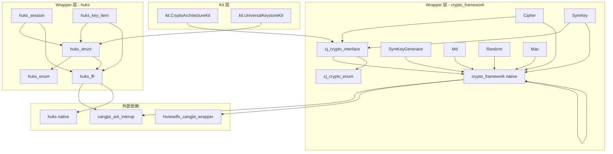

# 内部 API

本文档描述 `security_cangjie_wrapper` 内部模块之间的接口、依赖方向和稳定性标注。

## 模块依赖关系



---

## crypto_framework 模块

### 接口层（cj_crypto_interface.cj）

**文件位置**：`ohos/security/crypto_framework/cj_crypto_interface.cj`

**稳定性**：✅ Stable

#### Key 接口

```cj
public interface Key {
    prop format: String
    prop algName: String
    func getEncoded(): DataBlob
}
```

#### ParamsSpec

```cj
public open class ParamsSpec {
    public var algName: String
    private let impl_: ParamsSpecImpl = ParamsSpecImpl()
}
```

**依赖**：无内部依赖，仅定义接口。

---

### Native 桥接层（cj_crypto_native.cj）

**文件位置**：`ohos/security/crypto_framework/cj_crypto_native.cj`

**稳定性**：✅ Stable

#### HcfBlob 结构体

```cj
@C
struct HcfBlob {
    HcfBlob(
        let head: CPointer<UInt8>,
        let size: UIntNative
    ) {}

    init(blob: DataBlob)
    init(arr: Array<UInt8>)
    func toDataBlob(): DataBlob
    func free(): Unit
}
```

#### CParamsSpec 结构体

```cj
@C
struct CParamsSpec {
    CParamsSpec(
        let iv: HcfBlob,
        let add: HcfBlob,
        let authTag: HcfBlob
    ) {}
}
```

#### HcfBigInteger 结构体

```cj
@C
struct HcfBigInteger {
    HcfBigInteger(let data: CPointer<UInt8>, let len: UInt32)
    init(value: BigInt)
    func toArray(): Array<UInt8>
    func free(): Unit
}
```

---

### 枚举层（cj_crypto_enum.cj）

**文件位置**：`ohos/security/crypto_framework/cj_crypto_enum.cj`

**稳定性**：✅ Stable

#### Result 枚举

```cj
enum Result {
    InvalidParams           // -10001 → 401
    | NotSupport            // -10002 → 801
    | ErrOutOfMemory        // -20001 → 17620001
    | ErrRuntimeError       // -20002 → 17620002
    | ErrCryptoOperation    // -30001 → 17630001
    // ...
}

func checkAndThrow(errCode: Int32)
func getError(errCode: Int32): Result
```

#### CryptoMode 枚举

```cj
public enum CryptoMode {
    EncryptMode   // 值: 0
    | DecryptMode // 值: 1
}
```

#### CipherSpecItem 枚举

```cj
public enum CipherSpecItem {
    OaepMdNameStr          // 100
    | OaepMgfNameStr       // 101
    | OaepMgf1MdStr        // 102
    | OaepMgf1PsrcUint8Arr // 103
    // ...
}
```

---

### 加密实现层（cipher.cj）

**文件位置**：`ohos/security/crypto_framework/cipher.cj`

**稳定性**：✅ Stable

#### FFI 函数声明

```cj
foreign {
    func FfiOHOSCreateCipher(transformation: CString, errCode: CPointer<Int32>): Int64
    func FfiOHOSCipherInitByIv(id: Int64, opMode: Int32, key: CPointer<Unit>, blob1: HcfBlob): Int32
    func FfiOHOSCipherInitByGcm(id: Int64, opMode: Int32, key: CPointer<Unit>, spec: CParamsSpec): Int32
    func FfiOHOSCipherInitByCcm(id: Int64, opMode: Int32, key: CPointer<Unit>, spec: CParamsSpec): Int32
    func FfiOHOSCipherInitWithOutParams(id: Int64, opMode: Int32, key: CPointer<Unit>): Int32
    func FfiOHOSCipherUpdate(id: Int64, input: CPointer<HcfBlob>, output: CPointer<HcfBlob>): Int32
    func FfiOHOSCipherDoFinal(id: Int64, input: CPointer<HcfBlob>, output: CPointer<HcfBlob>): Int32
    func FfiOHOSSetCipherSpec(id: Int64, item: Int32, pSource: HcfBlob): Int32
    func FfiOHOSGetCipherSpecString(id: Int64, item: Int32, errCode: CPointer<Int32>): CString
    func FfiOHOSGetCipherSpecUint8Array(id: Int64, item: Int32, returnUint8Array: CPointer<HcfBlob>): Int32
    func FfiOHOSCipherGetAlgName(id: Int64, errCode: CPointer<Int32>): CString
}
```

#### Cipher 类

```cj
public class Cipher <: RemoteDataLite {
    private let _algName: String
    
    func getCHcfBlobList(ivData: DataBlob, aadData: DataBlob, tagData: DataBlob): Array<HcfBlob>
    public func initialize(opMode: CryptoMode, key: Key, params: ?ParamsSpec): Unit
    public func update(data: DataBlob): DataBlob
    public func doFinal(data: ?DataBlob): DataBlob
    public prop algName: String
}
```

---

### 密钥实现层（sym_key.cj）

**文件位置**：`ohos/security/crypto_framework/sym_key.cj`

**稳定性**：✅ Stable

```cj
public class SymKey <: RemoteDataLite & Key {
    private let _algName: String
    
    func getKey(): CPointer<Unit>
    public prop algName: String
    public prop format: String
    public func getEncoded(): DataBlob
    public func clearMem(): Unit
}
```

**内部依赖**：
- `RemoteDataLite`：来自 `ohos.ffi`
- `FfiOHOSSymKeyGetHcfKey`：来自 FFI

---

## huks 模块

### 结构定义层（huks_struct.cj）

**文件位置**：`ohos/security/huks/huks_struct.cj`

**稳定性**：✅ Stable

#### HuksParam

```cj
public class HuksParam {
    public var tag: UInt32
    public var value: HuksParamValue
    public init(tag: UInt32, value: HuksParamValue)
}
```

#### HuksParamValue

```cj
public enum HuksParamValue {
    BooleanValue(Bool)
    | Int32Value(Int32)
    | Uint32Value(UInt32)
    | Uint64Value(UInt64)
    | BytesValue(Bytes)
    // ...
}
```

#### HuksOptions

```cj
public class HuksOptions {
    public var properties: Array<HuksParam>
    public var inData: Bytes
    public init(properties!: Array<HuksParam> = [], inData!: Bytes = Bytes())
}
```

#### HuksSessionHandle

```cj
public class HuksSessionHandle {
    public var handle: HuksHandleId
    public var challenge: Bytes
    init(handle: HuksHandleId, challenge!: Bytes = Bytes())
}
```

#### HuksHandleId

```cj
public class HuksHandleId {
    var data: Bytes
    init(data: Bytes)
}
```

---

### FFI 声明层（huks_ffi.cj）

**文件位置**：`ohos/security/huks/huks_ffi.cj`

**稳定性**：✅ Stable

```cj
foreign {
    func FfiOHOSInitSession(
        keyAlias: CString,
        paramSet: CPointer<OhosHksParamSet>,
        retHandle: CPointer<OhosHksBlob>,
        retToken: CPointer<OhosHksBlob>
    ): Int32

    func FfiOHOSUpdateSession(
        handle: CPointer<OhosHksBlob>,
        paramSet: CPointer<OhosHksParamSet>,
        inData: CPointer<OhosHksBlob>,
        outData: CPointer<OhosHksBlob>
    ): Int32

    func FfiOHOSFinishSession(...): Int32
    func FfiOHOSAbortSession(...): Int32
    
    func FfiOHOSIsKeyExist(keyAlias: CString, paramSet: CPointer<OhosHksParamSet>): Int32
    func FfiOHOSGetKeyItemProperties(...): Int32
    func FfiOHOSHAttestKey(...): Int32
    func FfiOHOSHAnonAttestKey(...): Int32
    func FfiOHOSExportKey(...): Int32
    func FfiOHOSImportWrappedKey(...): Int32
    func FfiOHOSConvertErrCode(hksCode: Int32, ret: CPointer<OhosHksResult>): Unit
    func FfiOHOSGenerateKey(...): Int32
    func FfiOHOSDeleteKey(...): Int32
    func FfiOHOSImportKey(...): Int32
}
```

---

### 错误处理层（huks_err.cj）

**文件位置**：`ohos/security/huks/huks_err.cj`

**稳定性**：✅ Stable

```cj
import ohos.business_exception.BusinessException

func hksCodeToException(hksCode: Int32): BusinessException {
    var queryData: OhosHksResult = OhosHksResult(...)
    unsafe { FfiOHOSConvertErrCode(hksCode, inout queryData) }
    BusinessException(queryData.errorCode, queryData.errorMsg.toString())
}
```

---

### 会话层（huks_session.cj）

**文件位置**：`ohos/security/huks/huks_session.cj`

**稳定性**：✅ Stable

#### 会话函数

```cj
public func initSession(keyAlias: String, options: HuksOptions): HuksSessionHandle
public func updateSession(
    handle: HuksHandleId,
    options: HuksOptions,
    token!: Bytes = Bytes()
): Option<Bytes>
public func finishSession(
    handle: HuksHandleId,
    options: HuksOptions,
    token!: Bytes = Bytes()
): Option<Bytes>
public func abortSession(handle: HuksHandleId, options: HuksOptions): Unit
```

#### 内部辅助函数

```cj
func getHuksHandle(handle: OhosHksBlob): HuksHandleId
func updateOrFinish(
    handle: HuksHandleId,
    options: HuksOptions,
    token: Bytes,
    isUpdate: Bool
): Option<Bytes>
func updateOrFinishSession(...): ...
func getOutBlogSize(inData: Array<UInt8>)
func processRet(retCode: Int32, outBlob: OhosHksBlob, handleBlob: OhosHksBlob)
```

---

### 密钥项层（huks_key_item.cj）

**文件位置**：`ohos/security/huks/huks_key_item.cj`

**稳定性**：✅ Stable

#### 密钥操作函数

```cj
public func hasKeyItem(keyAlias: String, options: HuksOptions): Bool
public func getKeyItemProperties(keyAlias: String, _: HuksOptions): Array<HuksParam>
public func anonAttestKeyItem(keyAlias: String, options: HuksOptions): Array<String>
public func exportKeyItem(keyAlias: String, _: HuksOptions): Bytes
public func importWrappedKeyItem(
    keyAlias: String,
    wrappingKeyAlias: String,
    options: HuksOptions
): Unit
public func generateKeyItem(keyAlias: String, options: HuksOptions): Unit
public func deleteKeyItem(keyAlias: String, options: HuksOptions): Unit
public func importKeyItem(keyAlias: String, options: HuksOptions): Unit
```

---

## 稳定性标注说明

### 稳定性等级

| 等级 | 含义 | 示例 |
|------|------|------|
| Stable | 公开 API，已正式发布 | Kit 导出的大部分 API |
| Internal | 内部 API，仅限模块内使用 | `ParamsSpecImpl`、`OhosHksResult` |
| Hide | 隐藏 API，不对用户暴露 | `@Hide` 标注的枚举值 |

### 稳定性证据

| 标注类型 | 位置 | 说明 |
|----------|------|------|
| `@!APILevel` | 接口定义 | 标记 API 版本和 SysCap |
| `@APILevel` | 实现细节 | 标记内部实现版本 |
| `@Hide` | 隐藏成员 | 不对外暴露的内部成员 |

**证据来源**：`cj_crypto_interface.cj:27-72`（Key 接口的 APILevel 标注）
