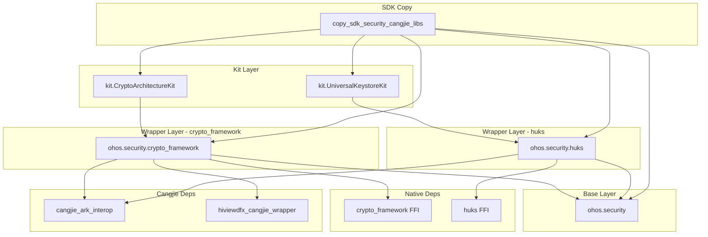

# GN Targets

本文档描述 `security_cangjie_wrapper` 的所有 GN 构建目标。

## 构建概览

```
security_cangjie_wrapper/
├── BUILD.gn                          # 根构建入口
├── ohos/
│   └── security/
│       ├── BUILD.gn                   # ohos.security
│       ├── crypto_framework/
│       │   └── BUILD.gn               # ohos.security.crypto_framework
│       └── huks/
│           └── BUILD.gn               # ohos.security.huks
└── kit/
    ├── CryptoArchitectureKit/
    │   └── BUILD.gn                   # kit.CryptoArchitectureKit
    └── UniversalKeystoreKit/
        └── BUILD.gn                   # kit.UniversalKeystoreKit
```

---

## 根构建入口（ BUILD.gn）

**文件位置**：`BUILD.gn`

```gn
import("//build/templates/cangjie/cjc.gni")

security_cangjie_wrapper_packages_ohos = [
  "//base/security/security_cangjie_wrapper/ohos/security/huks:ohos.security.huks",
  "//base/security/security_cangjie_wrapper/ohos/security:ohos.security",
  "//base/security/security_cangjie_wrapper/ohos/security/crypto_framework:ohos.security.crypto_framework",
]

security_cangjie_wrapper_packages_kit = [
  "//base/security/security_cangjie_wrapper/kit/CryptoArchitectureKit:kit.CryptoArchitectureKit",
  "//base/security/security_cangjie_wrapper/kit/UniversalKeystoreKit:kit.UniversalKeystoreKit",
]

copy_ohos_cangjie_sdk_api_lib("copy_sdk_security_cangjie_libs") {
  ohos_inputs = security_cangjie_wrapper_packages_ohos
  kit_inputs = security_cangjie_wrapper_packages_kit
}
```

**目标类型**：`copy_ohos_cangjie_sdk_api_lib`

**产物**：SDK API 复制任务，无独立产物

**说明**：收集所有 ohos 和 kit 模块，打包到 SDK

---

## ohos.security

**文件位置**：`ohos/security/BUILD.gn`

```gn
import("//build/templates/cangjie/cjc.gni")

ohos_cangjie_shared_library("ohos.security") {
  if (is_mingw || is_mac) {
    sources = [ "../../mock/ohos.security.cj" ]
  } else {
    sources = [ "security.cj" ]
  }

  subsystem_name = "security"
  part_name = "security_cangjie_wrapper"
}
```

| 属性 | 值 |
|------|-----|
| 目标类型 | `ohos_cangjie_shared_library` |
| 源码 | `security.cj`（或 mock） |
| 子系统 | `security` |
| 组件 | `security_cangjie_wrapper` |

**跨平台处理**：Mingw/Mac 使用 mock 实现

---

## ohos.security.crypto_framework

**文件位置**：`ohos/security/crypto_framework/BUILD.gn`

```gn
import("//build/templates/cangjie/cjc.gni")

ohos_cangjie_shared_library("ohos.security.crypto_framework") {
  if (is_mingw || is_mac) {
    sources = [ "../../../mock/ohos.security.crypto_framework.cj" ]
  } else {
    sources = [
      "cipher.cj",
      "cj_crypto_common.cj",
      "cj_crypto_enum.cj",
      "cj_crypto_interface.cj",
      "cj_crypto_log.cj",
      "cj_crypto_native.cj",
      "mac.cj",
      "md.cj",
      "random.cj",
      "sym_key.cj",
      "sym_key_generator.cj",
    ]
  }

  cj_external_deps = [
    "cangjie_ark_interop:ohos.business_exception",
    "cangjie_ark_interop:ohos.ffi",
    "cangjie_ark_interop:ohos.labels",
    "hiviewdfx_cangjie_wrapper:ohos.hilog",
  ]

  external_deps = [ "crypto_framework:cj_cryptoframework_ffi" ]

  subsystem_name = "security"
  part_name = "security_cangjie_wrapper"
}
```

| 属性 | 值 |
|------|-----|
| 目标类型 | `ohos_cangjie_shared_library` |
| 源码数量 | 11 个 `.cj` 文件 |
| Cangjie 依赖 | `cangjie_ark_interop`、`hiviewdfx_cangjie_wrapper` |
| Native 依赖 | `crypto_framework:cj_cryptoframework_ffi` |
| 子系统 | `security` |
| 组件 | `security_cangjie_wrapper` |

**跨平台处理**：Mingw/Mac 使用 mock 实现

---

## ohos.security.huks

**文件位置**：`ohos/security/huks/BUILD.gn`

```gn
import("//build/templates/cangjie/cjc.gni")

ohos_cangjie_shared_library("ohos.security.huks") {
  if (is_mingw || is_mac) {
    sources = [ "../../../mock/ohos.security.huks.cj" ]
  } else {
    sources = [
      "huks_enum.cj",
      "huks_err.cj",
      "huks_ffi.cj",
      "huks_key_item.cj",
      "huks_limit.cj",
      "huks_session.cj",
      "huks_struct.cj",
      "huks_struct_ffi.cj",
    ]
  }

  cj_external_deps = [
    "cangjie_ark_interop:ohos.business_exception",
    "cangjie_ark_interop:ohos.ffi",
    "cangjie_ark_interop:ohos.labels",
  ]

  external_deps = [ "huks:cj_huks_ffi" ]

  subsystem_name = "security"
  part_name = "security_cangjie_wrapper"
}
```

| 属性 | 值 |
|------|-----|
| 目标类型 | `ohos_cangjie_shared_library` |
| 源码数量 | 8 个 `.cj` 文件 |
| Cangjie 依赖 | `cangjie_ark_interop`（无 hiviewdfx） |
| Native 依赖 | `huks:cj_huks_ffi` |
| 子系统 | `security` |
| 组件 | `security_cangjie_wrapper` |

**跨平台处理**：Mingw/Mac 使用 mock 实现

---

## kit.CryptoArchitectureKit

**文件位置**：`kit/CryptoArchitectureKit/BUILD.gn`

```gn
import("//build/ohos.gni")
import("//build/templates/cangjie/cjc.gni")

ohos_cangjie_shared_library("kit.CryptoArchitectureKit") {
  sources = ["index.cj"]

  cj_deps = [
    "../../ohos/security/crypto_framework:ohos.security.crypto_framework",
  ]

  subsystem_name = "security"
  part_name = "security_cangjie_wrapper"
}
```

| 属性 | 值 |
|------|-----|
| 目标类型 | `ohos_cangjie_shared_library` |
| 源码 | `index.cj` |
| Cangjie 依赖 | `ohos.security.crypto_framework` |
| 子系统 | `security` |
| 组件 | `security_cangjie_wrapper` |

---

## kit.UniversalKeystoreKit

**文件位置**：`kit/UniversalKeystoreKit/BUILD.gn`

```gn
import("//build/ohos.gni")
import("//build/templates/cangjie/cjc.gni")

ohos_cangjie_shared_library("kit.UniversalKeystoreKit") {
  sources = ["index.cj"]

  cj_deps = [
    "../../ohos/security/huks:ohos.security.huks",
  ]

  subsystem_name = "security"
  part_name = "security_cangjie_wrapper"
}
```

| 属性 | 值 |
|------|-----|
| 目标类型 | `ohos_cangjie_shared_library` |
| 源码 | `index.cj` |
| Cangjie 依赖 | `ohos.security.huks` |
| 子系统 | `security` |
| 组件 | `security_cangjie_wrapper` |

---

## Target 依赖关系



---

## 编译配置

### bundle.json 配置

**文件位置**：`bundle.json`

```json
{
  "component": {
    "name": "security_cangjie_wrapper",
    "subsystem": "security",
    "adapted_system_type": ["standard"],
    "rom": "600KB",
    "ram": "604KB",
    "deps": {
      "components": [
        "cangjie_ark_interop",
        "hiviewdfx_cangjie_wrapper",
        "crypto_framework",
        "huks"
      ]
    },
    "build": {
      "sub_component": [
        "//base/security/security_cangjie_wrapper/ohos/security/crypto_framework:ohos.security.crypto_framework",
        "//base/security/security_cangjie_wrapper/ohos/security/huks:ohos.security.huks",
        "//base/security/security_cangjie_wrapper/ohos/security:ohos.security",
        "//base/security/security_cangjie_wrapper/kit/CryptoArchitectureKit:kit.CryptoArchitectureKit",
        "//base/security/security_cangjie_wrapper/kit/UniversalKeystoreKit:kit.UniversalKeystoreKit"
      ],
      "inner_kits": [
        {
          "name": "//base/security/security_cangjie_wrapper:copy_sdk_security_cangjie_libs"
        },
        {
          "name": "//base/security/security_cangjie_wrapper:copy_sdk_security_cangjie_libs_kit"
        }
      ]
    }
  }
}
```

### 子组件列表

| 目标路径 | 类型 | 说明 |
|----------|------|------|
| `ohos.security.crypto_framework` | sub_component | 加密框架封装 |
| `ohos.security.huks` | sub_component | 密钥管理封装 |
| `ohos.security` | sub_component | 包声明 |
| `kit.CryptoArchitectureKit` | sub_component | 加密算法 Kit |
| `kit.UniversalKeystoreKit` | sub_component | 密钥管理 Kit |
| `copy_sdk_security_cangjie_libs` | inner_kit | SDK 复制 |
| `copy_sdk_security_cangjie_libs_kit` | inner_kit | SDK Kit 复制 |

---

## 构建注意事项

### 跨平台处理

所有模块在 `is_mingw || is_mac` 条件下使用 mock 源码：

```gn
if (is_mingw || is_mac) {
  sources = [ "../../mock/xxx.cj" ]
} else {
  sources = [ "xxx.cj" ]
}
```

**原因**：避免在非标准设备上编译时依赖 Native 实现

### 依赖完整性

确保构建前已安装以下依赖：

```bash
# Cangjie 基础依赖
hb_compiler

# Native FFI 依赖
# - crypto_framework:cj_cryptoframework_ffi
# - huks:cj_huks_ffi
```
