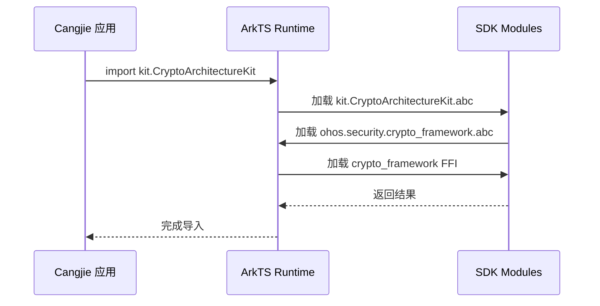

# 编译产物

本文档描述 `security_cangjie_wrapper` 的编译产物、安装路径和运行时加载关系。

## 产物清单

### 产物类型

| 产物类型 | 文件格式 | 来源 |
|----------|----------|------|
| Cangjie SDK | `.abc` | Cangjie 字节码 |
| 组件资源 | `.json` | bundle.json |

### 产物路径映射

| 目标 | 产物 | 预期路径 |
|------|------|----------|
| `kit.CryptoArchitectureKit` | `kit.CryptoArchitectureKit.abc` | `$SDK/ets/api/` |
| `kit.UniversalKeystoreKit` | `kit.UniversalKeystoreKit.abc` | `$SDK/ets/api/` |
| `ohos.security.crypto_framework` | `ohos.security.crypto_framework.abc` | `$SDK/ets/api/` |
| `ohos.security.huks` | `ohos.security.huks.abc` | `$SDK/ets/api/` |
| `ohos.security` | `ohos.security.abc` | `$SDK/ets/api/` |

---

## SDK 安装路径

```
${SDK_ROOT}/
├── ets/
│   └── api/
│       ├── kit.CryptoArchitectureKit.abc
│       ├── kit.UniversalKeystoreKit.abc
│       ├── ohos.security.crypto_framework.abc
│       ├── ohos.security.huks.abc
│       └── ohos.security.abc
└── ...
```

**说明**：
- `.abc` 文件是 Cangjie 字节码文件
- 应用开发时通过 `import` 语句引用
- 运行时由 ArkTS 运行时加载执行

---

## 运行时加载关系

### 加载顺序



### 模块依赖加载

| 模块 | 依赖模块 | 加载时机 |
|------|----------|----------|
| `kit.CryptoArchitectureKit` | `ohos.security.crypto_framework` | 编译时内联 |
| `kit.UniversalKeystoreKit` | `ohos.security.huks` | 编译时内联 |
| `ohos.security.crypto_framework` | `crypto_framework FFI` | 运行时动态加载 |
| `ohos.security.huks` | `huks FFI` | 运行时动态加载 |

---

## 资源占用

| 资源 | 大小 | 说明 |
|------|------|------|
| ROM | ~600 KB | SDK 产物总大小 |
| RAM | ~604 KB | 运行时内存预估 |

**证据来源**：`bundle.json:26-27`

---

## Native 依赖产物

### crypto_framework FFI

| 依赖 | 产物类型 | 说明 |
|------|----------|------|
| `cj_cryptoframework_ffi` | `.so` | Native 加密框架 FFI 桥接 |

**路径**：`$DEVICE_LIB/libcj_cryptoframework_ffi.z.so`

### huks FFI

| 依赖 | 产物类型 | 说明 |
|------|----------|------|
| `cj_huks_ffi` | `.so` | Native HUKS FFI 桥接 |

**路径**：`$DEVICE_LIB/libcj_huks_ffi.z.so`

---

## 设备端加载

### 系统能力要求

| SysCap | 用途 |
|--------|------|
| `SystemCapability.Security.CryptoFramework` | 基础加密能力 |
| `SystemCapability.Security.CryptoFramework.Key` | 密钥能力 |
| `SystemCapability.Security.CryptoFramework.Cipher` | 加解密能力 |
| `SystemCapability.Security.CryptoFramework.MessageDigest` | 消息摘要能力 |
| `SystemCapability.Security.CryptoFramework.Rand` | 随机数能力 |
| `SystemCapability.Security.CryptoFramework.Mac` | MAC 能力 |
| `SystemCapability.Security.Huks.Core` | HUKS 核心能力 |
| `SystemCapability.Security.Huks.Extension` | HUKS 扩展能力 |

### 权限要求

| API | 权限 | 说明 |
|-----|------|------|
| `anonAttestKeyItem` | 无特殊权限 | 但涉及网络通信 |
| `importWrappedKeyItem` | 无特殊权限 | 需密钥存在性检查 |

---

## 构建命令

### 全量构建

```bash
# 使用 hb 工具构建
hb build -p security_cangjie_wrapper
```

### 增量构建

```bash
# 仅构建 Cangjie 模块
hb build -p security_cangjie_wrapper -T ohos.security.crypto_framework
```

### SDK 打包

```bash
# 打包 SDK
hb build -p security_cangjie_wrapper -T copy_sdk_security_cangjie_libs
```

---

## 产物验证

### 验证方法

1. **文件存在性检查**

```bash
# 检查 SDK 产物
ls -la $SDK/ets/api/*.abc | grep security

# 预期输出
# kit.CryptoArchitectureKit.abc
# kit.UniversalKeystoreKit.abc
# ohos.security.crypto_framework.abc
# ohos.security.huks.abc
# ohos.security.abc
```

2. **字节码验证**

```bash
# 使用 cangjie 工具检查
cangjie -verify kit.CryptoArchitectureKit.abc
```

3. **依赖检查**

```bash
# 检查 native 依赖
ldd $DEVICE_LIB/libcj_cryptoframework_ffi.z.so
ldd $DEVICE_LIB/libcj_huks_ffi.z.so
```

---

## 常见问题

### Q1: SDK 产物缺失

**症状**：`import` 语句报错

**排查**：
1. 检查 `copy_sdk_security_cangjie_libs` 是否执行
2. 确认 SDK 输出目录配置正确

### Q2: 运行时加载失败

**症状**：`dlopen` 失败

**排查**：
1. 检查 Native FFI 产物是否存在
2. 确认设备端库路径配置正确

### Q3: 内存占用过高

**症状**：运行时内存异常

**排查**：
1. 检查 SymKey 是否及时调用 `clearMem()`
2. 确认无内存泄漏（对象未释放）
