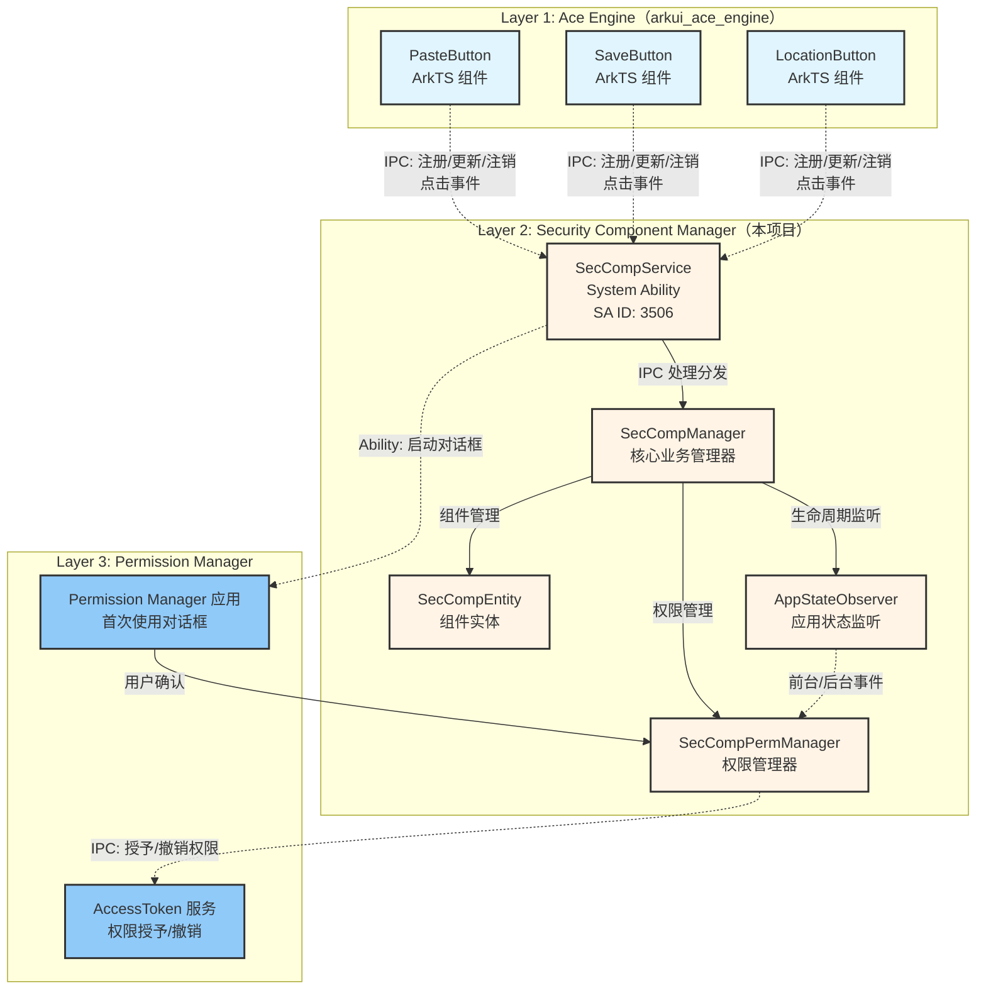
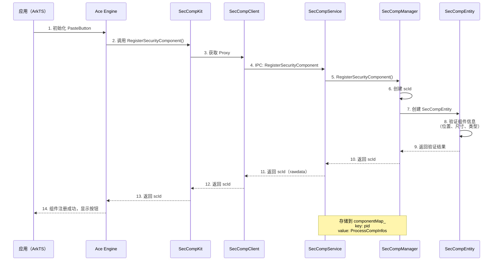
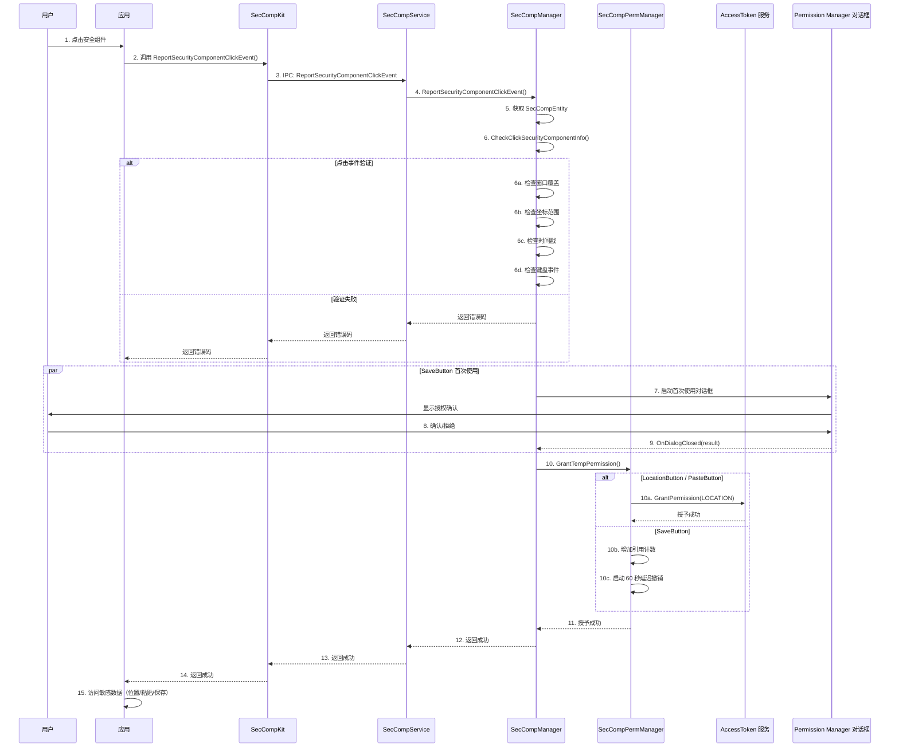
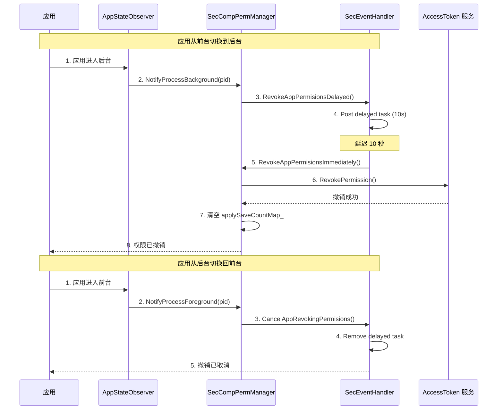
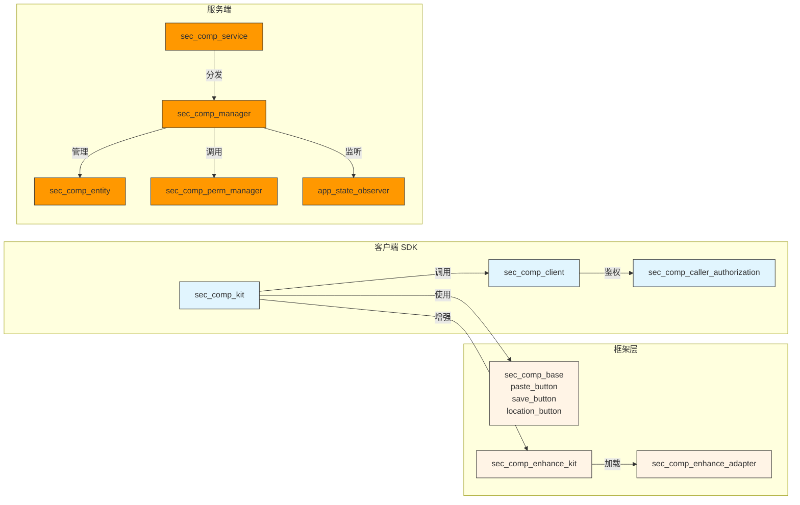

# 架构说明 - Security Component Manager

> 目的：理解 Security Component Manager 的三层架构、数据流与线程模型

---

## 适用范围

本文档适用于：
- 需要理解系统架构的开发者
- 需要调试跨进程通信的开发者
- 需要优化性能的系统集成者

---

## 关键结论

1. **三层架构**：Ace UI 层（Layer 1）→ Security Component Service（Layer 2）→ Permission Manager（Layer 3）
2. **IPC 通信**：层间通过 OpenHarmony IPC 框架（Binder）通信
3. **临时权限机制**：点击组件时授予，应用后台时撤销
4. **异步任务处理**：使用 ffrt（Foundations Framework for Runtime）处理延迟任务
5. **增强框架**：可插拔的厂商定制能力，通过 dlopen 动态加载

---

## 三层架构图



---

## 组件注册流程



**关键验证点**：
- **类型验证**：组件类型是否有效（`IsComponentTypeValid`）
- **尺寸验证**：字体大小、图标大小、padding 是否符合最小值
- **信息完整性**：JSON 解析是否成功

**证据路径**：
- 注册入口：`services/security_component_service/sa/sa_main/sec_comp_service.h:48`
- 验证逻辑：`services/security_component_service/sa/sa_main/sec_comp_entity.cpp:124`

---

## 点击事件与权限授予流程



**点击事件验证细节**：
1. **窗口覆盖检查**：`window_info_helper.cpp:WindowInfoHelper::CheckWindowCover()`
2. **坐标范围检查**：`sec_comp_entity.cpp:SecCompEntity::CheckPointEvent()`
3. **时间戳检查**：点击事件时间戳在 5000ms 内
4. **键盘事件检查**：仅允许 SPACE (2050)、ENTER (2054)、NUMPAD_ENTER (2119)
5. **增强数据验证**：`sec_comp_enhance_adapter.cpp:CheckExtraInfo()`

**证据路径**：
- 点击验证：`services/security_component_service/sa/sa_main/sec_comp_entity.cpp:124-174`
- 权限授予：`services/security_component_service/sa/sa_main/sec_comp_perm_manager.cpp:279-323`

---

## 权限撤销流程



**撤销时机对比**：

| 组件类型 | 撤销触发 | 延迟时间 |
|---------|----------|---------|
| LocationButton | 应用进入后台 | 10 秒 |
| PasteButton | 应用进入后台 | 10 秒 |
| SaveButton | 单次操作完成 | 60 秒 |

**证据路径**：
- 应用状态监听：`services/security_component_service/sa/sa_main/app_state_observer.cpp`
- 延迟撤销：`services/security_component_service/sa/sa_main/sec_comp_perm_manager.cpp:43-59`

---

## 模块依赖关系



**依赖方向**（避免环）：
- SDK → Framework → Service（单向依赖）
- Service 内部：Service → Manager → PermManager
- 无循环依赖

---

## 线程模型

### 事件处理线程

**SecEventHandler** (`services/security_component_service/sa/sa_main/sec_event_handler.cpp`)：
- 基于 `AppExecFwk::EventRunner`
- 单线程事件处理器
- 处理延迟任务（权限撤销、对话框等待）

**证据路径**：
- 事件处理器：`services/security_component_service/sa/sa_main/sec_event_handler.h:27`
- 初始化：`services/security_component_service/sa/sa_main/sec_comp_manager.cpp:98-99`

### FFRT 任务队列

**Foundations Framework for Runtime (ffrt)**：
- 异步任务执行
- 支持延迟任务
- 用于权限撤销、对话框回调

**证据路径**：
- ffrt 使用：`services/security_component_service/sa/sa_main/sec_comp_perm_manager.cpp:17`
- 延迟任务：`services/security_component_service/sa/sa_main/sec_comp_perm_manager.cpp:47-58`

### 线程安全

**互斥锁保护**：
- `componentInfoLock_` - `ffrt::shared_mutex`（组件信息）
- `scIdMtx_` - `std::mutex`（scId 分配）
- `mediaLibMutex_` - `std::mutex`（媒体库 Token）
- `mutex_` - `std::mutex`（权限管理器）
- `grantMtx_` - `std::mutex`（权限映射）

**证据路径**：
- 锁定义：`services/security_component_service/sa/sa_main/sec_comp_manager.h:90-95`

---

## 资源生命周期

### 组件生命周期

```
创建（RegisterSecurityComponent）
    ↓
存储到 componentMap_（key: pid, value: ProcessCompInfos）
    ↓
使用（点击事件）
    ↓
注销（UnregisterSecurityComponent）
    ↓
从 componentMap_ 删除
```

### 权限生命周期

```
授予（GrantTempPermission）
    ↓
存储到 applySaveCountMap_ / saveTaskDequeMap_
    ↓
应用使用
    ↓
应用进入后台
    ↓
启动延迟撤销任务（10s 或 60s）
    ↓
撤销（RevokeAppPermisionsImmediately）
    ↓
从 applySaveCountMap_ / saveTaskDequeMap_ 清空
```

### 服务生命周期

```
加载（按需加载：LoadSystemAbility）
    ↓
启动（OnStart）
    ↓
添加应用状态观察者
    ↓
启动增强服务（StartEnhanceService）
    ↓
无活动组件 + 延迟退出 → ExitSaProcess
    ↓
停止（OnStop）
    ↓
移除应用状态观察者
    ↓
退出增强服务（ExitEnhanceService）
```

---

## 增强框架机制

```mermaid
graph TB
    subgraph "客户端"
        C1[SecCompEnhanceKit]
        C2[SecCompEnhanceAdapter]
        C3[libsecurity_component_client_enhance.z.so]
    end

    subgraph "服务端"
        S1[SecCompService]
        S2[SecCompEnhanceAdapter]
        S3[libsecurity_component_service_enhance.z.so]
    end

    C1 -->|InitClientEnhance| C2
    C2 -->|dlopen + dlsym| C3
    C3 -.->|实现厂商定制| C2

    S1 -->|启动增强服务| S2
    S2 -->|dlopen + dlsym| S3
    S3 -.->|实现厂商定制| S2

    classDef client fill:#e1f5fe,stroke:#333
    classDef service fill:#ff9800,stroke:#333
    classDef vendorLib fill:#90caf9,stroke:#333,stroke-dasharray: 5 5

    class C1,C2 client
    class S1,S2 service
    class C3,S3 vendorLib
```



**增强接口类型**：

| 接口类型 | 加载的库 | 主要功能 |
|---------|----------|---------|
| `SEC_COMP_ENHANCE_INPUT_INTERFACE` | `libsecurity_component_client_enhance.z.so` | 输入事件增强（点击事件 HMAC） |
| `SEC_COMP_ENHANCE_SRV_INTERFACE` | `libsecurity_component_service_enhance.z.so` | 服务端增强（组件验证、Challenge 检查） |
| `SEC_COMP_ENHANCE_CLIENT_INTERFACE` | `libsecurity_component_client_enhance.z.so` | 客户端增强（地址随机化、调用者验证） |

**证据路径**：
- 动态加载：`frameworks/enhance_adapter/src/sec_comp_enhance_adapter.cpp:49-91`

---

## 相关跳转

- [对外 API](./03_Public_APIs.md) - 查看 C++ SDK API
- [内部 API](./04_Internal_APIs.md) - 查看内部模块接口
- [目录结构](./01_Directory_Structure.md) - 了解文件组织

---

**返回 [主页](./README.md) | [导航](./SUMMARY.md)
