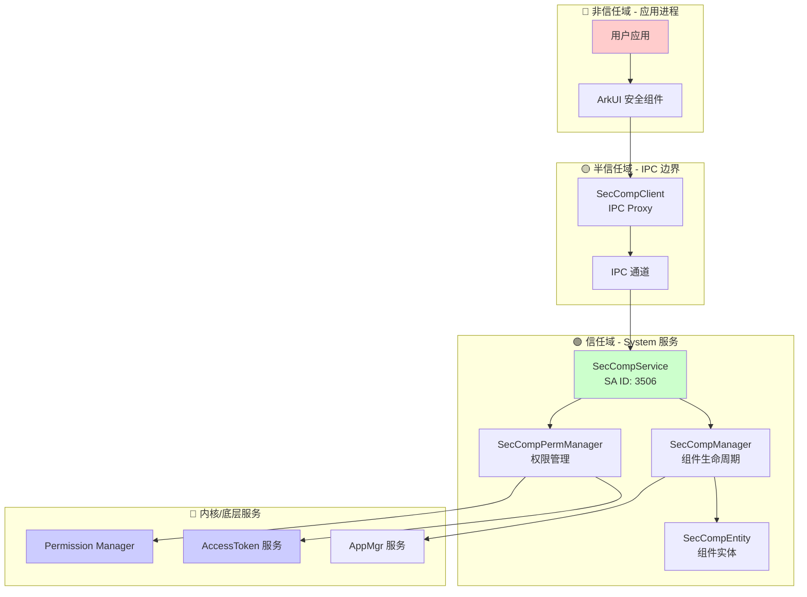

# 攻击面分析 (Attack Surface Analysis)

> 目的：全面识别 Security Component Manager 的外部输入入口、敏感操作和信任边界
> 
> 适用对象：安全研究员、审计人员

---

## 1. 外部输入清单

### 1.1 IPC 接口（主要攻击入口）

**SA ID**: 3506 (SECURITY_COMPONENT_SERVICE)

| 序号 | 方法名 | 参数 | 风险等级 | 文件位置 |
|------|--------|------|----------|----------|
| 1 | `RegisterSecurityComponent` | `[in] SecCompRawdata rawData` | 🟡 中 | `ISecCompService.idl:20` |
| 2 | `UpdateSecurityComponent` | `[in] SecCompRawdata rawData` | 🟡 中 | `ISecCompService.idl:21` |
| 3 | `UnregisterSecurityComponent` | `[in] SecCompRawdata rawData` | 🟢 低 | `ISecCompService.idl:22` |
| 4 | `ReportSecurityComponentClickEvent` | `[in] IRemoteObject callerToken`<br>`[in] IRemoteObject dialogCallback`<br>`[in] SecCompRawdata rawData` | 🔴 高 | `ISecCompService.idl:23-24` |
| 5 | `VerifySavePermission` | `[in] unsigned int tokenId` | 🟡 中 | `ISecCompService.idl:25` |
| 6 | `PreRegisterSecCompProcess` | `[in] SecCompRawdata rawData` | 🟡 中 | `ISecCompService.idl:26` |

**关键代码证据**：

```cpp
// services/security_component_service/sa/ISecCompService.idl:19-27
interface OHOS.Security.SecurityComponent.ISecCompService {
    void RegisterSecurityComponent([in] SecCompRawdata rawData, [out] SecCompRawdata rawReply);
    void UpdateSecurityComponent([in] SecCompRawdata rawData, [out] SecCompRawdata rawReply);
    void UnregisterSecurityComponent([in] SecCompRawdata rawData, [out] SecCompRawdata rawReply);
    void ReportSecurityComponentClickEvent([in] IRemoteObject callerToken, 
        [in] IRemoteObject dialogCallback, [in] SecCompRawdata rawData, 
        [out] SecCompRawdata rawReply);
    void VerifySavePermission([in] unsigned int tokenId, [out] boolean ret);
    void PreRegisterSecCompProcess([in] SecCompRawdata rawData, [out] SecCompRawdata rawReply);
}
```

---

### 1.2 JSON 参数解析点

| 功能 | 文件路径 | 行号 | 输入类型 | 风险 |
|------|----------|------|----------|------|
| 组件注册 | `sec_comp_service.cpp` | 254 | componentInfo JSON | JSON 注入、超大负载 |
| 组件更新 | `sec_comp_service.cpp` | 190 | componentInfo JSON | JSON 注入 |
| 点击事件 | `sec_comp_manager.cpp` | 486 | componentInfo JSON | JSON 注入 |
| 字段解析 | `sec_comp_info_helper.cpp` | 全文件 | 各字段 | 类型混淆 |
| 矩形解析 | `sec_comp_base.cpp` | 300-325 | rect 对象 | 坐标溢出 |
| 样式解析 | `sec_comp_base.cpp` | 627-655 | style 对象 | 值范围溢出 |

**关键代码证据**：

```cpp
// services/sa/sa_main/sec_comp_service.cpp:254-259
nlohmann::json jsonRes = nlohmann::json::parse(componentInfo, nullptr, false);
if (jsonRes.is_discarded()) {
    SC_LOG_ERROR(LABEL, "component info invalid %{public}s", componentInfo.c_str());
    return SC_SERVICE_ERROR_VALUE_INVALID;
}
```

**输入验证状态**：
- ✅ JSON 格式验证（`is_discarded()` 检查）
- ⚠️ JSON 长度无显式限制（TODO: 需确认最大长度）
- ✅ 字段类型检查（`ParseRect`, `ParseStyle` 等）

---

### 1.3 IPC RawData 反序列化点

| 功能 | 文件路径 | 行号 | 处理方式 |
|------|----------|------|----------|
| 注册反序列化 | `sec_comp_service.cpp` | 213-237 | `RegisterReadFromRawdata()` |
| 更新反序列化 | `sec_comp_service.cpp` | 336-358 | `UpdateReadFromRawdata()` |
| 注销反序列化 | `sec_comp_service.cpp` | 411-427 | `UnregisterReadFromRawdata()` |
| 点击事件反序列化 | `sec_comp_service.cpp` | 525-565 | `ReportSecurityComponentClickEvent()` |
| 增强框架反序列化 | `sec_comp_enhance_adapter.cpp` | 251-260 | `EnhanceSrvDeserialize()` |

**关键代码证据**：

```cpp
// services/sa/sa_main/sec_comp_service.cpp:213-219
int32_t SecCompService::RegisterReadFromRawdata(SecCompRawdata& rawData, 
    SecCompType& type, std::string& componentInfo)
{
    MessageParcel deserializedData;
    if (!SecCompEnhanceAdapter::EnhanceSrvDeserialize(rawData, deserializedData)) {
        SC_LOG_ERROR(LABEL, "Register deserialize session info failed");
        return SC_SERVICE_ERROR_PARCEL_OPERATE_FAIL;
    }
    // ... 读取 type 和 componentInfo
}
```

---

### 1.4 文件读取操作

| 功能 | 文件路径 | 行号 | 文件路径 | 风险 |
|------|----------|------|----------|------|
| 首次使用记录读取 | `first_use_dialog.cpp` | 174-190 | `/data/service/el1/public/security_component_service/first_use_record.json` | 路径遍历（已规范化） |
| 配置文件写入 | `first_use_dialog.cpp` | 195-209 | 同上 | 文件覆盖 |
| 文件大小检查 | `first_use_dialog.cpp` | 157-168 | - | 限制 100KB |

**关键代码证据**：

```cpp
// services/sa/sa_main/first_use_dialog.cpp:174-176
std::ifstream inFile(realPath);
if (!inFile.is_open()) {
    SC_LOG_INFO(LABEL, "First use record file not exist");
    return false;
}
```

**安全措施**：
- ✅ 使用 `realpath()` 规范化路径
- ✅ 文件大小限制 100KB
- ✅ 权限检查（只允许特定目录）

---

### 1.5 动态库加载（dlopen）

| 功能 | 文件路径 | 行号 | 加载库 | 风险 |
|------|----------|------|--------|------|
| 客户端增强库 | `sec_comp_enhance_adapter.cpp` | 73 | `libsecurity_component_client_enhance.z.so` | 库替换攻击 |
| 服务端增强库 | `sec_comp_enhance_adapter.cpp` | 73 | `libsecurity_component_service_enhance.z.so` | 库替换攻击 |
| 符号解析 | `sec_comp_enhance_adapter.cpp` | 80 | `dlsym` | 符号注入 |

**关键代码证据**：

```cpp
// frameworks/enhance_adapter/src/sec_comp_enhance_adapter.cpp:73-81
void* handler = dlopen(enhanceLibName, RTLD_NOW);
if (handler == nullptr) {
    SC_LOG_ERROR(LABEL, "Load enhance so failed, error: %{public}s", dlerror());
    return;
}

GetClientInstanceFunc getInstance = reinterpret_cast<GetClientInstanceFunc>(
    dlsym(handler, "GetClientInstance"));
```

**安全风险**：
- ⚠️ **无签名验证**：增强库加载前未进行数字签名验证
- ⚠️ **路径劫持风险**：若库搜索路径被篡改，可能加载恶意库
- 🟡 **缓解措施**：库通常位于 `/system/lib/` 等受保护目录

---

## 2. 敏感操作清单

### 2.1 权限检查与授予

| 操作 | 文件路径 | 行号 | 权限/操作 | 风险等级 |
|------|----------|------|-----------|----------|
| Token 类型检查 | `sec_comp_service.cpp` | 167 | `GetTokenTypeFlag() == TOKEN_HAP` | 🟢 低 |
| 位置权限检查 | `sec_comp_perm_manager.cpp` | 145-150 | `ohos.permission.LOCATION` | 🟢 低 |
| 粘贴权限检查 | `sec_comp_perm_manager.cpp` | 152-153 | `ohos.permission.SECURE_PASTE` | 🟢 低 |
| 权限授予 | `sec_comp_perm_manager.cpp` | 191 | `GrantPermission()` | 🔴 高 |
| 权限撤销 | `sec_comp_perm_manager.cpp` | 204 | `RevokePermission()` | 🟡 中 |
| DLP 沙箱检查 | `sec_comp_perm_manager.cpp` | 275 | `GetHapDlpFlag()` | 🟢 低 |
| MediaLibrary 调用者检查 | `sec_comp_service.cpp` | 650-663 | `IsMediaLibraryCalling()` | 🟡 中 |

**关键代码证据 - 权限授予**：

```cpp
// services/sa/sa_main/sec_comp_perm_manager.cpp:191-196
int32_t ret = AccessToken::AccessTokenKit::GrantPermission(
    tokenId, 
    permissionName,  // ohos.permission.LOCATION / SECURE_PASTE
    AccessToken::PermissionFlag::PERMISSION_ALLOW_THIS_TIME);
if (ret != AccessToken::RET_SUCCESS) {
    SC_LOG_ERROR(LABEL, "Grant permission failed, ret=%{public}d", ret);
}
```

**关键代码证据 - MediaLibrary 调用者检查**：

```cpp
// services/sa/sa_main/sec_comp_service.cpp:650-663
bool SecCompService::IsMediaLibraryCalling()
{
    std::unique_lock<std::mutex> lock(mediaLibMutex_);
    int32_t uid = IPCSkeleton::GetCallingUid();
    if (uid == ROOT_UID) {
        return true;
    }
    int32_t userId = uid / BASE_USER_RANGE;
    uint32_t tokenCaller = IPCSkeleton::GetCallingTokenID();
    if (mediaLibraryTokenId_ != tokenCaller) {
        mediaLibraryTokenId_ = AccessToken::AccessTokenKit::GetHapTokenID(
            userId, "com.ohos.medialibrary.medialibrarydata", 0);
    }
    return tokenCaller == mediaLibraryTokenId_;
}
```

---

### 2.2 系统服务交互

| 服务 | 文件路径 | 行号 | 操作 | 风险 |
|------|----------|------|------|------|
| SystemAbilityManager | `sec_comp_service.cpp` | 112 | `GetSystemAbilityManager()` | 🟢 低 |
| AppMgrService | `sec_comp_service.cpp` | 118 | `GetSystemAbility(APP_MGR_SERVICE_ID)` | 🟢 低 |
| AbilityManager | `first_use_dialog.cpp` | 459 | `StartExtensionAbility()` | 🟡 中（拉起对话框） |
| DisplayManager | `sec_comp_manager.cpp` | 525 | `GetDisplayById()` | 🟢 低 |
| BundleMgr | `sec_comp_service.cpp` | 268-279 | `GetNameForUid()`, `GetBundleInfo()` | 🟢 低 |

---

### 2.3 进程/线程操作

| 操作 | 文件路径 | 行号 | 说明 | 风险 |
|------|----------|------|------|------|
| 获取调用者 PID | `sec_comp_service.cpp` | 165 | `IPCSkeleton::GetCallingPid()` | 🟢 低 |
| 获取调用者 UID | `sec_comp_service.cpp` | 166 | `IPCSkeleton::GetCallingUid()` | 🟢 低 |
| 获取调用者 Token | `sec_comp_service.cpp` | 164 | `IPCSkeleton::GetCallingTokenID()` | 🟢 低 |
| 后台任务投递 | `sec_comp_perm_manager.cpp` | 57 | `ProxyPostTask()` | 🟡 中 |
| 进程退出 | `sec_comp_manager.cpp` | 270 | `UnloadSystemAbility()` | 🟡 中 |

---

## 3. 信任边界图



### 3.1 边界验证点

| 边界 | 验证点 | 文件路径 | 行号 | 验证内容 |
|------|--------|----------|------|----------|
| 应用 ↔ IPC | HAP 应用验证 | `sec_comp_service.cpp` | 167 | `GetTokenTypeFlag() == TOKEN_HAP` |
| 应用 ↔ IPC | ROOT 用户豁免 | `sec_comp_service.cpp` | 167 | `uid == ROOT_UID` |
| 应用 ↔ IPC | 前台进程验证 | `sec_comp_service.cpp` | 172 | `IsProcessForeground(pid, uid)` |
| 服务 ↔ 内核 | MediaLibrary 调用者 | `sec_comp_service.cpp` | 650-663 | `IsMediaLibraryCalling()` |
| 服务 ↔ 内核 | Token 有效性 | `sec_comp_service.cpp` | 642 | `tokenId == 0` 检查 |
| 内部 | 恶意应用列表 | `sec_comp_manager.cpp` | 351-353 | `IsInMaliciousAppList()` |
| 内部 | DLP 沙箱限制 | `sec_comp_perm_manager.cpp` | 312-314 | DLP 沙箱禁用 Save 组件 |
| 内部 | 组件 ID 有效性 | `sec_comp_manager.cpp` | 442-444 | `scId < 0` 检查 |
| 内部 | 单进程组件数限制 | `sec_comp_manager.cpp` | 102-104 | 最多 500 个组件 |

---

## 4. 攻击向量总结

| 攻击向量 | 风险等级 | 利用难度 | 影响范围 | 缓解措施 |
|----------|----------|----------|----------|----------|
| JSON 注入 | 🟡 中 | 中 | 服务崩溃/逻辑绕过 | 格式验证、字段检查 |
| IPC 数据篡改 | 🟡 中 | 高 | 伪造组件/点击事件 | 增强框架 HMAC 验证 |
| 点击事件伪造 | 🔴 高 | 高 | 未授权权限获取 | 时间戳验证、窗口检测 |
| 动态库劫持 | 🟡 中 | 中 | 代码执行 | 库路径保护 |
| 权限提升 | 🔴 高 | 高 | 永久权限获取 | 临时权限机制、自动撤销 |
| 拒绝服务 | 🟡 中 | 低 | 服务不可用 | 资源限制（500 组件/进程） |
| 恶意应用绕过 | 🟡 中 | 中 | 绕过安全检测 | 黑名单机制 |

---

## 5. 安全审计检查清单

### 5.1 输入验证检查

- [ ] JSON 解析是否存在类型混淆漏洞
- [ ] SecCompRawdata 是否有长度限制
- [ ] 组件尺寸/坐标是否存在溢出检查
- [ ] 字符串字段是否存在长度限制

### 5.2 权限检查检查

- [ ] `IsMediaLibraryCalling()` 的包名检查是否可被绕过
- [ ] 临时权限是否正确撤销
- [ ] DLP 沙箱检查是否完整

### 5.3 动态加载检查

- [ ] 增强库加载路径是否固定
- [ ] 是否可加载非系统目录的库
- [ ] 库文件是否有签名验证

### 5.4 竞态条件检查

- [ ] `componentMap_` 的锁保护是否完整
- [ ] 权限授予/撤销是否存在 TOCTOU
- [ ] 应用状态监听是否存在延迟

---

## 6. 参考资料

- [07_Security_Analysis.md](./07_Security_Analysis.md) - 完整安全风险评审
- [02_Architecture.md](./02_Architecture.md) - 架构设计说明
- [_work/NOTES.md](./_work/NOTES.md) - 代码证据汇总

---

*最后更新：2026-02-07*
