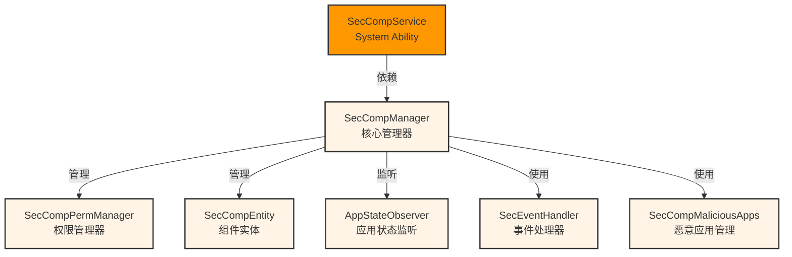
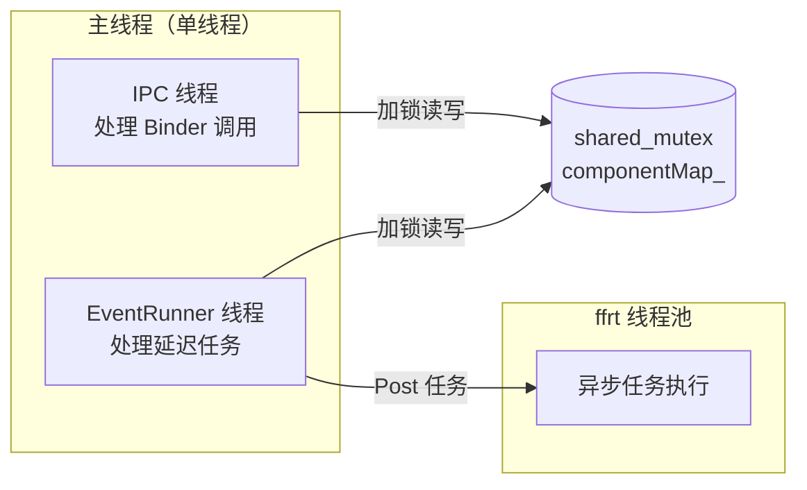

# 内部 API 与模块接口 - Security Component Manager

> 目的：了解内部模块接口、依赖方向与线程模型

---

## 适用范围

本文档适用于：
- 需要理解服务端逻辑的开发者
- 需要修改权限管理器的开发者
- 需要扩展增强框架的厂商

---

## 关键结论

1. **核心模块**：SecCompService → SecCompManager → SecCompPermManager
2. **依赖方向**：单向依赖，无循环
3. **线程模型**：单线程事件处理器 + ffrt 异步任务队列
4. **线程安全**：使用 `ffrt::shared_mutex` 和 `std::mutex` 保护共享数据

---

## SecCompService - 主 System Ability

### 类定义

```cpp
class __attribute__((visibility("default"))) SecCompService final
    : public SystemAbility
    , public SecCompServiceStub {
    DECLARE_DELAYED_SINGLETON(SecCompService);
    DECLEAR_SYSTEM_ABILITY(SecCompService);

public:
    SecCompService(int32_t saId, bool runOnCreate);

    // SystemAbility 接口
    void OnStart() override;
    void OnStop() override;

    // IPC 接口（由 SecCompServiceStub 生成）
    int32_t RegisterSecurityComponent(const SecCompRawdata& rawData, SecCompRawdata& rawReply) override;
    int32_t UpdateSecurityComponent(const SecCompRawdata& rawData, SecCompRawdata& rawReply) override;
    int32_t UnregisterSecurityComponent(const SecCompRawdata& rawData, SecCompRawdata& rawReply) override;
    int32_t ReportSecurityComponentClickEvent(const sptr<IRemoteObject>& callerToken,
        const sptr<IRemoteObject>& dialogCallback, const SecCompRawdata& rawData,
        SecCompRawdata& rawReply) override;
    int32_t VerifySavePermission(AccessToken::AccessTokenID tokenId, bool& isGranted) override;
    int32_t PreRegisterSecCompProcess(const SecCompRawdata& rawData, SecCompRawdata& rawReply) override;
    int Dump(int fd, const std::vector<std::u16string>& args) override;

private:
    // 内部方法
    int32_t ParseParams(const std::string& componentInfo, SecCompCallerInfo& caller, nlohmann::json& jsonRes);
    bool Initialize() const;
    bool RegisterAppStateObserver();
    void UnregisterAppStateObserver();
    bool GetCallerInfo(SecCompCallerInfo& caller);
    bool IsMediaLibraryCalling();

    // 成员变量
    std::mutex secCompSrvMutex_;
    std::mutex mediaLibMutex_;
    ServiceRunningState state_;
    sptr<AppExecFwk::IAppMgr> iAppMgr_;
    sptr<AppStateObserver> appStateObserver_;
    AccessToken::AccessTokenID mediaLibraryTokenId_ = 0;
};
```

**证据路径**：`services/security_component_service/sa/sa_main/sec_comp_service.h:38-91`

### 公共方法

| 方法 | 功能 | 线程安全 | 备注 |
|------|------|---------|------|
| `OnStart()` | 启动 SA，注册观察者 | 否 | 初始化核心管理器 |
| `OnStop()` | 停止 SA，清理资源 | 否 | 取消延迟任务 |
| `RegisterSecurityComponent()` | 注册组件 | 是 | 委托给 Manager |
| `UpdateSecurityComponent()` | 更新组件 | 是 | 委托给 Manager |
| `UnregisterSecurityComponent()` | 注销组件 | 是 | 委托给 Manager |
| `ReportSecurityComponentClickEvent()` | 报告点击事件 | 是 | 委托给 Manager |
| `VerifySavePermission()` | 验证保存权限 | 是 | 委托给 PermManager |
| `PreRegisterSecCompProcess()` | 预注册进程 | 是 | 委托给 Manager |
| `Dump()` | Dump 调试信息 | 是 | 输出组件列表 |

---

## SecCompManager - 核心业务管理器

### 类定义

```cpp
class SecCompManager {
public:
    static SecCompManager& GetInstance();

    // 组件管理
    int32_t RegisterSecurityComponent(SecCompType type, const nlohmann::json& jsonComponent,
        const SecCompCallerInfo& caller, int32_t& scId);
    int32_t UpdateSecurityComponent(int32_t scId, const nlohmann::json& jsonComponent,
        const SecCompCallerInfo& caller);
    int32_t UnregisterSecurityComponent(int32_t scId, const SecCompCallerInfo& caller);
    int32_t CheckClickSecurityComponentInfo(std::shared_ptr<SecCompEntity> sc, int32_t scId,
        const nlohmann::json& jsonComponent,  const SecCompCallerInfo& caller, std::string& message);

    // 点击事件处理
    int32_t ReportSecurityComponentClickEvent(SecCompInfo& secCompInfo, const nlohmann::json& jsonComponent,
        const SecCompCallerInfo& caller, const std::vector<sptr<IRemoteObject>>& remote, std::string& message);
    int32_t CheckClickEventParams(const SecCompCallerInfo& caller, const std::vector<sptr<IRemoteObject>>& remote);

    // 对话框管理
    int32_t StartDialog(const SecCompInfo& info, const std::shared_ptr<SecCompEntity>& sc,
        const std::vector<sptr<IRemoteObject>>& remote);

    // 应用状态监听
    void NotifyProcessForeground(int32_t pid);
    void NotifyProcessBackground(int32_t pid);
    void NotifyProcessDied(int32_t pid, bool isProcessCached);

    // 其他
    void DumpSecComp(std::string& dumpStr);
    bool Initialize();
    void ExitSaProcess();
    void ExitWhenAppMgrDied();
    int32_t AddSecurityComponentProcess(const SecCompCallerInfo& caller);
    bool HasCustomPermissionForSecComp();

private:
    SecCompManager();
    bool IsCompExist();
    bool IsScIdExist(int32_t scId);
    int32_t AddSecurityComponentToList(int32_t pid,
        AccessToken::AccessTokenID tokenId, std::shared_ptr<SecCompEntity> newEntity);
    int32_t DeleteSecurityComponentFromList(int32_t pid, int32_t scId);
    std::shared_ptr<SecCompEntity> GetSecurityComponentFromList(int32_t pid, int32_t scId);
    void SendCheckInfoEnhanceSysEvent(int32_t scId,
        SecCompType type, const std::string& scene, int32_t res);
    int32_t CreateScId();
    void GetFoldOffsetY(const CrossAxisState crossAxisState);

    // 成员变量（线程安全保护）
    ffrt::shared_mutex componentInfoLock_;
    std::mutex scIdMtx_;
    std::mutex superFoldOffsetMtx_;
    std::unordered_map<int32_t, ProcessCompInfos> componentMap_;
    int32_t scIdStart_;
    bool isSaExit_ = false;
    int32_t superFoldOffsetY_ = 0;

    // 事件处理
    std::shared_ptr<AppExecFwk::EventRunner> secRunner_;
    std::shared_ptr<SecEventHandler> secHandler_;
    SecCompMaliciousApps malicious_;
};
```

**证据路径**：`services/security_component_service/sa/sa_main/sec_comp_manager.h:50-107`

### 数据结构

```cpp
struct SecCompCallerInfo {
    AccessToken::AccessTokenID tokenId;
    int32_t uid;
    int32_t pid;
};

struct ProcessCompInfos {
    std::vector<std::shared_ptr<SecCompEntity>> compList;
    bool isForeground = false;
    AccessToken::AccessTokenID tokenId;
};
```

**证据路径**：`services/security_component_service/sa/sa_main/sec_comp_manager.h:38-48`

### 公共方法

| 方法 | 功能 | 锁保护 | 备注 |
|------|------|--------|------|
| `RegisterSecurityComponent()` | 注册组件 | `scIdMtx_` | 生成 scId，添加到 componentMap_ |
| `UpdateSecurityComponent()` | 更新组件 | `componentInfoLock_` | 从 componentMap_ 获取并更新 |
| `UnregisterSecurityComponent()` | 注销组件 | `componentInfoLock_` | 从 componentMap_ 删除 |
| `ReportSecurityComponentClickEvent()` | 处理点击事件 | `componentInfoLock_` | 验证点击，授予权限 |
| `CheckClickEventParams()` | 检查点击事件参数 | `componentInfoLock_` | 验证 callerToken、dialogCallback |
| `NotifyProcessForeground()` | 通知应用进入前台 | `componentInfoLock_` | 标记 isForeground = true |
| `NotifyProcessBackground()` | 通知应用进入后台 | `componentInfoLock_` | 启动延迟撤销任务 |
| `NotifyProcessDied()` | 通知应用死亡 | `componentInfoLock_` | 清理所有组件 |
| `AddSecurityComponentProcess()` | 添加安全组件进程 | `componentInfoLock_` | 调用增强适配器 |

---

## SecCompPermManager - 权限管理器

### 类定义

```cpp
class SecCompPermManager {
public:
    static SecCompPermManager& GetInstance();

    // 临时权限授予
    int32_t GrantTempPermission(AccessToken::AccessTokenID tokenId,
        const std::shared_ptr<SecCompBase>& componentInfo);
    int32_t GrantTempSavePermission(AccessToken::AccessTokenID tokenId);
    void RevokeTempSavePermission(AccessToken::AccessTokenID tokenId);

    // 权限验证
    bool VerifySavePermission(AccessToken::AccessTokenID tokenId);
    bool VerifyPermission(AccessToken::AccessTokenID tokenId, SecCompType type);

    // 应用权限管理
    int32_t GrantAppPermission(AccessToken::AccessTokenID tokenId, const std::string& permissionName);
    int32_t RevokeAppPermission(AccessToken::AccessTokenID tokenId, const std::string& permissionName);
    void RevokeAppPermissions(AccessToken::AccessTokenID tokenId);

    // 延迟任务
    void InitEventHandler(const std::shared_ptr<SecEventHandler>& secHandler);
    std::shared_ptr<SecEventHandler> GetSecEventHandler() const;
    void RevokeAppPermisionsDelayed(AccessToken::AccessTokenID tokenId);
    void CancelAppRevokingPermisions(AccessToken::AccessTokenID tokenId);

private:
    bool DelaySaveRevokePermission(AccessToken::AccessTokenID tokenId, const std::string& taskName);
    bool RevokeSavePermissionTask(const std::string& taskName);
    void RevokeTempSavePermissionCount(AccessToken::AccessTokenID tokenId);
    void RevokeAppPermisionsImmediately(AccessToken::AccessTokenID tokenId);

    // 权限记录
    void AddAppGrantPermissionRecord(AccessToken::AccessTokenID tokenId,
        const std::string& permissionName);
    void RemoveAppGrantPermissionRecord(AccessToken::AccessTokenID tokenId,
        const std::string& permissionName);

    // 成员变量（线程安全保护）
    std::unordered_map<AccessToken::AccessTokenID, int32_t> applySaveCountMap_;
    std::unordered_map<AccessToken::AccessTokenID, std::deque<std::string>> saveTaskDequeMap_;
    std::mutex mutex_;
    std::shared_ptr<SecEventHandler> secHandler_;

    // 权限映射（用于撤销时查找已授予的权限）
    std::mutex grantMtx_;
    std::unordered_map<int32_t, std::set<std::string>> grantMap_;
};
```

**证据路径**：`services/security_component_service/sa/sa_main/sec_comp_perm_manager.h:29-74`

### 公共方法

| 方法 | 功能 | 锁保护 | 权限类型 |
|------|------|--------|----------|
| `GrantTempPermission()` | 授予临时权限 | `mutex_` | Location, Paste, Save |
| `GrantTempSavePermission()` | 授予保存权限 | `mutex_` | Save（引用计数） |
| `RevokeTempSavePermission()` | 撤销保存权限 | `mutex_` | Save（引用计数） |
| `VerifySavePermission()` | 验证保存权限 | `mutex_` | Save（引用计数检查） |
| `VerifyPermission()` | 验证权限 | `mutex_` | Location, Paste |
| `GrantAppPermission()` | 授予应用权限 | `grantMtx_` | 所有权限类型 |
| `RevokeAppPermission()` | 撤销应用权限 | `grantMtx_` | 所有权限类型 |
| `RevokeAppPermissions()` | 撤销应用所有权限 | `grantMtx_` | 所有权限类型 |
| `RevokeAppPermisionsDelayed()` | 延迟撤销应用权限 | `mutex_` | Location, Paste（10 秒） |
| `CancelAppRevokingPermisions()` | 取消延迟撤销 | `mutex_` | Location, Paste |

### 权限授予逻辑

```cpp
// services/security_component_service/sa/sa_main/sec_comp_perm_manager.cpp:279
int32_t SecCompPermManager::GrantTempPermission(
    AccessToken::AccessTokenID tokenId, const std::shared_ptr<SecCompBase>& componentInfo)
{
    SecCompType type = componentInfo->type_;
    int32_t ret = SC_OK;

    switch (type) {
        case LOCATION_COMPONENT:
            // 授予精确位置权限
            ret = GrantAppPermission(tokenId, "ohos.permission.LOCATION");
            if (ret != SC_OK) return ret;
            // 授予模糊位置权限
            ret = GrantAppPermission(tokenId, "ohos.permission.APPROXIMATELY_LOCATION");
            break;

        case PASTE_COMPONENT:
            // 授予粘贴权限
            ret = GrantAppPermission(tokenId, "ohos.permission.SECURE_PASTE");
            break;

        case SAVE_COMPONENT:
            // 调用保存权限授予（内部引用计数）
            ret = GrantTempSavePermission(tokenId);
            break;

        default:
            return SC_SERVICE_ERROR_VALUE_INVALID;
    }

    return ret;
}
```

---

## SecCompEntity - 组件实体

### 类定义

```cpp
class SecCompEntity : public SecCompBase {
public:
    SecCompEntity() = default;
    ~SecCompEntity() = default;

    // 组件验证
    int32_t CheckClickInfo(const SecCompCallerInfo& caller);

    // Getter
    SecCompRect GetRect() const { return rect_; }
    AccessToken::AccessTokenID GetTokenId() const { return tokenId_; }
    int32_t GetPid() const { return pid_; }

private:
    SecCompRect rect_;
    AccessToken::AccessTokenID tokenId_;
    int32_t pid_;
    std::string iconPath_;
};
```

**证据路径**：`services/security_component_service/sa/sa_main/sec_comp_entity.h`

### 验证方法

| 检查项 | 方法 | 验证内容 |
|--------|------|----------|
| 窗口覆盖 | `WindowInfoHelper::CheckWindowCover()` | 组件是否被其他窗口遮挡 |
| 坐标范围 | `IsInRect()` | 点击点是否在组件矩形内 |
| 时间戳 | 比较当前时间戳 | 点击事件是否在 5000ms 内 |
| 键盘事件 | 检查 keyCode | 是否为 SPACE (2050)、ENTER (2054)、NUMPAD_ENTER (2119) |
| 增强数据 | `SecCompEnhanceAdapter::CheckExtraInfo()` | HMAC、Challenge 值是否有效 |

**证据路径**：`services/security_component_service/sa/sa_main/sec_comp_entity.cpp:124-174`

---

## AppStateObserver - 应用状态监听

### 类定义

```cpp
class AppStateObserver : public AppExecFwk::ApplicationStateObserver {
public:
    AppStateObserver();
    ~AppStateObserver() override;

    // ApplicationStateObserver 接口
    void OnForegroundApplicationChanged(const AppExecFwk::AppStateData& appStateData) override;

private:
    std::weak_ptr<SecCompManager> secCompManager_;
};
```

**证据路径**：`services/security_component_service/sa/sa_main/app_state_observer.h:18-26`

### 状态通知

| 应用状态转换 | 通知的 Manager 方法 | 执行操作 |
|------------|---------------------|----------|
| 前台 → 后台 | `NotifyProcessBackground(pid)` | 启动 10 秒延迟撤销任务 |
| 后台 → 前台 | `NotifyProcessForeground(pid)` | 取消延迟撤销任务 |
| 应用死亡 | `NotifyProcessDied(pid)` | 清理所有组件和权限 |

---

## SecEventHandler - 事件处理器

### 类定义

```cpp
class SecEventHandler : public AppExecFwk::EventHandler {
public:
    explicit SecEventHandler(const std::shared_ptr<AppExecFwk::EventRunner>& runner);
    ~SecEventHandler() override;

    // 发送延迟任务
    bool PostDelayedTask(std::function<void()> callback, int64_t delayTime, const std::string& taskName);
    bool RemoveTask(const std::string& taskName);

private:
    std::shared_ptr<AppExecFwk::EventRunner> runner_;
    std::unordered_map<std::string, InnerEvent::EventId> taskIds_;
};
```

**证据路径**：`services/security_component_service/sa/sa_main/sec_event_handler.h:27-41`

### 延迟任务使用

```cpp
// 启动 10 秒延迟撤销任务
secHandler_->PostDelayedTask([tokenId]() {
    SecCompPermManager::GetInstance().RevokeAppPermissions(tokenId);
}, 10000, "RevokePermission_" + std::to_string(tokenId));
```

---

## 模块依赖关系



**依赖方向**（无环）：
- `SecCompService` → `SecCompManager`（通过 IPC 方法）
- `SecCompManager` → `SecCompPermManager`（权限授予/撤销）
- `SecCompManager` → `SecCompEntity`（组件管理）
- `SecCompManager` → `AppStateObserver`（状态监听）
- `SecCompManager` → `SecEventHandler`（延迟任务）
- `SecCompManager` → `SecCompMaliciousApps`（黑名单检查）

---

## 线程安全分析

### 锁的类型

| 锁名 | 类型 | 保护的数据 | 读写模式 |
|--------|------|----------|----------|
| `componentInfoLock_` | `ffrt::shared_mutex` | `componentMap_` | 共享读，独占写 |
| `scIdMtx_` | `std::mutex` | `scIdStart_` | 独占读写 |
| `superFoldOffsetMtx_` | `std::mutex` | `superFoldOffsetY_` | 独占读写 |
| `mutex_` | `std::mutex` | `applySaveCountMap_`<br/>`saveTaskDequeMap_` | 独占读写 |
| `grantMtx_` | `std::mutex` | `grantMap_` | 独占读写 |
| `secCompSrvMutex_` | `std::mutex` | Service 状态 | 独占读写 |
| `mediaLibMutex_` | `std::mutex` | `mediaLibraryTokenId_` | 独占读写 |

### 线程模型



---

## 稳定接口标注

### 稳定接口（public API）

**证据**：在 `interfaces/inner_api/` 目录下，对外暴露

| 接口 | 稳定性 | 备注 |
|------|--------|------|
| `SecCompKit::RegisterSecurityComponent()` | ✅ 稳定 | 公共 SDK API |
| `SecCompKit::UpdateSecurityComponent()` | ✅ 稳定 | 公共 SDK API |
| `SecCompKit::UnregisterSecurityComponent()` | ✅ 稳定 | 公共 SDK API |
| `SecCompKit::ReportSecurityComponentClickEvent()` | ✅ 稳定 | 公共 SDK API |
| `SecCompEnhanceKit::InitClientEnhance()` | ✅ 稳定 | 厂商扩展点 |

### 不稳定接口（内部实现）

**证据**：在 `services/` 或 `frameworks/src/` 目录下，可能变更

| 接口 | 稳定性 | 备注 |
|------|--------|------|
| `SecCompManager` 内部方法 | ⚠️ 不稳定 | 实现细节可能变更 |
| `SecCompPermManager` 内部方法 | ⚠️ 不稳定 | 权限管理逻辑可能调整 |
| `SecCompEntity` 验证方法 | ⚠️ 不稳定 | 验证算法可能优化 |
| `AppStateObserver` 回调 | ⚠️ 不稳定 | 应用状态监听可能变更 |

---

## 相关跳转

- [架构说明](./02_Architecture.md) - 理解模块交互流程
- [对外 API](./03_Public_APIs.md) - 查看公共 SDK API

---

**返回 [主页](./README.md) | [导航](./SUMMARY.md)
