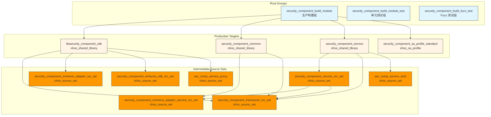
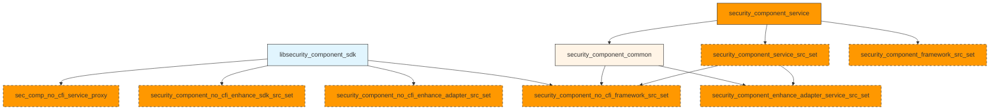

# GN Targets 与编译产物 - Security Component Manager

> 目的：了解 GN 构建系统、Target 依赖关系与编译产物

---

## 适用范围

本文档适用于：
- 需要构建项目的开发者
- 需要调试编译问题的开发者
- 需要集成本模块的系统集成者

---

## 关键结论

1. **主构建入口**：`BUILD.gn`（根目录）
2. **3 个主要生产 Target**：`libsecurity_component_sdk`、`security_component_common`、`security_component_service`
3. **26 个 BUILD.gn 文件**，2 个 .gni 文件
4. **产物类型**：`.so` 共享库、`.z.so` 系统库、可执行文件

---

## GN 构建文件清单

### BUILD.gn 文件（26 个）

| 路径 | 描述 |
|------|------|
| `/BUILD.gn` | 根构建文件，主 Target groups |
| `/config/BUILD.gn` | Coverage 配置 |
| `/frameworks/BUILD.gn` | 框架层 Source sets |
| `/frameworks/inner_api/security_component/BUILD.gn` | SDK library target |
| `/frameworks/inner_api/enhance_kits/BUILD.gn` | Enhancement SDK Source sets |
| `/services/security_component_service/sa/BUILD.gn` | 服务端 library targets |
| `/services/security_component_service/sa/sa_profile/BUILD.gn` | SA profile target |
| ...（其他测试 Target BUILD.gn 文件） | 测试相关 |

### .gni 文件（2 个）

| 路径 | 描述 |
|------|------|
| `/security_component.gni` | 主配置，feature flag 定义 |
| `/test/fuzztest/security_component/service/security_component_fuzz.gni` | Fuzz 测试公共定义 |

---

## Target 层级结构



---

## 主要 Target 详解

### 1. libsecurity_component_sdk - 客户端 SDK

**Target 定义**

**证据路径**：`frameworks/inner_api/security_component/BUILD.gn:24`

```gn
ohos_shared_library("libsecurity_component_sdk") {
  branch_protector_ret = "pac_ret"
  subsystem_name = "security"
  part_name = "security_component_manager"
  output_name = "libsecurity_component_sdk"

  public_configs = [ ":sec_comp_config" ]
  innerapi_tags = [ "sasdk" ]

  include_dirs = [
    "include",
    "${sec_comp_root_dir}/frameworks/common/include",
    "${sec_comp_root_dir}/frameworks/enhance_adapter/include/",
    "${sec_comp_root_dir}/frameworks/inner_api/enhance_kits/include",
    "${sec_comp_root_dir}/frameworks/security_component/include",
    "${sec_comp_root_dir}/interfaces/inner_api/security_component_common",
  ]

  sources = [
    "src/sec_comp_caller_authorization.cpp",
    "src/sec_comp_client.cpp",
    "src/sec_comp_death_recipient.cpp",
    "src/sec_comp_dialog_callback.cpp",
    "src/sec_comp_dialog_callback_stub.cpp",
    "src/sec_comp_kit.cpp",
    "src/sec_comp_load_callback.cpp",
    "src/sec_comp_ui_register.cpp",
  ]

  deps = [
    "${sec_comp_root_dir}/frameworks:security_component_no_cfi_enhance_adapter_src_set",
    "${sec_comp_root_dir}/frameworks:security_component_no_cfi_framework_src_set",
    "${sec_comp_root_dir}/frameworks/inner_api/enhance_kits:security_component_no_cfi_enhance_sdk_src_set",
    "${sec_comp_root_dir}/services/security_component_service/sa:sec_comp_no_cfi_service_proxy",
  ]

  external_deps = [
    "access_token:libaccesstoken_sdk",
    "bundle_framework:appexecfwk_base",
    "bundle_framework:appexecfwk_core",
    "c_utils:utils",
    "hilog:libhilog",
    "hisysevent:libhisysevent",
    "ipc:ipc_core",
    "json:nlohmann_json_static",
    "samgr:samgr_proxy",
  ]

  cflags_cc = [
    "-DHILOG_ENABLE",
    "-fvisibility=hidden",
  ]
}
```

**属性**：

| 属性 | 值 | 说明 |
|------|-----|------|
| 类型 | `ohos_shared_library` | 共享库 |
| 输出名 | `libsecurity_component_sdk` | `.so` 文件名 |
| 内部 API 标签 | `sasdk` | 系统应用 SDK |
| 分支保护 | `pac_ret` | PAC-RET 保护 |

**外部依赖**：
- `access_token:libaccesstoken_sdk` - 访问令牌
- `bundle_framework:appexecfwk_*` - 应用框架
- `c_utils:utils` - C 工具库
- `hilog:libhilog` - HiLog 日志
- `hisysevent:libhisysevent` - HiSysEvent 系统事件
- `ipc:ipc_core` - IPC 框架
- `json:nlohmann_json_static` - JSON 库
- `samgr:samgr_proxy` - System Ability Manager

---

### 2. security_component_common - 公共库

**Target 定义**

**证据路径**：`services/security_component_service/sa/BUILD.gn:128`

```gn
ohos_shared_library("security_component_common") {
  subsystem_name = "security"
  part_name = "security_component_manager"

  innerapi_tags = [ "sasdk" ]
  public_configs = [ ":security_component_common_config" ]

  sanitize = {
    cfi = true
    cfi_cross_dso = true
    debug = false
  }
  branch_protector_ret = "pac_ret"

  include_dirs = [
    "${sec_comp_root_dir}/frameworks/common/include",
    "${sec_comp_root_dir}/frameworks/security_component/include",
    "${sec_comp_root_dir}/frameworks/inner_api/security_component/include",
    "${sec_comp_root_dir}/interfaces/inner_api/security_component_common",
    "${sec_comp_root_dir}/interfaces/inner_api/security_component/include",
  ]

  sources = [
    "sa_main/delay_exit_task.cpp",
    "sa_main/sec_comp_info_helper.cpp",
    "sa_main/sec_event_handler.cpp",
    "sa_main/window_info_helper.cpp",
  ]

  deps = [
    "${sec_comp_root_dir}/frameworks:security_component_enhance_adapter_service_src_set",
    "${sec_comp_root_dir}/frameworks:security_component_no_cfi_framework_src_set",
  ]

  external_deps = [
    "ability_runtime:ability_manager",
    "access_token:libaccesstoken_sdk",
    "access_token:libtokenid_sdk",
    "bundle_framework:appexecfwk_base",
    "c_utils:utils",
    "eventhandler:libeventhandler",
    "hilog:libhilog",
    "hisysevent:libhisysevent",
    "ipc:ipc_core",
    "ipc:ipc_single",
    "json:nlohmann_json_static",
    "safwk:system_ability_fwk",
    "samgr:samgr_proxy",
    "window_manager:libdm",
    "window_manager:libwm",
  ]

  cflags_cc = [
    "-DHILOG_ENABLE",
    "-fvisibility=hidden",
    "-DSEC_COMP_SERVICE_COMPILE_ENABLE",
  ]
}
```

**属性**：

| 属性 | 值 | 说明 |
|------|-----|------|
| 类型 | `ohos_shared_library` | 共享库（系统库） |
| 输出名 | `security_component_common` | `.z.so` 文件名 |
| CFI | `true` | Control Flow Integrity |
| 跨 DSO CFI | `true` | 跨库 CFI |

**外部依赖**：
- `ability_runtime:ability_manager` - 能力管理
- `access_token:libaccesstoken_sdk` - 访问令牌 SDK
- `access_token:libtokenid_sdk` - Token ID SDK
- `eventhandler:libeventhandler` - 事件处理器
- `safwk:system_ability_fwk` - System Ability 框架
- `window_manager:libdm`、`libwm` - 窗口管理器

---

### 3. security_component_service - 服务端库

**Target 定义**

**证据路径**：`services/security_component_service/sa/BUILD.gn:283`

```gn
ohos_shared_library("security_component_service") {
  subsystem_name = "security"
  part_name = "security_component_manager"

  sanitize = {
    cfi = true
    cfi_cross_dso = true
    debug = false
  }
  branch_protector_ret = "pac_ret"

  deps = [
    ":security_component_common",
    ":security_component_service.rc",
    ":security_component_service_src_set",
    "${sec_comp_root_dir}/frameworks:security_component_framework_src_set",
  ]

  external_deps = [ "hilog:libhilog" ]

  configs = [ "${sec_comp_root_dir}/config:coverage_flags" ]
}
```

**属性**：

| 属性 | 值 | 说明 |
|------|-----|------|
| 类型 | `ohos_shared_library` | 共享库（系统库） |
| 输出名 | `security_component_service` | `.z.so` 文件名 |

**依赖**：
- `:security_component_common` - 公共库
- `:security_component_service.rc` - 服务启动配置
- `:security_component_service_src_set` - 服务端源码

---

## Source Set Targets（中间产物）

### security_component_framework_src_set

**证据路径**：`frameworks/BUILD.gn`

**源文件**：
- `security_component/src/sec_comp_base.cpp`
- `security_component/src/sec_comp_click_event_parcel.cpp`
- `security_component/src/paste_button.cpp`
- `security_component/src/save_button.cpp`
- `security_component/src/location_button.cpp`

### security_component_enhance_adapter_src_set

**证据路径**：`frameworks/BUILD.gn`

**源文件**：
- `enhance_adapter/src/sec_comp_enhance_adapter.cpp`

### sec_comp_service_proxy

**证据路径**：`services/security_component_service/sa/BUILD.gn:36`

**源文件**：从 `ISecCompService.idl` 生成的 `_proxy.cpp`

### sec_comp_service_stub

**证据路径**：`services/security_component_service/sa/BUILD.gn:82`

**源文件**：从 `ISecCompService.idl` 生成的 `_stub.cpp`

---

## 条件编译配置

### Feature Flags

**证据路径**：`security_component.gni:16-21`

```gn
if (!defined(global_parts_info) ||
    defined(global_parts_info.security_security_component_enhance)) {
  security_component_enhance_enable = true
} else {
  security_component_enhance_enable = false
}
```

**效果**：
- `security_component_enhance_enable = true` - 启用增强框架
- `security_component_enhance_enable = false` - 禁用增强框架

### Preprocessor Defines

| 宏 | 定义位置 | 用途 |
|-----|---------|------|
| `HILOG_ENABLE` | cflags_cc | 启用 HiLog 日志 |
| `SEC_COMP_SERVICE_COMPILE_ENABLE` | cflags_cc | 标记服务端编译 |
| `SECURITY_COMPONENT_ENHANCE_ENABLE` | cflags_cc | 启用增强功能 |
| `SECURITY_COMPONENT_ENHANCE_DISABLE` | no_cfi 变体 | 禁用增强（用于测试） |
| `TDD_COVERAGE` | cflags_cc | 覆盖率统计 |

---

## Target 依赖关系



**依赖说明**：
- `libsecurity_component_sdk` 依赖 3 个 source sets（增强适配器、框架、增强 SDK、Proxy）
- `security_component_common` 依赖 2 个 source sets（增强适配器服务端、框架）
- `security_component_service` 依赖 common、service source set、框架 source set

---

## 相关跳转

- [编译产物](./06_Build_Artifacts.md) - 查看产物清单与安装路径

---

**返回 [主页](./README.md) | [导航](./SUMMARY.md)
