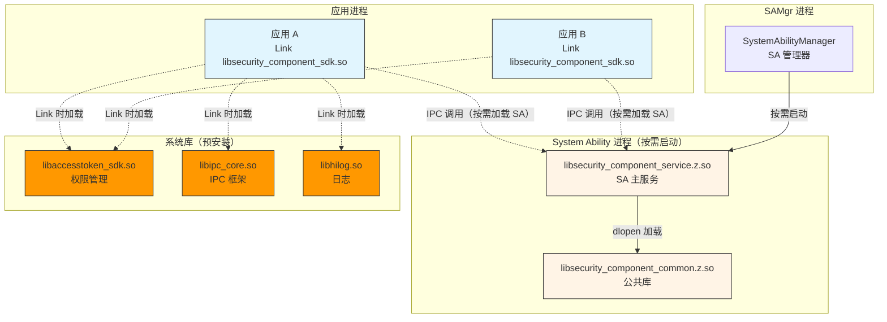
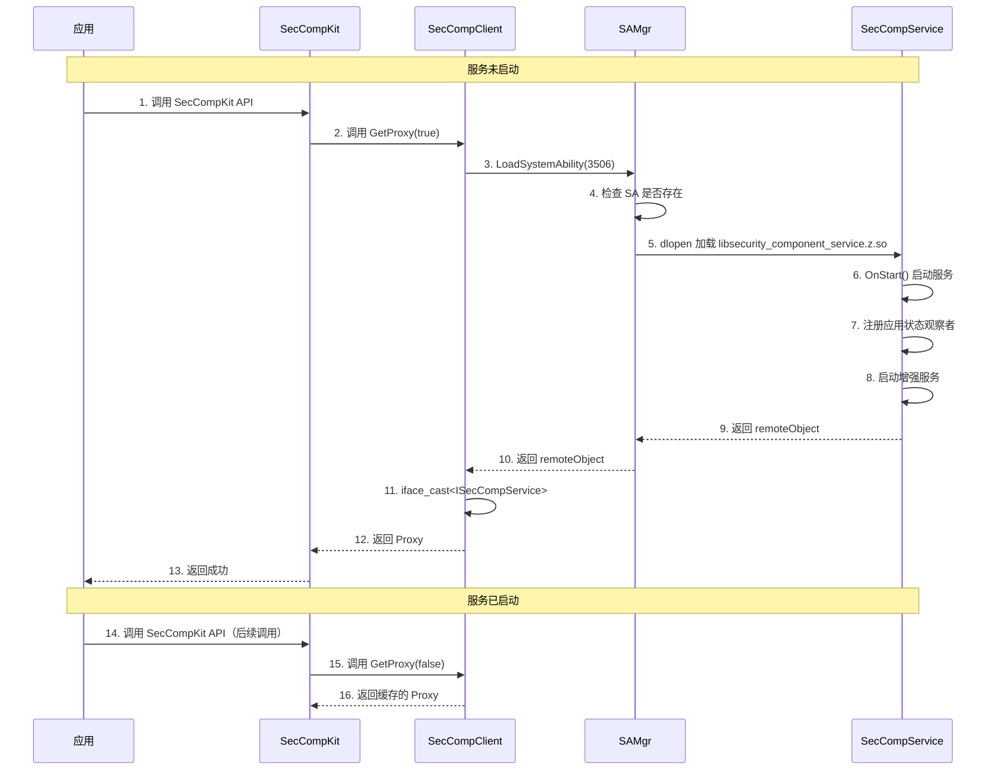
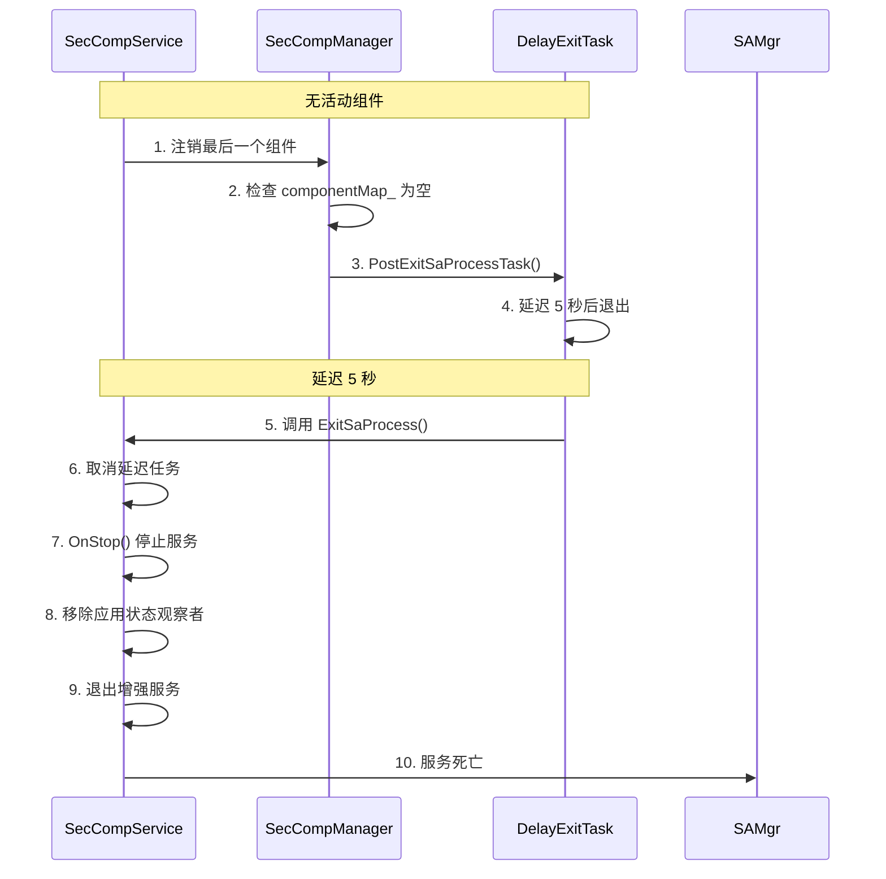
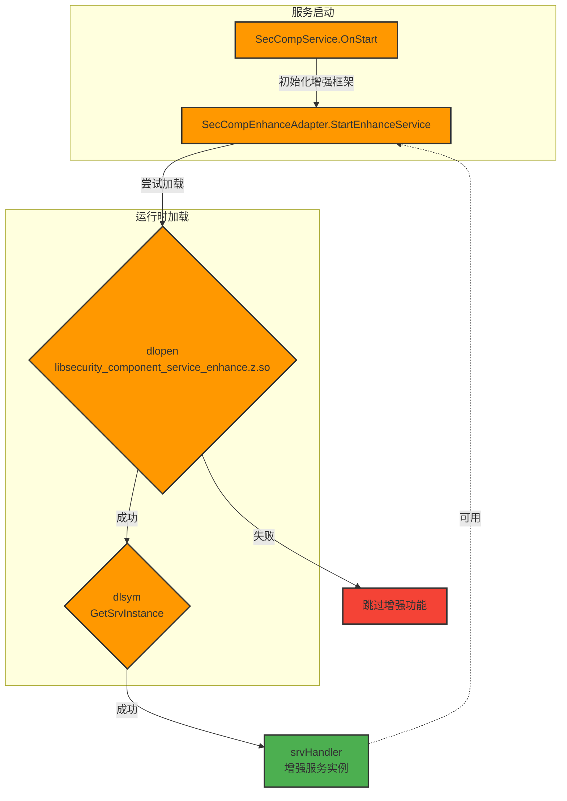

# 编译产物与运行时加载 - Security Component Manager

> 目的：了解编译产物清单、安装路径与运行时加载关系

---

## 适用范围

本文档适用于：
- 需要部署系统的系统集成者
- 需要调试加载问题的开发者
- 需要优化部署的系统集成者

---

## 关键结论

1. **3 个主要共享库**：`libsecurity_component_sdk.so`、`libsecurity_component_common.z.so`、`libsecurity_component_service.z.so`
2. **服务启动配置**：`security_component_service.rc`（init 脚本）
3. **SA 配置文件**：`3506.json`（System Ability profile）
4. **按需加载**：服务在首次调用时启动，无活动组件时延迟退出

---

## 编译产物清单

### 生产库（3 个）

| 产物名 | Target | 类型 | 安装路径 | 加载时机 | 依赖库 |
|--------|--------|------|----------|----------|
| `libsecurity_component_sdk.so` | `libsecurity_component_sdk` | `/usr/lib/`<br/>`/system/lib/` | 应用启动时（Link 时） | `libaccesstoken_sdk.so`<br/>`libappexecfwk_*.so`<br/>`libhilog.so`<br/>`libhisysevent.so`<br/>`libipc_core.so`<br/>`libjson.so`<br/>`libsamgr.so` |
| `libsecurity_component_common.z.so` | `security_component_common` | `/system/lib/` | 服务启动时 | `libability_manager.so`<br/>`libaccesstoken_sdk.so`<br/>`libtokenid_sdk.so`<br/>`libappexecfwk_base.so`<br/>`libeventhandler.so`<br/>`libffrt.so`<br/>`libhilog.so`<br/>`libhisysevent.so`<br/>`libipc_core.so`<br/>`libipc_single.so`<br/>`libjson.so`<br/>`libsafwk.so`<br/>`libsamgr.so`<br/>`libdm.so`<br/>`libwm.so`<br/>`librender_service_client.so` |
| `libsecurity_component_service.z.so` | `security_component_service` | `/system/lib/` | 服务启动时 | `libsecurity_component_common.z.so`<br/>`libsecurity_component_service.rc`<br/>`libhilog.so` |

**说明**：
- `.so` - 标准共享库（应用可用）
- `.z.so` - 系统共享库（系统内部使用，应用不直接 Link）

### 配置文件（2 个）

| 产物名 | Target | 安装路径 | 内容 |
|--------|--------|----------|------|
| `security_component_service.cfg` | `:security_component_service.rc` | `/system/etc/init/` | 服务启动配置（required permissions 等） |
| `3506.json` | `:security_component_sa_profile_standard` | `/system/profile/` | System Ability 配置（SA ID 3506） |

### SA Profile 内容

**证据路径**：`services/security_component_service/sa/sa_profile/3506.json`

```json
{
  "services": [
    {
      "name": "3506",
      "path": "/system/lib/libsecurity_component_service.z.so",
      "ondemand": true,
      "boot-phase": 2,
      "start-mode": "condition",
      "required": [
        "GetSystemAbilityManager"
      ]
    }
  ]
}
```

**关键字段**：
- `ondemand: true` - 按需加载（首次调用时启动）
- `boot-phase: 2` - 启动阶段 2（基础服务启动后）
- `start-mode: "condition"` - 条件启动模式

---

## 运行时加载关系



---

## Target 到产物映射

### Production Targets

| Target | GN 类型 | 输出产物 | 产物类型 | 最终安装路径 |
|--------|----------|----------|----------|-------------|
| `libsecurity_component_sdk` | `ohos_shared_library` | `out/.../lib.unstripped/libsecurity_component_sdk.so` | `/usr/lib/` 或 `/system/lib/` |
| `security_component_common` | `ohos_shared_library` | `out/.../lib.unstripped/libsecurity_component_common.z.so` | `/system/lib/` |
| `security_component_service` | `ohos_shared_library` | `out/.../lib.unstripped/libsecurity_component_service.z.so` | `/system/lib/` |

### Configuration Targets

| Target | GN 类型 | 输出产物 | 最终安装路径 |
|--------|----------|----------|-------------|
| `:security_component_service.rc` | `ohos_prebuilt_etc` | `security_component_service.cfg` | `/system/etc/init/` |
| `:security_component_sa_profile_standard` | `ohos_sa_profile` | `3506.json` | `/system/profile/` |

---

## 按需加载机制

### 加载触发



**证据路径**：
- 按需加载：`services/security_component_service/sa/sa_profile/3506.json:5`
- Proxy 缓存：`frameworks/inner_api/security_component/src/sec_comp_client.cpp`

### 延迟退出机制



**证据路径**：
- 延迟退出：`services/security_component_service/sa/sa_main/delay_exit_task.cpp`
- 退出逻辑：`services/security_component_service/sa/sa_main/sec_comp_manager.cpp:69`

---

## 增强库加载

### 动态加载流程



**证据路径**：`frameworks/enhance_adapter/src/sec_comp_enhance_adapter.cpp:309-327`

---

## 部署验证

### 编译验证

```bash
# 编译生产模块
./build.sh --product-name rk3568 --build-variant root --build-target security_component_build_module

# 编译单元测试
./build.sh --product-name rk3568 --build-variant root --build-target security_component_build_module_test

# 编译 Fuzz 测试
./build.sh --product-name rk3568 --build-variant root --build-target security_component_build_fuzz_test
```

### 产物验证

```bash
# 检查生成的库
ls -lh out/rk3568/lib.unstripped/

# 检查 SDK 库
ls -lh out/rk3568/tests/unittest/security_component_manager/

# 检查 SA Profile
cat out/rk3568/system/profile/3506.json

# 检查服务配置
cat out/rk3568/system/etc/init/security_component_service.cfg
```

### 安装验证

```bash
# 验证 SA 是否注册
hdc shell dump -l | grep 3506

# 验证服务是否启动
hdc shell ps -A | grep security_component

# 验证库是否安装
hdc shell ls -l /system/lib/libsecurity_component*
```

---

## 常见问题

### 问题 1：服务无法按需加载

**症状**：应用调用 API 时，服务未启动

**排查步骤**：
1. 检查 SA Profile 是否正确安装：
   ```bash
   hdc shell cat /system/profile/3506.json
   ```
2. 检查服务库是否存在：
   ```bash
   hdc shell ls -l /system/lib/libsecurity_component_service.z.so
   ```
3. 检查服务权限：
   ```bash
   hdc shell cat /system/etc/init/security_component_service.cfg
   ```

**证据路径**：`services/security_component_service/sa/sa_profile/3506.json`

### 问题 2：增强库加载失败

**症状**：增强功能不生效

**排查步骤**：
1. 检查增强库是否安装：
   ```bash
   hdc shell ls -l /system/lib/libsecurity_component_*_enhance.z.so
   ```
2. 检查 feature flag：
   ```bash
   # 查看编译配置
   cat out/rk3568/args.gn | grep security_component_enhance
   ```
3. 检查日志：
   ```bash
   hdc shell hilog -T SecurityComponent | grep Enhance
   ```

**证据路径**：`frameworks/enhance_adapter/src/sec_comp_enhance_adapter.cpp:73-78`

### 问题 3：应用无法 Link SDK

**症状**：应用编译时报错找不到符号

**排查步骤**：
1. 检查 SDK 库是否导出符号：
   ```bash
   nm -D out/rk3568/lib.unstripped/libsecurity_component_sdk.so | grep SecCompKit
   ```
2. 检查头文件是否包含：
   ```bash
   # 确保包含正确的头文件路径
   #include "security_component/sec_comp_kit.h"
   ```
3. 检查 GN deps 配置：
   ```bash
   # 确保应用 BUILD.gn 包含正确的 deps
   deps = ["//base/security/security_component_manager/frameworks/inner_api/security_component:libsecurity_component_sdk"]
   ```

**证据路径**：`frameworks/inner_api/security_component/BUILD.gn:24-85`

---

## 相关跳转

- [GN Targets](./05_GN_Targets.md) - 查看 Target 详细定义
- [常见问题](./08_Common_Issues.md) - 查看更多排查步骤

---

**返回 [主页](./README.md) | [导航](./SUMMARY.md)
