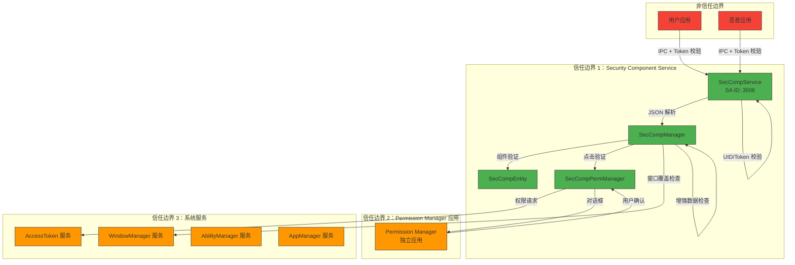

# 安全风险评审 - Security Component Manager

> 目的：识别安全组件管理服务的攻击面、信任边界与可被利用点

---

## 适用范围

本文档适用于：
- 进行安全审计的安全研究人员
- 进行威胁建模的安全工程师
- 需要加固系统的安全开发人员

---

## 关键结论

1. **主要攻击面**：IPC、临时权限授予、点击事件验证、增强框架动态加载
2. **信任边界**：应用进程 ↔ Security Component Service ↔ Permission Manager ↔ AccessToken 服务
3. **发现 5 个可被利用点**，需要修复建议
4. **缓解措施**：点击事件验证、窗口覆盖检测、时间戳验证、增强框架

---

## 攻击面清单

### 1. IPC 攻击面

**入口**：`ISecCompService` IPC 接口（SA ID: 3506）

| IPC 方法 | 攻击面 | 风险等级 |
|---------|--------|----------|
| `RegisterSecurityComponent` | JSON 注入、参数伪造 | 中 |
| `UpdateSecurityComponent` | JSON 注入、参数篡改 | 中 |
| `UnregisterSecurityComponent` | 组件 ID 篡改 | 低 |
| `ReportSecurityComponentClickEvent` | 点击事件伪造、Token 伪造 | 高 |
| `VerifySavePermission` | Token ID 伪造 | 中 |
| `PreRegisterSecCompProcess` | 进程信息伪造 | 中 |

**证据路径**：`services/security_component_service/sa/ISecCompService.idl:19-27`

### 2. 输入验证攻击面

**验证点**：

| 验证项 | 攻击面 | 现有保护 |
|--------|--------|----------|
| JSON 解析 | JSON 注入、超大负载 | ❌ 无长度限制 |
| 组件类型 | 类型混淆 | ✅ 枚举范围检查 |
| 组件尺寸 | 负数、超大尺寸 | ⚠️ 部分最小值检查 |
| 组件位置 | 坐标溢出 | ✅ 坐标范围检查 |
| 点击事件 | 伪造点击、重放攻击 | ✅ 时间戳验证 |

**证据路径**：
- JSON 解析：`services/security_component_service/sa/sa_main/sec_comp_info_helper.cpp`
- 尺寸验证：`services/security_component_service/sa/sa_main/sec_comp_entity.cpp:124`

### 3. 权限授予攻击面

**权限类型**：

| 组件 | 权限 | 攻击面 | 撤销时机 |
|------|------|--------|----------|
| LocationButton | `ohos.permission.LOCATION`<br/>`ohos.permission.APPROXIMATELY_LOCATION` | 权限持久化 | 后台 10 秒 |
| PasteButton | `ohos.permission.SECURE_PASTE` | 粘贴持久化 | 后台 10 秒 |
| SaveButton | 内部引用计数 | 保存持久化 | 操作完成 60 秒 |

**证据路径**：`services/security_component_service/sa/sa_main/sec_comp_perm_manager.cpp:279-323`

### 4. 增强框架攻击面

**动态加载**：

| 加载点 | 攻击面 | 现有保护 |
|--------|--------|----------|
| 客户端增强库 | 库替换、符号注入 | ⚠️ 无签名验证 |
| 服务端增强库 | 库替换、符号注入 | ⚠️ 无签名验证 |

**证据路径**：`frameworks/enhance_adapter/src/sec_comp_enhance_adapter.cpp:73`

### 5. 竞态条件攻击面

**共享数据竞争**：

| 数据结构 | 竞态风险 | 现有保护 |
|--------|----------|----------|
| `componentMap_` | 读写竞态 | ✅ `ffrt::shared_mutex` |
| `grantMap_` | 读写竞态 | ✅ `std::mutex` |
| `applySaveCountMap_` | 读写竞态 | ✅ `std::mutex` |

**证据路径**：`services/security_component_service/sa/sa_main/sec_comp_manager.h:90-95`

---

## 信任边界与数据流



**信任边界说明**：
1. **应用进程（非信任）**：用户应用、恶意应用
2. **Security Component Service（信任）**：SA 3506，处理 IPC 请求
3. **Permission Manager（信任）**：独立应用，显示确认对话框
4. **系统服务（信任）**：AccessToken、WindowManager、AbilityManager、AppManager

---

## 可被利用点（Exploitable Points）

### ⚠️ 1. JSON 注入（组件注册）

**证据路径**：
- 注册入口：`services/security_component_service/sa/sa_main/sec_comp_info_helper.cpp`
- 无长度限制检查

**触发条件**：
1. 恶意应用调用 `RegisterSecurityComponent()`
2. 传递超大 JSON 字符串（> 4KB）
3. JSON 包含嵌套对象或特殊字符

**影响**：
- 服务器内存耗尽
- 服务拒绝服务

**修复建议**：
```cpp
// 在 sec_comp_info_helper.cpp 中添加长度检查
static constexpr uint32_t MAX_COMPONENT_INFO_SIZE = 4096;

std::string componentInfo = /* 从 rawdata 读取 */;
if (componentInfo.size() > MAX_COMPONENT_INFO_SIZE) {
    SC_LOG_ERROR(LABEL, "Component info too large: %{public}zu", componentInfo.size());
    return SC_SERVICE_ERROR_COMPONENT_INFO_INVALID;
}
```

---

### ⚠️ 2. 组件重叠绕过（点击验证）

**证据路径**：
- 重叠检测：`services/security_component_service/sa/sa_main/window_info_helper.cpp:WindowInfoHelper::CheckWindowCover()`
- 验证逻辑：`services/security_component_service/sa/sa_main/sec_comp_entity.cpp:124-174`

**触发条件**：
1. 恶意应用注册组件时指定小尺寸
2. 实际渲染时使用大尺寸（透明覆盖）
3. 用户点击透明区域

**影响**：
- 组件重叠检查失效
- 用户点击伪造组件，授予非预期的权限

**修复建议**：
1. 添加渲染尺寸验证：
   ```cpp
   // 在注册和更新时验证实际渲染尺寸
   int32_t ret = WindowInfoHelper::CheckWindowCover(rect, pid);
   if (ret != SC_OK) {
       return SC_SERVICE_ERROR_COMPONENT_RECT_OVERLAP;
   }
   ```
2. 周期性重新验证窗口信息

---

### ⚠️ 3. 点击事件重放（权限持久化）

**证据路径**：
- 时间戳验证：`services/security_component_service/sa/sa_main/sec_comp_entity.cpp:150-155`
- 验证逻辑：`services/security_component_service/sa/sa_main/sec_comp_entity.cpp:124-174`

**触发条件**：
1. 恶意应用捕获有效点击事件（包含时间戳）
2. 等待应用进入后台（权限未撤销）
3. 应用返回前台时重放点击事件
4. 使用旧的时间戳通过验证

**影响**：
- 点击事件重放成功
- 权限重新授予绕过用户点击
- 临时权限被持久化

**修复建议**：
```cpp
// 使用单调递增的时间戳
static constexpr uint64_t CLICK_EVENT_TTL_MS = 5000;

// 在 sec_comp_entity.cpp:CheckPointEvent() 中
if (clickInfo.point.timestamp < lastValidTimestamp_) {
    SC_LOG_ERROR(LABEL, "Replay attack detected: timestamp too old");
    return SC_SERVICE_ERROR_CLICK_EVENT_INVALID;
}
if (clickInfo.point.timestamp > GetCurrentTimestamp() + CLICK_EVENT_TTL_MS) {
    SC_LOG_ERROR(LABEL, "Timestamp too far in future");
    return SC_SERVICE_ERROR_CLICK_EVENT_INVALID;
}

// 更新最后有效时间戳
lastValidTimestamp_ = clickInfo.point.timestamp;
```

---

### ⚠️ 4. Token ID 伪造（权限验证）

**证据路径**：
- Token 获取：`services/security_component_service/sa/sa_main/sec_comp_service.cpp:GetCallerInfo()`
- 验证逻辑：`services/security_component_service/sa/sa_main/sec_comp_service.cpp:ParseParams()`

**触发条件**：
1. 恶意应用伪造 Token ID（低权限应用的 Token）
2. 调用 `VerifySavePermission(tokenId)`
3. 获取其他应用的权限

**影响**：
- 跨应用权限提升
- 保存权限泄露

**修复建议**：
```cpp
// 在 sec_comp_service.cpp:ParseParams() 中添加 Token 验证
bool SecCompService::GetCallerInfo(SecCompCallerInfo& caller) {
    int32_t uid = IPCSkeleton::GetCallingUid();
    AccessToken::AccessTokenID tokenId = IPCSkeleton::GetCallingTokenID();

    // 验证 Token 属于调用者
    int32_t callerUid = AccessToken::AccessTokenKit::GetUidByToken(tokenId);
    if (callerUid != uid) {
        SC_LOG_ERROR(LABEL, "Token ID %{public}d does not match caller UID %{public}d", tokenId, uid);
        return false;
    }

    caller.tokenId = tokenId;
    caller.uid = uid;
    caller.pid = IPCSkeleton::GetCallingPid();
    return true;
}
```

---

### ⚠️ 5. 增强库替换（动态加载）

**证据路径**：
- 动态加载：`frameworks/enhance_adapter/src/sec_comp_enhance_adapter.cpp:73-78`
- 库路径：`frameworks/enhance_adapter/src/sec_comp_enhance_adapter.cpp:33-35`

**触发条件**：
1. 攻击者替换 `libsecurity_component_service_enhance.z.so`
2. 重新启动服务
3. 恶意增强库绕过所有安全检查

**影响**：
- 所有验证逻辑被绕过
- 任意点击事件被接受
- 权限无条件授予

**修复建议**：
```cpp
// 在 sec_comp_enhance_adapter.cpp:InitEnhanceHandler() 中添加库签名验证
void* handler = dlopen(libPath.c_str(), RTLD_LAZY);
if (handler == nullptr) {
    SC_LOG_ERROR(LABEL, "dlopen failed");
    return;
}

// 验证库签名（伪代码，需要实际实现）
if (!VerifyLibrarySignature(handler, libPath)) {
    SC_LOG_ERROR(LABEL, "Library signature verification failed: %{public}s", libPath.c_str());
    dlclose(handler);
    return;
}

// 继续正常流程
EnhanceInterface getSrvInstance = reinterpret_cast<EnhanceInterface>(dlsym(handler, "GetSrvInstance"));
```

---

## 检查范围与局限性

### 已检查范围

✅ **IPC 接口**：所有 6 个 IPC 方法
✅ **输入验证**：JSON 解析、组件类型、尺寸验证
✅ **权限授予**：临时权限授予/撤销逻辑
✅ **点击事件验证**：窗口覆盖、坐标范围、时间戳
✅ **线程安全**：互斥锁保护共享数据
✅ **动态加载**：增强框架的 dlopen 调用

### 未检查范围

⏳ **Ace Engine 集成**：位于 arkui_ace_engine 仓库
⏳ **Permission Manager 应用**：位于 applications/standard/permission_manager
⏳ **厂商增强库实现**：需要额外的厂商文档
⏳ **内存安全**：需要使用 AddressSanitizer 进行完整分析
⏳ **模糊测试**：需要运行 Fuzz 测试套件

### 局限性

1. **无 N-API 绑定**：本项目不直接暴露 JS API，攻击面集中在 C++ 层
2. **依赖系统服务**：Security Component Service 依赖 AccessToken、WindowManager 等系统服务的安全性
3. **假设应用隔离**：假设应用进程隔离，未考虑容器逃逸场景

---

## 缓解措施有效性评估

| 缓解措施 | 有效性 | 局限 |
|----------|--------|------|
| 点击事件验证（窗口覆盖、坐标范围） | ⭐⭐⭐ | 透明覆盖可能绕过 |
| 时间戳验证 | ⭐⭐ | 重放攻击可能绕过 |
| 增强框架 | ⭐⭐⭐⭐ | 厂商实现差异较大 |
| Token 校验 | ⭐⭐ | 需要完善实现 |
| 权限自动撤销 | ⭐⭐ | 10 秒延迟可能不够 |

---

## 安全加固建议

### 短期改进

1. **添加 JSON 长度限制**：防止内存耗尽
2. **完善 Token 验证**：验证 Token 属于调用者
3. **添加单调时间戳**：防止点击事件重放
4. **增强库签名验证**：防止库替换

### 中期改进

1. **周期性窗口验证**：检测透明覆盖
2. **缩短权限有效期**：考虑将 10 秒缩短到 5 秒
3. **添加异常检测**：检测异常的组件注册/点击频率
4. **完善模糊测试覆盖**：增加 Fuzz 测试用例

### 长期改进

1. **引入形式化验证**：使用模型验证组件状态机
2. **增强审计日志**：记录所有安全相关操作
3. **引入硬件信任根**：验证增强库完整性

---

## 相关跳转

- [架构说明](./02_Architecture.md) - 理解安全相关数据流
- [附录：调用链分析](./appendix/Callgraphs.md) - 查看关键安全调用链

---

**返回 [主页](./README.md) | [导航](./SUMMARY.md)
