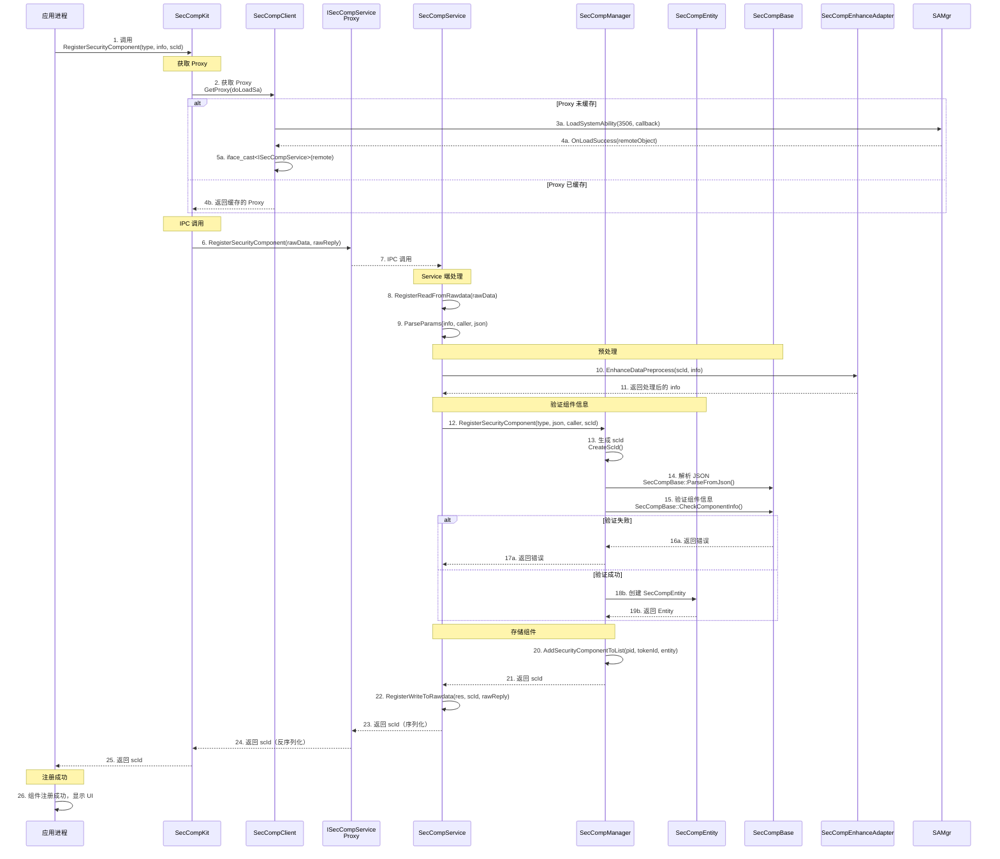
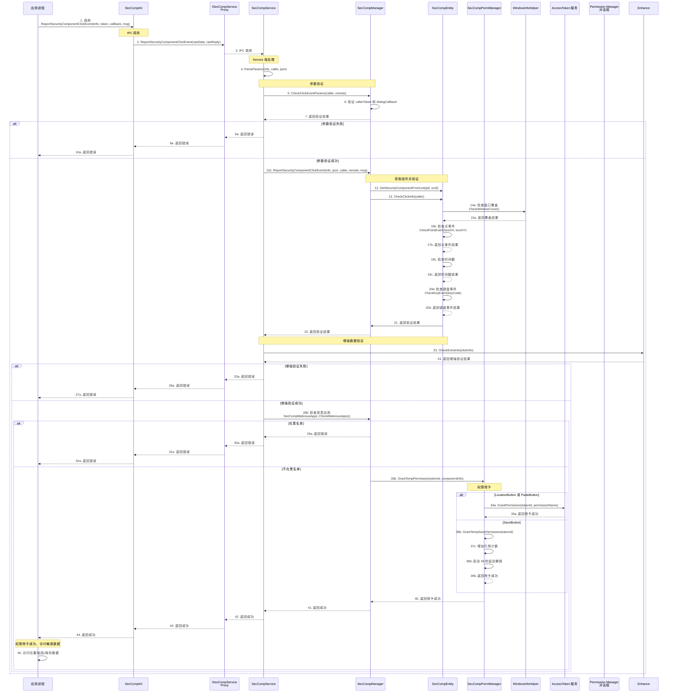
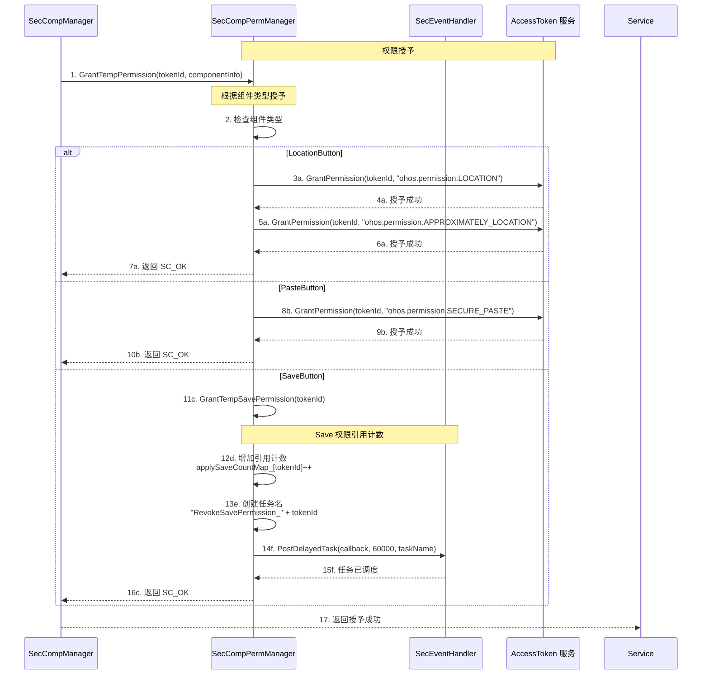
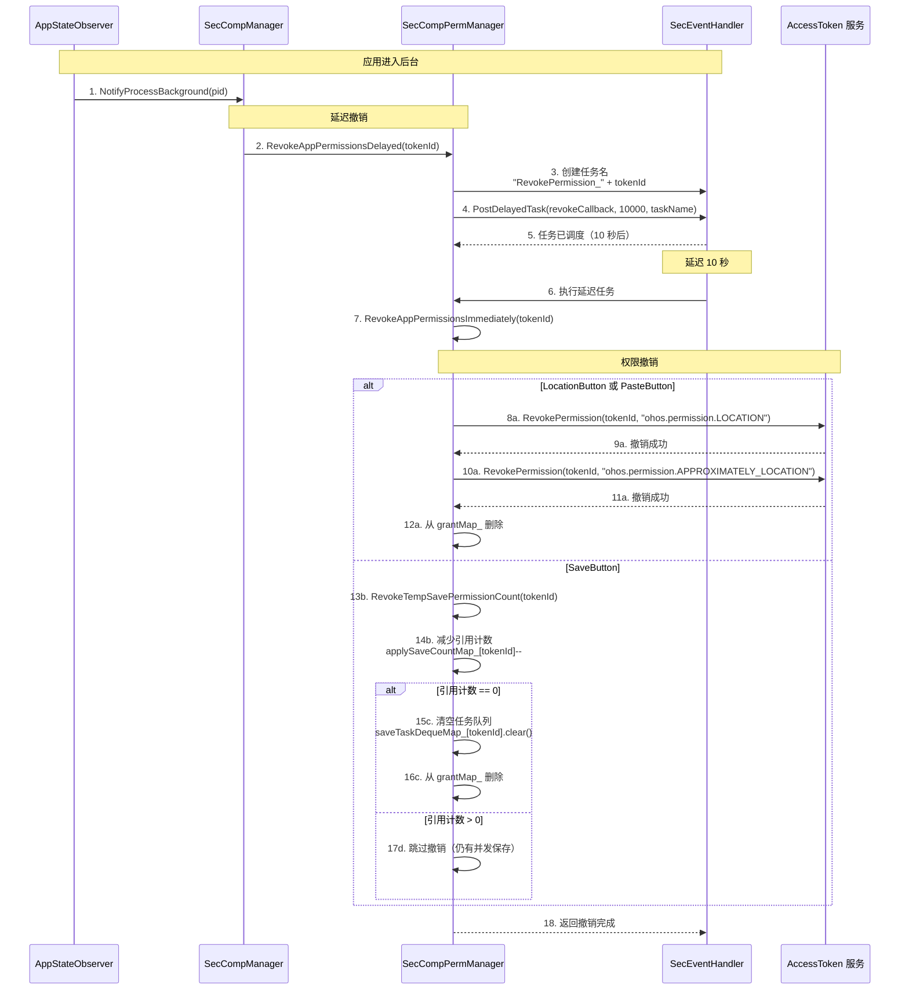
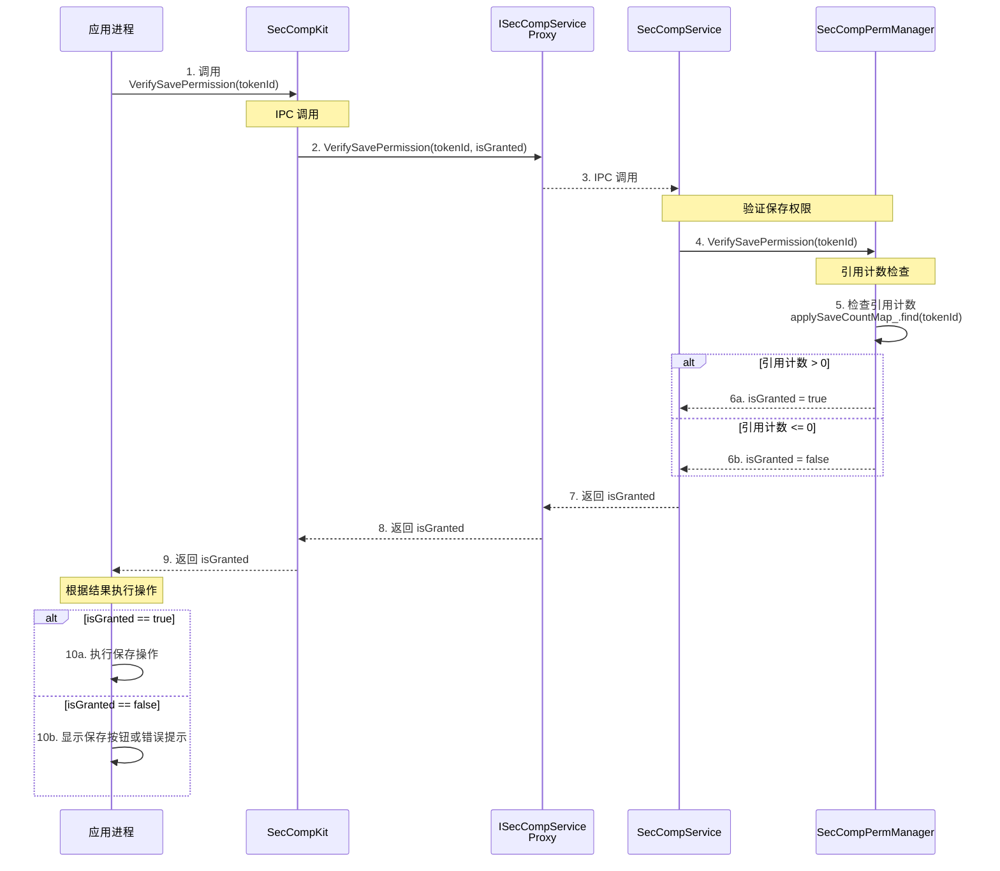

# 附录：调用链分析 - Security Component Manager

> 目的：跟踪关键 API 调用链，理解数据流与执行路径

---

## 适用范围

本文档适用于：
- 需要调试问题的开发者
- 需要理解执行流程的开发者
- 需要性能优化的开发者

---

## 关键结论

1. **组件注册**：应用 → SecCompKit → IPC → SecCompService → SecCompManager → SecCompEntity
2. **点击事件处理**：应用 → SecCompKit → IPC → SecCompService → SecCompManager → SecCompPermManager
3. **权限授予**：SecCompPermManager → AccessToken 服务
4. **权限撤销**：AppStateObserver → SecCompPermManager → AccessToken 服务

---

## 1. RegisterSecurityComponent 调用链

**关键验证点**：

| 步骤 | 验证内容 | 文件:行 |
|------|----------|----------|
| 9 | 调用者 Token/UID 校验 | `sec_comp_service.cpp:78-82` |
| 11 | 增强数据预处理 | `sec_comp_enhance_adapter.cpp:154-166` |
| 14 | JSON 解析 | `sec_comp_info_helper.cpp` |
| 15 | 组件信息验证 | `sec_comp_base.cpp` |

---

## 2. ReportSecurityComponentClickEvent 调用链

**关键验证点**：

| 步骤 | 验证内容 | 文件:行 |
|------|----------|----------|
| 6 | callerToken 和 dialogCallback 验证 | `sec_comp_manager.cpp:64-76` |
| 14a | 窗口覆盖检查 | `window_info_helper.cpp` |
| 14b | 坐标范围检查 | `sec_comp_entity.cpp` |
| 14c | 时间戳检查（5000ms 内） | `sec_comp_entity.cpp:150-155` |
| 14d | 键盘事件检查（SPACE/ENTER/NUMPAD_ENTER） | `sec_comp_entity.cpp:156-174` |
| 24 | 增强数据验证（HMAC/Challenge） | `sec_comp_enhance_adapter.cpp:116-129` |

---

## 3. GrantTempPermission 调用链

**关键逻辑**：

| 组件类型 | 权限名称 | 撤销时机 |
|---------|----------|----------|
| LocationButton | `ohos.permission.LOCATION` | 后台 10 秒 |
| LocationButton | `ohos.permission.APPROXIMATELY_LOCATION` | 后台 10 秒 |
| PasteButton | `ohos.permission.SECURE_PASTE` | 后台 10 秒 |
| SaveButton | 内部引用计数 | 操作完成 60 秒 |

**证据路径**：`services/security_component_service/sa/sa_main/sec_comp_perm_manager.cpp:279-323`

---

## 4. RevokeAppPermissions 调用链

**证据路径**：`services/security_component_service/sa/sa_main/sec_comp_perm_manager.cpp:43-59`

---

## 5. VerifySavePermission 调用链

**证据路径**：`services/security_component_service/sa/sa_main/sec_comp_perm_manager.cpp:140-161`

---

## 调用链总结

| API | 层数 | 关键验证点 | 性能敏感 |
|-----|-------|----------|----------|
| `RegisterSecurityComponent` | 9 层 | 组件验证 | 是 |
| `ReportSecurityComponentClickEvent` | 12 层 | 点击验证 + 权限授予 | 是 |
| `GrantTempPermission` | 2 层（PermMgr → Access） | 无 | 否 |
| `RevokeAppPermissions` | 3 层 | 无 | 否 |
| `VerifySavePermission` | 3 层 | 无 | 否 |

---

## 相关跳转

- [对外 API](./03_Public_APIs.md) - 查看 API 参考
- [内部 API](./04_Internal_APIs.md) - 查看内部接口详情

---

**返回 [主页](./README.md) | [导航](./SUMMARY.md)
