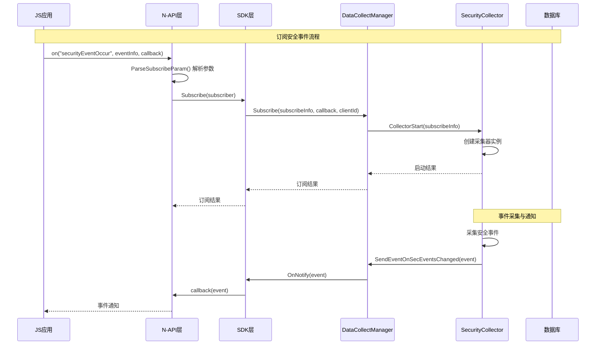

# SecurityGuard 架构详解

**文档版本**：3.1.0  
**最后更新**：2026-02-06  
**维护者**：SecurityGuard Team

---

## 1. 概述

本文档详细描述 SecurityGuard 设备的系统架构，包括模块划分、线程模型、IPC 通信机制以及数据流向。所有关键结论均可追溯到代码证据。

**证据来源**：`frameworks/js/napi/security_guard_napi.cpp:1374-1405`（N-API 模块注册）、`services/data_collect/sa/include/data_collect_manager_service.h:32`（SA 服务定义）

---

## 2. 系统架构概览

### 2.1 四层架构模型

```
┌─────────────────────────────────────────────────────────────────────────────┐
│                              应用层（JS/ArkUI）                               │
│                                                                              │
│  import securityGuard from '@ohos.security.securityGuard';                   │
│                                                                              │
└─────────────────────────────────────────────────────────────────────────────┘
                                      │
                                      ▼
┌─────────────────────────────────────────────────────────────────────────────┐
│                           N-API 层（securityguard_napi.z.so）                 │
│                                                                              │
│  ├── 事件上报接口：reportSecurityEvent()                                      │
│  ├── 事件查询接口：querySecurityEvent()                                      │
│  ├── 事件订阅接口：on() / off()                                              │
│  ├── 采集器控制：startSecurityEventCollector() / stopSecurityEventCollector()│
│  ├── 模型获取：getModelResult()                                              │
│  └── 策略更新：updatePolicyFile()                                             │
│                                                                              │
│  位置：frameworks/js/napi/security_guard_napi.cpp                            │
└─────────────────────────────────────────────────────────────────────────────┘
                                      │
                                      ▼
┌─────────────────────────────────────────────────────────────────────────────┐
│                          Inner API 层（平台 SDK）                             │
│                                                                              │
│  ┌───────────────────────────────────────────────────────────────────────┐  │
│  │ libsg_collect_sdk.so（数据采集 SDK）                                  │  │
│  │ 位置：frameworks/common/collect/BUILD.gn                              │  │
│  │ 功能：事件上报、数据查询、订阅管理                                      │  │
│  └───────────────────────────────────────────────────────────────────────┘  │
│  ┌───────────────────────────────────────────────────────────────────────┐  │
│  │ libsg_classify_sdk.so（风险分类 SDK）                                 │  │
│  │ 位置：frameworks/common/classify/BUILD.gn                             │  │
│  │ 功能：模型结果请求、模型状态管理                                        │  │
│  └───────────────────────────────────────────────────────────────────────┘  │
│  ┌───────────────────────────────────────────────────────────────────────┐  │
│  │ libsg_collector_sdk.so（采集器 SDK）                                  │  │
│  │ 位置：frameworks/common/collector/BUILD.gn                            │  │
│  │ 功能：采集器生命周期管理、事件订阅                                      │  │
│  └───────────────────────────────────────────────────────────────────────┘  │
│                                                                              │
│  Inner API 标签：platformsdk, sasdk                                          │
└─────────────────────────────────────────────────────────────────────────────┘
                                      │
                                      ▼
┌─────────────────────────────────────────────────────────────────────────────┐
│                            服务层（SA Services）                               │
│                                                                              │
│  ┌───────────────────────────────────────────────────────────────────────┐  │
│  │ SA 3523：RiskAnalysisManager（风险分析服务）                          │  │
│  │ 位置：services/risk_classify/include/risk_analysis_manager_service.h  │  │
│  │ 功能：安全模型执行、风险分析结果返回                                    │  │
│  └───────────────────────────────────────────────────────────────────────┘  │
│  ┌───────────────────────────────────────────────────────────────────────┐  │
│  │ SA 3524：DataCollectManager（数据收集服务）                            │  │
│  │ 位置：services/data_collect/sa/include/data_collect_manager_service.h  │  │
│  │ 功能：事件上报、事件查询、订阅管理、配置更新                            │  │
│  └───────────────────────────────────────────────────────────────────────┘  │
│  ┌───────────────────────────────────────────────────────────────────────┐  │
│  │ SA 3525：SecurityCollectorManager（安全采集器管理服务）                 │  │
│  │ 位置：services/security_collector/include/security_collector_manager_service.h│
│  │ 功能：采集器生命周期管理、事件采集、事件过滤                            │  │
│  └───────────────────────────────────────────────────────────────────────┘  │
│                                                                              │
│  SA 配置：sa_profile/3523.json, 3524.json, 3525.json                        │
└─────────────────────────────────────────────────────────────────────────────┘
                                      │
                                      ▼
┌─────────────────────────────────────────────────────────────────────────────┐
│                            管理层（Manager Layer）                            │
│                                                                              │
│  ┌──────────────────────┐  ┌──────────────────────┐                      │
│  │ ConfigManager         │  │ CollectorManager      │                      │
│  │ 配置管理服务           │  │ 采集器管理服务        │                      │
│  │ 路径：services/config_ │  │ 路径：services/       │                      │
│  │ manager/             │  │ collector_manager/    │                      │
│  └──────────────────────┘  └──────────────────────┘                      │
│  ┌──────────────────────┐  ┌──────────────────────┐                      │
│  │ ModelManager          │  │ BigData              │                      │
│  │ 模型管理服务           │  │ 大数据上报服务        │                      │
│  │ 路径：services/risk_  │  │ 路径：services/      │                      │
│  │ classify/model_manager│  │ bigdata/             │                      │
│  └──────────────────────┘  └──────────────────────┘                      │
│                                                                              │
└─────────────────────────────────────────────────────────────────────────────┘
                                      │
                                      ▼
┌─────────────────────────────────────────────────────────────────────────────┐
│                            数据存储层（Storage Layer）                        │
│                                                                              │
│  ┌──────────────────────┐  ┌──────────────────────┐                      │
│  │ SQLite 数据库         │  │ 文件系统存储          │                      │
│  │ 位置：services/data_  │  │ 位置：services/data_  │                      │
│  │ collect/store/       │  │ collect/store/        │                      │
│  └──────────────────────┘  └──────────────────────┘                      │
│  ┌──────────────────────┐                                                  │
│  │ RDB 存储              │                                                  │
│  │ 关系型数据库存储       │                                                  │
│  └──────────────────────┘                                                  │
│                                                                              │
│  安装路径：/data/service/el1/public/database/security_guard_service/        │
└─────────────────────────────────────────────────────────────────────────────┘
```

### 2.2 产物与组件映射表

| 组件名称 | 产物文件 | 类型 | Inner API 标签 | 代码位置 |
|---------|---------|------|---------------|----------|
| securityguard_napi | securityguard_napi.z.so | 共享库 | 无 | frameworks/js/napi/BUILD.gn |
| libsg_collect_sdk | libsg_collect_sdk.so | 共享库 | platformsdk, sasdk | frameworks/common/collect/BUILD.gn |
| libsg_classify_sdk | libsg_classify_sdk.so | 共享库 | platformsdk, sasdk | frameworks/common/classify/BUILD.gn |
| libsg_collector_sdk | libsg_collector_sdk.so | 共享库 | platformsdk, sasdk | frameworks/common/collector/BUILD.gn |
| sg_collect_service | sg_collect_service.so | 服务 | 无 | services/data_collect/BUILD.gn |
| sg_classify_service | sg_classify_service.so | 服务 | 无 | services/risk_classify/BUILD.gn |
| security_collector_service | security_collector_service.so | 服务 | 无 | services/security_collector/BUILD.gn |
| security_collector_manager | security_collector_manager.so | 共享库 | 无 | services/collector_manager/BUILD.gn |
| sg_config_manager | sg_config_manager.so | 共享库 | 无 | services/config_manager/BUILD.gn |

**证据来源**：BUILD.gn 各模块配置文件

---

## 3. 服务架构详解

### 3.1 System Ability 列表

SecurityGuard 包含三个核心系统能力（SA），分别运行在不同进程：

| SA ID | 服务名称 | 进程 | 运行模式 | 主要功能 |
|-------|---------|------|---------|---------|
| 3523 | RiskAnalysisManager | security_guard | OnDemand | 安全模型分析、风险分类 |
| 3524 | DataCollectManager | security_guard | OnDemand | 事件上报、查询、订阅管理 |
| 3525 | SecurityCollectorManager | security_collector | OnDemand | 采集器生命周期管理、事件采集 |

**证据来源**：sa_profile/3523.json:1-10、sa_profile/3524.json:1-10、sa_profile/3525.json:1-10

### 3.2 DataCollectManager 服务详解

#### 3.2.1 服务接口定义

**位置**：interfaces/inner_api/collect/include/i_data_collect_manager.h

```cpp
// IPC 命令码定义
enum class DataCollectManagerInterfaceCode {
    CMD_DATA_COLLECT = 1,              // 数据采集
    CMD_DATA_REQUEST = 2,               // 数据请求
    CMD_DATA_SUBSCRIBE = 3,             // 数据订阅
    CMD_DATA_UNSUBSCRIBE = 4,           // 取消订阅
    CMD_SECURITY_EVENT_QUERY = 5,       // 安全事件查询
    CMD_SECURITY_COLLECTOR_START = 6,  // 采集器启动
    CMD_SECURITY_COLLECTOR_STOP = 7,   // 采集器停止
    CMD_SECURITY_CONFIG_UPDATE = 8,     // 配置更新
    CMD_SECURITY_EVENT_CONFIG_QUERY = 9, // 事件配置查询
    CMD_SECURITY_EVENT_MUTE = 10,      // 事件静音
    CMD_SECURITY_EVENT_UNMUTE = 11,    // 取消静音
    CMD_SECURITY_EVENT_QUERY_BY_ID = 12, // 按 ID 查询
};

// 服务接口类
class IDataCollectManager : public IRemoteBroker {
    virtual int32_t RequestDataSubmit(int64_t eventId, std::string &version, 
        std::string &time, std::string &content, bool isSync = true) = 0;
    virtual int32_t RequestRiskData(std::string &devId, std::string &eventList,
        const sptr<IRemoteObject> &callback) = 0;
    virtual int32_t Subscribe(const SecurityCollector::SecurityCollectorSubscribeInfo &subscribeInfo,
        const sptr<IRemoteObject> &callback, const std::string &clientId) = 0;
    virtual int32_t Unsubscribe(const SecurityCollector::SecurityCollectorSubscribeInfo &subscribeInfo,
        const sptr<IRemoteObject> &callback, const std::string &clientId) = 0;
    virtual int32_t QuerySecurityEvent(
        const std::vector<SecurityCollector::SecurityEventRuler> &rulers,
        const sptr<IRemoteObject> &cb, const std::string &eventGroup) = 0;
    virtual int32_t CollectorStart(const SecurityCollector::SecurityCollectorSubscribeInfo &subscribeInfo,
        const sptr<IRemoteObject> &cb) = 0;
    virtual int32_t CollectorStop(const SecurityCollector::SecurityCollectorSubscribeInfo &subscribeInfo,
        const sptr<IRemoteObject> &cb) = 0;
    virtual int32_t ConfigUpdate(int fd, const std::string& name) = 0;
    virtual int32_t AddFilter(const SecurityEventFilter &subscribeMute, 
        const std::string &clientId) = 0;
    virtual int32_t RemoveFilter(const SecurityEventFilter &subscribeMute, 
        const std::string &clientId) = 0;
};
```

#### 3.2.2 服务实现类

**位置**：services/data_collect/sa/include/data_collect_manager_service.h:32-98

```cpp
class DataCollectManagerService : public SystemAbility, 
    public DataCollectManagerIdlStub, public NoCopyable {
    DECLARE_SYSTEM_ABILITY(DataCollectManagerService);

public:
    DataCollectManagerService(int32_t saId, bool runOnCreate);
    ~DataCollectManagerService() override = default;
    void OnStart() override;
    void OnStop() override;
    int Dump(int fd, const std::vector<std::u16string>& args) override;
    
    // 核心接口实现
    ErrCode RequestDataSubmit(int64_t eventId, const std::string &version, 
        const std::string &time, const std::string &content) override;
    ErrCode RequestDataSubmitAsync(int64_t eventId, const std::string &version, 
        const std::string &time, const std::string &content) override;
    ErrCode RequestRiskData(const std::string &devId, const std::string &eventList,
        const sptr<IRemoteObject> &cb) override;
    ErrCode Subscribe(const SecurityCollector::SecurityCollectorSubscribeInfo &subscribeInfo,
        const sptr<IRemoteObject> &cb, const std::string &clientId) override;
    ErrCode Unsubscribe(const SecurityCollector::SecurityCollectorSubscribeInfo &subscribeInfo,
        const sptr<IRemoteObject> &cb, const std::string &clientId) override;
    ErrCode QuerySecurityEvent(
        const std::vector<SecurityCollector::SecurityEventRuler> &rulers,
        const sptr<IRemoteObject> &cb, const std::string &eventGroup) override;
    ErrCode CollectorStart(const SecurityCollector::SecurityCollectorSubscribeInfo &subscribeInfo,
        const sptr<IRemoteObject> &cb) override;
    ErrCode CollectorStop(const SecurityCollector::SecurityCollectorSubscribeInfo &subscribeInfo,
        const sptr<IRemoteObject> &cb) override;
    ErrCode ConfigUpdate(int fd, const std::string& name) override;
    ErrCode QuerySecurityEventConfig(std::string &result) override;
    ErrCode AddFilter(const SecurityEventFilter &subscribeMute, 
        const std::string &clientId) override;
    ErrCode RemoveFilter(const SecurityEventFilter &subscribeMute, 
        const std::string &clientId) override;
    
private:
    // 权限检查
    int32_t IsApiHasPermission(const std::string &api);
    int32_t IsEventGroupHasPermission(const std::string &eventGroup, 
        std::vector<int64_t> eventIds);
    int32_t IsEventGroupHasPublicPermission(const std::string &eventGroup, 
        std::vector<int64_t> eventIds);
    
    // 资源管理
    std::mutex mutex_{};
    sptr<IRemoteObject::DeathRecipient> deathRecipient_{};
    std::map<std::string, sptr<IRemoteObject>> clientCallBacks_{};
    std::atomic<int32_t> tokenBucket_{};  // Token Bucket 限流
};
```

### 3.3 RiskAnalysisManager 服务详解

#### 3.3.1 服务接口定义

**位置**：interfaces/inner_api/classify/include/i_risk_analysis_manager.h

```cpp
// IPC 命令码
enum class RiskAnalysisManagerInterfaceCode {
    CMD_GET_SECURITY_MODEL_RESULT = 2,  // 获取模型结果
    CMD_SET_MODEL_STATE = 3,             // 设置模型状态
    CMD_START_MODEL = 4,                  // 启动模型
};

// 服务接口
class IRiskAnalysisManager : public IRemoteBroker {
    virtual int32_t RequestSecurityModelResult(const std::string &devId, uint32_t modelId,
        const std::string &param, const sptr<IRemoteObject> &callback) = 0;
    virtual int32_t SetModelState(uint32_t modelId, bool enable) = 0;
    virtual int32_t StartSecurityModel(uint32_t modelId, const std::string &param) = 0;
};

// 回调接口
class IRiskAnalysisManagerCallback : public IRemoteBroker {
    virtual int32_t ResponseSecurityModelResult(const std::string &devId, 
        uint32_t modelId, std::string &result) = 0;
};
```

#### 3.3.2 支持的模型列表

**位置**：frameworks/js/napi/security_guard_napi.h:125-132

```cpp
enum ModelIdType {
    ROOT_SCAN_MODEL_ID = 3001000000,           // 越狱检测模型
    DEVICE_COMPLETENESS_MODEL_ID = 3001000001, // 设备完整性检测模型
    PHYSICAL_MACHINE_DETECTION_MODEL_ID = 3001000002, // 物理机检测模型
    SECURITY_RISK_FACTOR_MODEL_ID = 3001000009, // 安全风险因子检测
    WLAN_RISK_DETECTION_MODEL_ID = 3001000011,  // WLAN 风险检测
};
```

### 3.4 SecurityCollectorManager 服务详解

#### 3.4.1 服务接口定义

**位置**：interfaces/inner_api/collector/include/i_security_collector_manager.h

```cpp
// IPC 命令码
enum class SecurityCollectManagerInterfaceCode {
    CMD_COLLECTOR_SUBCRIBE = 1,        // 采集器订阅
    CMD_COLLECTOR_UNSUBCRIBE = 2,      // 取消订阅
    CMD_COLLECTOR_START = 3,           // 启动采集器
    CMD_COLLECTOR_STOP = 4,            // 停止采集器
    CMD_SECURITY_EVENT_QUERY = 5,      // 事件查询
    CMD_SECURITY_EVENT_MUTE = 6,       // 静音
    CMD_SECURITY_EVENT_UNMUTE = 7,     // 取消静音
};

// 服务接口
class ISecurityCollectorManager : public IRemoteBroker {
    virtual int32_t Subscribe(const SecurityCollectorSubscribeInfo &subscribeInfo,
        const sptr<IRemoteObject> &callback) = 0;
    virtual int32_t Unsubscribe(const sptr<IRemoteObject> &callback) = 0;
    virtual int32_t CollectorStart(const SecurityCollectorSubscribeInfo &subscribeInfo,
        const sptr<IRemoteObject> &cb) = 0;
    virtual int32_t CollectorStop(const SecurityCollectorSubscribeInfo &subscribeInfo,
        const sptr<IRemoteObject> &cb) = 0;
    virtual int32_t QuerySecurityEvent(
        const std::vector<SecurityCollector::SecurityEventRuler> &rulers,
        const sptr<IRemoteObject> &cb) = 0;
    virtual int32_t AddFilter(const SecurityEventFilter &filter,
        const sptr<IRemoteObject> &callback) = 0;
    virtual int32_t RemoveFilter(const SecurityEventFilter &filter,
        const sptr<IRemoteObject> &callback) = 0;
};
```

#### 3.4.2 权限校验实现

**位置**：services/security_collector/src/security_collector_manager_service.cpp:393-402

```cpp
int32_t SecurityCollectorManagerService::HasPermission(const std::string &permission)
{
    AccessToken::AccessTokenID callerToken = IPCSkeleton::GetCallingTokenID();
    int code = AccessToken::AccessTokenKit::VerifyAccessToken(callerToken, permission);
    if (code != AccessToken::PermissionState::PERMISSION_GRANTED) {
        return NO_PERMISSION;
    }
    return SUCCESS;
}
```

---

## 4. 线程模型

### 4.1 FFRT 异步任务调度

SecurityGuard 全面采用 FFRT（Fast Function Runtime）进行异步任务调度：

| 模块 | 线程/队列类型 | 用途 |
|------|--------------|------|
| DataCollectManagerService | ffrt::submit() | 异步任务提交 |
| SecurityCollectorManagerService | ffrt::thread | 后台卸载检查线程 |
| AcquireDataSubscribeManager | ffrt::queue (Serial) | UploadEvent 队列、DbEvent 队列 |
| DatabaseManager | ffrt::submit() | 数据库删除任务 |
| DetectPluginManager | ffrt::submit() | 重试订阅任务 |

**证据来源**：services/data_collect/sa/include/acquire_data_subscribe_manager.h

#### 4.1.1 Token Bucket 限流机制

**位置**：services/data_collect/sa/data_collect_manager_service.cpp

```cpp
// Token Bucket 限流任务
auto tokenBucketTask = [this]() {
    while (true) {
        if (tokenBucket_.load() < TOKEN_BUCKET_MAX_SIZE) {
            tokenBucket_.fetch_add(TOKEN_BUCKET_STEP_SIZE);
        }
        ffrt::this_task::sleep_for(std::chrono::milliseconds(TOKEN_BUCKET_INTERVAL_TIME));
    }
};
ffrt::submit(tokenBucketTask);
```

#### 4.1.2 双队列模型

**位置**：services/data_collect/sa/include/acquire_data_subscribe_manager.h

```cpp
class AcquireDataSubscribeManager {
private:
    // 事件上传队列（串行队列）
    std::shared_ptr<ffrt::queue> queue_ = std::make_shared<ffrt::queue>(
        ffrt::queue_serial, "UploadEvent");
    
    // 数据库上传队列（串行队列）
    std::shared_ptr<ffrt::queue> dbQueue_ = std::make_shared<ffrt::queue>(
        ffrt::queue_serial, "UploadDbEvent");
};
```

### 4.2 QoS 优先级控制

**位置**：services/security_collector/src/security_collector_manager_service.cpp

```cpp
// 高优先级事件使用默认 QoS
ffrt::submit(task);

// 后台事件使用 qos_background
if (event.eventId == FILE_EVENTID || 
    event.eventId == PROCESS_EVENTID || 
    event.eventId == NETWORK_EVENTID) {
    ffrt::submit(task, {}, {}, ffrt::task_attr().qos(ffrt::qos_background));
}
```

### 4.3 自动资源管理

**位置**：services/security_collector/src/security_collector_manager_service.cpp

```cpp
// 无订阅时自动卸载 SA
auto task = []() {
    while (g_flag) {
        ffrt::this_task::sleep_for(std::chrono::milliseconds(SLEEP_INTERVAL));
        if (g_refCount.load() != 0) continue;
        registry->UnloadSystemAbility(SECURITY_COLLECTOR_MANAGER_SA_ID);
        break;
    }
};
g_mainThread = ffrt::thread(task);
```

---

## 5. IPC 通信机制

### 5.1 Proxy-Stub 通信模式

SecurityGuard 使用 OpenHarmony 标准 IPC 框架，采用 Proxy-Stub 模式进行进程间通信：

```
┌─────────────────────────────────────────────────────────────────┐
│                         客户端进程                               │
│                                                                 │
│  ┌─────────────────────────────────────────────────────────┐     │
│  │ Client Code                                           │     │
│  └─────────────────────────────────────────────────────────┘     │
│                              │                                   │
│                              ▼                                   │
│  ┌─────────────────────────────────────────────────────────┐     │
│  │ Proxy 类（客户端代理）                                    │     │
│  │ • data_collect_manager_callback_proxy.h                 │     │
│  │ • risk_analysis_manager_callback_proxy.h                │     │
│  │ • security_collector_manager_callback_proxy.h           │     │
│  └─────────────────────────────────────────────────────────┘     │
│                              │                                   │
│                    MessageParcel::WriteRemoteObject()          │
└─────────────────────────────────────────────────────────────────┘
                              │
                              ▼
┌─────────────────────────────────────────────────────────────────┐
│                         服务端进程                               │
│                                                                 │
│                    MessageParcel::ReadRemoteObject()            │
│                              │                                   │
│                              ▼                                   │
│  ┌─────────────────────────────────────────────────────────┐     │
│  │ Stub 类（服务端存根）                                     │     │
│  │ • data_collect_manager_idl_stub.h                       │     │
│  │ • risk_analysis_manager_idl_sa_stub.h                  │     │
│  │ • security_collector_manager_stub.h                    │     │
│  └─────────────────────────────────────────────────────────┘     │
│                              │                                   │
│                              ▼                                   │
│  ┌─────────────────────────────────────────────────────────┐     │
│  │ Service Implementation                                  │     │
│  │ • DataCollectManagerService                             │     │
│  │ • RiskAnalysisManagerService                            │     │
│  │ • SecurityCollectorManagerService                      │     │
│  └─────────────────────────────────────────────────────────┘     │
└─────────────────────────────────────────────────────────────────┘
```

### 5.2 消息序列化示例

**位置**：services/security_collector/src/security_collector_manager_stub.cpp

```cpp
// Stub 端消息解析
ErrCode SecurityCollectorManagerStub::Subscribe(
    const MessageParcel &data, const MessageParcel &reply)
{
    // 1. 接口令牌验证
    std::u16string token = data.ReadInterfaceToken();
    if (!ifaceTokenCheck(token)) {
        return ERR_INVALID_VALUE;
    }

    // 2. 反序列化参数
    std::unique_ptr<SecurityCollectorSubscribeInfo> info(
        data.ReadParcelable<SecurityCollectorSubscribeInfo>());
    if (info == nullptr) {
        return ERR_INVALID_VALUE;
    }

    auto callback = data.ReadRemoteObject();
    if (callback == nullptr) {
        return ERR_INVALID_VALUE;
    }

    // 3. 调用服务实现
    int32_t ret = Subscribe(*info, callback);

    // 4. 写入响应
    reply.WriteInt32(ret);
    return ERR_OK;
}
```

---

## 6. 模块依赖关系

### 6.1 依赖关系图

```
┌─────────────────────────────────────────────────────────────────────────────┐
│                           应用层依赖                                        │
│                                                                              │
│  securityguard_napi.z.so                                                    │
│      │                                                                       │
│      ├──► libsg_collect_sdk.so                                              │
│      │       │                                                               │
│      │       ├──► data_collect_manager_idl_sa_proxy                         │
│      │       └──► (Inner API 头文件)                                        │
│      │                                                                       │
│      ├──► libsg_classify_sdk.so                                            │
│      │       │                                                               │
│      │       └──► risk_analysis_manager_idl_sa_proxy                       │
│      │                                                                       │
│      └──► libsg_collector_sdk.so                                            │
│                                                                              │
└─────────────────────────────────────────────────────────────────────────────┘
                                      │
                                      ▼
┌─────────────────────────────────────────────────────────────────────────────┐
│                           服务层依赖                                        │
│                                                                              │
│  sg_collect_service.so (SA 3524)                                             │
│      │                                                                       │
│      ├──► libsg_collect_sdk.so                                              │
│      ├──► libsg_collector_sdk.so                                            │
│      ├──► security_collector_manager.so                                    │
│      ├──► sg_config_manager.so                                              │
│      ├──► sg_config_data_manager.so                                         │
│      ├──► sg_collect_service_database.so                                    │
│      ├──► data_collect_manager_idl_sa_stub                                  │
│      ├──► sg_model_manager_stamp                                            │
│      └──► sg_bigdata_stamp                                                  │
│                                                                              │
│  sg_classify_service.so (SA 3523)                                            │
│      │                                                                       │
│      ├──► libsg_collect_sdk.so                                              │
│      ├──► sg_config_manager.so                                              │
│      ├──► sg_collect_service.so                                             │
│      ├──► risk_analysis_manager_idl_sa_stub                                 │
│      └──► sg_model_manager_stamp                                            │
│                                                                              │
│  security_collector_service.so (SA 3525)                                      │
│      │                                                                       │
│      ├──► libsg_collect_sdk.so                                              │
│      └──► libsg_collector_sdk.so                                            │
│                                                                              │
└─────────────────────────────────────────────────────────────────────────────┘
```

### 6.2 关键依赖配置

**位置**：frameworks/common/collect/BUILD.gn

```gn
ohos_shared_library("libsg_collect_sdk") {
  sources = [
    "src/i_collector_subscriber.cpp",
    "src/data_collect_manager.cpp",
    "src/sg_collect_client.cpp",
    # ... 其他源文件
  ]

  include_dirs = [
    "include",
    "interfaces/inner_api/collect/include",
    "interfaces/inner_api/common/include",
    "interfaces/inner_api/collector/include",
    "frameworks/common/constants/include",
    "frameworks/common/collect/include",
    "frameworks/common/collector/include",
    "frameworks/common/log/include",
    "frameworks/common/utils/include",
  ]

  deps = [
    "//base/security/security_guard/services/data_collect/idl:data_collect_manager_idl_sa_proxy",
  ]

  external_deps = [
    "c_utils:utils",
    "hilog:libhilog",
    "ipc:ipc_core",
    "samgr:samgr_proxy",
  ]

  innerapi_tags = ["platformsdk", "sasdk"]
}
```

---

## 7. 数据流详解

### 7.1 事件上报流程

```
┌──────────┐     ┌──────────┐     ┌──────────┐     ┌──────────┐     ┌──────────┐
│ JS 应用   │────►│ N-API    │────►│ SDK     │────►│ SA 代理  │────►│ SA 服务  │
│          │     │ 封装     │     │ Adaptor  │     │ Proxy    │     │ Stub    │
└──────────┘     └──────────┘     └──────────┘     └──────────┘     └──────────┘
                                                                      │
                                                                      ▼
                                                                ┌──────────┐
                                                                │ SQLite   │
                                                                │ 数据库   │
                                                                └──────────┘
```

**调用链追踪**：

1. **JS 层**：`securityGuard.reportSecurityEvent(eventInfo)`  
   **位置**：frameworks/js/napi/security_guard_napi.cpp:318

2. **N-API 层**：`NapiReportSecurityInfo(env, info)`  
   **实现**：解析 JS 参数，调用 SDK Adaptor

3. **SDK Adaptor**：`SecurityGuardSdkAdaptor::InnerReportSecurityInfo()`  
   **位置**：frameworks/js/napi/security_guard_sdk_adaptor.cpp:37

4. **数据收集管理**：`DataCollectManager::ReportSecurityEvent(info, true)`  
   **位置**：frameworks/common/collect/src/data_collect_manager.cpp:342

5. **IPC 调用**：`proxy->RequestDataSubmit(eventId, version, date, content)`  
   **代理位置**：frameworks/common/collect/src/sg_collect_client.cpp

6. **服务处理**：`DataCollectManagerService::RequestDataSubmit()`  
   **位置**：services/data_collect/sa/data_collect_manager_service.cpp

### 7.2 事件查询流程

```
┌──────────┐     ┌──────────┐     ┌──────────┐     ┌──────────┐     ┌──────────┐
│ JS 应用   │────►│ N-API    │────►│ SDK     │────►│ SA 代理  │────►│ SA 服务  │
│          │     │ 封装     │     │ Adaptor  │     │ Proxy    │     │ Stub    │
└──────────┘     └──────────┘     └──────────┘     └──────────┘     └──────────┘
     ▲                                                                      │
     │                                                                      ▼
     │                                                                ┌──────────┐
     │                                                                │ SQLite   │
     │                                                                │ 数据库   │
     │                                                                └──────────┘
     │                                                                      │
     │◄──────────────────────────────────────────────────────────────────────┘
     │                                                                      │
     ▼◄──────────────────────────────────────────────────────────────────────┘
┌──────────┐     ┌──────────┐     ┌──────────┐     ┌──────────┐
│ JS 回调  │◄────│ N-API    │◄────│ Querier  │◄────│ 回调代理  │
│ onQuery  │     │ 封装     │     │ 回调     │     │ Proxy    │
└──────────┘     └──────────┘     └──────────┘     └──────────┘
```

### 7.3 模型结果获取流程

```
┌──────────┐     ┌──────────┐     ┌──────────┐     ┌──────────┐     ┌──────────┐
│ JS Promise│────►│ N-API    │────►│ SDK     │────►│ SA 代理  │────►│ SA 服务  │
│          │     │ Async    │     │ Adaptor  │     │ Proxy    │     │ Stub    │
└──────────┘     └──────────┘     └──────────┘     └──────────┘     └──────────┘
                                                                      │
                                                                      ▼
                                                                ┌──────────┐
                                                                │ 模型管理  │
                                                                │ ModelMgr  │
                                                                └──────────┘
```

---

## 8. 关键时序图

### 8.1 安全事件订阅时序



---

## 9. 相关文档

| 文档 | 说明 |
|------|------|
| [01_Overview.md](./01_Overview.md) | 项目概览与快速开始 |
| [02_NAPI_Reference.md](./02_NAPI_Reference.md) | JS API 参考 |
| [04_Build.md](./04_Build.md) | 构建配置与编译产物 |
| [05_Services.md](./05_Services.md) | SA 服务详解 |
| [06_Security_Review.md](./06_Security_Review.md) | 安全风险分析 |
