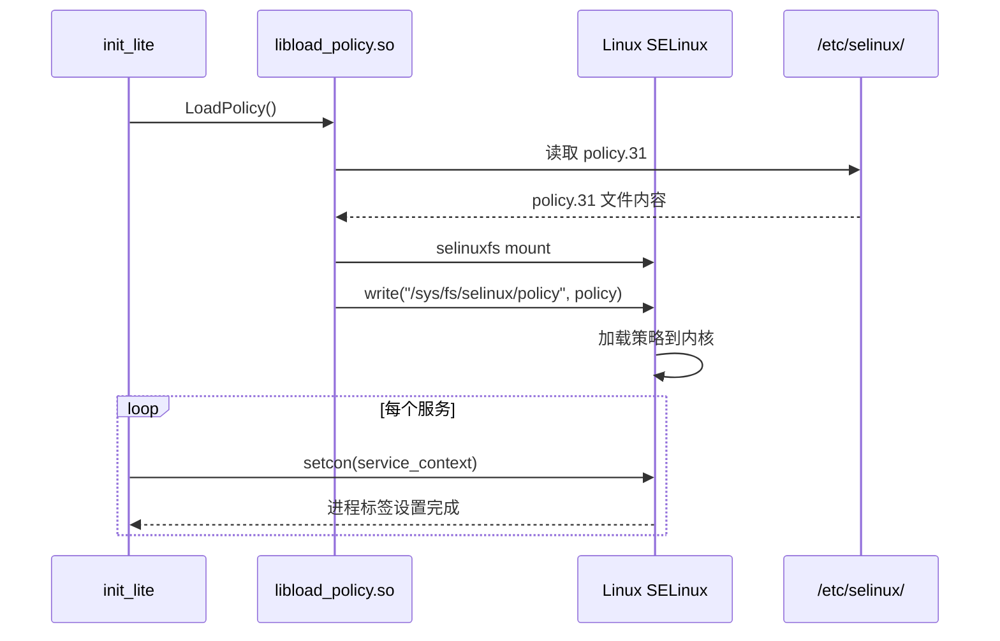
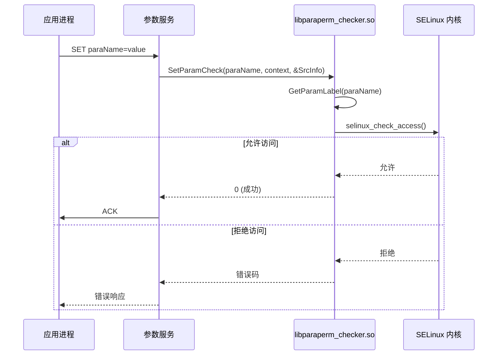

# 架构设计

## 1. 整体架构

### 1.1 架构概览

```
┌─────────────────────────────────────────────────────────────────┐
│                     OpenHarmony 系统                            │
├─────────────────────────────────────────────────────────────────┤
│  应用层 (HAP)                                                    │
├─────────────────────────────────────────────────────────────────┤
│  系统服务层 (SA)                                                 │
│  ┌──────────┐ ┌──────────┐ ┌──────────┐ ┌──────────────────┐   │
│  │ 参数服务 │ │ 权限服务 │ │ HDF 服务 │ │ ...              │   │
│  └────┬─────┘ └────┬─────┘ └────┬─────┘ └──────────────────┘   │
├───────┼────────────┼────────────┼────────────────────────────────┤
│       │            │            │                                │
│       ▼            ▼            ▼                                │
│  ┌──────────────────────────────────────────────────────────┐  │
│  │              selinux_adapter (用户空间)                     │  │
│  ├─────────────┬─────────────┬─────────────┬────────────────┤  │
│  │ libparaperm_│ libservice_ │ libhap_    │ librestorecon  │  │
│  │ checker.so  │ checker.so  │ restorecon │ .so            │  │
│  │             │             │ .so        │                │  │
│  ├─────────────┴─────────────┴─────────────┴────────────────┤  │
│  │ libload_policy.so                                      │  │
│  └──────────────────────────────────────────────────────────┘  │
├─────────────────────────────────────────────────────────────────┤
│                    Linux Kernel SELinux                          │
│  ┌──────────────────┐ ┌────────────────────────────────────┐   │
│  │ SELinux LSM 模块  │ │ Security Context 缓存 (AVC)        │   │
│  └──────────────────┘ └────────────────────────────────────┘   │
└─────────────────────────────────────────────────────────────────┘
```

### 1.2 分层说明

| 层级 | 组件 | 说明 |
|------|------|------|
| **应用层** | HAP 包 | 应用的安装与运行，涉及 HAP 上下文设置 |
| **系统服务层** | SA/HDF | 参数读写、服务调用，涉及权限检查 |
| **运行时库** | selinux_adapter | 5 个核心库，提供权限检查入口 |
| **内核** | Linux SELinux | 实际执行访问控制决策 |

## 2. 组件详解

### 2.1 策略加载 (libload_policy.so)

**源码位置**: `framework/policycoreutils/src/load_policy.cpp`

**功能**: 在系统启动时加载编译后的 SELinux 二进制策略

**关键接口**:

```c
// policycoreutils.h:25
int LoadPolicy(void);
```

**调用时机**:
- 系统启动 init 阶段
- 策略更新后重新加载

**数据流**:
```
LoadPolicy()
    │
    ├───> selinuxfs (/sys/fs/selinux)
    │         │
    │         ├───> write policy.31
    │         └───> selinux_setenforce()
    │
    └───> 初始化 AVC 缓存
```

### 2.2 文件标签恢复 (librestorecon.so)

**源码位置**: `framework/policycoreutils/src/selinux_restorecon.c`

**功能**: 根据 file_contexts 规则恢复文件的 SELinux 标签

**关键接口** (`policycoreutils.h:26-31`):

```c
int Restorecon(const char *path);                              // 单文件恢复
int RestoreconRecurse(const char *path);                        // 递归恢复
int RestoreconRecurseParallel(const char *path, unsigned int nthreads); // 并行恢复
int RestoreconRecurseForce(const char *path);                  // 强制恢复
int RestoreconFromParentDir(const char *path);                 // 从父目录恢复
int RestoreconCommon(const char *path, unsigned int flag, unsigned int nthreads); // 通用接口
```

**依赖**:
- FreeBSD fts (文件遍历)
- libselinux (lsetfilecon 等)

### 2.3 HAP 上下文管理 (libhap_restorecon.so)

**源码位置**: 
- `framework/policycoreutils/src/hap_restorecon.cpp`
- `framework/policycoreutils/src/sehap_contexts_trie.cpp`

**功能**: 
- 应用安装时设置数据目录的 Security Context
- 应用运行时设置进程域

**关键类/接口** (`hap_restorecon.h`):

```cpp
class HapContext {
public:
    int HapFileRestorecon(HapFileInfo& hapFileInfo);    // 文件标签恢复
    int HapDomainSetcontext(HapDomainInfo& hapDomainInfo); // 进程域设置
};

class HapFileRestoreContext {
public:
    static HapFileRestoreContext& GetInstance();
    int SetFileConForce(const HapFileInfo& hapFileInfo, ...);
};
```

**HAP 标志** (`hap_restorecon.h:27-36`):

| 标志 | 值 | 说明 |
|------|-----|------|
| SELINUX_HAP_RESTORECON_RECURSE | 1 | 递归处理数据目录 |
| SELINUX_HAP_DEBUGGABLE | 2 | 可调试应用 |
| SELINUX_HAP_INPUT_ISOLATE | 8 | 输入隔离应用 |
| SELINUX_HAP_CUSTOM_SANDBOX | 16 | 自定义沙箱 |
| SELINUX_HAP_DLP_READ_ONLY | 128 | DLP 只读沙箱 |
| SELINUX_HAP_DLP_FULL_CONTROL | 256 | DLP 完全控制沙箱 |

### 2.4 参数权限检查 (libparaperm_checker.so)

**源码位置**: `framework/policycoreutils/src/param_checker.c`

**功能**: 检查进程对系统参数的读写权限

**关键接口** (`param_checker.h:33-43`):

```c
void SetInitSelinuxLog(void);  // 设置 SELinux 日志
int SetParamCheck(const char *paraName, const char *destContext, const SrcInfo *info);
```

**调用链**:

```
参数服务收到 SET 请求
        │
        ▼
SetParamCheck(paraName, destContext, &SrcInfo)
        │
        ├───> GetParamLabel(paraName)      // 查找参数的安全上下文
        │         │
        │         └───> selinux_check_access()
        │                   │
        │                   └───> 内核 SELinux 决策
        │
        └───> 返回允许/拒绝
```

### 2.5 服务权限检查 (libservice_checker.so)

**源码位置**: `framework/policycoreutils/src/service_checker.cpp`

**功能**: 检查 System Ability 和 HDF 服务的访问权限

**关键类/接口** (`service_checker.h:28-51`):

```cpp
class ServiceChecker {
public:
    int ListServiceCheck(const std::string& callingSid);      // 列表权限检查
    int GetServiceCheck(const std::string& callingSid, const std::string& serviceName);  // 获取权限
    int AddServiceCheck(const std::string& callingSid, const std::string& serviceName);  // 添加权限
};

int HdfListServiceCheck(const char *callingSid);              // HDF 列表检查
int HdfGetServiceCheck(const char *callingSid, const char *serviceName); // HDF 获取检查
int HdfAddServiceCheck(const char *callingSid, const char *serviceName); // HDF 添加检查
```

## 3. 线程模型

### 3.1 策略编译 (build time)

```
主线程
    │
    ├───> build_policy.py (收集 .te 文件)
    │         │
    │         └───> checkpolicy (语法检查)
    │         └───> secilc (CIL 编译)
    │         └───> 输出 policy.31
    │
    └───> build_contexts.py (编译上下文)
              │
              └───> sefcontext_compile
              └───> 输出 file_contexts 等
```

### 3.2 HAP restorecon (runtime)

```
主线程 (调用者)
    │
    ▼
HapFileRestoreContext::SetFileConForce()
    │
    ├──> RestoreTask (独立线程池)
    │         │
    │         ├───> fts_open() / fts_read()  // 遍历文件
    │         ├───> lsetfilecon()             // 设置标签
    │         └───> 进度回调
    │
    └──> ResultInfo (完成报告)
```

**证据来源**: `hap_restorecon.h:114-137` (ResultInfo, RestoreTask)

### 3.3 restorecon 并行执行

```c
// selinux_restorecon.c
int RestoreconRecurseParallel(const char *path, unsigned int nthreads)
{
    // 多线程文件遍历与标签设置
    // 使用 fts 库的并行版本
}
```

## 4. 依赖关系

### 4.1 内部模块依赖

```
libload_policy.so
    └── libselinux_klog_static

librestorecon.so
    ├── libselinux_klog_static
    ├── FreeBSD (fts)
    └── hilog

libhap_restorecon.so
    ├── libselinux_error_static
    ├── libselinux_hilog_static
    ├── cJSON
    ├── hilog
    ├── hisysevent
    └── FreeBSD (fts)

libparaperm_checker.so
    ├── libselinux_klog_static
    ├── libselinux_parameter_static
    └── libselinux

libservice_checker.so
    ├── libselinux_error_static
    ├── libselinux_hilog_static
    ├── hilog
    └── libselinux
```

### 4.2 外部依赖

| 依赖 | 来源 | 用途 |
|------|------|------|
| libselinux | third_party/selinux | SELinux 用户空间 API |
| checkpolicy | third_party/selinux | 策略编译 |
| secilc | third_party/selinux | CIL 编译 |
| sefcontext_compile | third_party/selinux | 上下文编译 |
| pcre2 | third_party/pcre2 | 正则表达式 |
| FreeBSD | third_party/FreeBSD | fts 文件遍历 |
| hilog | hilog | 日志 |
| libsec | bounds_checking_function | 安全函数 |

## 5. 关键时序

### 5.1 系统启动时策略加载



### 5.2 参数写入权限检查



## 6. 相关文档

| 文档 | 链接 |
|------|------|
| 项目概述 | [01_Overview.md](01_Overview.md) |
| API 接口 | [03_API.md](03_API.md) |
| 构建系统 | [04_Build.md](04_Build.md) |
| 安全评审 | [05_Security.md](05_Security.md) |
| 故障排查 | [06_Troubleshooting.md](06_Troubleshooting.md) |
