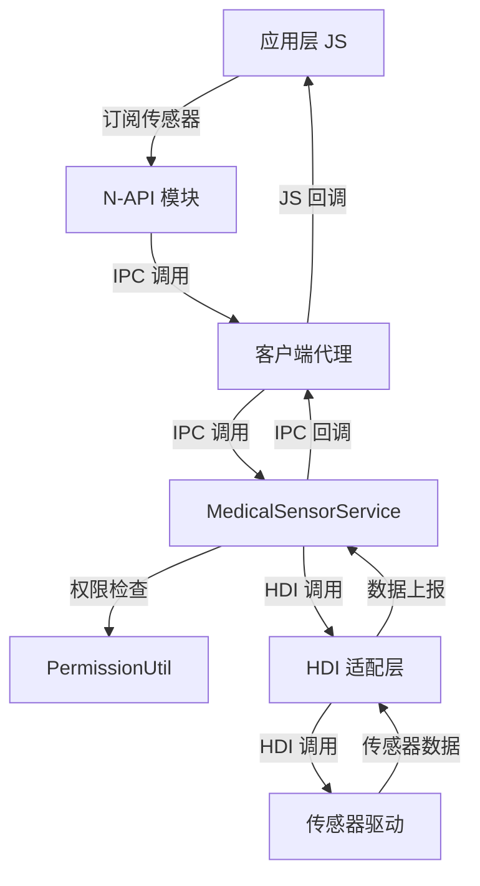

# Medical_Sensor 项目概览

## 目的

本文档介绍 Medical_Sensor 组件的项目定位、核心能力、运行环境和关键概念，帮助开发者快速理解项目全貌。

---

## 适用范围

本文档适用于：
- OpenHarmony 应用开发者
- 系统集成工程师
- 硬件适配工程师
- 安全审计人员

---

## 项目定位

### 什么是 Medical_Sensor？

Medical_Sensor 是 OpenHarmony 中的**健康类传感器服务**，主要用于测量人体健康相关数据，例如：
- **光电容积脉搏波**（PPG - Photoplethysmography）
- **心电图**（ECG - Electrocardiogram）
- **心率**
- **佩戴检测**

与传统传感器（如加速度计、陀螺仪）相比，Medical_Sensor 具有以下特点：

| 特性 | 说明 |
|------|------|
| 使用场景复杂 | 需要配套算法共同使用 |
- 数据敏感性高 | 涉及个人健康数据 |
| 权限要求严格 | 需要 `ohos.permission.READ_HEALTH_DATA` 权限 |

### 为什么独立实现？

Medical_Sensor 从传统传感器组件（`sensors_sensor`）中分离出来的原因：

1. **业务差异**：健康传感器有独特的业务流程和数据处理要求
2. **算法耦合**：需要与特定健康算法库集成
3. **权限管控**：健康数据需要更严格的访问控制
4. **未来扩展**：为更多医疗级传感器（如血氧、血压）预留空间

---

## 核心能力

### 1. 传感器数据订阅

提供 JS API 供应用订阅传感器数据变化：

```javascript
import medical from '@ohos.medical';

// 订阅 PPG 数据
medical.on(medical.MedicalSensorType.TYPE_ID_PHOTOPLETHYSMOGRAPH, (data) => {
    console.info("PPG data obtained. data: " + data.dataArray);
}, {
    interval: 200000000  // 采样间隔（纳秒）
});
```

### 2. 传感器列表查询

应用可以查询设备支持的医疗传感器列表：

```javascript
// 通过 native API 获取传感器列表
const sensors = medical.GetAllSensors();
```

### 3. 传感器控制

支持动态启用、禁用、配置传感器：

- **启用传感器**: 激活传感器硬件
- **禁用传感器**: 停止传感器数据上报
- **设置批处理**: 配置采样周期和上报延迟
- **设置选项**: 配置传感器特定选项（如测量范围、精度）

### 4. 数据通道管理

- **数据通道**: 使用共享内存（Ashmem）或 socket 实现高效数据传输
- **事件回调**: 通过事件循环机制异步通知应用

---

## 运行环境

### 系统要求

| 要求 | 值 |
|------|------|
| 系统 | OpenHarmony 3.1+ |
| 架构 | standard（标准系统） |
| ROM 空间 | 2048KB |
| RAM 空间 | ~4096KB |

### 依赖组件

Medical_Sensor 依赖以下系统组件：

| 组件 | 用途 |
|------|------|
| access_token | 权限检查和访问控制 |
| c_utils | 基础工具库 |
| drivers_interface_sensor | 传感器驱动接口 |
| drivers_peripheral_sensor | 传感器外设驱动 |
| eventhandler | 事件循环和线程管理 |
| ets_runtime | ArkTS 运行时 |
| hilog | 日志系统 |
| hisysevent | 系统事件上报 |
- napi | Node.js API 绑定
| ipc | 进程间通信 |
| samgr | 系统能力管理器 |
| safwk | 系统能力框架 |

### 依赖的第三方库

- **libuv**: 事件循环库（用于 N-API 异步回调）
- **node**: Node.js 运行时（N-API 框架）

---

## 关键概念

### 1. 系统能力（SystemAbility）

**定义**：OpenHarmony 中的系统服务机制，类似 Android 的 System Service。

**Medical_Sensor 的 SA 信息**：

| 属性 | 值 |
|------|------|
| SA 名称 | MedicalSensorService |
| SA ID | 3605 |
| 进程名 | sensors |
| 动态库 | libmedical_service.z.so |
| 配置文件 | 3605.xml |

**证据**：
- SA 配置：`sa_profile/3605.xml:16-24`
- SA 注册：`services/medical_sensor/src/medical_service.cpp:51`

### 2. N-API（Node.js API）

**定义**：OpenHarmony 中 JS 与 C/C++ 交互的标准接口。

**Medical_Sensor 的 N-API 模块**：

- **模块名**：`medical`
- **导入语句**：`import medical from '@ohos.medical';`

**证据**：
- 模块注册：`interfaces/plugin/src/medical_js.cpp:282-295`

### 3. HDI（Hardware Device Interface）

**定义**：OpenHarmony 中硬件设备层的标准接口，用于服务层与驱动层通信。

**Medical_Sensor 的 HDI 适配**：

```
服务层（MedicalSensorService）
    ↓ IPC
HDI 适配层（SensorHdiConnection）
    ↓ HDI
驱动层（Sensor Driver）
```

**证据**：
- HDI 接口：`services/medical_sensor/hdi_connection/interface/include/i_sensor_hdi_connection.h`

### 4. IPC（Inter-Process Communication）

**定义**：跨进程通信机制。

**Medical_Sensor 的 IPC 模式**：

```
应用进程（N-API 模块）
    ↓ IPC (Binder)
服务进程（MedicalSensorService）
    ↓ IPC (HDI)
驱动进程（Sensor HDI）
```

**证据**：
- IPC 接口：`frameworks/native/medical_sensor/include/i_medical_sensor_service.h`

### 5. 权限系统

**Medical_Sensor 支持的权限**：

| 权限名 | 传感器类型 | 敏感级别 |
|--------|-----------|----------|
| ohos.permission.READ_HEALTH_DATA | PPG、心率 | user_grant |

**权限检查机制**：

```cpp
// utils/src/permission_util.cpp:40-49
AccessTokenKit::VerifyAccessToken(callerToken, "ohos.permission.READ_HEALTH_DATA")
```

**证据**：
- 权限定义：`utils/src/permission_util.cpp:32-38`
- 权限检查：`utils/src/permission_util.cpp:40-49`

---

## 项目边界

### 职责范围

Medical_Sensor **负责**：
- ✅ 传感器数据的采集、处理、上报
- ✅ 应用与传感器之间的数据通道管理
- ✅ 传感器权限验证
- ✅ 传感器状态管理（启用/禁用）
- ✅ 与驱动层（HDI）的通信

Medical_Sensor **不负责**：
- ❌ 传感器硬件驱动实现（由厂商提供）
- ❌ 健康数据的算法处理（由应用层或第三方库负责）
- ❌ 数据持久化存储（由应用层负责）
- ❌ 网络数据传输（由应用层负责）

---

## 传感器类型

| 传感器类型 ID | 名称 | 说明 |
|-------------|------|------|
| 129 | TYPE_ID_PHOTOPLETHYSMOGRAPH | 光电容积脉搏波传感器 |
| 130 | TYPE_ID_ELECTROCARDIOGRAPH | 心电图传感器 |
| 278 | TYPE_ID_HEART_RATE | 心率传感器 |
| 280 | TYPE_ID_WEAR_DETECTION | 佩戴检测传感器 |

**证据**：
- 类型定义：`interfaces/native/include/medical_native_type.h:66-73`

---

## 数据流概览



---

## 相关跳转

- [架构说明](02_Architecture.md) - 详细的架构分析和时序图
- [N-API 参考](03_N-API_Reference.md) - 完整的 JS API 文档
- [安全评审](07_Security_Review.md) - 安全风险和防护机制
- [目录结构](01_Directory_Structure.md) - 代码组织详解
