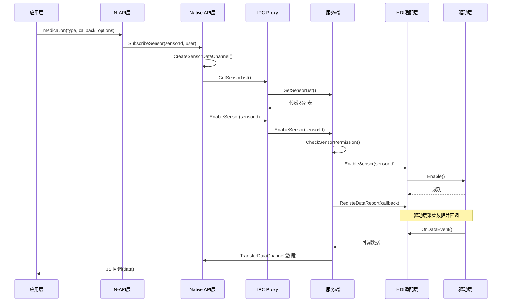
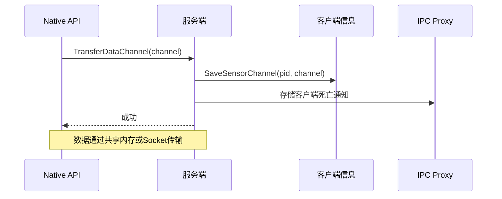
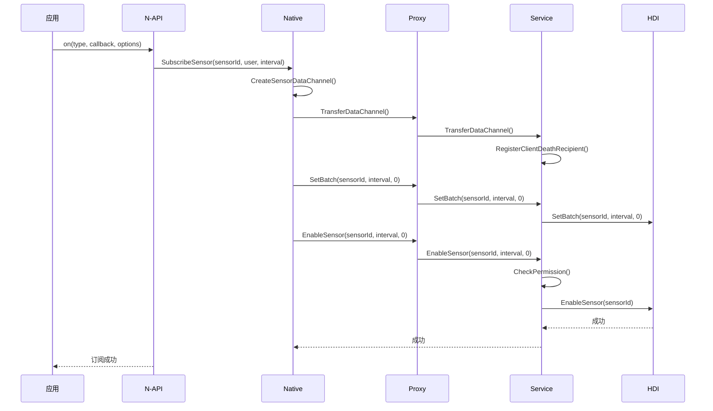
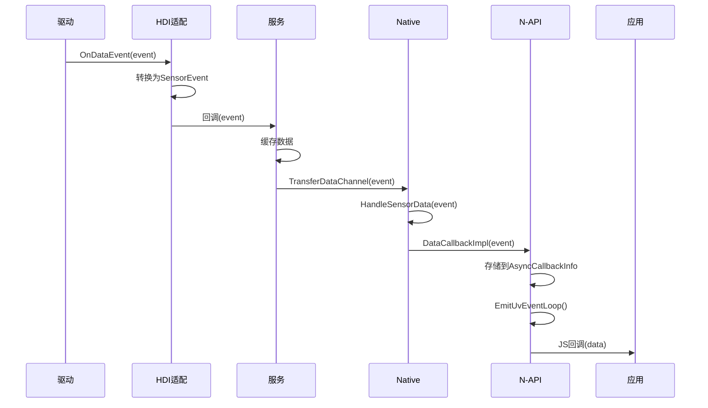
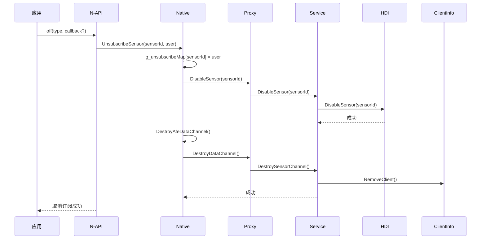
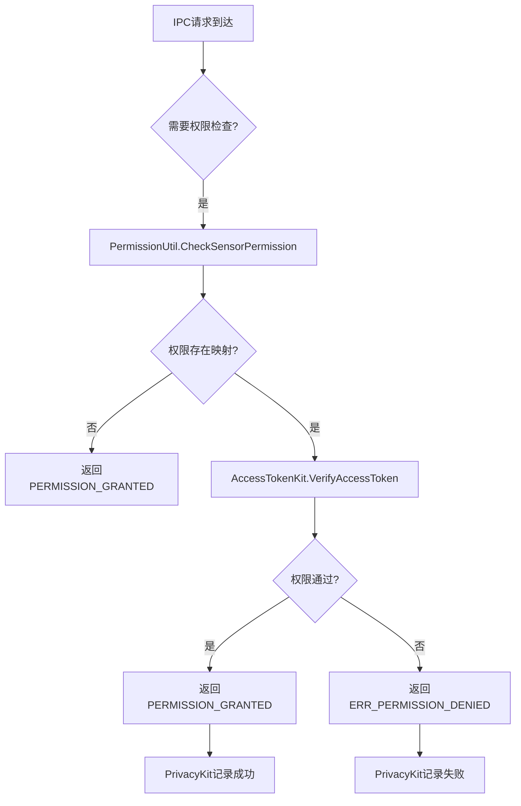

# 架构说明

## 目的

本文档详细说明 Medical_Sensor 的系统架构，包括组件图、数据流、线程模型和关键时序。

---

## 适用范围

本文档适用于需要：
- 理解系统架构和组件关系
- 分析数据流向和交互时序
- 进行性能优化或故障排查

---

## 系统架构概览

Medical_Sensor 采用**分层架构**，从应用层到驱动层分为以下层次：

```
┌─────────────────────────────────────────────────────────────────────┐
│                    应用层 (Application)                    │
│                      JS / C++ 应用                          │
└──────────────────────┬────────────────────────────────────────┘
                       │
┌──────────────────────▼────────────────────────────────────────┐
│              N-API 层 (interfaces/plugin/)              │
│                   medical.so                                 │
│              (medical_js.cpp, medical_napi_utils.cpp)         │
└──────────────────────┬────────────────────────────────────────┘
                       │
┌──────────────────────▼────────────────────────────────────────┐
│         Native API 层 (interfaces/native/)              │
│              medical_agent.so                                 │
│         (medical_native_impl.cpp)                            │
└──────────────────────┬────────────────────────────────────────┘
                       │
┌──────────────────────▼────────────────────────────────────────┐
│         客户端框架层 (frameworks/native/)          │
│              libmedical_native.so                               │
│      (MedicalSensorServiceProxy, MedicalSensorServiceClient)      │
└──────────────────────┬────────────────────────────────────────┘
                       │ IPC (Binder)
┌──────────────────────▼────────────────────────────────────────┐
│         服务端层 (services/medical_sensor/)          │
│              libmedical_service.so                               │
│         (MedicalSensorService, MedicalSensorServiceStub)           │
│                                                             │
│         ┌──────────────────────┴─────────────────────────────┐   │
│         │       HDI 适配层 (hdi_connection/)            │   │
│         │  SensorHdiConnection (Facade)                         │   │
│         │                                                        │   │
│         │  ┌───────────┴───────────┐                       │   │
│         │  ▼                        ▼                       │   │
│         │  HdiConnection     CompatibleConnection              │   │
│         └──────────────────────┬─────────────────────┘               │   │
│                            │ HDI                                │   │
└───────────────────────────────▼─────────────────────────────────────┘
                           │
         ┌──────────────────────▼────────────────────────────────┐
         │          驱动层 (Sensor HDI)                 │
         │     ISensorInterface (系统提供)                         │
         └───────────────────────────────────────────────────────┘
```

---

## 组件说明

### 1. 应用层（Application Layer）

**组成**：JS 应用或 C++ 应用

**职责**：
- 调用 Medical_Sensor 的 JS API 或 Native API
- 接收并处理传感器数据
- 管理 UI 和业务逻辑

**交互方式**：
- **JS 应用**：通过 `import medical from '@ohos.medical'` 使用 N-API
- **C++ 应用**：通过链接 `medical_agent.so` 调用 Native API

---

### 2. N-API 层（Node.js API Layer）

**组成**：
- `medical.so` - N-API 模块
- `medical_static.a` - 静态库（可选）

**职责**：
- 桥接 JS 调用到 Native 实现
- 参数校验和类型转换
- 异步回调管理（通过 UV 事件循环）

**关键类**：

| 类/文件 | 职责 |
|---------|------|
| `On()` | 订阅传感器数据的 JS 方法 |
| `Off()` | 取消订阅的 JS 方法 |
| `SetOpt()` | 设置传感器选项的 JS 方法 |
| `EmitUvEventLoop()` | 异步回调到 JS 的事件循环 |

**证据**：
- N-API 注册：`interfaces/plugin/src/medical_js.cpp:292-295`

---

### 3. Native API 层（Native API Layer）

**组成**：
- `medical_agent.so` - Native 接口库
- `medical.so` (NDK) - NDK 符号

**职责**：
- 提供 C/C++ API 供外部应用调用
- 管理数据通道（Ashmem/Socket）
- 与服务端通信

**关键 API**（`medical_native_impl.cpp`）：

| API | 说明 |
|-----|------|
| `GetAllSensors()` | 获取传感器列表 |
| `SubscribeSensor()` | 订阅传感器数据 |
| `UnsubscribeSensor()` | 取消订阅 |
| `ActivateSensor()` | 启用传感器 |
| `DeactivateSensor()` | 禁用传感器 |
| `SetBatch()` | 设置批处理参数 |

**证据**：
- Native 实现：`interfaces/native/src/medical_native_impl.cpp`

---

### 4. 客户端框架层（Client Framework Layer）

**组成**：
- `libmedical_native.so` - 客户端框架库

**职责**：
- 实现 IPC Proxy
- 管理与服务端的连接
- 处理数据接收和分发

**关键类**：

| 类 | 职责 |
|-----|------|
| `MedicalSensorServiceProxy` | IPC 客户端代理 |
| `MedicalSensorServiceClient` | 单例客户端，管理连接生命周期 |
| `MedicalSensorDataChannel` | 数据通道管理（共享内存/Socket） |

**证据**：
- Proxy 头文件：`frameworks/native/medical_sensor/include/medical_sensor_service_proxy.h`

---

### 5. 服务端层（Service Layer）

**组成**：
- `libmedical_service.z.so` - 服务端库

**职责**：
- 实现 SystemAbility
- 处理客户端请求（IPC 分发）
- 管理传感器状态和订阅关系
- 与 HDI 通信

**关键类**：

| 类 | 职责 |
|-----|------|
| `MedicalSensorService` | SystemAbility 主服务类 |
| `MedicalSensorServiceStub` | IPC Stub，分发请求 |
| `MedicalSensorManager` | 传感器管理器 |
| `SensorHdiConnection` | HDI 适配层门面类 |
| `ClientInfo` | 客户端信息管理（PID、UID、Token） |

**证据**：
- Service 定义：`services/medical_sensor/include/medical_sensor_service.h:39`

---

### 6. HDI 适配层（HDI Adapter Layer）

**组成**：
- HDI 适配器代码（嵌入在服务层中）

**职责**：
- 连接传感器 HDI 服务
- 处理 HDI 死亡通知和自动重连
- 转换 HDI 数据为内部格式

**适配器层次**：

| 层 | 说明 |
|-----|------|
| `SensorHdiConnection` | 门面类（Facade），自动选择实现 |
| `HdiConnection` | 真实 HDI 连接 |
| `CompatibleConnection` | 兼容性连接（Fallback） |

**证据**：
- HDI 接口：`services/medical_sensor/hdi_connection/interface/include/sensor_hdi_connection.h`

---

### 7. 驱动层（Driver Layer）

**组成**：传感器驱动（由厂商提供）

**职责**：
- 与硬件传感器通信
- 采集传感器数据
- 通过 HDI 接口上报数据

**说明**：驱动层不在本仓库中，由设备厂商实现。

---

## 数据流

### 传感器数据上报流程



### 数据通道建立流程



---

## 线程模型

### 应用层线程

- **主线程**：JS 引擎主线程，接收传感器数据回调
- **事件循环线程**：UV 事件循环，处理异步任务

**证据**：
- UV 事件循环：`interfaces/plugin/src/medical_napi_utils.cpp:122-180`

### 服务端线程

- **主线程**：SystemAbility 主线程，处理 IPC 请求
- **HDI 线程**：HDI 连接和通信线程
- **数据上报线程**：独立线程处理传感器数据上报

**证据**：
- Service 生命周期：`services/medical_sensor/src/medical_service.cpp:62-95`

### 线程间通信

- **IPC 线程**：Binder IPC 机制
- **数据通道**：共享内存（Ashmem）或 Socket

---

## 关键时序

### 1. 传感器订阅时序



### 2. 传感器数据上报时序



### 3. 取消订阅时序



---

## 权限检查流程



**证据**：
- 权限检查：`utils/src/permission_util.cpp:40-49`
- 权限映射：`utils/src/permission_util.cpp:35-38`

---

## 错误传播机制

### Native 层错误码

| 错误码 | 说明 | 来源 |
|--------|------|------|
| `SUCCESS` | 成功 | `medical_errors.h` |
| `ERROR` | 通用错误 | `medical_errors.h` |
| `INVALID_POINTER` | 空指针 | `medical_errors.h` |

### IPC 层错误码

| 错误码 | 说明 |
|--------|------|
| `ERR_OK` | 成功 |
| `ERR_PERMISSION_DENIED` | 权限拒绝 |
| `ERR_NO_INIT` | 未初始化 |

---

## 性能考虑

### 数据传输优化

1. **共享内存**：使用 Ashmem 进行大数据量传输，减少拷贝
2. **事件批处理**：支持批量上报，减少 IPC 调用次数
3. **异步回调**：使用 UV 事件循环，避免阻塞主线程

**证据**：
- 数据通道：`frameworks/native/medical_sensor/include/medical_sensor_data_channel.h`
- 异步回调：`interfaces/plugin/src/medical_napi_utils.cpp:122-180`

---

## 相关跳转

- [项目概览](00_Overview.md) - 项目定位和核心能力
- [目录结构](01_Directory_Structure.md) - 代码组织详解
- [N-API 参考](03_N-API_Reference.md) - 完整的 JS API 文档
- [内部 API](04_Internal_API.md) - 模块接口和依赖关系
- [安全评审](07_Security_Review.md) - 安全风险和防护机制
