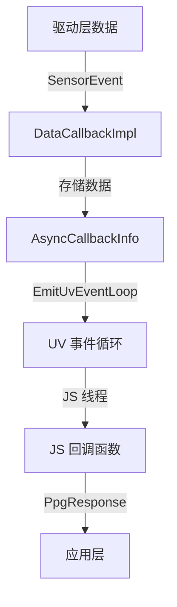

# N-API 参考（JS API）

## 目的

本文档详细说明 Medical_Sensor 提供的 JS API，包括所有导出的方法、参数、返回值和错误处理。

---

## 适用范围

本文档适用于需要：
- 在 JS/ArkTS 应用中使用医疗传感器 API
- 理解 API 的参数校验和错误处理
- 进行 API 集成和调试

---

## 模块导入

```javascript
import medical from '@ohos.medical';
```

**模块名**：`medical`

**证据**：
- 模块注册：`interfaces/plugin/src/medical_js.cpp:292-295`

---

## API 清单

| API 名称 | 说明 | 同步/异步 |
|---------|------|----------|
| `on(type, callback, options?)` | 订阅传感器数据 | 异步（Callback） |
| `off(type, callback?)` | 取消订阅传感器数据 | 异步（Callback） |
| `setOpt(type, option)` | 设置传感器选项 | 同步 |

---

## 常量定义

### MedicalSensorType

传感器类型枚举，用于标识不同的医疗传感器。

| 常量名 | 值 | 说明 |
|---------|---|------|
| `TYPE_ID_PHOTOPLETHYSMOGRAPH` | 129 | 光电容积脉搏波传感器 |

**证据**：
- 枚举定义：`interfaces/plugin/src/medical_js.cpp:255-264`
- 类型定义：`interfaces/native/include/medical_native_type.h:66-73`

---

## API 详细说明

### 1. on(type, callback, options?)

订阅医疗传感器数据，如果多次调用，则仅最后一次调用生效。

#### 语法

```typescript
function on(
    type: MedicalSensorType.TYPE_ID_PHOTOPLETHYSMOGRAPH,
    callback: Callback<PpgResponse>,
    options?: Options
): void
```

#### 参数

| 参数名 | 类型 | 必需/可选 | 说明 |
|--------|------|-----------|------|
| `type` | `MedicalSensorType` | 必需 | 传感器类型，目前仅支持 `TYPE_ID_PHOTOPLETHYSMOGRAPH` |
| `callback` | `Callback<PpgResponse>` | 必需 | 传感器数据回调函数 |
| `options` | `Options` | 可选 | 配置参数 |

#### Options

| 属性 | 类型 | 必需/可选 | 说明 |
|--------|------|-----------|------|
| `interval` | `number` | 可选 | 传感器数据上报的时间间隔（纳秒），默认 200000000 |

#### 回调参数：PpgResponse

| 属性 | 类型 | 说明 |
|--------|------|------|
| `dataArray` | `Array<number>` | PPG 数据数组 |

#### 权限

| 权限名 | 说明 |
|--------|------|
| `ohos.permission.READ_HEALTH_DATA` | 读取健康数据权限 |

#### 实现

- **文件位置**：`interfaces/plugin/src/medical_js.cpp:112-157`
- **C++ 函数名**：`On`
- **参数校验**：
  - `sensorTypeId`：类型检查（`napi_typeof()`），行 124
  - `callback`：类型检查（`napi_typeof()`），行 129
  - `interval`：类型检查（`napi_typeof()`），行 137
- **默认值**：`interval = 200000000` 纳秒（行 132）
- **存储**：回调信息存储在 `g_onCallbackInfos` 全局 map 中（行 40）

**关键代码片段**：

```cpp
// interfaces/plugin/src/medical_js.cpp:112-157
static napi_value On(napi_env env, napi_callback_info info)
{
    // 参数个数检查
    NAPI_ASSERT(env, ((argc >= 2) && (argc <= 3)), "requires 2 or 3 parameters");

    // 参数类型检查
    napi_typeof(env, args[0], &eventId);
    NAPI_ASSERT(env, eventId == napi_number, "type mismatch for parameter 1");
    int32_t sensorTypeId = GetCppInt32(args[0], env);

    napi_typeof(env, args[1], &handler);
    NAPI_ASSERT(env, handler == napi_function, "type mismatch for parameter 2");

    // 处理可选参数
    int64_t interval = 200000000;
    if (argc == 3) {
        napi_value value = NapiGetNamedProperty(args[2], "interval", env);
        napi_typeof(env, value, &intervalType);
        NAPI_ASSERT(env, intervalType == napi_number, "type mismatch for parameter 3");
        interval = GetCppInt64(value, env);
    }

    // 创建回调引用
    AsyncCallbackInfo *asyncCallbackInfo = new AsyncCallbackInfo {...};
    napi_create_reference(env, args[1], 1, &asyncCallbackInfo->callback[0]);

    // 存储回调信息
    g_onCallbackInfos[sensorTypeId] = asyncCallbackInfo;

    // 调用 Native API 订阅
    int32_t ret = SubscribeSensor(sensorTypeId, interval, &user);
    if (ret < 0) {
        g_onCallbackInfos.erase(sensorTypeId);
        return nullptr;
    }
    return nullptr;
}
```

#### 错误处理

- **参数校验失败**：抛出 `napi_throw_type_error()`
- **订阅失败**：记录错误日志，删除回调信息
- **权限拒绝**：通过 Native 层的权限检查返回错误

---

### 2. off(type, callback?)

取消订阅医疗传感器数据。

#### 语法

```typescript
function off(
    type: MedicalSensorType.TYPE_ID_PHOTOPLETHYSMOGRAPH,
    callback?: Callback<PpgResponse>
): void
```

#### 参数

| 参数名 | 类型 | 必需/可选 | 说明 |
|--------|------|-----------|------|
| `type` | `MedicalSensorType` | 必需 | 传感器类型 |
| `callback` | `Callback<PpgResponse>` | 可选 | 要取消的回调函数；如果未提供，则取消所有该传感器的回调 |

#### 权限

无权限要求。

#### 实现

- **文件位置**：`interfaces/plugin/src/medical_js.cpp:159-206`
- **C++ 函数名**：`Off`
- **参数校验**：
  - `sensorTypeId`：类型检查（行 171）
  - `callback`：类型检查（行 184）
- **回调查找**：如果未提供回调，从 `g_onCallbackInfos` 中查找（行 186-187）
- **资源清理**：删除回调引用、释放内存（行 197-200）

**关键代码片段**：

```cpp
// interfaces/plugin/src/medical_js.cpp:159-206
static napi_value Off(napi_env env, napi_callback_info info)
{
    size_t argc = 2;
    napi_value args[2];
    napi_value thisVar;
    NAPI_CALL(env, napi_get_cb_info(env, info, &argc, args, &thisVar, NULL));
    NAPI_ASSERT(env, ((argc >= 1) && (argc <= 2)), "requires 1 or 2 parameters");

    // 传感器类型检查
    napi_typeof(env, args[0], &eventId);
    NAPI_ASSERT(env, eventId == napi_number, "type mismatch for parameter 1");
    int32_t sensorTypeId = GetCppInt32(args[0], env);

    // 创建回调信息
    AsyncCallbackInfo *asyncCallbackInfo = new AsyncCallbackInfo {...};

    if (argc == 2) {
        // 验证回调函数
        napi_typeof(env, args[1], &handler);
        NAPI_ASSERT(env, handler == napi_function, "type mismatch for parameter 2");
    } else {
        // 如果未提供回调，从 map 中获取
        NAPI_ASSERT(env, g_onCallbackInfos.find(sensorTypeId) != g_onCallbackInfos.end(),
            "no callback registered");
        napi_get_reference_value(env, g_onCallbackInfos[sensorTypeId]->callback[0], &args[1]);
    }

    // 创建回调引用
    napi_create_reference(env, args[1], 1, &asyncCallbackInfo->callback[0]);

    // 调用 Native API 取消订阅
    int32_t ret = UnsubscribeSensor(sensorTypeId);
    if (ret < 0) {
        HiLog::Error(LABEL, "%{public}s UnsubscribeSensor failed", __func__);
    } else {
        // 清理回调信息
        if (g_onCallbackInfos.find(sensorTypeId) != g_onCallbackInfos.end()) {
            napi_delete_reference(env, g_onCallbackInfos[sensorTypeId]->callback[0]);
            delete g_onCallbackInfos[sensorTypeId];
            g_onCallbackInfos[sensorTypeId] = nullptr;
            g_onCallbackInfos.erase(sensorTypeId);
        }
    }

    // 发送异步回调
    EmitAsyncCallbackWork(asyncCallbackInfo);
    return nullptr;
}
```

#### 错误处理

- **参数校验失败**：抛出 `napi_throw_type_error()`
- **未找到回调**：抛出 `napi_throw_error()`（行 186）
- **取消订阅失败**：记录错误日志

---

### 3. setOpt(type, option)

设置传感器选项（预留接口，当前未完整实现）。

#### 语法

```typescript
function setOpt(
    type: MedicalSensorType.TYPE_ID_PHOTOPLETHYSMOGRAPH,
    option: number
): void
```

#### 参数

| 参数名 | 类型 | 必需/可选 | 说明 |
|--------|------|-----------|------|
| `type` | `MedicalSensorType` | 必需 | 传感器类型 |
| `option` | `number` | 必需 | 传感器选项值 |

#### 权限

无权限要求。

#### 实现

- **文件位置**：`interfaces/plugin/src/medical_js.cpp:208-240`
- **C++ 函数名**：`SetOpt`
- **参数校验**：
  - `sensorTypeId`：类型检查（行 220）
  - `option`：类型检查（行 226）

**关键代码片段**：

```cpp
// interfaces/plugin/src/medical_js.cpp:208-240
static napi_value SetOpt(napi_env env, napi_callback_info info)
{
    size_t argc = 2;
    napi_value args[2];
    napi_value thisVar;
    NAPI_CALL(env, napi_get_cb_info(env, info, &argc, args, &thisVar, NULL));

    // 参数个数检查
    if (argc < 1) {
        HiLog::Error(LABEL, "%{public}s Invalid input.", __func__);
        return nullptr;
    }

    // 传感器类型检查
    if (!IsMatchType(args[0], napi_number, env)) {
        HiLog::Error(LABEL, "%{public}s argument should be number type!", __func__);
        return nullptr;
    }
    int32_t sensorTypeId = GetCppInt32(args[0], env);

    // 选项参数检查
    if (!IsMatchType(args[1], napi_number, env)) {
        HiLog::Error(LABEL, "%{public}s argument should be function type!", __func__);
        return nullptr;
    }
    int32_t opt = GetCppInt32(args[1], env);

    // 调用 Native API
    int32_t ret = SetOption(sensorTypeId, &user, opt);
    if (ret < 0) {
        HiLog::Error(LABEL, "%{public}s SetOption failed", __func__);
    } else {
        HiLog::Error(LABEL, "%{public}s SetOption success", __func__);
    }
    return nullptr;
}
```

#### 错误处理

- **参数校验失败**：记录错误日志，返回 `nullptr`
- **设置选项失败**：记录错误日志

---

## 异步回调机制

### 回调数据结构

```cpp
struct AsyncCallbackInfo {
    napi_env env;
    napi_async_work asyncWork;
    napi_deferred deferred;
    napi_ref callback[1];
    int32_t sensorTypeId;
    int32_t sensorDataLength;
    uint32_t sensorData[MAX_DATA_LEN];  // MAX_DATA_LEN = 512
};
```

**证据**：
- 结构体定义：`interfaces/plugin/include/medical_napi_utils.h:31-39`

### 事件循环集成

使用 **libuv** 事件循环实现线程安全的 JS 回调。

**关键函数**：

| 函数 | 文件位置 | 说明 |
|------|----------|------|
| `EmitUvEventLoop()` | medical_napi_utils.cpp:122-180 | 将数据回调推送到 UV 事件循环 |
| `EmitAsyncCallbackWork()` | medical_napi_utils.cpp:99-118 | 创建异步工作并调度 |

**证据**：
- UV 事件循环：`interfaces/plugin/src/medical_napi_utils.cpp:122-180`

### 数据回调流程



---

## 参数校验规则

### 1. 类型检查

所有 JS 方法都进行严格的类型检查：

| 参数 | 期望类型 | 校验方式 |
|------|---------|---------|
| `type` | `napi_number` | `napi_typeof()` |
| `callback` | `napi_function` | `napi_typeof()` |
| `options.interval` | `napi_number` | `napi_typeof()` |
| `option` | `napi_number` | `napi_typeof()` |

**证据**：
- 类型检查：`interfaces/plugin/src/medical_js.cpp:124, 129, 137, 171, 183, 220, 226`

### 2. 个数检查

| 方法 | 最小个数 | 最大个数 |
|------|---------|---------|
| `on()` | 2 | 3 |
| `off()` | 1 | 2 |
| `setOpt()` | 2 | 2 |

**证据**：
- `on()`：`interfaces/plugin/src/medical_js.cpp:115-116`
- `off()`：`interfaces/plugin/src/medical_js.cpp:162-163`
- `setOpt()`：`interfaces/plugin/src/medical_js.cpp:211-212`

### 3. 值范围检查

目前 JS 层未进行数值范围检查，范围检查在 Native 层进行。

---

## 错误码

### JavaScript 层错误

| 错误类型 | 说明 | 抛出方式 |
|---------|------|---------|
| 类型不匹配 | 参数类型错误 | `napi_throw_type_error()` |
| 参数不足/过多 | 参数个数错误 | `napi_throw_error()` |

### Native 层错误

| 错误码 | 说明 |
|--------|------|
| `SUCCESS` | 操作成功 |
| `ERROR` | 通用错误 |

---

## 使用示例

### 订阅 PPG 传感器数据

```javascript
import medical from '@ohos.medical';

export default {
    onCreate() {
        console.info('Application onCreate');

        // 订阅 PPG 传感器，设置采样间隔为 200ms
        medical.on(medical.MedicalSensorType.TYPE_ID_PHOTOPLETHYSMOGRAPH, (data) => {
            console.info("PPG data obtained. data: " + data.dataArray);
        }, {
            interval: 200000000  // 200,000,000 纳秒 = 200 毫秒
        });
    },

    onDestroy() {
        console.info('Application onDestroy');

        // 取消订阅 PPG 传感器
        medical.off(medical.MedicalSensorType.TYPE_ID_PHOTOPLETHYSMOGRAPH, (data) => {
            console.info("Succeeded in unsubscribe from sensor data");
        });
    }
};
```

### 设置传感器选项

```javascript
import medical from '@ohos.medical';

// 设置传感器选项（示例）
medical.setOpt(medical.MedicalSensorType.TYPE_ID_PHOTOPLETHYSMOGRAPH, 1);
```

---

## TypeScript 定义

完整类型定义见：`interfaces/jsapi/@ohos.medical.d.ts`

**关键类型**：

```typescript
declare namespace medical {
    // 订阅传感器数据
    function on(
        type: MedicalSensorType.TYPE_ID_PHOTOPLETHYSMOGRAPH,
        callback: Callback<PpgResponse>,
        options?: Options
    ): void;

    // 取消订阅
    function off(
        type: MedicalSensorType.TYPE_ID_PHOTOPLETHYSMOGRAPH,
        callback?: Callback<PpgResponse>
    ): void;

    // 可选参数
    interface Options {
        interval?: number;
    }

    // 传感器类型枚举
    enum MedicalSensorType {
        TYPE_ID_PHOTOPLETHYSMOGRAPH = 129;
    }

    // PPG 响应数据
    interface PpgResponse {
        dataArray: Array<number>;
    }
}

export default medical;
```

**证据**：
- 类型定义：`interfaces/jsapi/@ohos.medical.d.ts:1-64`

---

## 相关跳转

- [项目概览](00_Overview.md) - 项目定位和核心能力
- [架构说明](02_Architecture.md) - 系统架构和数据流
- [内部 API](04_Internal_API.md) - Native API 详解
- [安全评审](07_Security_Review.md) - 权限和安全机制
