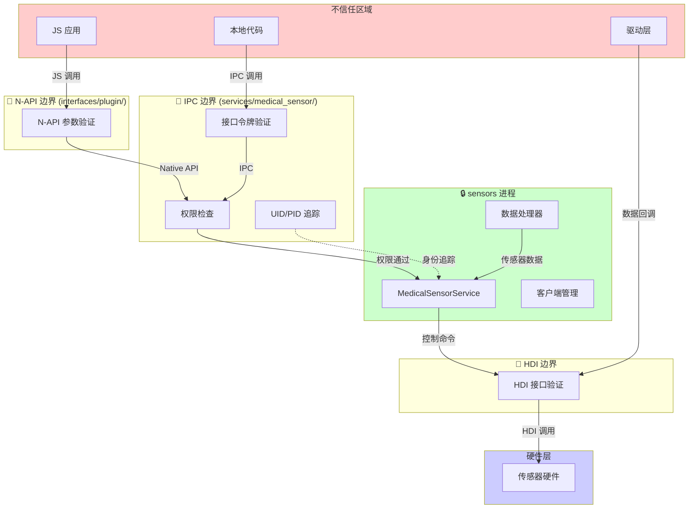

# 攻击面分析

## 目的

本文档系统分析 Medical_Sensor 的所有攻击面，识别外部输入入口、敏感操作点和信任边界跨越位置，为安全研究和风险评估提供基础。

---

## 适用范围

本文档适用于：
- 安全审计人员：理解系统的攻击面分布
- 风险评估人员：识别潜在的安全风险点
- 开发人员：了解需要保护的关键位置
- 安全研究人员：寻找可利用的攻击路径

---

## 威胁模型

### 攻击者能力假设

| 攻击者类型 | 能力 | 目标 |
|-----------|------|------|
| **恶意应用** | 可调用 N-API，持有有限权限 | 未授权访问健康数据 |
| **本地攻击者** | 可运行本地代码，可调试 | 权限提升、数据篡改 |
| **远程攻击者** | 可影响 HDI 驱动 | 数据注入、拒绝服务 |

### 系统信任边界

```
┌─────────────────────────────────────────────────────────────────────────────┐
│                              不信任区域                                      │
│  ┌──────────────┐    ┌──────────────┐    ┌──────────────┐                  │
│  │   JS 应用     │    │  恶意本地代码 │    │  被篡改驱动   │                  │
│  └──────┬───────┘    └──────┬───────┘    └──────┬───────┘                  │
└─────────┼───────────────────┼───────────────────┼──────────────────────────┘
          │                   │                   │
          ▼                   ▼                   ▼
┌─────────────────────────────────────────────────────────────────────────────┐
│                              信任边界 1 (N-API)                             │
│  参数类型检查 │ 范围验证 │ 权限委托                                         │
└─────────────────────────────────────────────────────────────────────────────┘
          │
          ▼
┌─────────────────────────────────────────────────────────────────────────────┐
│                              信任边界 2 (IPC)                               │
│  接口令牌验证 │ 权限检查(AccessTokenKit) │ UID/PID 追踪                      │
└─────────────────────────────────────────────────────────────────────────────┘
          │
          ▼
┌─────────────────────────────────────────────────────────────────────────────┐
│                           系统服务域 (sensors 进程)                          │
│  ┌─────────────────────────────────────────────────────────────────────────┐ │
│  │                    MedicalSensorService                                  │ │
│  │  ┌──────────────┐  ┌──────────────┐  ┌──────────────┐                  │ │
│  │  │  权限检查     │  │  客户端管理   │  │  传感器控制   │                  │ │
│  │  └──────────────┘  └──────────────┘  └──────────────┘                  │ │
│  └─────────────────────────────────────────────────────────────────────────┘ │
└─────────────────────────────────────────────────────────────────────────────┘
          │
          ▼
┌─────────────────────────────────────────────────────────────────────────────┐
│                              信任边界 3 (HDI)                               │
│  HDI 接口标准化 │ 驱动签名验证                                                │
└─────────────────────────────────────────────────────────────────────────────┘
          │
          ▼
┌─────────────────────────────────────────────────────────────────────────────┐
│                              硬件层                                          │
│                         物理传感器设备                                       │
└─────────────────────────────────────────────────────────────────────────────┘
```

---

## 外部输入清单

### 1. N-API 层输入

**攻击面等级**: 🔴 高风险

**位置**: `interfaces/plugin/src/medical_js.cpp`

| 接口 | 输入参数 | 数据类型 | 验证情况 | 风险 |
|------|---------|---------|---------|------|
| `on()` | `type` (sensorId) | `napi_number` | 类型检查 | 中 |
| `on()` | `callback` | `napi_function` | 类型检查 | 低 |
| `on()` | `options.interval` | `napi_number` | 类型检查，**无范围检查** | **高** |
| `off()` | `type` | `napi_number` | 类型检查 | 中 |
| `off()` | `callback` | `napi_function` (可选) | 类型检查 | 低 |
| `setOpt()` | `type` | `napi_number` | 类型检查 | 中 |
| `setOpt()` | `option` | `napi_number` | 类型检查，**无范围检查** | **高** |

**关键发现**：
- **行 112-157**: `On()` 函数接受 `interval` 参数但未验证数值范围
- **行 208-240**: `SetOpt()` 函数接受 `option` 参数但未验证数值范围
- **行 40**: 全局 `g_onCallbackInfos` map 无互斥锁保护

**攻击场景**：
```
攻击者 → 传入极大 interval 值 → 驱动层溢出/除零 → 服务崩溃
攻击者 → 快速 on/off 切换 → 竞态条件 → Use-After-Free
```

---

### 2. IPC 层输入

**攻击面等级**: 🟠 中高风险

**位置**: `services/medical_sensor/src/medical_service_stub.cpp`

| 接口 | 输入参数 | 来源 | 验证情况 | 风险 |
|------|---------|------|---------|------|
| `EnableSensor` | `sensorId` (uint32) | MessageParcel | 权限检查 | 中 |
| `EnableSensor` | `samplingPeriodNs` (int64) | MessageParcel | **无范围检查** | **高** |
| `EnableSensor` | `maxReportDelayNs` (int64) | MessageParcel | **无范围检查** | **高** |
| `DisableSensor` | `sensorId` (uint32) | MessageParcel | 权限检查 | 中 |
| `SetOption` | `sensorId` + `opt` | MessageParcel | 权限检查 | 中 |
| `GetSensorState` | `sensorId` | MessageParcel | 权限检查 | 低 |
| `RunCommand` | `sensorId` + `cmdType` + `params` | MessageParcel | 权限检查，cmdType 范围检查 | 低 |
| `TransferDataChannel` | `channel` (FD) | MessageParcel | 空指针检查 | 中 |
| `DestroySensorChannel` | `client` | MessageParcel | 空指针检查 | 中 |

**关键发现**：
- **行 78**: `sensorId` 仅检查是否为 `INVALID_SENSOR_ID` (-1)，**无上界检查**
- **行 80-82**: `samplingPeriodNs` 和 `maxReportDelayNs` 从 IPC 读取后**无范围验证**
- **行 54-63**: 接口令牌验证存在，防止未授权 IPC 调用

**攻击场景**：
```
攻击者 → 构造 IPC 调用 → 传入超大 sensorId → 数组越界访问
攻击者 → 传入 samplingPeriodNs=0 → 除零错误 → 服务崩溃
```

---

### 3. HDI 层输入

**攻击面等级**: 🟠 中风险

**位置**: `services/medical_sensor/hdi_connection/adapter/src/sensor_event_callback.cpp`

| 输入源 | 数据类型 | 验证情况 | 风险 |
|--------|---------|---------|------|
| `event.data` (vector<uint8_t>) | HDI 回调 | **大小检查缺失** | **高** |
| `event.sensorId` | HDI 回调 | 无验证 | 中 |
| `event.timestamp` | HDI 回调 | 无验证 | 低 |

**关键发现**：
- **行 41-43**: 分配固定 1024 字节缓冲区，但 `event.data.size()` 可能更大
- **行 44-50**: 数据复制前**无大小验证**

**攻击场景**：
```
被篡改的驱动 → 返回超大 data 数组 → 缓冲区溢出 → 代码执行
```

---

### 4. 文件描述符输入

**攻击面等级**: 🟡 中风险

**位置**: `utils/src/medical_basic_data_channel.cpp`

| 输入 | 来源 | 验证情况 | 风险 |
|------|------|---------|------|
| Socket FD | `TransferDataChannel` | 基础有效性检查 | 中 |
| Ashmem FD | `CreateSensorBasicChannel` | 大小检查 | 低 |

**攻击场景**：
```
攻击者 → 传入恶意 FD → 拒绝服务/信息泄露
```

---

## 敏感操作清单

### 1. 权限操作

**位置**: `utils/src/permission_util.cpp`

| 操作 | 敏感数据 | 检查机制 | 风险 |
|------|---------|---------|------|
| `CheckSensorPermission` | AccessToken | `AccessTokenKit::VerifyAccessToken` | 配置缺陷 |
| `AddPermissionRecord` | 权限使用记录 | `PrivacyKit::AddPermissionUsedRecord` | 低 |

**关键发现**：
- **行 42-44**: 未配置权限的传感器类型**默认允许访问**
- **行 35-38**: 仅 2 种传感器类型配置了权限

### 2. 内存操作

| 操作 | 位置 | 安全函数 | 风险 |
|------|------|---------|------|
| 数据复制 | `medical_js.cpp:58` | `memcpy_s` | 低 |
| 数据复制 | `sensor_event_callback.cpp:48` | `memcpy_s` | **中** (大小未验证) |
| 字符串复制 | `medical_native_impl.cpp:146` | `strcpy_s` | 低 |
| 内存分配 | `medical_native_impl.cpp:137` | `malloc` | **中** (错误处理) |

### 3. 系统调用

| 调用 | 位置 | 用途 | 风险 |
|------|------|------|------|
| `send()` | `medical_basic_data_channel.cpp:149` | Socket 发送 | 错误处理不完整 |
| `recv()` | `medical_basic_data_channel.cpp:166` | Socket 接收 | 错误处理不完整 |
| `mmap()` | Ashmem 操作 | 共享内存 | 低 |

### 4. 进程间通信

| 通信 | 位置 | 数据 | 风险 |
|------|------|------|------|
| IPC SendRequest | `medical_service_proxy.cpp` | 控制命令 | 中 |
| IPC OnRemoteRequest | `medical_service_stub.cpp` | 控制命令 | 中 |
| 数据通道 SendData | `medical_basic_data_channel.cpp` | 传感器数据 | 低 |
| 数据通道 ReceiveData | `medical_basic_data_channel.cpp` | 传感器数据 | 低 |

---

## 信任边界图



---

## 攻击路径分析

### 路径 1: 权限绕过

**严重程度**: 🔴 严重

**路径**: 恶意应用 → N-API → IPC → 未配置权限的传感器类型 → 数据访问

**触发条件**:
1. 应用调用 `on()` 订阅未配置权限的传感器类型
2. `CheckSensorPermission()` 返回 `PERMISSION_GRANTED`（默认允许）

**关键代码**:
```cpp
// utils/src/permission_util.cpp:42-44
if (sensorPermissions_.find(sensorTypeId) == sensorPermissions_.end()) {
    return PERMISSION_GRANTED;  // ⚠️ 默认允许！
}
```

**影响**: 未授权访问所有未配置权限的传感器数据

---

### 路径 2: 整数溢出/除零

**严重程度**: 🟠 高

**路径**: 恶意应用 → 传入异常 interval 值 → 驱动层计算 → 服务崩溃

**触发条件**:
1. 应用调用 `on()` 传入 `interval=0` 或极大值
2. 驱动层进行除法运算 `maxReportDelayNs / samplingPeriodNs`

**关键代码**:
```cpp
// services/medical_sensor/src/medical_service.cpp:239-240
if (sensorId == INVALID_SENSOR_ID || 
    (maxReportDelayNs / samplingPeriodNs) > MAX_EVENT_COUNT) {
```

**影响**: 服务崩溃（拒绝服务）

---

### 路径 3: 缓冲区溢出

**严重程度**: 🟠 高

**路径**: 被篡改的驱动 → 超大 sensor data → 数据回调 → 缓冲区溢出

**触发条件**:
1. HDI 驱动返回的 `event.data` 超过 1024 字节
2. `memcpy_s` 被绕过或配置错误

**关键代码**:
```cpp
// sensor_event_callback.cpp:41-43
uint8_t sensorData[SENSOR_DATA_LENGHT];  // 固定 1024 字节
struct SensorEvent event = {
    .data = sensorData,
    .dataLen = event.data.size(),  // ⚠️ 可能超过 1024
};
```

**影响**: 内存破坏，潜在代码执行

---

### 路径 4: Use-After-Free

**严重程度**: 🟠 高

**路径**: 多线程竞态 → 回调被删除后使用 → Use-After-Free

**触发条件**:
1. 线程 A 调用 `off()` 删除回调
2. 线程 B 同时执行 `DataCallbackImpl()` 访问回调

**关键代码**:
```cpp
// interfaces/plugin/src/medical_js.cpp:40
static std::map<int32_t, struct AsyncCallbackInfo*> g_onCallbackInfos;
// ⚠️ 全局 map 无互斥锁保护
```

**影响**: 内存损坏，潜在代码执行

---

### 路径 5: IPC 伪造

**严重程度**: 🟡 中

**路径**: 本地攻击者 → 伪造 IPC 调用 → 未授权操作

**触发条件**:
1. 攻击者获取 IPC 接口令牌
2. 构造伪造的 `MessageParcel`

**防护措施**:
- 接口令牌验证：`data.ReadInterfaceToken()`
- UID/PID 追踪：`GetCallingPid()`, `GetCallingUid()`

**风险**: 令牌泄露后可绕过验证

---

## 攻击面汇总表

| 攻击面 | 位置 | 输入类型 | 风险等级 | 已有防护 | 缺失防护 |
|--------|------|---------|---------|---------|---------|
| **N-API 参数** | `medical_js.cpp` | JS 值 | 🔴 高 | 类型检查 | 范围检查、线程安全 |
| **IPC 数据** | `medical_service_stub.cpp` | Parcel | 🟠 中 | 令牌验证、权限检查 | sensorId 范围、数值范围 |
| **HDI 数据** | `sensor_event_callback.cpp` | 回调数据 | 🟠 中 | 无 | 大小验证 |
| **文件描述符** | `medical_basic_data_channel.cpp` | FD | 🟡 低 | 基础检查 | 完整错误处理 |
| **权限检查** | `permission_util.cpp` | sensorId | 🔴 高 | AccessTokenKit | 默认拒绝策略 |
| **全局状态** | `medical_js.cpp:40` | 并发访问 | 🟠 中 | 无 | 互斥锁保护 |

---

## 安全建议

### 立即修复（高优先级）

1. **修复默认允许策略**
   ```cpp
   // utils/src/permission_util.cpp
   if (sensorPermissions_.find(sensorTypeId) == sensorPermissions_.end()) {
       HiLog::Error(LABEL, "Sensor %{public}d has no permission configured", sensorTypeId);
       return ERR_PERMISSION_DENIED;  // 默认拒绝
   }
   ```

2. **添加全局 map 互斥锁**
   ```cpp
   // interfaces/plugin/src/medical_js.cpp
   static std::mutex g_callbackMutex;
   static std::map<int32_t, struct AsyncCallbackInfo*> g_onCallbackInfos;
   ```

3. **验证 HDI 数据大小**
   ```cpp
   // sensor_event_callback.cpp
   if (event.data.size() > SENSOR_DATA_LENGHT) {
       HiLog::Error(LABEL, "Data too large: %{public}zu", event.data.size());
       return;
   }
   ```

### 短期修复（中优先级）

4. **添加 IPC 参数范围检查**
   ```cpp
   // medical_service_stub.cpp
   if (sensorId > MAX_VALID_SENSOR_ID) {
       return ERR_INVALID_SENSOR_ID;
   }
   if (samplingPeriodNs <= 0 || samplingPeriodNs > MAX_INTERVAL) {
       return ERR_INVALID_INTERVAL;
   }
   ```

5. **添加 N-API 参数范围检查**
   ```cpp
   // medical_js.cpp
   if (interval < MIN_INTERVAL || interval > MAX_INTERVAL) {
       napi_throw_range_error(env, "Interval out of range");
       return nullptr;
   }
   ```

### 长期改进（低优先级）

6. **实现 `GetPackageNameFromUid()`**
   - 当前为空实现，无法做应用白名单控制

7. **完善错误处理**
   - 所有 send/recv 错误码检查
   - 内存分配失败处理

8. **添加模糊测试**
   - 针对 IPC 接口的 fuzzing
   - 针对 N-API 的 fuzzing

---

## 相关链接

- [项目概览](00_Overview.md) - 项目定位和核心能力
- [架构说明](02_Architecture.md) - 系统架构和数据流
- [N-API 参考](03_N-API_Reference.md) - JS API 详细文档
- [安全风险评估](07_Security_Review.md) - 详细漏洞分析和修复建议
- [IPC 接口文档](https://gitee.com/openharmony/docs) - OpenHarmony IPC 机制

---

## 证据索引

| 描述 | 文件路径 |
|------|---------|
| N-API 参数处理 | `interfaces/plugin/src/medical_js.cpp:112-157` |
| IPC 请求处理 | `services/medical_sensor/src/medical_service_stub.cpp:54-144` |
| 权限检查 | `utils/src/permission_util.cpp:40-49` |
| HDI 数据回调 | `services/medical_sensor/hdi_connection/adapter/src/sensor_event_callback.cpp:41-43` |
| 全局回调 map | `interfaces/plugin/src/medical_js.cpp:40` |
| 数值计算 | `services/medical_sensor/src/medical_service.cpp:239-240` |
