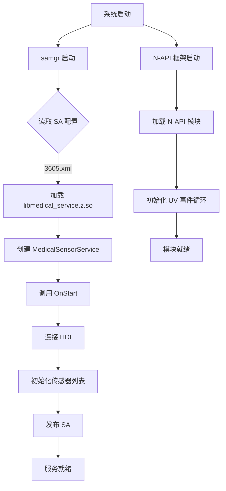

# 编译产物文档

## 目的

本文档说明 Medical_Sensor 的编译产物、安装路径和运行时加载关系。

---

## 适用范围

本文档适用于需要：
- 了解编译输出文件
- 分析运行时加载流程
- 定位产物相关问题

---

## 产物清单

### 1. 动态库（.so）

| 产物名称 | 来源 Target | 安装路径 | 说明 |
|---------|-------------|----------|------|
| `libmedical_utils.so` | `utils/libmedical_utils` | `system/lib64/` | 工具库 |
| `libmedical_service.z.so` | `services/libmedical_service` | `system/lib64/` | 服务端库（SA 库） |
| `libmedical_native.so` | `frameworks/libmedical_native` | `system/lib64/` | 客户端框架库 |
| `medical_agent.so` | `interfaces/native/medical_interface_native` | `system/lib64/` | Native 接口库 |
| `medical.so` | `interfaces/plugin/medical` | `system/lib64/module/` | JS 模块 |
| `libsensor_proxy_1.0.so` | external_deps | `system/lib64/` | HDI 代理库（系统提供） |

**证据**：
- 服务端输出：`services/medical_sensor/BUILD.gn:17` 输出 `libmedical_service.z.so`
- JS 模块安装：`interfaces/plugin/BUILD.gn:38` `relative_install_dir = "module"`

### 2. 静态库（.a）

| 产物名称 | 来源 Target | 说明 |
|---------|-------------|------|
| `medical_static.a` | `interfaces/plugin/medical_static` | N-API 静态库（可选） |

### 3. 配置文件（.xml）

| 产物名称 | 来源 Target | 安装路径 | 说明 |
|---------|-------------|----------|------|
| `3605.xml` | `sa_profile/medical_sa_profiles` | `/system/profile/sa_profile/` | System Ability 配置 |

**证据**：
- SA 配置：`sa_profile/BUILD.gn:16-19`

### 4. NDK 符号（.so）

| 产物名称 | 来源 Target | 说明 |
|---------|-------------|------|
| `medical.so` | `interfaces/native/libmedical_ndk` | NDK 符号库（包含头文件定义） |

**证据**：
- NDK 定义：`interfaces/native/BUILD.gn:17-21`

---

## 安装路径

### 标准系统路径

| 产物类型 | 安装路径 | 说明 |
|---------|----------|------|
| SA 配置 | `/system/profile/sa_profile/3605.xml` | 系统能力配置 |
| 动态库 | `/system/lib64/*.so` | 共享库 |
| JS 模块 | `/system/lib64/module/medical.so` | N-API 模块 |
| NDK 库 | `/usr/include/` | NDK 头文件 |

---

## 运行时加载关系

### 1. System Ability 加载

```
系统启动
  ↓
samgr (系统能力管理器)
  ↓ 读取 SA 配置
3605.xml
  ↓ 加载动态库
libmedical_service.z.so
  ↓ 创建 SA 实例
MedicalSensorService::OnStart()
  ↓ 发布服务
SystemAbility::Publish()
  ↓ 服务可用
IPC 通信启动
```

**证据**：
- SA 配置：`sa_profile/3605.xml:15-24`
- 服务启动：`services/medical_sensor/src/medical_service.cpp:62-95`

### 2. N-API 模块加载

```
JS 应用启动
  ↓ import 语句
import medical from '@ohos.medical'
  ↓ N-API 框架加载
加载 medical.so
  ↓ 执行注册函数
RegisterModule()
  ↓ 初始化
Init() 函数
  ↓ 注册 JS 方法
on(), off(), setOpt()
  ↓ API 可用
应用可调用
```

**证据**：
- 模块注册：`interfaces/plugin/src/medical_js.cpp:292-295`

### 3. Native 接口加载

```
C++ 应用启动
  ↓ 链接
medical_agent.so
  ↓ 调用 API
GetAllSensors(), SubscribeSensor() 等
  ↓ 创建数据通道
CreateSensorDataChannel()
  ↓ 建立 IPC 连接
MedicalSensorServiceClient::GetInstance()
  ↓ 服务调用
通过 Proxy 调用服务
```

---

## 运行时组件交互

### 进程分布

| 组件 | 进程名 | 说明 |
|------|--------|------|
| MedicalSensorService | `sensors` | 系统能力服务进程 |
| Sensor HDI | （独立进程） | 传感器驱动进程 |
| 应用 | （应用进程） | JS/C++ 应用 |

**证据**：
- SA 进程：`sa_profile/3605.xml:16`

### IPC 通信

**客户端（应用进程）→ 服务端（sensors 进程）**

```
应用进程
  └─> libmedical_agent.so (Native API)
      └─> libmedical_native.so (IPC Proxy)
          └─> Binder IPC
              └─> libmedical_service.z.so (SA)
                  └─> 处理请求并返回
```

**服务端（sensors 进程）→ 驱动进程**

```
sensors 进程
  └─> libmedical_service.z.so (SA)
      └─> HDI 适配层
          └─> libsensor_proxy_1.0.so (HDI 代理)
              └─> Binder IPC
                  └─> 传感器驱动进程
```

**证据**：
- HDI 依赖：`services/medical_sensor/BUILD.gn:51-52`

---

## 数据通道运行时

### 共享内存（Ashmem）

**用途**：传感器数据从服务端传输到客户端的高效通道。

**创建流程**：

1. 客户端调用 `CreateSensorDataChannel()` 创建共享内存
2. 客户端通过 `TransferDataChannel()` 将共享内存句柄发送给服务端
3. 服务端将传感器数据写入共享内存
4. 客户端从共享内存读取数据并回调到应用

**证据**：
- 数据通道：`frameworks/native/medical_sensor/include/medical_sensor_data_channel.h`

---

## 目标 → 产物映射

| bundle.json sub_component | 构建目标 | 最终产物 | 安装位置 |
|---------------------|----------|----------|----------|
| `medical_sa_profiles` | `sa_profile:medical_sa_profiles` | `3605.xml` | `/system/profile/sa_profile/` |
| `medical_utils_target` | `utils:libmedical_utils` | `libmedical_utils.so` | `/system/lib64/` |
| `medical_service_target` | `services:libmedical_service` | `libmedical_service.z.so` | `/system/lib64/` |
| `medical_native_target` | `frameworks:libmedical_native` | `libmedical_native.so` | `/system/lib64/` |
| `medical_ndk_target` | `interfaces/native:medical_interface_native` | `medical_agent.so` | `/system/lib64/` |
| `medical_js_target` | `interfaces/plugin:medical` | `medical.so` | `/system/lib64/module/` |

**证据**：
- 组件定义：`bundle.json:35-42`

---

## 依赖的外部产物

### 系统组件依赖

| 组件 | 库 | 提供能力 |
|------|-----|----------|
| access_token | libaccesstoken_sdk.so | 权令牌和权限检查 |
| c_utils | libc++.so | 基础 C++ 工具 |
| eventhandler | libeventhandler.so | 事件处理和线程管理 |
| hilog | libhilog.so | 日志系统 |
| hisysevent | libhisysevent.so | 系统事件上报 |
- napi | libace_napi.z.so | N-API 框架 |
| ipc | libipc_core.so | IPC 核心库 |
| safwk | libsystem_ability_fwk.so | 系统能力框架 |
| samgr | libsamgr_proxy.z.so | 系统能力管理器代理 |
| drivers_interface_sensor | libsensor_proxy_1.0.so | 传感器 HDI 接口代理 |
| drivers_peripheral_sensor | hdi_sensor | 传感器 HDI 服务 |

**证据**：
- 依赖列表：`bundle.json:18-31`

---

## 加载顺序

### 系统启动顺序



**证据**：
- 服务启动：`services/medical_sensor/src/medical_service.cpp:62-95`

---

## 相关跳转

- [项目概览](00_Overview.md) - 项目定位和核心能力
- [目录结构](01_Directory_Structure.md) - 代码组织详解
- [GN Targets](05_GN_Targets.md) - 构建目标和依赖图
