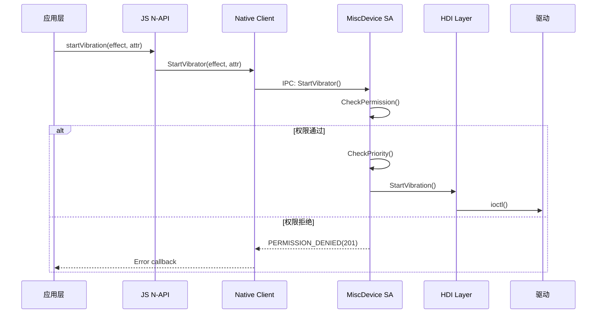

# 架构设计

## 分层架构

```
┌─────────────────────────────────────────────────────────────────────┐
│                          应用层 (Application)                         │
│  ┌─────────────┐ ┌─────────────┐ ┌─────────────┐ ┌─────────────┐   │
│  │ JS/TS App   │ │  C App      │ │  ArkTS App  │ │ CJ App      │   │
│  └──────┬──────┘ └──────┬──────┘ └──────┬──────┘ └──────┬──────┘   │
└─────────┼───────────────┼───────────────┼───────────────┼───────────┘
          │               │               │               │
┌─────────┼───────────────┼───────────────┼───────────────┼───────────┘
│          │               │               │               │           │
│  ┌──────┴──────┐ ┌──────┴──────┐ ┌──────┴──────┐ ┌──────┴──────┐   │
│  │   JS N-API   │ │    C API     │ │  Taihe/ETS  │ │  CJ FFI     │   │
│  │  (vibrator)  │ │  (ohvibrator)│ │ (vibrator)  │ │ (vibrator) │   │
│  └──────┬──────┘ └──────┬──────┘ └──────┬──────┘ └──────┬──────┘   │
│         │                │               │               │           │
│  ┌──────┴───────────────────────────────────────────────────────┐   │
│  │                   框架层 (Frameworks)                         │   │
│  │  ┌─────────────────────────────────────────────────────────┐  │   │
│  │  │              Native C++ 客户端层                          │  │   │
│  │  │  vibrator_service_client.cpp | light_client.cpp        │  │   │
│  │  └────────────────────────┬────────────────────────────────┘  │   │
│  └───────────────────────────┼───────────────────────────────────┘   │
│                              │                                       │
│  ┌───────────────────────────┼───────────────────────────────────┐   │
│  │              Inner API 接口层                                  │   │
│  │  interfaces/inner_api/vibrator/vibrator_agent.h              │   │
│  │  interfaces/inner_api/light/light_agent.h                     │   │
│  └───────────────────────────┼───────────────────────────────────┘   │
│                              │                                       │
└──────────────────────────────┼───────────────────────────────────────┘
                               │
┌──────────────────────────────┼───────────────────────────────────────┐
│                              │                           服务层 (Services)
│  ┌──────────────────────────┴──────────────────────────────────┐   │
│  │              MiscDeviceService (SA ID: 3602)                 │   │
│  │  ┌─────────────────────────────────────────────────────────┐  │   │
│  │  │  主服务: miscdevice_service.cpp                         │  │   │
│  │  │  优先级管理: vibration_priority_manager.cpp              │  │   │
│  │  │  振动线程: vibrator_thread.cpp                          │  │   │
│  │  └─────────────────────────────────────────────────────────┘  │   │
│  │  ┌─────────────────────────────────────────────────────────┐  │   │
│  │  │  HDI 连接层                                            │  │   │
│  │  │  adapter/ + interface/                                 │  │   │
│  │  └─────────────────────────────────────────────────────────┘  │   │
│  │  ┌─────────────────────────────────────────────────────────┐  │   │
│  │  │  触觉匹配: haptic_matcher/                             │  │   │
│  │  └─────────────────────────────────────────────────────────┘  │   │
│  └─────────────────────────────────────────────────────────────┘   │
└────────────────────────────────────────────────────────────────────┘
                               │
                               ▼
                    ┌─────────────────────┐
                    │   HDI 层 (HAL)      │
                    │  Vibrator | Light   │
                    └─────────────────────┘
```

## 模块职责

| 层次 | 模块 | 职责 | 关键文件 |
|------|------|------|----------|
| **接口** | inner_api/vibrator | 内部 C++ API 定义 | `vibrator_agent.h` |
| **接口** | inner_api/light | 灯光 API 定义 | `light_agent.h` |
| **框架** | js/napi | JS N-API 绑定 | `vibrator_js.cpp` |
| **框架** | capi | C API 实现 | `vibrator.cpp` |
| **框架** | ets/taihe | ArkTS 绑定 | `ohos.vibrator.taihe` |
| **框架** | cj | Cangjie FFI | `vibrator_ffi.cpp` |
| **服务** | miscdevice_service | SA 主服务 | `miscdevice_service.cpp` |
| **服务** | hdi_connection | HDI 桥接 | `hdi_connection.cpp` |
| **工具** | common | 通用工具 | `permission_util.cpp` |
| **工具** | haptic_decoder | 触觉解码 | `default_vibrator_decoder.cpp` |

## IPC/Binder 通信

### SA 配置

**文件**: `sa_profile/3602.json`

```json
{
  "process": "sensors",
  "systemability": [{
    "name": 3602,
    "libpath": "libmiscdevice_service.z.so",
    "run-on-create": true,
    "distributed": false
  }]
}
```

### 服务端注册流程

```cpp
// services/miscdevice_service/src/miscdevice_service.cpp
class MiscdeviceService : public SystemAbility, public MiscdeviceServiceStub {
    MiscdeviceService() : SystemAbility(MISCDEVICE_SERVICE_ABILITY_ID, true) {}
    void OnStart() override {
        // 发布服务
        Publish(MiscdeviceDelayedSpSingleton<MiscdeviceService>::GetInstance());
    }
};

// 单例注册
auto g_miscdeviceService = MiscdeviceDelayedSpSingleton<MiscdeviceService>::GetInstance();
SystemAbility::MakeAndRegisterAbility(g_miscdeviceService.GetRefPtr());
```

### 客户端发现流程

```cpp
// frameworks/native/vibrator/src/vibrator_service_client.cpp
auto sm = SystemAbilityManagerClient::GetInstance().GetSystemAbilityManager();
auto remoteObject = sm->GetSystemAbility(MISCDEVICE_SERVICE_ABILITY_ID);
miscdeviceProxy_ = iface_cast<IMiscdeviceService>(remoteObject);
```

### Binder 通信模式

```
Client                          Server
  │                               │
  ├─MessageParcel(write)────────>│
  │      [请求参数]                │
  │                               │
  │<────Remote()->SendRequest()───│
  │      [响应数据]                │
  │
  ▼
```

## 线程模型

```
┌─────────────────────────────────────────────────────────────┐
│                      主线程 (Main Thread)                    │
│  - SystemAbility OnStart/OnStop                            │
│  - SA 生命周期管理                                          │
│  - IPC 请求处理 (OnRemoteRequest)                          │
└─────────────────────────────────────────────────────────────┘
                              │
                              ▼
┌─────────────────────────────────────────────────────────────┐
│                  VibratorThread (独立线程)                   │
│  - 振动控制循环                                            │
│  - 长时间振动任务                                          │
│  - 与 HDI 驱动通信                                         │
└─────────────────────────────────────────────────────────────┘
                              │
                              ▼
┌─────────────────────────────────────────────────────────────┐
│                    HDI 回调线程                              │
│  - 振动完成回调                                            │
│  - 插拔事件通知                                            │
└─────────────────────────────────────────────────────────────┘
```

### 线程安全机制

- **Death Recipient**: 监听客户端死亡 (`death_recipient_template.h`)
- **Delayed Sp Singleton**: 延迟单例管理 (`miscdevice_delayed_sp_singleton.h`)
- **Mutex**: 关键资源同步 (`sensors_errors.h` 中定义的错误码)

## 数据流

### 振动请求数据流

```
JS: startVibration(effect, attribute)
    │
    ▼
N-API: vibrator_js.cpp::StartVibrate()
    │
    ▼
Native Client: vibrator_service_client.cpp
    │
    ▼
Binder IPC: SendRequest(StartVibrator)
    │
    ▼
SA Server: miscdevice_service.cpp::StartVibrator()
    │
    ├─[权限检查]──> CheckVibratePermission()
    │
    ├─[优先级]──> VibrationPriorityManager
    │
    ▼
HDI: hdi_connection.cpp
    │
    ▼
Kernel Driver: ioctl(VIBRATOR_START)
```

## 时序图

### 振动启动时序



## 稳定性标注

| 接口类型 | 稳定性 | 证据 |
|----------|--------|------|
| `interfaces/kits/c/` | **稳定** | NDK 公开 API，有版本兼容要求 |
| `interfaces/inner_api/` | **稳定** | Platform SDK 接口 |
| `frameworks/js/napi/` | **稳定** | ArkTS/JS 标准 API |
| `frameworks/native/*` | **内部** | 仅框架层使用 |
| `services/*` | **内部** | SA 内部实现 |
| `utils/*` | **内部** | 工具库 |
