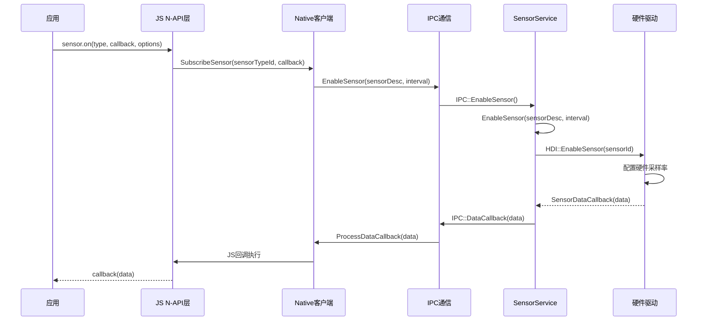
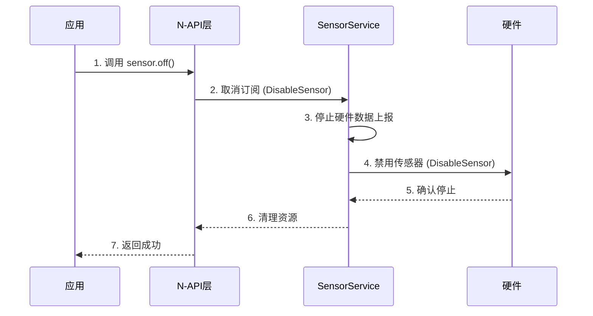

# 架构说明

> **目的**: 描述 Sensor 子系统的组件图、数据流、线程模型和关键时序
> **适用范围**: /base/sensors/sensor（排除 test/ 目录）
> **关键结论**: Sensor 子系统采用 Client-Server 架构，通过 System Ability 和 IPC 通信，支持多语言绑定和多种数据通道
> **相关跳转**: [目录结构](01_Directory_Structure.md) | [内部 API](04_Internal_API.md)

---

## 架构概述

### 分层架构

```
┌─────────────────────────────────────────────────────────────────┐
│                   应用层 (JS/TS/CJ 应用)                   │
└───────────────────────────┬─────────────────────────────────┘
                        │
                        ↓ N-API / Native API
┌─────────────────────────────────────────────────────────────────┐
│                Framework 层 (客户端框架)                   │
│  ┌──────────┬──────────┬──────────┬────────────┐  │
│  │ JS/TS  │ Native    │ CJ      │ Taihe       │  │
│  │ N-API  │ Client     │ FFI     │ ETS         │  │
│  └──────────┴──────────┴──────────┴────────────┘  │
└───────────────────────────┬─────────────────────────────────┘
                        │ IPC (Binder/HDF)
┌─────────────────────────────────────────────────────────────────┐
│              Service 层 (服务端框架)                    │
│  ┌────────────────────────────────────────────────────┐       │
│  │ SensorService (System Ability 3601)         │       │
│  │  - SensorManager                            │       │
│  │  - SensorDataManager                        │       │
│  │  - SensorDataProcesser                     │       │
│  │  - ClientInfo                               │       │
│  └────────────────────────────────────────────────────┘       │
└───────────────────────────┬─────────────────────────────────┘
                        │ HDI (Hardware Driver Interface)
┌─────────────────────────────────────────────────────────────────┐
│              硬件驱动层 (HDF Sensors)                     │
│  ┌────────────────────────────────────────────────────┐       │
│  │ Physical Sensor Hardware                  │       │
│  │  - Accelerometer                         │       │
│  │  - Gyroscope                            │       │
│  │  - Ambient Light, etc.                   │       │
│  └────────────────────────────────────────────────────┘       │
└─────────────────────────────────────────────────────────────────┘
```

> **TODO**: 添加更详细的组件图（Mermaid）

---

## 组件职责

### 1. 应用层 (Application Layer)

**职责**:
- 提供传感器数据的订阅和展示
- 通过 JS/TS/CJ 等语言调用传感器 API
- 处理传感器数据回调

**主要组件**:
- JS/TS 应用 (ArkUI 应用)
- Native C++ 应用
- Cangjie 应用

> **证据**: README.md 示例代码

### 2. Framework 层 (Framework Layer)

**职责**:
- 提供 N-API 和 Native API 绑定
- 实现 IPC 客户端
- 管理传感器代理
- 处理数据通道

**主要组件**:
- **SensorAgent**: 传感器代理接口
- **SensorServiceClient**: IPC 客户端
- **SensorClientProxy**: 客户端代理
- **SensorClientStub**: 客户端 Stub
- **SensorAgentProxy**: Agent 代理
- **JS/NAPI 绑定**: `libsensor.z.so`
- **CJ FFI 绑定**: `cj_sensor_ffi.z.so`
- **Taihe ETS 绑定**: `sensor_taihe_native.z.so`

> **证据**: `frameworks/native/`, `frameworks/js/napi/`, `frameworks/cj/`, `frameworks/ets/taihe/`

### 3. Service 层 (Service Layer)

**职责**:
- 实现 System Ability (SA 3601)
- 管理传感器硬件
- 处理客户端订阅
- 数据采集和分发
- 权限验证

**主要组件**:
- **SensorService**: 主服务类，继承自 SystemAbility
- **SensorManager**: 传感器管理器
- **SensorDataManager**: 数据管理器
- **SensorDataProcesser**: 数据处理器
- **ClientInfo**: 客户端信息管理
- **SensorObserver**: 观察者模式实现
- **SensorPowerPolicy**: 电源策略管理
- **StreamServer**: 流服务器
- **FifoCacheData**: FIFO 缓存
- **HDI Connection**: 硬件驱动接口连接

> **证据**: `services/include/`, `services/src/`

### 4. 硬件驱动层 (Hardware Driver Layer)

**职责**:
- 提供物理传感器的硬件抽象
- 实现传感器驱动接口 (HDI)
- 数据采集和上报

**主要组件**:
- **Physical Sensor Hardware**: 实际传感器硬件
- **HDF Sensor Driver**: 传感器驱动框架
- **HDI Interface**: `libsensor_proxy_3.0.z.so`

> **TODO**: 确认 HDF 驱动的具体实现位置

---

## 数据流

### 订阅数据流



> **TODO**: 完善 Mermaid 图，添加更多细节

### 数据通道流

**FileDescriptor 通道** (高性能数据流):
```
应用 → N-API → Client → IPC → Service → HDI → 硬件
      ↑                                        ↓
      ←←←←←←←←←←← SensorData
```

**Socket 通道** (远程设备数据):
```
远程设备 → Service (通过 Socket)
        ↓
    CreateSocketChannel()
        ↓
数据流传输
```

> **证据**: `services/include/sensor_service.h`, `utils/ipc/include/stream_socket.h`

---

## 线程模型

### Service 端线程

| 线程类型 | 职责 | 证据 |
|----------|------|------|
| 主线程 (SystemAbility 线程) | SA 生命周期管理、IPC 调度 | `SensorService::OnStart()` |
| 数据采集线程 | 传感器数据采集、FIFO 缓存 | `SensorDataManager` |
| 事件分发线程 | 数据分发到客户端 | `SensorObserver` |
| Socket 服务器线程 | 处理远程 Socket 连接 | `StreamServer` |
| 电源管理线程 | 传感器电源状态管理 | `SensorPowerPolicy` |

> **TODO**: 确认具体的线程实现

### Client 端线程

| 线程类型 | 职责 | 证据 |
|----------|------|------|
| 主线程 | API 调用、事件处理 | `SensorAgentProxy` |
| N-API 回调线程 | 执行 JS 回调 | `AsyncCallbackInfo` |
| 数据接收线程 | 接收传感器数据 | `SensorDataChannel` |

> **TODO**: 确认客户端线程模型

### 线程同步机制

- **互斥锁 (Mutex)**:
  - `g_mutex` - 全局互斥锁
  - `g_onMutex` - on 订阅互斥锁
  - `g_onceMutex` - once 订阅互斥锁
  - `g_plugMutex` - plug 事件互斥锁

> **证据**: `frameworks/js/napi/src/sensor_js.cpp:60-69`

---

## 关键时序

### 传感器订阅时序

```mermaid
sequenceDiagram
    participant App as 应用
    participant NAPI as N-API层
    participant Service as SensorService
    participant HDI as 硬件

    App->>NAPI: 1. 调用 sensor.on()
    Note over App,NAPI: 传递 type, callback, options
    NAPI->>Service: 2. 订阅传感器 (EnableSensor)
    Note over NAPI,Service: 通过 IPC 调用
    Service->>Service: 3. 验证权限
    Note over Service: 调用 CheckSensorPermission()
    Service->>HDI: 4. 启用硬件 (EnableSensor)
    Note over Service,HDI: 通过 HDI 调用
    HDI->>HDI: 5. 配置采样率
    Note over HDI: 硬件层配置
    HDI-->>Service: 6. 上报数据 (SensorDataCallback)
    Note over HDI,Service: 传感器数据回调
    Service-->>App: 7. 回调应用 (data)
    Note over Service,App: 通过 N-API 回调
    loop
        App-->>App: 8. 持续接收数据
        Note over App: 周期性数据上报
```

> **TODO**: 添加错误处理流程

### 传感器取消订阅时序



> **TODO**: 添加资源清理细节

---

## IPC 通信模式

### Client → Service 通信

**接口**: `ISensorService` (IDL 定义)

**通信方式**: Binder IPC

**主要方法**:
- `EnableSensor()` - 启用传感器
- `DisableSensor()` - 禁用传感器
- `GetSensorList()` - 获取传感器列表
- `TransferDataChannel()` - 传输数据通道
- `DestroySensorChannel()` - 销毁数据通道
- `SuspendSensors()` - 暂停传感器
- `ResumeSensors()` - 恢复传感器
- `GetActiveInfoList()` - 获取活跃信息列表
- `CreateSocketChannel()` - 创建 Socket 通道

> **证据**: `frameworks/native/ISensorService.idl`

### Service → Client 通信

**接口**: `ISensorClient` (回调接口)

**通信方式**: Binder IPC (双向回调)

**主要方法**:
- `ProcessPlugEvent()` - 处理传感器插拔事件

> **证据**: `frameworks/native/include/i_sensor_client.h`

---

## 资源生命周期

### 订阅资源

**创建时机**:
- `sensor.on()` 调用时
- `sensor.once()` 调用时

**生命周期**:
1. 创建 `SensorBasicDataChannel`
2. 创建 `AsyncCallbackInfo` 回调信息
3. 注册到 `SensorService`
4. 开始接收传感器数据

**清理时机**:
- `sensor.off()` 调用时
- 应用进程退出时

**清理步骤**:
1. 停止传感器数据上报
2. 销毁数据通道
3. 清理回调引用
4. 释放内存资源

> **证据**: `frameworks/js/napi/src/sensor_js.cpp`, `frameworks/native/src/sensor_data_channel.cpp`

### 客户端连接资源

**创建**:
- `SensorServiceClient::InitServiceClient()` 调用时
- 通过 SAMGR 获取 SA 3601

**生命周期**:
1. 创建 Death Recipient
2. 连接到 SA
3. 添加死亡监听

**清理**:
- 进程退出时
- SA 服务死亡时

> **证据**: `frameworks/native/src/sensor_service_client.cpp`

---

## 事件处理机制

### 传感器数据事件

**流程**:
```
硬件层 → HDI → SensorService → SensorDataManager
→ SensorObserver → ClientInfo → SensorDataChannel
→ Client → N-API → 应用回调
```

**关键组件**:
- `SensorObserver`: 观察者模式，负责数据分发
- `ClientInfo`: 管理客户端信息
- `FifoCacheData`: FIFO 数据缓存

> **证据**: `services/src/sensor_observer.cpp`, `services/src/fifo_cache_data.cpp`

### 传感器插拔事件

**事件类型**: `SENSOR_STATE_CHANGE`

**流程**:
```
硬件层 (插拔) → HDI → SensorService
→ SensorClientProxy::ProcessPlugEvent()
→ Client → N-API → 应用 (onPlugSensor)
```

> **证据**: `frameworks/js/napi/src/sensor_js.cpp:525-541`

---

## 配置与控制

### 采样率控制

**参数**:
- `samplingPeriodNs` - 采样周期 (纳秒)
- `maxReportDelayNs` - 最大报告延迟

**默认值**:
- `normal`: 200000000 ns (200 ms)
- `ui`: 60000000 ns (60 ms)
- `game`: 20000000 ns (20 ms)

> **证据**: `frameworks/js/napi/src/sensor_js.cpp:55-59`

### 电源策略

**策略**:
- **SuspendSensors()**: 暂停所有传感器，减少功耗
- **ResumeSensors()**: 恢复传感器
- **SensorPowerPolicy**: 监控客户端活跃度，智能休眠

> **证据**: `services/src/sensor_power_policy.cpp`

---

## 错误传播

### 错误码

| 错误码 | 含义 | 位置 |
|---------|------|------|
| PERMISSION_DENIED | 权限拒绝 | `services/src/sensor_service.cpp` |
| NON_SYSTEM_API | 非 System API | `services/src/sensor_service.cpp` |
| PARAMETER_ERROR | 参数错误 | `frameworks/js/napi/src/sensor_napi_error.cpp` |
| SENSOR_NATIVE_GET_SERVICE_ERR | 获取服务失败 | `interfaces/inner_api/sensor_errors.h` |

> **TODO**: 补充完整错误码表

---

## 相关跳转

- [目录结构](01_Directory_Structure.md) - 查看组件组织
- [对外 N-API 参考](03_NAPI_Reference.md) - 查看 API 详细说明
- [内部 API](04_Internal_API.md) - 查看内部接口定义
