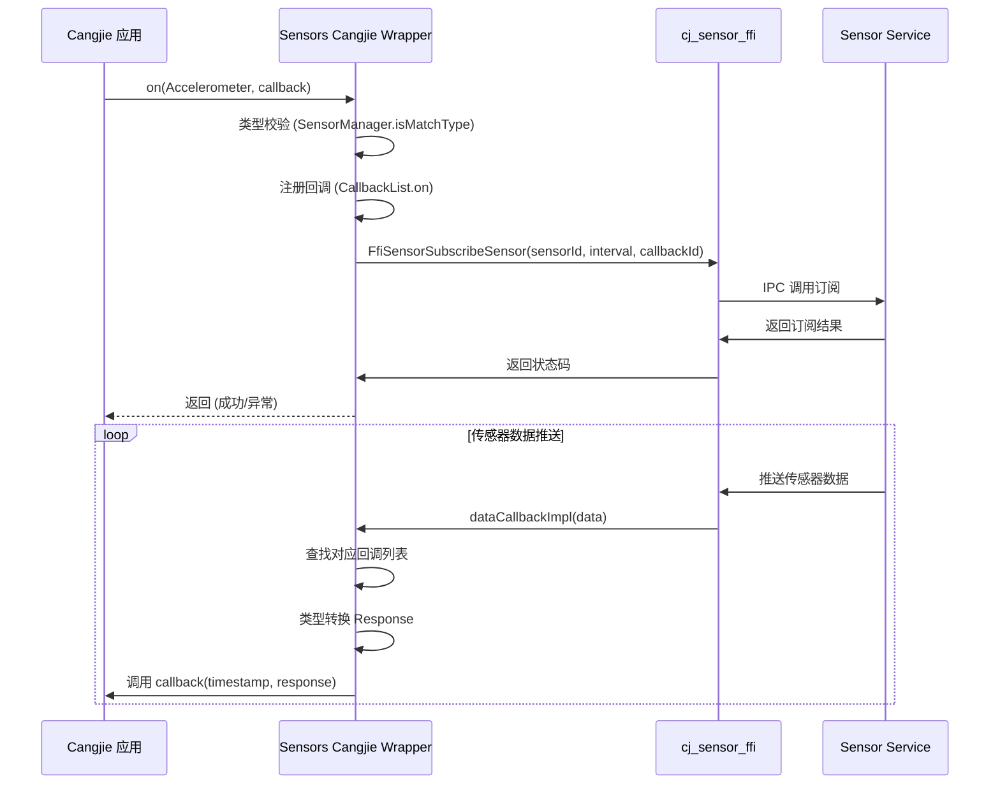
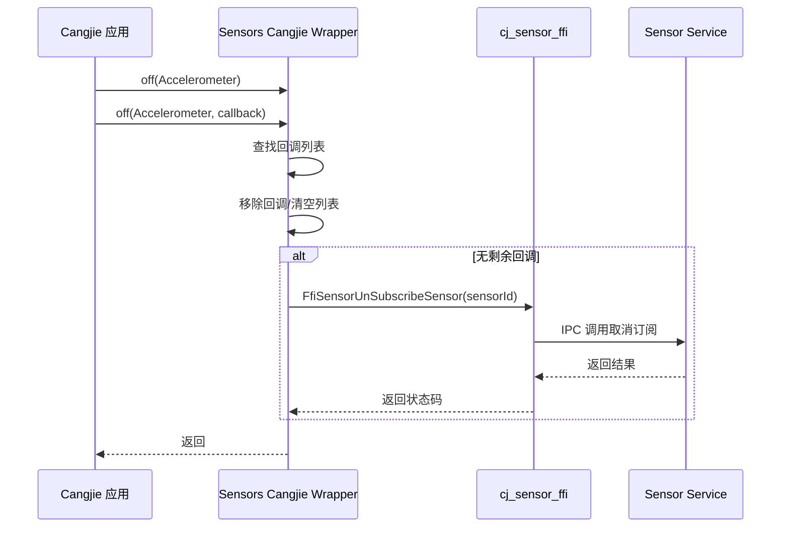

# 架构说明

## 2.1 系统架构图

```
┌─────────────────────────────────────────────────────────────────────────┐
│                           Cangjie 应用层                                 │
│                                                                         │
│   import kit.SensorServiceKit                                          │
│   SensorServiceKit.on(Accelerometer) { ... }                           │
└─────────────────────────────────────────────────────────────────────────┘
                                    │
                                    ▼
┌─────────────────────────────────────────────────────────────────────────┐
│                      Sensors Cangjie Wrapper (本层)                     │
│                                                                         │
│  ┌─────────────────────────────────────────────────────────────────┐   │
│  │                    kit/SensorServiceKit/                        │   │
│  │                    index.cj (包入口)                             │   │
│  │                    public import ohos.sensor.*                  │   │
│  └─────────────────────────────────────────────────────────────────┘   │
│                                    │                                    │
│                                    ▼                                    │
│  ┌─────────────────────────────────────────────────────────────────┐   │
│  │                     ohos/sensor/                                 │   │
│  │  ┌──────────────┐ ┌──────────────┐ ┌────────────────────────┐ │   │
│  │  │ sensor.cj     │ │ sensor_      │ │ ffi.cj                 │ │   │
│  │  │ - API 函数    │ │ manager.cj   │ │ - C 结构定义           │ │   │
│  │  │ - 类型枚举    │ │ - 回调管理   │ │ - FFI 函数声明         │ │   │
│  │  │ - Response 类 │ │ - 数据分发   │ │                        │ │   │
│  │  └──────────────┘ └──────────────┘ └────────────────────────┘ │   │
│  └─────────────────────────────────────────────────────────────────┘   │
└─────────────────────────────────────────────────────────────────────────┘
                                    │ FFI 调用
                                    ▼
┌─────────────────────────────────────────────────────────────────────────┐
│                     sensors_sensor (cj_sensor_ffi)                      │
│                    (C++ FFI 实现，位于独立仓库)                          │
│                                                                         │
│   - sensor_subscription.cpp                                              │
│   - sensor_data_channel.cpp                                            │
└─────────────────────────────────────────────────────────────────────────┘
                                    │ IPC
                                    ▼
┌─────────────────────────────────────────────────────────────────────────┐
│                        Sensor Service (SA)                              │
│                    (系统能力，System Ability)                            │
└─────────────────────────────────────────────────────────────────────────┘
                                    │ HDF
                                    ▼
┌─────────────────────────────────────────────────────────────────────────┐
│                        Sensor HDF Driver                                 │
│                      (硬件抽象层驱动)                                    │
└─────────────────────────────────────────────────────────────────────────┘
```

## 2.2 数据流

### 订阅数据流



### 取消订阅数据流



## 2.3 核心模块职责

### 模块划分

| 模块 | 文件 | 职责 |
|------|------|------|
| API 入口 | `sensor.cj` | 定义公共 API 函数、类型枚举 |
| 回调管理 | `sensor_manager.cj` | 传感器回调注册表、数据分发 |
| FFI 接口 | `ffi.cj` | C 结构定义、FFI 函数声明 |
| 错误处理 | `error.cj` | 错误码映射 |
| 日志 | `log.cj` | 日志通道配置 |
| Kit 导出 | `kit/SensorServiceKit/index.cj` | 包导出 |

### 依赖方向

```
kit/SensorServiceKit/index.cj
    └── ohos/sensor/index.cj (隐式重导出)
            │
            ├── sensor.cj (API)
            │       │
            │       ├── ffi.cj (类型)
            │       │       │
            │       │       └── sensor_manager.cj (回调)
            │       │               │
            │       └── sensor.cj ─┘
            │               │
            ├── error.cj ──┤
            └── log.cj ────┘
```

### 关键组件

#### SensorManager

**位置**: `ohos/sensor/sensor_manager.cj:90-164`

**职责**:
- 管理传感器类型与回调列表的映射
- 提供回调注册、注销、查询接口
- 支持按传感器类型匹配回调

**关键方法**:

| 方法 | 说明 |
|------|------|
| `get(sensorId)` | 获取指定传感器的回调列表 |
| `getOrCreate(sensorType)` | 获取或创建回调列表 |
| `consume(sensorType)` | 获取并移除回调列表 (once 模式) |
| `remove(sensorType)` | 移除指定传感器的所有回调 |
| `isMatchType(type, callback)` | 校验回调类型是否匹配 |

#### CallbackList

**位置**: `ohos/sensor/sensor_manager.cj:27-88`

**职责**:
- 管理单个传感器类型的回调对象列表
- 线程安全的增删改查

**关键方法**:

| 方法 | 说明 |
|------|------|
| `on(target)` | 注册回调 |
| `off(target)` | 移除指定回调 |
| `clear()` | 清空所有回调 |
| `getAllCallbacks()` | 获取所有回调 |
| `size()` | 获取回调数量 |

## 2.4 线程模型

### 线程划分

| 线程 | 职责 | 代码位置 |
|------|------|----------|
| JS 线程 | API 调用、回调执行 | Cangjie 运行时 |
| FFI 回调线程 | 接收传感器数据 | `cj_sensor_ffi` |
| Sensor Service 线程 | IPC 通信 | 系统服务 |

### 回调执行

1. **数据接收**: FFI 回调在独立线程接收传感器数据
2. **数据转换**: `dataCallbackImpl` 进行 C 到 Cangjie 类型转换
3. **回调分发**: 在 FFI 回调线程遍历回调列表，调用各回调
4. **用户回调**: 用户回调函数在 FFI 回调线程执行

### 线程安全

**Mutex 保护** (`sensor_manager.cj`):

```cj
class CallbackList {
    private let callBackMutex: Mutex  // 保护 callbackList
    // ...
}

class SensorManager {
    private let mutex: Mutex  // 保护 sensorMap
    // ...
}
```

所有对共享状态的访问均使用 `synchronized(mutex)` 保护。

## 2.5 生命周期

### 回调生命周期

```
┌─────────────┐
│ on() 调用    │────────┐
└─────────────┘        │
                       ▼
              ┌─────────────────┐
              │ CallbackList    │
              │ 中注册回调      │
              └─────────────────┘
                       │
         ┌─────────────┴─────────────┐
         ▼                           ▼
┌─────────────────┐        ┌─────────────────┐
│ 继续接收数据    │        │ off() 调用     │
│                 │        │ 或单次数据返回  │
└─────────────────┘        └─────────────────┘
                                       │
                                       ▼
                              ┌─────────────────┐
                              │ 回调从列表移除  │
                              └─────────────────┘
                                       │
                                       ▼
                              ┌─────────────────┐
                              │ 无回调时取消    │
                              │ FFI 订阅        │
                              └─────────────────┘
```

### 单次订阅 (once) 特殊流程

1. 调用 `once()` 时，先检查是否已有持续订阅
2. 如果已有订阅，直接注册 once 回调，等待下次数据返回后自动取消
3. 如果没有订阅，发起新的 FFI 订阅请求
4. 收到数据后，自动取消 FFI 订阅并清理回调

## 2.6 调用链图示

### API 调用链

#### on() 调用链

```
传感器 API 调用
    │
    ▼
┌─────────────────────────────────────────────────────────┐
│ sensor.cj: on<T>()                                      │
│ 1. 类型校验: SensorManager.isMatchType()                │
│ 2. 构建 lambda: Callback1Param                          │
│ 3. FFI 调用: FfiSensorSubscribeSensor()                 │
│ 4. 注册回调: ON_SENSOR_MANAGER.getOrCreate().on()       │
└─────────────────────────────────────────────────────────┘
```

#### off() 调用链

```
取消订阅 API
    │
    ▼
┌─────────────────────────────────────────────────────────┐
│ sensor.cj: off()                                        │
│ 1. 检查订阅状态: isSensorSubscribed()                   │
│ 2. 移除回调: removeCallback() / removeAllCallback()    │
│ 3. FFI 调用: FfiSensorUnSubscribeSensor()              │
└─────────────────────────────────────────────────────────┘
```

#### 回调数据流

```
传感器数据到达
    │
    ▼
┌─────────────────────────────────────────────────────────┐
│ ffi.cj: CSensorCallbackData.convertToResponseOption()   │
│ 根据 sensorTypeId 转换为对应 Response 类型              │
└─────────────────────────────────────────────────────────┘
    │
    ▼
┌─────────────────────────────────────────────────────────┐
│ sensor_manager.cj: dataCallbackImpl()                   │
│ 1. 从 ON_SENSOR_MANAGER 获取回调列表                    │
│ 2. 从 ONCE_SENSOR_MANAGER 获取并消费回调列表            │
│ 3. 调用 emitSensorCallback() 分发数据                  │
└─────────────────────────────────────────────────────────┘
    │
    ▼
┌─────────────────────────────────────────────────────────┐
│ sensor_manager.cj: emitOneSensorTypeCallbacks()         │
│ 根据 sensorTypeId 分发到对应类型的回调                   │
└─────────────────────────────────────────────────────────┘
```

详细调用链见 [附录：调用链图](appendix/Callgraphs.md)
