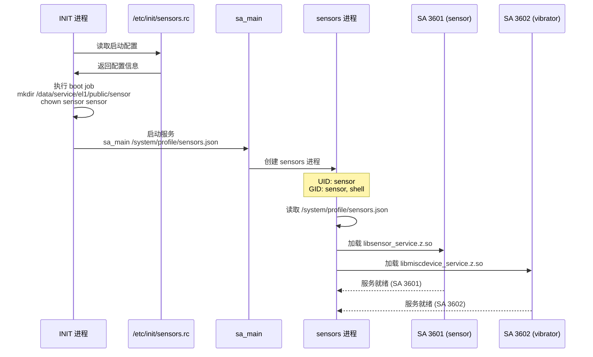
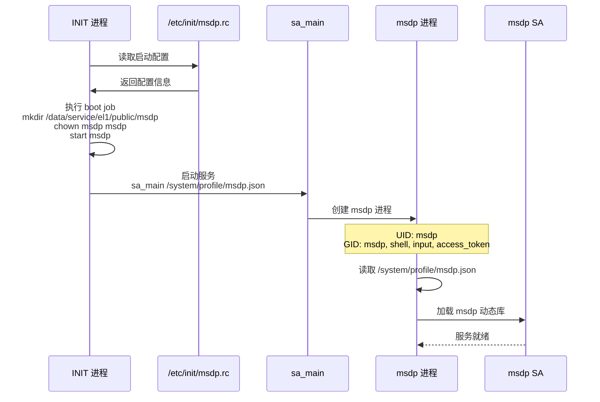
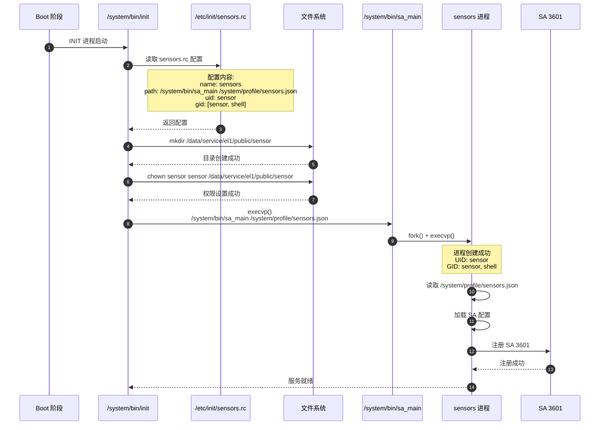
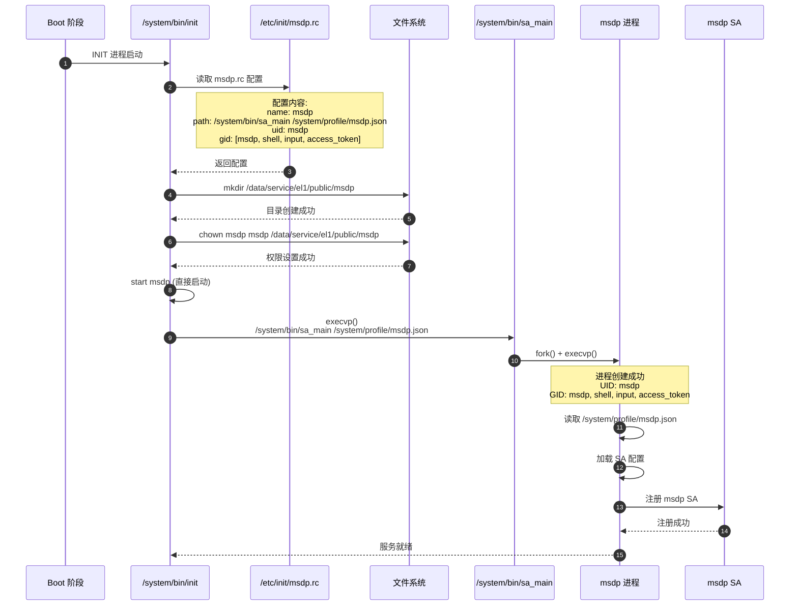

# 架构说明

**适用范围**: 本文档适用于所有需要了解组件架构和服务启动流程的人员
**目的**: 说明组件图、数据流、线程模型、关键时序
**关键结论**: 本组件通过 INIT 系统配置启动 sensors 和 msdp 服务，服务实现由外部组件提供

---

## 组件架构图

### 整体架构

```mermaid
graph TB
    subgraph "OpenHarmony 系统"
        INIT[/system/bin/init<br/>INIT 进程]
        SA_MAIN[/system/bin/sa_main<br/>SA 进程管理器]
    end

    subgraph "sensors_start 组件 (本仓库)"
        BUNDLE[bundle.json<br/>组件元数据]
        BUILD[BUILD.gn<br/>构建脚本]
        CFG1[sensors.cfg<br/>sensors 服务配置]
        CFG2[msdp.cfg<br/>msdp 服务配置]
    end

    subgraph "外部组件"
        SENSORS_SERV[sensors_sensor<br/>传感器服务实现]
        MISC_SERV[sensors_miscdevice<br/>杂项设备服务]
        MSDP_SERV[msdp 相关组件<br/>msdp 服务实现]
    end

    subgraph "运行时服务"
        SENSORS_PROC[sensors 进程<br/>PID: sensor]
        MSDP_PROC[msdp 进程<br/>PID: msdp]
        SA3601[SA 3601<br/>传感器]
        SA3602[SA 3602<br/>震动器]
    end

    BUILD -->|安装| INIT
    CFG1 -->|安装| INIT
    CFG2 -->|安装| INIT

    INIT -->|读取配置| SA_MAIN
    SA_MAIN -->|启动| SENSORS_PROC
    SA_MAIN -->|启动| MSDP_PROC

    SENSORS_PROC -->|加载| SA3601
    SENSORS_PROC -->|加载| SA3602
    MSDP_PROC -->|加载| MSDP_SERV

    SA3601 -->|实现| SENSORS_SERV
    SA3602 -->|实现| MISC_SERV

    style CFG1 fill:#e1f5ff
    style CFG2 fill:#e1f5ff
    style SENSORS_SERV fill:#fff4e1
    style MISC_SERV fill:#fff4e1
    style MSDP_SERV fill:#fff4e1
```

### 组件边界

**sensors_start 职责** (蓝色区域):
- 提供服务启动配置文件 (`.cfg`)
- 定义构建目标

**外部组件职责** (黄色区域):
- `sensors_sensor`: 提供传感器服务实现
- `sensors_miscdevice`: 提供杂项设备服务实现
- `msdp 相关组件`: 提供 msdp 服务实现

---

## 数据流

### 构建时数据流


**关键步骤**:
1. GN 解析 `BUILD.gn` [等价: etc/init/BUILD.gn:1](../etc/init/BUILD.gn:1)
2. 根据 `use_musl` 变量选择源文件 [等价: etc/init/BUILD.gn:19](../etc/init/BUILD.gn:19)
3. 将 `.cfg` 文件作为预构建 ETC 文件安装
4. 安装到 `/etc/init/` 目录 [等价: etc/init/BUILD.gn:24](../etc/init/BUILD.gn:24)

### 运行时数据流（sensors 服务）



**配置文件引用**:
- 启动配置: [etc/init/sensors.cfg:12](../etc/init/sensors.cfg:12)
- SA 配置: `/system/profile/sensors.json` (不在本仓库)

### 运行时数据流（msdp 服务）



**配置文件引用**:
- 启动配置: [etc/init/msdp.cfg:13](../etc/init/msdp.cfg:13)
- SA 配置: `/system/profile/msdp.json` (不在本仓库)

---

## 服务启动流程

### sensors 服务启动时序



**关键证据**:
- 配置文件: [etc/init/sensors.cfg:10-22](../etc/init/sensors.cfg:10)
- Boot job: [etc/init/sensors.cfg:2-8](../etc/init/sensors.cfg:2)

### msdp 服务启动时序



**关键证据**:
- 配置文件: [etc/init/msdp.cfg:11-54](../etc/init/msdp.cfg:11)
- Boot job: [etc/init/msdp.cfg:2-9](../etc/init/msdp.cfg:2)

---

## 线程模型

### 进程级别

本仓库**不创建任何线程**，仅提供配置文件。

实际的线程模型由以下进程负责:

| 进程 | 线程模型 | 职责 |
|------|----------|------|
| INIT 进程 | 单线程 | 初始化和服务启动 |
| sa_main | 多线程 | SA 进程管理、IPC 处理 |
| sensors 进程 | 多线程 | 传感器数据处理、IPC |
| msdp 进程 | 多线程 | 多设备协同、IPC |

### 线程来源

**sensors 进程线程** (由 `libsensor_service.z.so` 创建):
- 数据采集线程
- 事件通知线程
- IPC 通信线程
- ...

**msdp 进程线程** (由 msdp 动态库创建):
- 输入事件处理线程
- 传感器数据融合线程
- 跨设备通信线程
- ...

**说明**: 线程模型细节需查阅 `sensors_sensor` 和 `msdp` 相关仓库文档

---

## 资源生命周期

### 文件系统资源

#### 数据目录

| 服务 | 目录 | 创建时机 | 所有者 | 清理时机 |
|------|------|----------|--------|----------|
| sensors | `/data/service/el1/public/sensor` | boot job: mkdir | sensor | 系统关机 |
| msdp | `/data/service/el1/public/msdp` | boot job: mkdir | msdp | 系统关机 |

**创建证据**:
- sensors: [etc/init/sensors.cfg:5](../etc/init/sensors.cfg:5)
- msdp: [etc/init/msdp.cfg:5](../etc/init/msdp.cfg:5)

#### 配置文件

| 文件 | 安装位置 | 安装时机 | 读取时机 |
|------|----------|----------|----------|
| sensors.rc | `/etc/init/sensors.rc` | 构建安装 | INIT 启动时 |
| msdp.rc | `/etc/init/msdp.rc` | 构建安装 | INIT 启动时 |

### 进程生命周期

```
系统启动
    ↓
INIT 进程启动
    ↓
读取 /etc/init/*.rc
    ↓
执行 boot jobs (创建目录)
    ↓
启动 services (通过 sa_main)
    ↓
创建服务进程 (sensors / msdp)
    ↓
加载 SA 动态库
    ↓
服务运行 (进程持续存在)
    ↓
系统关机
    ↓
进程终止
```

---

## 错误传播机制

### 启动失败处理

**sensors 服务启动失败**:
1. INIT 记录错误日志
2. 根据 `onrestart` / `ondemand` 等配置决定是否重启
3. 如果是关键服务，可能影响系统启动

**msdp 服务启动失败**:
1. INIT 记录错误日志
2. 根据 `onrestart` / `ondemand` 等配置决定是否重启
3. msdp 失败可能导致跨设备协同功能不可用

**说明**: 具体的错误处理策略需查阅 INIT 系统文档和 SA 框架文档

### 权限错误

**权限不足导致的服务启动失败**:
- UID/GID 不存在
- 目录创建失败 (chown 失败)
- 动态库加载失败

**证据**: 配置文件中指定的 UID/GID:
- sensors: [etc/init/sensors.cfg:13-14](../etc/init/sensors.cfg:13)
- msdp: [etc/init/msdp.cfg:14-15](../etc/init/msdp.cfg:14)

---

## 跨组件交互

### sensors_start → sensors_sensor / sensors_miscdevice

```
sensors_start
    ↓ 提供
    /etc/init/sensors.rc
    ↓ 被读取
    /system/bin/init
    ↓ 启动
    sensors 进程
    ↓ 加载
    ├─ libsensor_service.z.so (sensors_sensor)
    └─ libmiscdevice_service.z.so (sensors_miscdevice)
```

**关键点**:
- `sensors_sensor` 和 `sensors_miscdevice` 共享 `sensors` 进程
- 避免重复启动进程
- 通过本仓库的统一配置文件启动

**证据**: [README.md:24](../README.md:24)

### sensors_start → msdp 组件

```
sensors_start
    ↓ 提供
    /etc/init/msdp.rc
    ↓ 被读取
    /system/bin/init
    ↓ 启动
    msdp 进程
    ↓ 加载
    msdp 动态库
```

---

## 配置依赖关系

### musl 条件编译

```
GN 变量 use_musl
    ├─ false (默认)
    │   ├─ 使用 sensors.cfg
    │   └─ 使用 msdp.cfg
    │
    └─ true
        ├─ 使用 sensors_musl.cfg
        └─ 使用 msdp_musl.cfg
```

**证据**: [etc/init/BUILD.gn:19-23, 30-34](../etc/init/BUILD.gn:19)

### SA 配置依赖

```
INIT 配置文件
    ├─ sensors.cfg
    │   └─ 引用: /system/profile/sensors.json
    │       └─ (由 sensors_sensor 生成)
    │
    └─ msdp.cfg
        └─ 引用: /system/profile/msdp.json
            └─ (由 msdp 组件生成)
```

---

## 相关跳转

- [项目概览](./00_Overview.md) - 组件定位和核心能力
- [目录结构](./01_Directory_Structure.md) - 文件组织
- [GN Targets](./05_GN_Targets.md) - 构建系统
- [编译产物](./06_Build_Artifacts.md) - 产物和运行时加载
- [配置文件详解](./appendix/Config_Files.md) - 配置参数完整说明

---

**最后更新**: 2026-02-06
