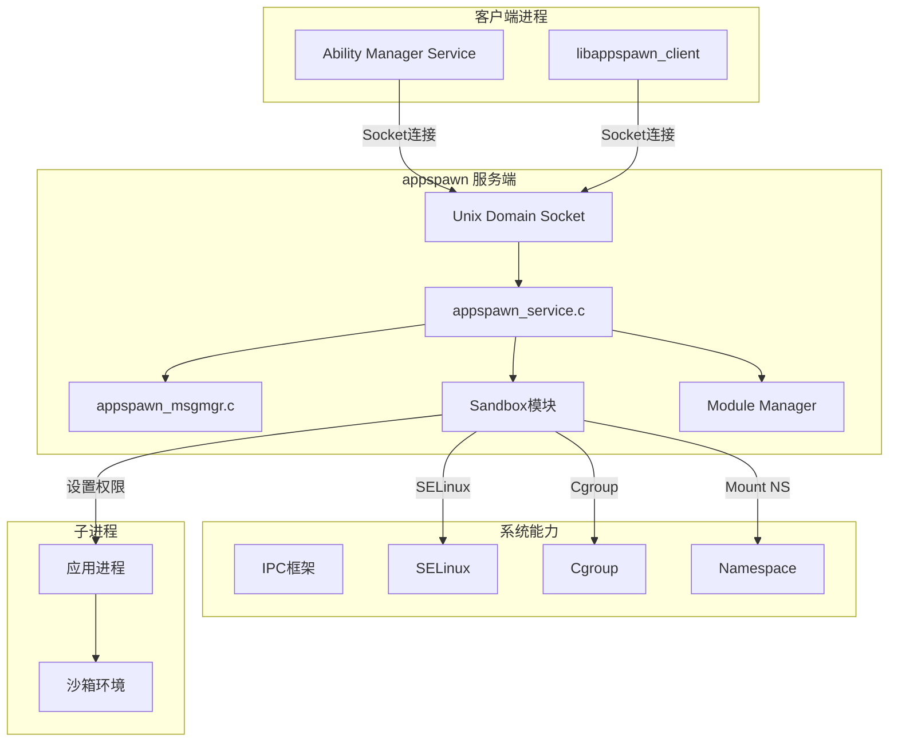
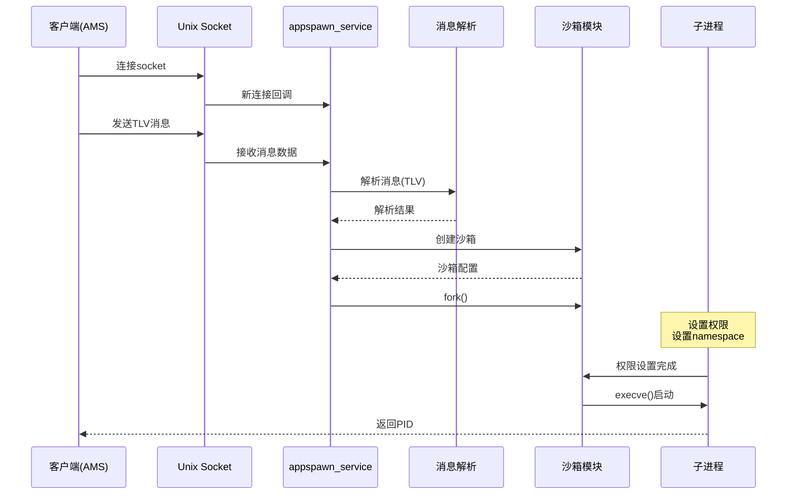

# 架构说明

## 整体架构图



## 数据流



## 目录结构

```
base/startup/appspawn/
├── .gitee/              # Gitee配置
├── common/              # 通用工具代码
│   └── appspawn_*.c    # 通用功能实现
├── figures/             # 架构图等资源
├── interfaces/          # 对外接口
│   └── innerkits/       # Inner API
│       ├── client/      # 客户端库 (libappspawn_client)
│       ├── dec_util/    # DEC工具
│       ├── hnp/         # HNP原生包
│       ├── include/      # 头文件
│       └── permission/  # 权限管理
├── lite/               # 小型系统版本
│   ├── appspawn_*.c    # 轻量级实现
│   └── BUILD.gn
├── modules/            # 标准系统模块
│   ├── ace_adapter/    # ACE框架适配
│   ├── asan/           # Address Sanitizer
│   ├── common/         # 公共模块
│   ├── module_engine/  # 模块引擎
│   ├── modulemgr/      # 模块管理
│   ├── native_adapter/ # Native适配
│   ├── nweb_adapter/   # NWeb适配
│   ├── sandbox/        # 沙箱模块
│   │   ├── modern/     # 现代沙箱
│   │   ├── normal/     # 标准沙箱
│   │   └── sandbox_*.c
│   └── sysevent/       # 系统事件
├── service/            # 服务组件
│   ├── devicedebug/    # 设备调试
│   └── hnp/            # HNP服务
├── standard/           # 标准系统版本
│   ├── appspawn_*.c    # 完整实现
│   └── BUILD.gn
├── test/              # 测试代码 (不计入文档)
├── util/              # 工具类
│   ├── include/        # 工具头文件
│   └── appspawn_*.c   # JSON/Utils实现
├── BUILD.gn           # GN构建入口
├── appspawn.cfg       # 运行时配置
└── *.json             # 沙箱配置
```

## 模块职责

### standard/ - 标准系统主服务
- `appspawn_service.c`: 服务主循环，Socket监听，消息处理
- `appspawn_msgmgr.c`: 消息TLV解析与管理
- `appspawn_appmgr.c`: 应用管理相关
- `appspawn_kickdog.c`: 看门狗监控
- `appspawn_main.c`: 主入口

### modules/sandbox/ - 沙箱隔离
- `appspawn_sandbox.c`: 沙箱创建与管理
- `sandbox_manager.c`: 沙箱配置管理
- `sandbox_mount_*.c`: 挂载点管理
- `appspawn_permission.c`: 权限配置

### modules/module_engine/ - 模块引擎
- `appspawn_hook.c`: 钩子函数管理
- `appspawn_msg.c`: 消息处理

### interfaces/innerkits/client/ - 客户端库
- `appspawn_client.c`: Socket连接管理
- `appspawn_msg.c`: 消息构建与发送

## 线程模型

appspawn 采用 **单线程事件驱动** 架构：

1. **主线程**: 事件循环，处理Socket I/O
2. **Worker线程**: (可选) 任务处理
3. **子进程**: fork后独立运行

### 事件循环
```c
// appspawn_service.c
AppSpawnContent *AppSpawnCreateContent(...)
{
    // 创建事件循环
    // 注册Socket回调
    // 启动监听
}
```

## 消息处理流程

```
Socket接收 → 消息头解析 → TLV解析 → 权限校验 → 沙箱创建 → fork() → 子进程设置 → execve()
```

## 关键时序

### 应用孵化时序

```mermaid
sequenceDiagram
    Note over appspawn: 启动阶段
    appspawn->>Socket: 创建并监听socket
    appspawn->>Config: 加载沙箱配置
    
    Note over 客户端,appspawn: 消息交互
    客户端->>Socket: connect()
    Socket->>appspawn: OnConnection()
    
    客户端->>Socket: send(TLV消息)
    Socket->>appspawn: OnDataAvailable()
    
    appspawn->>MsgMgr: 解析消息
    MsgMgr-->>appspawn: 解析结果
    
    appspawn->>Sandbox: 创建沙箱环境
    Sandbox-->>appspawn: 沙箱路径
    
    appspawn->>OS: fork()
    
    Note over 子进程: 子进程设置
    Sandbox->>子进程: setuid/setgid
    Sandbox->>子进程: setgroups
    Sandbox->>子进程: mount namespace
    Sandbox->>子进程: SELinux label
    
    子进程->>OS: execve(app)
    
    appspawn->>客户端: 响应(PID)
```


## 稳定性标注

### 稳定接口
- `appspawn.h` 主API
- Socket 通信协议 (TLV格式)
- 配置文件结构

### 内部接口
- `appspawn_service.h` 服务接口
- Sandbox 模块接口
- Module Engine 接口

### 不稳定接口
- 调试接口
- 测试接口
- 内部实现细节
