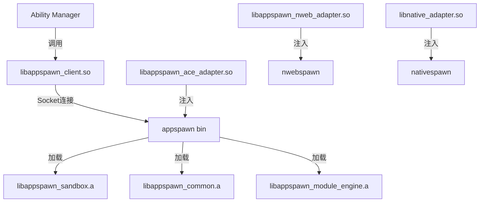

# 构建与编译产物

## GN 构建系统

appspawn 使用 GN (Generate Ninja) 作为构建系统。

### 根构建文件

| 文件 | 说明 |
|------|------|
| `BUILD.gn` | 主构建入口 |
| `appspawn.gni` | GN配置参数 |

### GN配置参数 (appspawn.gni)

```gn
# 功能开关
appspawn_support_nweb = true      # 支持NWeb
appspawn_support_cj = true        # 支持CJ
appspawn_support_native = true    # 支持Native
appspawn_support_hybrid = true    # 支持Hybrid
appspawn_test_cmd = false         # 测试命令
appspawn_sandbox_new = false      # 新沙箱
appspawn_use_encaps = false       # 使用封装

# 安全开关
appspawn_seccomp_privilege = false # Seccomp特权
appspawn_support_prefork = true    # 支持预fork
appspawn_support_code_signature = true  # 支持代码签名
appspawn_allow_internet_permission = false  # 允许互联网权限
appspawn_custom_sandbox = false    # 自定义沙箱
appspawn_support_nosharefs = false # 不支持sharefs
appspawn_allow_dumpable = false    # 允许dumpable
appspawn_change_sched = true      # 更改调度

# 调试开关
enable_appspawn_dump_catcher = true  # Dump捕获
appspawn_unittest_coverage = false   # 单元测试覆盖率
appspawn_support_local_debugger = false  # 支持本地调试器

# 其他
appspawn_report_event = true       # 上报事件
appspawn_hitrace_option = true      # HiTrace选项
appspawn_napi_preload_path = "../appspawn_preload.json"  # N-API预加载路径
```

## 主要 Targets

### 标准系统 Targets

#### appspawn
标准应用孵化器主程序。

```gn
ohos_executable("appspawn") {
    sources = [
        "appspawn_main.c",
        "appspawn_service.c",
        "appspawn_msgmgr.c",
        "appspawn_appmgr.c",
        "appspawn_kickdog.c",
        "pid_ns_init.c",
    ]
    
    deps = [
        ":appspawn_config",
        "//base/startup/appspawn/interfaces/innerkits/client:appspawn_client",
        "//base/startup/appspawn/modules/common:appspawn_common",
        "//base/startup/appspawn/modules/sandbox:appspawn_sandbox",
        "//base/startup/appspawn/modules/module_engine:libappspawn_module_engine",
        "//base/startup/appspawn/util:appspawn_utils",
    ]
    
    include_dirs = [
        "//base/startup/appspawn/modules/module_engine/include",
        "//base/startup/appspawn/util/include",
        "//base/startup/appspawn/interfaces/innerkits/include",
    ]
}
```

#### nativespawn
Native应用孵化器。

```gn
ohos_executable("nativespawn") {
    # 类似appspawn，但针对Native应用
}
```

#### cjappspawn
CJ应用孵化器。

```gn
ohos_executable("cjappspawn") {
    # 类似appspawn，针对C/Java应用
}
```

#### nwebspawn
Web应用孵化器。

```gn
ohos_executable("nwebspawn") {
    # 类似appspawn，针对Web应用
}
```

#### hybridspawn
混合应用孵化器。

```gn
ohos_executable("hybridspawn") {
    # 类似appspawn，针对混合应用
}
```

### 库 Targets

#### libappspawn_client
客户端库，供其他进程连接appspawn。

```gn
ohos_shared_library("libappspawn_client") {
    sources = [
        "appspawn_client.c",
        "appspawn_msg.c",
    ]
    
    deps = [
        ":appspawn_config",
    ]
    
    export_deps = [
        "//base/startup/appspawn/interfaces/innerkits/include:appspawn_public",
    ]
}
```

#### appspawn_sandbox
沙箱模块。

```gn
ohos_static_library("appspawn_sandbox") {
    sources = [
        "sandbox_*.c",
        "appspawn_sandbox.c",
    ]
    
    deps = [
        ":appspawn_config",
    ]
}
```

#### appspawn_common
公共功能模块。

```gn
ohos_static_library("appspawn_common") {
    sources = [
        "appspawn_adapter.cpp",
        "appspawn_begetctl.c",
        "appspawn_cgroup.c",
        "appspawn_common.c",
        "appspawn_env.cpp",
        "appspawn_isolate.c",
        "appspawn_namespace.c",
        "appspawn_silk.c",
        # ... 更多文件
    ]
}
```

#### libappspawn_module_engine
模块引擎库。

```gn
ohos_static_library("libappspawn_module_engine") {
    sources = [ ... ]
}
```

### 测试 Targets

```gn
# 单元测试
ohos_unittest("unittest") { ... }

# 模块测试
ohos_unittest("moduletest") { ... }

# 模糊测试
ohos_fuzztest("fuzztest") { ... }
```

## 编译产物

### 可执行文件

| 产物 | 路径 | 说明 |
|------|------|------|
| appspawn | `/system/bin/appspawn` | 主孵化器 |
| nativespawn | `/system/bin/nativespawn` | Native孵化器 |
| cjappspawn | `/system/bin/cjappspawn` | CJ孵化器 |
| nwebspawn | `/system/bin/nwebspawn` | Web孵化器 |
| hybridspawn | `/system/bin/hybridspawn` | 混合孵化器 |

### 动态库

| 产物 | 路径 | 说明 |
|------|------|------|
| libappspawn_client.so | `/system/lib/` | 客户端库 |
| libappspawn_nweb_adapter.so | `/system/lib/` | Web适配器 |
| libappspawn_ace_adapter.so | `/system/lib/` | ACE适配器 |
| libnative_adapter.so | `/system/lib/` | Native适配器 |

### 静态库

| 产物 | 路径 | 说明 |
|------|------|------|
| libappspawn_sandbox.a | `/system/lib/` | 沙箱模块 |
| libappspawn_common.a | `/system/lib/` | 公共模块 |
| libappspawn_module_engine.a | `/system/lib/` | 模块引擎 |
| libappspawn_stub_empty.a | `/system/lib/` | 空桩模块 |

### 配置文件

| 产物 | 路径 | 说明 |
|------|------|------|
| appspawn.cfg | `/system/etc/init/` | 主配置 |
| nativespawn.cfg | `/system/etc/init/` | Native配置 |
| cjappspawn.cfg | `/system/etc/init/` | CJ配置 |
| nwebspawn.cfg | `/system/etc/init/` | Web配置 |
| hybridspawn.cfg | `/system/etc/init/` | 混合配置 |

### 沙箱配置

| 产物 | 路径 | 说明 |
|------|------|------|
| appdata-sandbox.json | `/system/etc/` | 标准沙箱配置 |
| appdata-sandbox-app.json | `/system/etc/` | 应用沙箱 |
| appdata-sandbox-render.json | `/system/etc/` | 渲染沙箱 |
| appdata-sandbox-gpu.json | `/system/etc/` | GPU沙箱 |
| appdata-sandbox-isolated.json | `/system/etc/` | 隔离沙箱 |
| appdata-sandbox-asan.json | `/system/etc/` | ASAN沙箱 |

## 安装路径

### 系统分区

```
/system/
├── bin/
│   ├── appspawn
│   ├── nativespawn
│   ├── cjappspawn
│   ├── nwebspawn
│   └── hybridspawn
├── lib/
│   ├── libappspawn_client.so
│   ├── libappspawn_nweb_adapter.so
│   ├── libappspawn_ace_adapter.so
│   ├── libnative_adapter.so
│   ├── libappspawn_sandbox.a
│   ├── libappspawn_common.a
│   ├── libappspawn_module_engine.a
│   └── libappspawn_stub_empty.a
└── etc/
    ├── init/
    │   ├── appspawn.cfg
    │   ├── nativespawn.cfg
    │   ├── cjappspawn.cfg
    │   ├── nwebspawn.cfg
    │   └── hybridspawn.cfg
    └── appdata-sandbox*.json
```

### 数据分区

```
/data/
├── service/
│   └── el1/
│       ├── startup/
│       │   ├── appspawn/
│       │   ├── nativespawn/
│       │   ├── hybridspawn/
│       │   └── nwebspawn/
│       └── hnp/
└── startup/
    └── log/
        └── appspawn/
```

## 运行时加载关系



## 依赖关系

### 外部依赖

```json
// bundle.json 中的 components
"ability_base",
"c_utils",
"ipc",
"selinux_adapter",
"selinux",
"hilog",
"init",
"ability_runtime",
"access_token",
"eventhandler",
"config_policy",
"resource_management",
"hitrace",
"common_event_service",
"hisysevent",
"security_component_manager",
"napi",
"netmanager_base",
"ace_engine",
"os_account",
"hilog_lite",
"samgr_lite",
"kv_store",
"ability_lite",
"ace_engine_lite",
"surface_lite",
"ui_lite",
"code_signature",
"bounds_checking_function",
"zlib",
"cJSON",
"json",
"faultloggerd",
"dlp_permission_service",
"ffrt",
"webview"
```

### 构建变体

| 变体 | 特性 |
|------|------|
| small | 小型系统 (lite) |
| standard | 标准系统 (standard) |
| asan | Address Sanitizer版本 |
| debug | 调试版本 |
| release | 发布版本 |

## 构建命令

### 全量编译

```bash
hb build appspawn
```

### 单模块编译

```bash
hb build //base/startup/appspawn:appspawn
```

### 带测试编译

```bash
hb build appspawn --test
```

### ASAN版本

```bash
hb build appspawn -T enable_appspawn_asan=true
```

## 配置验证

### 检查Socket配置

```json
// appspawn.cfg
{
    "services": [{
        "name": "appspawn",
        "socket": [{
            "name": "AppSpawn",
            "family": "AF_LOCAL",
            "type": "SOCK_STREAM",
            "uid": "root",
            "gid": "appspawn"
        }]
    }]
}
```

### 检查沙箱配置

```json
// appdata-sandbox.json
{
    "sandbox": {
        "uid": "..."
    }
}
```
