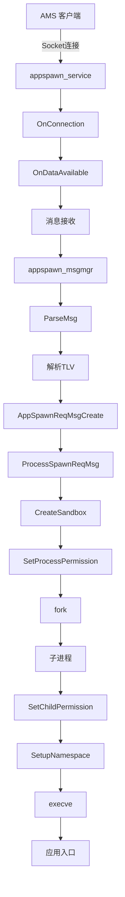
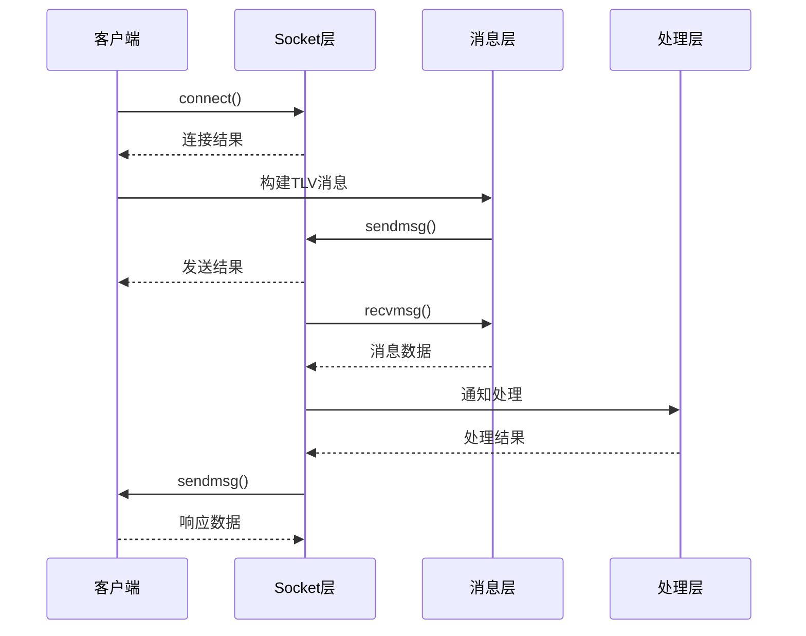
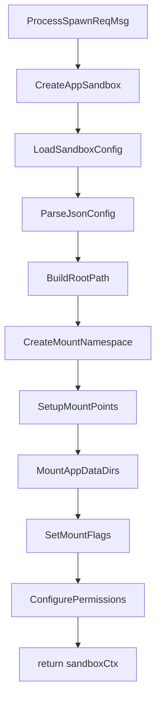
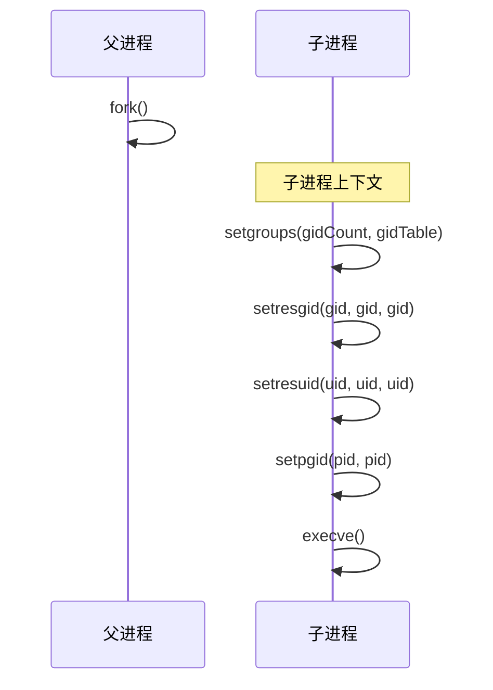
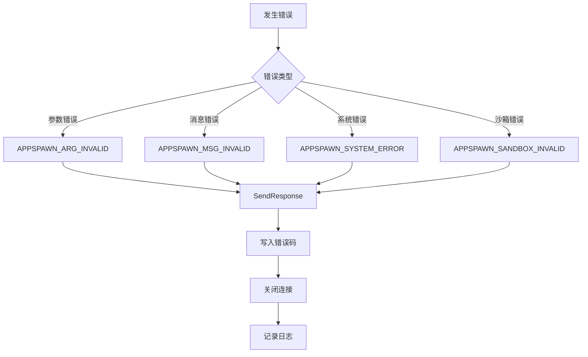

# 关键调用链

## 概述

本文档展示 appspawn 关键功能的调用链图示，包括消息处理、进程孵化、沙箱创建等核心流程。

## 目录

- [应用孵化调用链](#应用孵化调用链)
- [Socket通信调用链](#socket通信调用链)
- [消息解析调用链](#消息解析调用链)
- [沙箱创建调用链](#沙箱创建调用链)
- [权限设置调用链](#权限设置调用链)

## 应用孵化调用链

### 整体流程



### 详细调用链

#### 1. 客户端连接

```
appspawn_client.c
├── AppSpawnClientInit()
│   ├── CreateClientSocket()
│   │   ├── socket(AF_UNIX, SOCK_STREAM, 0)
│   │   ├── setsockopt(TCP_NODELAY)
│   │   ├── setsockopt(SO_PASSCRED)
│   │   ├── setsockopt(SO_SNDTIMEO)
│   │   ├── setsockopt(SO_RCVTIMEO)
│   │   └── connect()
│   └── return socketId
```

#### 2. 消息发送

```
appspawn_client.c
├── AppSpawnReqMsgCreate()
│   └── AllocReqMsg()
├── AppSpawnReqMsgSetBundleInfo()
├── AppSpawnReqMsgSetAppDacInfo()
├── AppSpawnReqMsgAddPermission()
├── AppSpawnReqMsgAddExtInfo()
├── AppSpawnClientSendMsg()
│   ├── HandleMsgSend()
│   │   ├── WriteMessage()
│   │   │   └── sendmsg(socketFd, ...)
│   │   └── return sendResult
│   └── ReadMessage()
│       ├── read(socketFd, ...)
│       └── return response
└── AppSpawnReqMsgFree()
```

#### 3. 服务端消息处理

```
appspawn_service.c
├── StartSpawnService()
│   ├── AppSpawnCreateContent()
│   │   ├── CreateAppSpawnServer()
│   │   │   ├── GetControlSocket()
│   │   │   └── LE_CreateServer()
│   │   └── LE_CreateLoop()
│   └── LE_RunLoop()
├── OnConnection()
├── OnDataAvailable()
├── ProcessRecvMsg()
│   └── switch(msgType)
│       ├── MSG_APP_SPAWN
│       │   └── ProcessSpawnReqMsg()
│       ├── MSG_SPAWN_NATIVE_PROCESS
│       │   └── ProcessSpawnNativeMsg()
│       └── ...
```

## Socket通信调用链

### 消息收发流程



### Socket 选项配置

```c
// appspawn_client.c
int CreateClientSocket(...)
{
    int socketFd = socket(AF_UNIX, SOCK_STREAM, 0);
    
    // TCP延迟禁用
    setsockopt(socketFd, IPPROTO_TCP, TCP_NODELAY, ...);
    
    // 凭据传递
    setsockopt(socketFd, SOL_SOCKET, SO_PASSCRED, ...);
    
    // 发送超时
    setsockopt(socketFd, SOL_SOCKET, SO_SNDTIMEO, ...);
    
    // 接收超时
    setsockopt(socketFd, SOL_SOCKET, SO_RCVTIMEO, ...);
    
    return socketFd;
}
```

## 消息解析调用链

### TLV 解析流程

```
appspawn_msgmgr.c
├── ParseMsg()
│   ├── CheckMsgHeader()
│   │   ├── CHECK_MAGIC(0xEF201234)
│   │   ├── CHECK_MSGTYPE()
│   │   └── CHECK_MSGLEN()
│   ├── AllocMsgBuffer()
│   └── return msgBuffer
│
├── ParseMsgTLV()
│   ├── while(tlvCount > 0)
│   │   ├── ReadTlvHeader()
│   │   │   ├── ReadTlvLen()
│   │   │   └── ReadTlvType()
│   │   ├── switch(tlvType)
│   │   │   ├── TLV_BUNDLE_INFO
│   │   │   │   └── ParseBundleInfo()
│   │   │   ├── TLV_DAC_INFO
│   │   │   │   └── ParseDacInfo()
│   │   │   ├── TLV_MSG_FLAGS
│   │   │   │   └── ParseMsgFlags()
│   │   │   ├── TLV_PERMISSION
│   │   │   │   └── ParsePermission()
│   │   │   ├── TLV_ACCESS_TOKEN_INFO
│   │   │   │   └── ParseAccessToken()
│   │   │   └── ...
│   │   └── tlvCount--
│   └── return parseResult
```

###处理 TLV 类型

| TLV类型 | 解析函数 | 说明 |
|--------|---------|------|
| TLV_BUNDLE_INFO | ParseBundleInfo | Bundle名称和索引 |
| TLV_DAC_INFO | ParseDacInfo | UID/GID信息 |
| TLV_MSG_FLAGS | ParseMsgFlags | 应用标志 |
| TLV_DOMAIN_INFO | ParseDomainInfo | APL信息 |
| TLV_OWNER_INFO | ParseOwnerInfo | 所有者ID |
| TLV_ACCESS_TOKEN_INFO | ParseAccessToken | 访问令牌 |
| TLV_PERMISSION | ParsePermission | 权限列表 |
| TLV_INTERNET_INFO | ParseInternetInfo | 互联网权限 |

## 沙箱创建调用链

### 沙箱初始化流程



### 详细调用链

```
appspawn_sandbox.c (modern)
├── CreateAppSandbox()
│   ├── BuildRootPath()
│   │   └── sprintf_s(..., "%s/%d", sandbox->rootPath, uid)
│   │
│   ├── CreateAppSandboxNamespace()
│   │   ├── unshare(CLONE_NEWNS)
│   │   ├── MountRootfs()
│   │   │   └── mount("/", "/", "ext4", MS_REC | MS_SLAVE, NULL)
│   │   │
│   │   ├── MountPointLoop()
│   │   │   ├── for each mount point
│   │   │   │   ├── MountSandboxNode()
│   │   │   │   │   ├── access(source, F_OK)
│   │   │   │   │   ├── mount(source, target, MS_BIND)
│   │   │   │   │   └── mount(source, target, MS_REMOUNT | MS_RDONLY)
│   │   │   │   └── return mountResult
│   │   │   └── return loopResult
│   │   │
│   │   ├── SetMountFlags()
│   │   │   └── mount(..., MS_NOSUID | MS_NODEV | MS_NOEXEC)
│   │   │
│   │   └── SetupSharedMounts()
│   │       └── SetupSandboxSharedMounts()
│   │
│   ├── SetSandboxInfo()
│   │   ├── SetSandboxUid()
│   │   ├── SetSandboxGid()
│   │   └── SetSelinuxLabel()
│   │
│   └── return sandboxCtx
```

### 挂载点配置

```c
// 挂载点定义 (appdata-sandbox.json)
{
    "mountPoints": [
        {
            "source": "/data/storage/el1",
            "target": "/mnt/sandbox/0/com.example.app/data/storage/el1",
            "type": "bind",
            "flags": ["nosuid", "nodev", "noexec"]
        },
        {
            "source": "/data/storage/el2", 
            "target": "/mnt/sandbox/0/com.example.app/data/storage/el2",
            "type": "bind",
            "flags": ["nosuid", "nodev", "noexec"]
        }
    ]
}
```

## 权限设置调用链

### DAC 权限设置



### 权限设置代码

```
appspawn_common.c
├── SetProcessPermission()
│   ├── APPSPAWN_CHECK(uid >= MIN_VALID_APP_UID)
│   │
│   ├── setgroups()
│   │   ├── parameters: dacInfo->gidCount, dacInfo->gidTable
│   │   └── return errno on failure
│   │
│   ├── setresgid()
│   │   ├── parameters: dacInfo->gid, dacInfo->gid, dacInfo->gid
│   │   └── return errno on failure
│   │
│   └── setresuid()
│       ├── parameters: dacInfo->uid, dacInfo->uid, dacInfo->uid
│       └── return errno on failure
```

### Capability 设置

```
lite/appspawn_process.c
├── SetProcessCapability()
│   ├── ParseCapabilityJson()
│   │   └── cJSON_Parse()
│   │
│   ├── ParseCapabilityList()
│   │   └── cJSON_GetObjectItem()
│   │
│   └── capset()
│       ├── parameters: header, data
│       └── return 0 on success
```

### SELinux 设置

```
appspawn_common.c
├── SetSelinuxContext()
│   ├── LoadSeLinuxConfig()
│   │   └── security_load_policy()
│   │
│   ├── GetSelinuxLabel()
│   │   └── security_getencon()
│   │
│   └── setcon()
│       └── parameters: selinuxLabel
│       └── return errno on failure
```

## 错误处理调用链

### 错误响应流程



### 错误码处理

```
appspawn_service.c
├── SendResponse()
│   ├── switch(resultCode)
│   │   ├── case APPSPAWN_ARG_INVALID
│   │   │   └── APPSPAWN_LOGE("Invalid argument")
│   │   ├── case APPSPAWN_MSG_INVALID
│   │   │   └── APPSPAWN_LOGE("Invalid message")
│   │   ├── case APPSPAWN_SANDBOX_INVALID
│   │   │   └── APPSPAWN_LOGE("Sandbox error")
│   │   ├── case APPSPAWN_CHILD_CRASH
│   │   │   └── APPSPAWN_LOGE("Child process crashed")
│   │   ├── case APPSPAWN_SPAWN_TIMEOUT
│   │   │   └── APPSPAWN_LOGE("Spawn timeout")
│   │   └── default
│   │       └── APPSPAWN_LOGW("Unknown error")
│   │
│   ├── WriteResponse()
│   │   ├── SerializeResponse()
│   │   └── sendmsg(socketFd, ...)
│   │
│   └── CloseConnection()
```

## 信号处理调用链

### SIGCHLD 处理

```
appspawn_service.c
├── RegisterSignalHandler()
│   └── signal(SIGCHLD, SigchldHandler)
│
└── SigchldHandler()
    ├── waitpid(pid, &status, WNOHANG)
    ├── switch(status)
    │   ├── case WIFEXITED
    │   │   └── HandleChildExit()
    │   ├── case WIFSIGNALED
    │   │   └── HandleChildSignal()
    │   └── case WIFSTOPPED
    │       └── HandleChildStop()
    └── NotifyAppMgr()
```

### 看门狗监控

```
appspawn_kickdog.c
├── InitWatchdog()
│   ├── CreateTimer()
│   └── StartTimer()
│
├── KickDog()
│   └── RefreshTimer()
│
└── WatchdogTimeout()
    ├── KillTimeoutProcess()
    ├── SendTimeoutEvent()
    └── ResetDog()
```

## 模块间依赖关系

```
                    ┌─────────────────┐
                    │   appspawn      │
                    │   (主程序)       │
                    └────────┬────────┘
                             │
              ┌──────────────┼──────────────┐
              │              │              │
              ▼              ▼              ▼
    ┌──────────────┐ ┌──────────────┐ ┌──────────────┐
    │  msgmgr      │ │  sandbox     │ │  common     │
    │ (消息管理)    │ │ (沙箱隔离)    │ │ (公共功能)   │
    └──────┬───────┘ └──────┬───────┘ └──────┬───────┘
           │                │                │
           │      ┌─────────┴─────────┐      │
           │      │                   │      │
           ▼      ▼                   ▼      ▼
    ┌─────────────────────────────────────────────┐
    │              module_engine                    │
    │         (模块引擎/消息钩子)                    │
    └─────────────────────┬───────────────────────┘
                          │
           ┌──────────────┼──────────────┐
           │              │              │
           ▼              ▼              ▼
    ┌──────────────┐ ┌──────────────┐ ┌──────────────┐
    │ ace_adapter │ │nweb_adapter │ │native_adapter│
    └──────────────┘ └──────────────┘ └──────────────┘
```

## 外部依赖调用

### IPC 调用

```
appspawn_service.c
├── OpenIPCConnection()
│   ├── GetIpcProxy()
│   └── ConnectToServer()
│
├── SendIpcMsg()
│   ├── IPC_Transaction()
│   └── WaitForResponse()
│
└── CloseIPC()
    └── ReleaseIpcProxy()
```

### 系统能力调用

```
appspawn_*.c (多个模块)
├── SetProcessName()
│   └── prctl(PR_SET_NAME, ...)
│
├── GetProcessInfo()
│   ├── getpid()
│   ├── getuid()
│   └── getgid()
│
├── CreateNamespace()
│   ├── unshare()
│   └── setns()
│
├── MountFilesystem()
│   ├── mount()
│   ├── umount()
│   └── umount2()
│
└── SetResourceLimit()
    ├── setrlimit()
    └── prctl()
```
