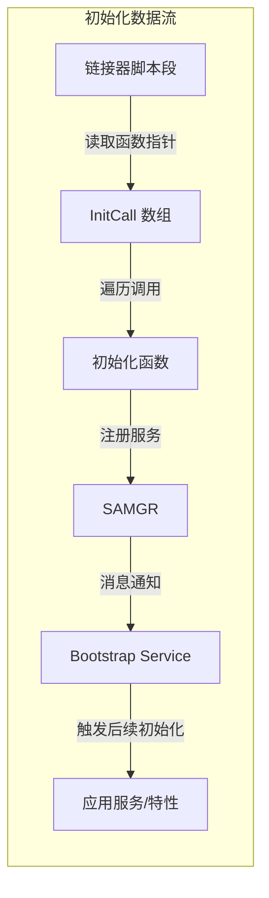
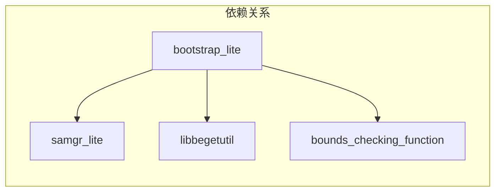

# Bootstrap_Lite - 架构设计

## 架构概述

Bootstrap_Lite 采用**分层启动 + SAMGR 服务协调**的架构模式，在系统启动早期执行，负责组织和管理各系统组件的初始化顺序。

## 组件关系图

```mermaid
graph TD
    subgraph "系统启动入口"
        A["OHOS_SystemInit()<br/>system_init.c:19"] --> B[MODULE_INIT 阶段]
        B --> C[SYS_INIT 阶段]
        C --> D[MODULE_INIT run]
        D --> E[SAMGR_Bootstrap()]
        E --> F[LiteParamService()]
    end

    subgraph "MODULE_INIT 阶段"
        B1["MODULE_INIT(bsp)<br/>BSP 初始化"] --> B2["MODULE_INIT(device)<br/>设备初始化"]
        B2 --> B3["MODULE_INIT(core)<br/>核心初始化"]
    end

    subgraph "SYS_INIT 阶段"
        C1["SYS_INIT(service)<br/>系统服务初始化"] --> C2["SYS_INIT(feature)<br/>系统特性初始化"]
    end

    subgraph "Bootstrap Service"
        G["SAMGR 注册<br/>bootstrap_service.c:38"] --> H["MessageHandle<br/>消息处理"]
        H --> I["INIT_APP_CALL<br/>应用级初始化"]
    end

    B3 --> C
    C2 --> D
    F --> G
```

## 数据流



## 核心组件

### 1. System Init (`system_init.c`)

**职责**: 系统初始化入口点

**证据**: `path:services/source/system_init.c:19-29`

```c
void OHOS_SystemInit(void)
{
    MODULE_INIT(bsp);
    MODULE_INIT(device);
    MODULE_INIT(core);
    SYS_INIT(service);
    SYS_INIT(feature);
    MODULE_INIT(run);
    SAMGR_Bootstrap();
    LiteParamService();
}
```

### 2. Bootstrap Service (`bootstrap_service.c`)

**职责**: SAMGR 下的系统服务，协调应用级服务初始化

**证据**: `path:services/source/bootstrap_service.c:20-24`

```c
typedef struct Bootstrap {
    INHERIT_SERVICE;
    Identity identity;
    uint8 flag;
} Bootstrap;
```

**消息处理**:
| 消息ID | 处理逻辑 | 证据 |
|--------|----------|------|
| `BOOT_SYS_COMPLETED` | 调用 INIT_APP_CALL(service/feature) | bootstrap_service.c:59-66 |
| `BOOT_APP_COMPLETED` | 发送响应 | bootstrap_service.c:68-70 |
| `BOOT_REG_SERVICE` | 发送响应 | bootstrap_service.c:72-74 |

### 3. Core Main (`core_main.h`)

**职责**: 定义系统级初始化宏和链接器段访问宏

**证据**: `path:services/source/core_main.h:23-77`

```c
// 链接器段名称定义
#define SYS_NAME(name, step) ".zinitcall.sys." #name #step ".init"
#define MODULE_NAME(name, step) ".zinitcall." #name #step ".init"

// 初始化调用宏
#define SYS_INIT(name)       \
    do {                     \
        SYS_CALL(name, 0);   \
    } while (0)

#define MODULE_INIT(name)     \
    do {                      \
        MODULE_CALL(name, 0); \
    } while (0)
```

### 4. Bootstrap Service Header (`bootstrap_service.h`)

**职责**: 定义应用级初始化宏

**证据**: `path:services/source/bootstrap_service.h:23-42`

```c
#define APP_NAME(name, step) ".zinitcall.app." #name #step ".init"
#define MODULE_NAME(name, step) ".zinitcall." #name #step ".init"

#define APP_CALL(name, step)                                      \
    do {                                                          \
        InitCall *initcall = (APP_BEGIN(name, step));             \
        InitCall *initend = (APP_END(name, step));                \
        for (; initcall < initend; initcall++) {                 \
            (*initcall)();                                        \
        }                                                         \
    } while (0)

#define INIT_APP_CALL(name)     \
    do {                         \
        APP_CALL(name, 0);      \
    } while (0)
```

## 线程模型

### Bootstrap Service 线程配置

**证据**: `path:services/source/bootstrap_service.c:82-88`

```c
static TaskConfig GetTaskConfig(Service *service)
{
    (void)service;
    // The bootstrap service uses a stack of 2 KB (0x800) in size 
    // and a queue of 20 elements.
    TaskConfig config = {LEVEL_HIGH, PRI_NORMAL, 0x800, 20, SHARED_TASK};
    return config;
}
```

| 配置项 | 值 | 说明 |
|--------|-----|------|
| 优先级级别 | LEVEL_HIGH | 高优先级 |
| 任务优先级 | PRI_NORMAL | 普通优先级 |
| 栈大小 | 0x800 (2KB) |  |
| 消息队列深度 | 20 |  |
| 任务类型 | SHARED_TASK | 共享任务模式 |

## 依赖方向



| 组件 | 类型 | 说明 |
|------|------|------|
| samgr_lite | 强依赖 | Service Manager，提供服务注册框架 |
| libbegetutil | 强依赖 | 初始化工具库 |
| bounds_checking_function | 可选依赖 | 边界检查（仅 liteos_a/linux） |

## 稳定性标注

### 稳定接口
| 接口 | 稳定性 | 证据 |
|------|--------|------|
| `OHOS_SystemInit()` | 稳定 | 系统入口点，文档化 |
| `SYS_INIT()` / `MODULE_INIT()` | 稳定 | 公开宏，NDK 头文件 |
| Bootstrap Service | 稳定 | SAMGR 标准服务模式 |

### 内部实现
| 组件 | 稳定性 | 说明 |
|------|--------|------|
| InitCall 函数指针类型 | 内部 | 未在头文件导出 |
| 链接器段名称格式 | 内部 | 编译期约定 |

## 相关文档

- **[初始化机制详解](03_Initialization.md)** - 启动流程深入分析
- **[构建配置](02_Build.md)** - GN 构建说明
- **[安全分析](04_Security.md)** - 安全风险评估
