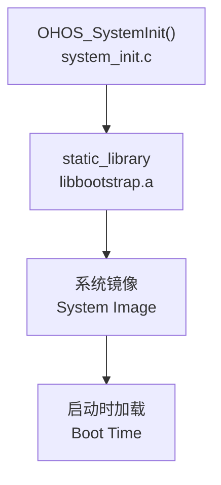

# Bootstrap_Lite - 构建配置

## 构建系统概述

Bootstrap_Lite 使用 OpenHarmony 的 **GN (Generate Ninja)** 构建系统，配置分为两个层级：
1. 组件级配置 (`services/BUILD.gn`)
2. 源码级配置 (`services/source/BUILD.gn`)

## GN Targets 清单

### 1. 组件级 Target: `bootstrap`

**证据**: `path:services/BUILD.gn:16-18`

```gn
lite_component("bootstrap") {
  features = [ "//base/startup/bootstrap_lite/services/source:bootstrap" ]
}
```

| 属性 | 值 |
|------|-----|
| Target 类型 | lite_component |
| 依赖 features | bootstrap source library |

### 2. NDK Target: `bootstrap_lite_ndk`

**证据**: `path:services/BUILD.gn:20-27`

```gn
ndk_lib("bootstrap_lite_ndk") {
  deps = [ "//base/startup/bootstrap_lite/services/source:bootstrap" ]
  head_files = [
    "//commonlibrary/utils_lite/include/ohos_init.h",
    "//commonlibrary/utils_lite/include/ohos_errno.h",
    "//commonlibrary/utils_lite/include/ohos_types.h",
  ]
}
```

| 属性 | 值 |
|------|-----|
| Target 类型 | ndk_lib |
| 依赖 | bootstrap static library |

**NDK 导出头文件**:
| 头文件 | 路径 | 说明 |
|--------|------|------|
| ohos_init.h | `//commonlibrary/utils_lite/include/` | 系统初始化宏定义 |
| ohos_errno.h | `//commonlibrary/utils_lite/include/` | 错误码定义 |
| ohos_types.h | `//commonlibrary/utils_lite/include/` | 类型定义 |

### 3. 源码级 Target: `bootstrap`

**证据**: `path:services/source/BUILD.gn:13-32`

```gn
static_library("bootstrap") {
  sources = [
    "bootstrap_service.c",
    "system_init.c",
  ]
  include_dirs = [
    "../source",
    "//foundation/systemabilitymgr/samgr_lite/interfaces/kits/samgr",
    "//commonlibrary/utils_lite/include",
    "//base/startup/init/interfaces/innerkits",
  ]
  if (ohos_kernel_type == "liteos_a" || ohos_kernel_type == "linux") {
    include_dirs += [ "//third_party/bounds_checking_function/include" ]
  }
  deps = [ "//base/startup/init/interfaces/innerkits:libbegetutil" ]
  cflags = [ "-Wall" ]
}
```

| 属性 | 值 |
|------|-----|
| Target 类型 | static_library |
| 源文件 | bootstrap_service.c, system_init.c |

**Include 目录**:
| 目录 | 用途 |
|------|------|
| `../source` | 本地头文件 |
| `samgr_lite/interfaces/kits/samgr` | SAMGR 接口 |
| `utils_lite/include` | 工具库头文件 |
| `init/interfaces/innerkits` | 初始化接口 |
| `bounds_checking_function/include` | 边界检查（条件） |

**条件编译**:
| 条件 | 附加配置 |
|------|----------|
| `ohos_kernel_type == "liteos_a" \|\| ohos_kernel_type == "linux"` | bounds_checking_function |

**依赖**:
| 依赖 | 类型 | 说明 |
|------|------|------|
| `//base/startup/init/interfaces/innerkits:libbegetutil` | libs | 初始化工具库 |

### 4. 通知文件生成: `bootstrap_notice_file`

**证据**: `path:services/BUILD.gn:29-32`

```gn
generate_notice_file("bootstrap_notice_file") {
  module_name = "bootstrap"
  module_source_dir_list = [ "//third_party/bounds_checking_function" ]
}
```

| 属性 | 值 |
|------|-----|
| Target 类型 | generate_notice_file |
| 模块名 | bootstrap |

## 源文件清单

| 文件名 | 路径 | 作用 |
|--------|------|------|
| bootstrap_service.c | `services/source/` | Bootstrap 服务实现 |
| system_init.c | `services/source/` | 系统初始化入口 |
| bootstrap_service.h | `services/source/` | Bootstrap 服务头文件 |
| core_main.h | `services/source/` | 核心初始化宏定义 |

## 组件配置 (bundle.json)

**证据**: `path:bundle.json`

```json
{
    "name": "@ohos/bootstrap_lite",
    "version": "4.0.2",
    "component": {
        "name": "bootstrap_lite",
        "subsystem": "startup",
        "adapted_system_type": ["mini", "small"],
        "rom": "14KB",
        "ram": "~128KB",
        "build": {
            "sub_component": [
                "//base/startup/bootstrap_lite/services/source:bootstrap"
            ]
        }
    }
}
```

| 配置项 | 值 | 说明 |
|--------|-----|------|
| 包名 | @ohos/bootstrap_lite | NPM 风格包名 |
| 版本 | 4.0.2 | 组件版本 |
| 子系统 | startup | 所属子系统 |
| 适用系统 | mini, small | Mini/Small 系统 |
| ROM 占用 | 14KB | 只读存储占用 |
| RAM 占用 | ~128KB | 运行时内存占用 |

## 编译产物

### 静态库产物
- **产物路径**: `out/.../libs/libbootstrap.a`
- **产物类型**: 静态库 (.a)
- **来源 Target**: `//base/startup/bootstrap_lite/services/source:bootstrap`

### 组件产物
- **产物形式**: lite_component
- **集成方式**: 链接到系统镜像

## 运行时加载关系



1. 静态库 `libbootstrap.a` 在链接阶段集成到系统镜像
2. 系统启动时，`OHOS_SystemInit()` 被调用
3. 初始化宏遍历链接器脚本段中的 InitCall 数组
4. 按顺序调用各阶段初始化函数

## 构建命令示例

```bash
# 完整构建
hb build -f

# 仅构建 bootstrap_lite
hb build //base/startup/bootstrap_lite/services:bootstrap

# 查看构建产物
ls out/.../libs/libbootstrap.a
```

## 相关文档

- **[项目概览](00_Overview.md)** - 运行环境与依赖
- **[架构设计](01_Architecture.md)** - 组件关系
- **[初始化机制](03_Initialization.md)** - 启动流程
