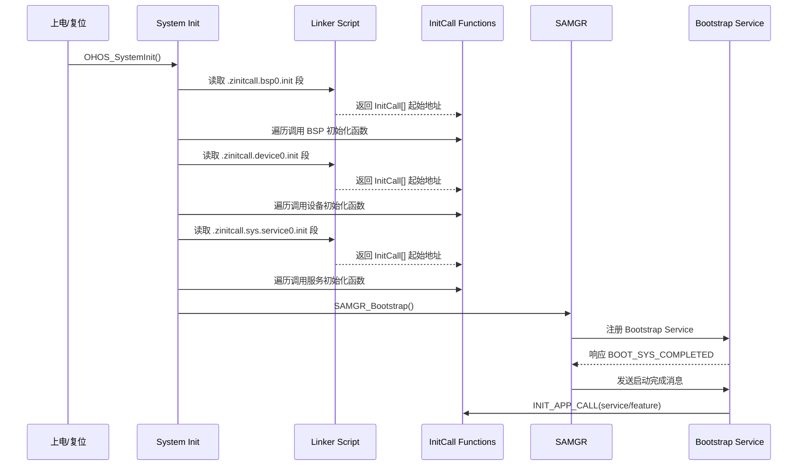

# Bootstrap_Lite - 初始化机制详解

## 初始化概述

Bootstrap_Lite 使用**链接器脚本段 + 函数指针数组遍历**的机制实现初始化函数的组织与调用。这种方式允许：
1. 将不同阶段的初始化函数编译到独立的链接器段
2. 在运行时通过指针遍历按顺序调用
3. 无需修改代码即可添加新的初始化函数

## 初始化阶段

### 完整初始化序列

**证据**: `path:services/source/system_init.c:19-29`

```c
void OHOS_SystemInit(void)
{
    MODULE_INIT(bsp);      // BSP 初始化
    MODULE_INIT(device);   // 设备初始化
    MODULE_INIT(core);     // 核心初始化
    SYS_INIT(service);     // 系统服务初始化
    SYS_INIT(feature);    // 系统特性初始化
    MODULE_INIT(run);      // 运行时初始化
    SAMGR_Bootstrap();     // 启动 SAMGR
    LiteParamService();    // 轻量参数服务
}
```

| 阶段 | 优先级 | 宏调用 | 说明 |
|------|--------|--------|------|
| 1 | 最高 | MODULE_INIT(bsp) | BSP 板级支持包初始化 |
| 2 | 高 | MODULE_INIT(device) | 设备驱动初始化 |
| 3 | 高 | MODULE_INIT(core) | 核心功能初始化 |
| 4 | 中 | SYS_INIT(service) | 系统服务初始化 |
| 5 | 中 | SYS_INIT(feature) | 系统特性初始化 |
| 6 | 低 | MODULE_INIT(run) | 运行时初始化 |
| 7 | - | SAMGR_Bootstrap() | 启动 SAMGR 服务管理框架 |
| 8 | - | LiteParamService() | 启动轻量参数服务 |

## 链接器脚本段机制

### 段命名规则

**系统级段** (`core_main.h`):

**证据**: `path:services/source/core_main.h:23`

```c
#define SYS_NAME(name, step) ".zinitcall.sys." #name #step ".init"
```

| 段类型 | 段名称格式 | 示例 |
|--------|-----------|------|
| 系统服务 | `.zinitcall.sys.service{0-4}.init` | `.zinitcall.sys.service0.init` |
| 系统特性 | `.zinitcall.sys.feature{0-4}.init` | `.zinitcall.sys.feature0.init` |

**模块级段** (`core_main.h` + `bootstrap_service.h`):

**证据**: `path:services/source/core_main.h:24` 和 `path:services/source/bootstrap_service.h:24`

```c
#define MODULE_NAME(name, step) ".zinitcall." #name #step ".init"
```

| 段类型 | 段名称格式 | 示例 |
|--------|-----------|------|
| 模块初始化 | `.zinitcall.{bsp\|device\|core\|run}{0-4}.init` | `.zinitcall.bsp0.init` |
| 应用服务 | `.zinitcall.app.service{0-4}.init` | `.zinitcall.app.service0.init` |
| 应用特性 | `.zinitcall.app.feature{0-4}.init` | `.zinitcall.app.feature0.init` |
| 测试模块 | `.zinitcall.test{0-4}.init` | `.zinitcall.test0.init` |

### 段访问宏 (GCC/Clang)

**证据**: `path:services/source/core_main.h:44-77`

```c
#if (defined(__GNUC__) || defined(__clang__))

// 系统级段访问
#define SYS_BEGIN(name, step)                                 \
    ({  extern InitCall __zinitcall_sys_##name##_start;       \
        InitCall *initCall = &__zinitcall_sys_##name##_start; \
        (initCall);                                           \
    })

#define SYS_END(name, step)                                 \
    ({  extern InitCall __zinitcall_sys_##name##_end;       \
        InitCall *initCall = &__zinitcall_sys_##name##_end; \
        (initCall);                                         \
    })

// 模块级段访问
#define MODULE_BEGIN(name, step)                          \
    ({  extern InitCall __zinitcall_##name##_start;       \
        InitCall *initCall = &__zinitcall_##name##_start; \
        (initCall);                                       \
    })

#define MODULE_END(name, step)                          \
    ({  extern InitCall __zinitcall_##name##_end;       \
        InitCall *initCall = &__zinitcall_##name##_end; \
        (initCall);                                     \
    })

// 初始化调用宏
#define SYS_INIT(name)     \
    do {                   \
        SYS_CALL(name, 0); \
    } while (0)

#define MODULE_INIT(name)     \
    do {                      \
        MODULE_CALL(name, 0); \
    } while (0)

#endif
```

### 初始化调用实现

**证据**: `path:services/source/core_main.h:26-33`

```c
#define SYS_CALL(name, step)                                      \
    do {                                                          \
        InitCall *initcall = (InitCall *)(SYS_BEGIN(name, step)); \
        InitCall *initend = (InitCall *)(SYS_END(name, step));    \
        for (; initcall < initend; initcall++) {                  \
            (*initcall)();                                        \
        }                                                         \
    } while (0)
```

**调用流程**:
1. 通过 `SYS_BEGIN` 获取段起始地址（`__zinitcall_sys_*_start` 符号）
2. 通过 `SYS_END` 获取段结束地址（`__zinitcall_sys_*_end` 符号）
3. 遍历函数指针数组，依次调用每个 `InitCall`

## ICCARM 编译器支持

**证据**: `path:services/source/core_main.h:79-116`

对于 IAR ICCARM 编译器，使用不同的段访问方式：

```c
#elif (defined(__ICCARM__))

#define SYS_BEGIN(name, step) __section_begin(SYS_NAME(name, step))
#define SYS_END(name, step) __section_end(SYS_NAME(name, step))

#pragma section = SYS_NAME(service, 0)
#pragma section = SYS_NAME(service, 1)
// ... 更多段定义

#define SYS_INIT(name)     \
    do {                   \
        SYS_CALL(name, 0); \
        SYS_CALL(name, 1); \
        SYS_CALL(name, 2); \
        SYS_CALL(name, 3); \
        SYS_CALL(name, 4); \
    } while (0)

#endif
```

## 应用级初始化 (Bootstrap Service)

### Bootstrap Service 注册

**证据**: `path:services/source/bootstrap_service.c:30-40`

```c
static void Init(void)
{
    static Bootstrap bootstrap;
    bootstrap.GetName = GetName;
    bootstrap.Initialize = Initialize;
    bootstrap.MessageHandle = MessageHandle;
    bootstrap.GetTaskConfig = GetTaskConfig;
    bootstrap.flag = FALSE;
    SAMGR_GetInstance()->RegisterService((Service *)&bootstrap);
}
SYS_SERVICE_INIT(Init);
```

### 消息处理与初始化

**证据**: `path:services/source/bootstrap_service.c:55-80`

```c
static BOOL MessageHandle(Service *service, Request *request)
{
    Bootstrap *bootstrap = (Bootstrap *)service;
    switch (request->msgId) {
        case BOOT_SYS_COMPLETED:
            if ((bootstrap->flag & LOAD_FLAG) != LOAD_FLAG) {
                INIT_APP_CALL(service);  // 调用应用服务初始化
                INIT_APP_CALL(feature);  // 调用应用特性初始化
                bootstrap->flag |= LOAD_FLAG;
            }
            (void)SAMGR_SendResponseByIdentity(&bootstrap->identity, request, NULL);
            break;
        // ... 其他消息处理
    }
    return TRUE;
}
```

## 初始化函数注册宏

### OHOS_INIT 宏

在 OpenHarmony 中，使用 `OHOS_INIT` 系列宏注册初始化函数：

| 宏 | 用途 | 链接器段 |
|----|------|----------|
| `OHOS_DECL_INIT(name)` | 声明初始化函数 | 声明符号 |
| `OHOS_DEFINE_INIT(name)` | 定义初始化函数 | 放入对应段 |

### 典型的初始化函数定义

```c
// 定义一个 BSP 初始化函数
void BSP_Init(void)
{
    // 硬件初始化代码
}
OHOS_DEFINE_INIT(BSP_Init);  // 自动放入 .zinitcall.bsp0.init 段

// 定义一个服务初始化函数
void MyService_Init(void)
{
    // 服务初始化代码
}
SYS_SERVICE_INIT(MyService_Init);  // 自动放入 .zinitcall.sys.service0.init 段
```

## 初始化流程图



## 相关文档

- **[架构设计](01_Architecture.md)** - 组件关系图
- **[构建配置](02_Build.md)** - GN 构建说明
- **[安全分析](04_Security.md)** - 安全风险评估
