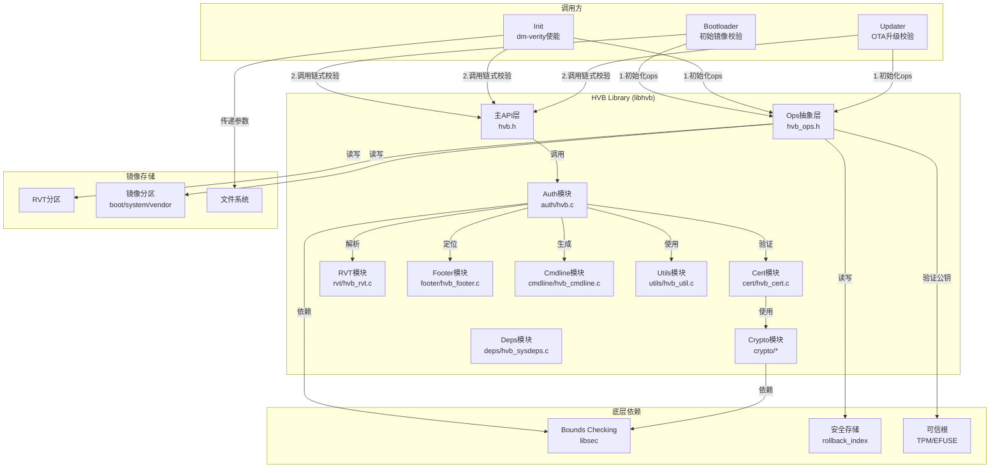
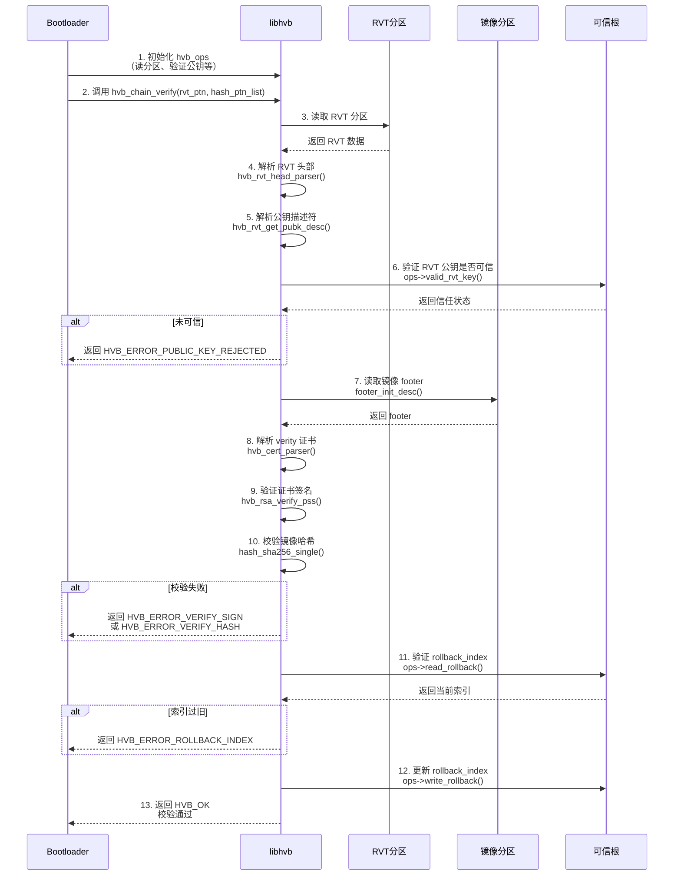
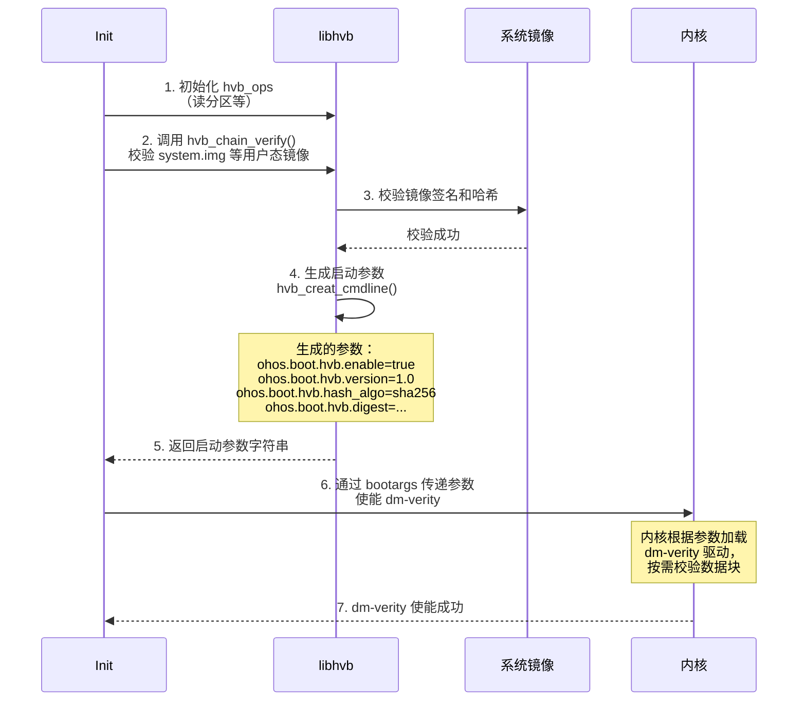
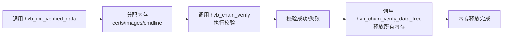

# 架构说明

## 目的

本文档介绍 HVB 组件的系统架构、组件关系、数据流和关键时序，帮助读者理解设计原理。

---

## 适用范围

- 目标读者：系统架构师、安全工程师、Bootloader 开发者
- 知识储备：系统设计、加密算法、Bootloader 工作流程

---

## 核心结论

1. **HVB 是静态库**，通过 `hvb_ops` 接口与 Bootloader/init 集成
2. **链式校验**：从 RVT 开始，逐个验证镜像签名和哈希
3. **信任链**：Bootloader 可信根 → RVT 公钥 → 镜像签名 → 镜像哈希
4. **同步调用**：所有接口为同步调用，无异步或回调
5. **无 IPC**：Bootloader/init 直接调用 libhvb，无进程间通信

---

## 组件图



---

## 核心数据结构

### 1. hvb_verified_data - 校验数据上下文

**定义**：`libhvb/include/hvb.h:73-89`

```c
struct hvb_verified_data {
    struct hvb_cert_data *certs;              // 已加载证书
    uint64_t num_loaded_certs;               // 证书数量
    struct hvb_image_data *images;             // 已加载镜像
    uint64_t num_loaded_images;              // 镜像数量
    struct hvb_cmdline_data cmdline;          // 启动参数
    uint64_t rollback_indexes[32];           // 防回滚索引
    uint32_t algorithm;                     // 哈希算法（0=SHA256_RSA3072, 1=SHA256_RSA4096, 2=SHA256_RSA2048, 3=SM）
    uint32_t match_backup_pubkey;            // 是否匹配备用公钥
};
```

**用途**：在整个校验过程中保存状态数据

---

### 2. hvb_ops - Bootloader 适配接口

**定义**：`libhvb/include/hvb_ops.h:38-54`

```c
struct hvb_ops {
    void *user_data;
    enum hvb_io_errno (*read_partition)(...);       // 读分区
    enum hvb_io_errno (*write_partition)(...);      // 写分区
    enum hvb_io_errno (*valid_rvt_key)(...);     // 验证公钥是否可信
    enum hvb_io_errno (*read_rollback)(...);       // 读防回滚索引
    enum hvb_io_errno (*write_rollback)(...);      // 写防回滚索引
    enum hvb_io_errno (*read_lock_state)(...);     // 读锁状态
    enum hvb_io_errno (*get_partiton_size)(...);   // 获取分区大小
};
```

**用途**：抽象底层平台操作，便于移植

---

### 3. hvb_cert - Verity 证书

**定义**：`libhvb/include/hvb_cert.h:77-158`

关键字段：
- `magic`: 证书魔数（"HVB"）
- `version_major/minor`: HVB 版本（1.1）
- `image_name`: 分区名称（如 "boot"、"system"）
- `rollback_location/index`: 防回滚位置和索引
- `verity_type`: 校验类型（1=hash, 2=hashtree）
- `hash_algo`: 哈希算法（0=SHA256, 1=SHA1, 2=SHA512, 3=SM3）
- `salt_offset/size`: 盐值位置和大小
- `digest_offset/size`: 摘要位置和大小
- `hashtree_offset/size`: 哈希树位置和大小
- `signature_info`: 签名信息（公钥、签名、user_id）

**用途**：存储镜像的校验信息和签名

---

### 4. hvb_footer - Footer 结构

**定义**：`libhvb/include/hvb_footer.h:33-40`

```c
struct hvb_footer {
    uint8_t magic[8];              // "HVB\0\0\0\0\0"
    uint64_t cert_offset;           // 证书偏移
    uint64_t cert_size;             // 证书大小
    uint64_t image_size;           // 镜像大小
    uint64_t partition_size;        // 分区大小
    uint8_t reserved[64];          // 保留字段
};
```

**大小**：104 字节（`HVB_FOOTER_SIZE`）

**用途**：定位镜像末尾的证书位置

---

## 数据流：Bootloader 镜像校验



---

## 数据流：init dm-verity 使能



---

## 线程模型

### 同步调用

- **所有 HVB 接口均为同步调用**
- 无异步接口、无回调函数
- 无线程池、无工作队列

**证据**：`libhvb/include/hvb.h`（所有接口返回 `enum hvb_errno`）

---

### 调用者线程

- **Bootloader**：单线程执行
- **init**：单线程执行
- **updater**：单线程执行

**结论**：HVB 本身不创建线程，由调用者管理线程

---

## 资源生命周期

### 1. 校验数据生命周期



**证据**：`libhvb/src/auth/hvb.c:27-70`（`hvb_init_verified_data` 和 `hvb_chain_verify_data_free`）

---

### 2. 镜像数据生命周期

```c
struct hvb_image_data {
    char *partition_name;      // 分区名称
    struct hvb_buf data;       // 数据缓冲区
    bool preloaded;          // 是否预加载
};
```

- **预加载模式**：调用者提供 `data.addr` 和 `data.size`
- **按需加载**：HVB 通过 `ops->read_partition()` 读取数据

**证据**：`libhvb/include/hvb.h:55-59`

---

## 错误传播机制

### 错误码定义

**定义**：`libhvb/include/hvb.h:41-53`

```c
enum hvb_errno {
    HVB_OK,                          // 成功
    HVB_ERROR_OOM,                   // 内存不足
    HVB_ERROR_IO,                     // IO 错误
    HVB_ERROR_VERIFY_SIGN,             // 签名验证失败
    HVB_ERROR_VERIFY_HASH,             // 哈希验证失败
    HVB_ERROR_ROLLBACK_INDEX,          // 防回滚索引错误
    HVB_ERROR_PUBLIC_KEY_REJECTED,     // 公钥被拒绝
    HVB_ERROR_INVALID_CERT_FORMAT,      // 证书格式无效
    HVB_ERROR_INVALID_FOOTER_FORMAT,   // Footer 格式无效
    HVB_ERROR_UNSUPPORTED_VERSION,      // 不支持的版本
    HVB_ERROR_INVALID_ARGUMENT,        // 参数无效
};
```

### 错误处理流程

1. **遇到错误立即返回**：不继续执行后续逻辑
2. **调用者处理错误**：Bootloader/init 根据错误码决定下一步
3. **清理资源**：即使出错，也要释放已分配的内存

**证据**：`libhvb/src/auth/hvb.c:65-69`（`fail` 标签清理）

---

## 相关跳转

- [项目概览](00_Overview.md) - HVB 组件介绍
- [对外 API](04_Public_API.md) - 如何调用 HVB 接口
- [内部 API](05_Internal_API.md) - 模块接口详情
- [安全分析](08_Security_Analysis.md) - 信任边界与攻击面

---

*最后更新: 2026-02-06*
