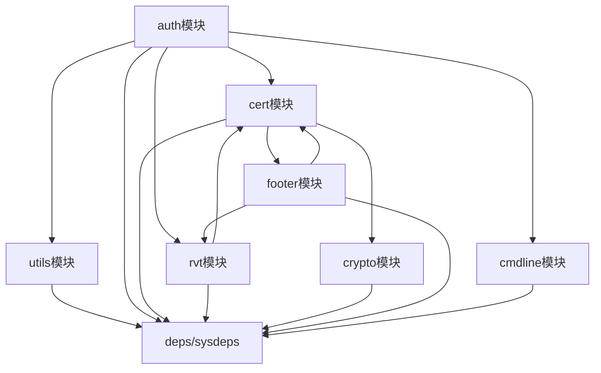

# 内部 API

## 目的

本文档介绍 HVB 组件的内部模块接口、依赖关系和稳定性标识，帮助代码贡献者理解模块设计和可扩展点。

---

## 适用范围

- 目标读者：代码贡献者、模块维护者
- 知识储备：C 语言、模块化设计、加密算法

---

## 核心结论

1. **include/** 为稳定接口**，外部可调用
2. **src/** 为内部实现**，模块内共享
3. **无循环依赖**：模块依赖单向（auth → 其他模块）
4. **平台抽象层**：hvb_ops 和 hvb_sysdeps 便于移植

---

## 模块接口

### 1. cert 模块接口（hvb_cert.h）

| 函数/类型 | 文件位置 | 稳定性 | 说明 |
|-----------|----------|----------|------|
| `struct hvb_cert` | `libhvb/include/hvb_cert.h:77-158` | ✅ 稳定 | Verity 证书结构体 |
| `struct hvb_sign_info` | `libhvb/include/hvb_cert.h:61-75` | ✅ 稳定 | 签名信息结构体 |
| `struct hash_payload` | `libhvb/include/hvb_cert.h:56-59` | ✅ 稳定 | 哈希数据结构体 |
| `enum hvb_image_type` | `libhvb/include/hvb_cert.h:49-54` | ✅ 稳定 | 镜像类型枚举 |
| `cert_init_desc()` | `libhvb/include/hvb_cert.h:160-162` | ✅ 稳定 | 初始化证书描述 |
| `hvb_cert_parser()` | `libhvb/include/hvb_cert.h:163` | ✅ 稳定 | 解析证书数据 |

**依赖**：crypto、footer、rvt

**调用方**：auth、rvt

---

### 2. rvt 模块接口（hvb_rvt.h）

| 函数/类型 | 文件位置 | 稳定性 | 说明 |
|-----------|----------|----------|------|
| `struct rvt_image_header` | `libhvb/include/hvb_rvt.h:57-69` | ✅ 稳定 | RVT 头部结构体 |
| `struct rvt_pubk_desc` | `libhvb/include/hvb_rvt.h:40-55` | ✅ 稳定 | 公钥描述符结构体 |
| `hvb_rvt_head_parser()` | `libhvb/include/hvb_rvt.h:71` | ✅ 稳定 | 解析 RVT 头部 |
| `hvb_rvt_get_pubk_desc()` | `libhvb/include/hvb_rvt.h:72` | ✅ 稳定 | 获取公钥描述符 |
| `hvb_rvt_pubk_desc_parser()` | `libhvb/include/hvb_rvt.h:73` | ✅ 稳定 | 解析公钥描述符 |
| `hvb_rvt_get_pubk_buf()` | `libhvb/include/hvb_rvt.h:74-75` | ✅ 稳定 | 获取公钥数据 |
| `hvb_calculate_certs_digest()` | `libhvb/include/hvb_rvt.h:76` | ✅ 稳定 | 计算证书摘要 |

**依赖**：cert

**调用方**：auth

---

### 3. crypto 模块接口（hvb_crypto.h）

| 函数/类型 | 文件位置 | 稳定性 | 说明 |
|-----------|----------|----------|------|
| `struct hash_ctx_t` | `libhvb/include/hvb_crypto.h:49-58` | ✅ 稳定 | 哈希上下文 |
| `struct hvb_rsa_pubkey` | `libhvb/include/hvb_crypto.h:35-43` | ✅ 稳定 | RSA 公钥结构体 |
| `enum hash_alg_type` | `libhvb/include/hvb_crypto.h:45-47` | ✅ 稳定 | 哈希算法类型 |
| `hash_ctx_init()` | `libhvb/include/hvb_crypto.h:60` | ✅ 稳定 | 初始化哈希上下文 |
| `hash_calc_update()` | `libhvb/include/hvb_crypto.h:62` | ✅ 稳定 | 更新哈希计算 |
| `hash_calc_do_final()` | `libhvb/include/hvb_crypto.h:64` | ✅ 稳定 | 完成哈希计算 |
| `hash_sha256_single()` | `libhvb/include/hvb_crypto.h:66` | ✅ 稳定 | 一次性 SHA256 计算 |
| `hvb_rsa_verify_pss()` | `libhvb/include/hvb_crypto.h:77-79` | ✅ 稳定 | RSA-PSS 签名验证 |

**依赖**：无（纯数学实现）

**调用方**：cert

---

### 4. footer 模块接口（hvb_footer.h）

| 函数/类型 | 文件位置 | 稳定性 | 说明 |
|-----------|----------|----------|------|
| `struct hvb_footer` | `libhvb/include/hvb_footer.h:33-40` | ✅ 稳定 | Footer 结构体 |
| `footer_init_desc()` | `libhvb/include/hvb_footer.h:42-44` | ✅ 稳定 | 初始化 footer 描述 |

**依赖**：cert、rvt

**调用方**：auth

---

### 5. cmdline 模块接口（hvb_cmdline.h）

| 函数/宏 | 文件位置 | 稳定性 | 说明 |
|----------|----------|----------|------|
| `CMD_LINE_SIZE` | `libhvb/include/hvb_cmdline.h:26` | ✅ 稳定 | 启动参数缓冲区大小 |
| `HVB_CMDLINE_VB_STATE` | `libhvb/include/hvb_cmdline.h:28` | ✅ 稳定 | HVB 使能参数名 |
| `HVB_CMDLINE_HASH_ALG` | `libhvb/include/hvb_cmdline.h:29` | ✅ 稳定 | 哈希算法参数名 |
| `HVB_CMDLINE_CERT_DIGEST` | `libhvb/include/hvb_cmdline.h:30` | ✅ 稳定 | 摘要参数名 |
| `HVB_CMDLINE_VERSION` | `libhvb/include/hvb_cmdline.h:32` | ✅ 稳定 | 版本参数名 |
| `hvb_creat_cmdline()` | `libhvb/include/hvb_cmdline.h:35` | ✅ 稳定 | 生成启动参数 |

**依赖**：hvb_ops、hvb

**调用方**：auth

---

### 6. utils 模块接口（hvb_util.h）

| 函数/宏 | 文件位置 | 稳定性 | 说明 |
|----------|----------|----------|------|
| `hvb_be64toh()` | `libhvb/include/hvb_util.h:49` | ✅ 稳定 | 大端序转主机序 |
| `hvb_htobe64()` | `libhvb/include/hvb_util.h:50` | ✅ 稳定 | 主机序转大端序 |
| `hvb_strdup()` | `libhvb/include/hvb_util.h:52` | ✅ 稳定 | 字符串复制 |
| `hvb_malloc()` | `libhvb/include/hvb_util.h:53` | ✅ 稳定 | 内存分配 |
| `hvb_calloc()` | `libhvb/include/hvb_util.h:54` | ✅ 稳定 | 内存清零分配 |
| `hvb_uint64_to_base10()` | `libhvb/include/hvb_util.h:56` | ✅ 稳定 | uint64 转 base10 字符串 |
| `hvb_bin2hex()` | `libhvb/include/hvb_util.h:57` | ✅ 稳定 | 二进制转十六进制 |
| `check_hvb_ops()` | `libhvb/include/hvb_util.h:59` | ✅ 稳定 | 检查 ops 是否完整 |

**依赖**：无

**调用方**：所有模块

---

### 7. sysdeps 模块接口（hvb_sysdeps.h）

| 函数 | 文件位置 | 稳定性 | 说明 |
|------|----------|----------|------|
| `hvb_memcmp()` | `libhvb/include/hvb_sysdeps.h:29` | ✅ 稳定 | 内存比较 |
| `hvb_strcmp()` | `libhvb/include/hvb_sysdeps.h:30` | ✅ 稳定 | 字符串比较 |
| `hvb_strncmp()` | `libhvb/include/hvb_sysdeps.h:31` | ✅ 稳定 | 字符串长度比较 |
| `hvb_memcpy()` | `libhvb/include/hvb_sysdeps.h:32` | ✅ 稳定 | 内存复制 |
| `hvb_memcpy_s()` | `libhvb/include/hvb_sysdeps.h:33` | ✅ 稳定 | 安全内存复制 |
| `hvb_memset()` | `libhvb/include/hvb_sysdeps.h:34` | ✅ 稳定 | 内存设置 |
| `hvb_memset_s()` | `libhvb/include/hvb_sysdeps.h:35` | ✅ 稳定 | 安全内存设置 |
| `hvb_print()` | `libhvb/include/hvb_sysdeps.h:36` | ✅ 稳定 | 调试打印 |
| `hvb_print_u64()` | `libhvb/include/hvb_sysdeps.h:37` | ✅ 稳定 | 打印 uint64 |
| `hvb_printv()` | `libhvb/include/hvb_sysdeps.h:38` | ✅ 稳定 | 可变参数打印 |
| `hvb_malloc_()` | `libhvb/include/hvb_sysdeps.h:39` | ✅ 稳定 | 内部内存分配 |
| `hvb_free()` | `libhvb/include/hvb_sysdeps.h:40` | ✅ 稳定 | 内存释放 |
| `hvb_abort()` | `libhvb/include/hvb_sysdeps.h:41` | ✅ 稳定 | 中止程序 |
| `hvb_strlen()` | `libhvb/include/hvb_sysdeps.h:42` | ✅ 稳定 | 字符串长度 |
| `hvb_strnlen()` | `libhvb/include/hvb_sysdeps.h:43` | ✅ 稳定 | 安全字符串长度 |
| `hvb_div_by_10()` | `libhvb/include/hvb_sysdeps.h:44` | ✅ 稳定 | 除以 10 |

**依赖**：bounds_checking_function (securec)

**调用方**：所有模块

**注意**：这些是系统函数的包装，使用 securec 进行边界检查

---

### 8. sm2 模块接口（hvb_sm2.h）

| 函数/类型 | 文件位置 | 稳定性 | 说明 |
|-----------|----------|----------|------|
| `struct sm2_pubkey` | `libhvb/include/hvb_sm2.h:38-41` | ✅ 稳定 | SM2 公钥结构体 |
| `sm2_digest_verify()` | `libhvb/include/hvb_sm2.h:43-44` | ✅ 稳定 | SM2 摘要验证 |
| `hvb_sm2_verify()` | `libhvb/include/hvb_sm2.h:46-47` | ✅ 稳定 | SM2 签名验证 |

**依赖**：无（纯数学实现）

**调用方**：crypto

---

## 模块依赖方向

**依赖规则**：
1. **auth** 依赖所有模块（顶层入口）
2. **cert** 依赖 crypto、footer、rvt
3. **rvt** 依赖 cert
4. **footer** 依赖 cert、rvt
5. **crypto** 独立模块
6. **utils** 独立模块
7. **deps** 最底层模块

**无循环依赖** ✅

---

## 稳定性说明

### 稳定接口

**定义**：include/ 目录下的所有接口

**特征**：
- 向外暴露
- 文档完整
- 版本管理（通过 HVB_VERSION_MAJOR/MINOR）

**修改建议**：
- 仅在主版本升级时修改
- 保持向后兼容

---

### 内部接口

**定义**：src/ 目录下各模块间的接口

**特征**：
- 模块内共享
- 不对外暴露
- 可随时修改

**修改建议**：
- 可自由重构
- 但需保持模块间接口一致性

---

## 可扩展点

### 1. 新增加密算法

**位置**：`libhvb/src/crypto/`

**步骤**：
1. 实现新的签名/哈希算法（如 Ed25519）
2. 添加到 `enum hash_alg_type`
3. 在 `hvb_cert.h` 中增加算法类型枚举
4. 在 hvbtool.py 中增加新算法支持

**接口**：`libhvb/include/hvb_crypto.h`

---

### 2. 新增镜像类型

**位置**：`libhvb/include/hvb_cert.h`

**步骤**：
1. 在 `enum hvb_image_type` 中增加新类型
2. 在 cert 解析逻辑中增加处理分支
3. 在 hvbtool.py 中增加签名逻辑

---

### 3. 平台适配层

**位置**：`libhvb/include/hvb_ops.h`、`libhvb/include/hvb_sysdeps.h`

**步骤**：
1. 实现所有 `hvb_ops` 函数指针
2. 实现所有 `hvb_sysdeps` 函数
3. 编译链接时替换实现

**注意**：无需修改 HVB 核心代码

---

## 相关跳转

- [目录结构](02_Directory_Structure.md) - 模块划分
- [对外 API](04_Public_API.md) - 公共接口
- [架构说明](03_Architecture.md) - 组件依赖图

---

*最后更新: 2026-02-06*
