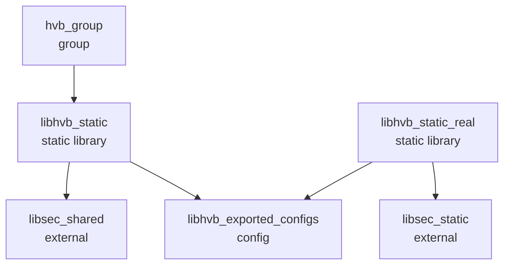

# GN Targets

## 目的

本文档系统化梳理 HVB 组件的所有 GN 构建目标，包括目标类型、依赖关系、输出文件和配置选项。

---

## 适用范围

- 目标读者：构建工程师、编译系统开发者
- 知识储备：GN 构建系统、静态库

---

## 核心结论

1. **仅 2 个 BUILD.gn 文件**：根目录和 libhvb
2. **2 个静态库 target**：libhvb_static 和 libhvb_static_real
3. **外部依赖**：bounds_checking_function (libsec_shared/libsec_static)
4. **无 .gni 配置文件**：所有配置在 BUILD.gn 中

---

## 构建文件列表

| 文件路径 | 行数 | 作用 |
|----------|------|------|
| `BUILD.gn` | 20 | 根构建入口，定义 hvb_group |
| `libhvb/BUILD.gn` | 72 | libhvb 静态库构建配置 |
| `bundle.json` | 75 | 部件元数据和依赖声明 |

---

## 根 Targets (BUILD.gn)

### hvb_group

**类型**：group

**文件位置**：`BUILD.gn:17-19`

**GN 定义**：
```gn
group("hvb_group") {
  deps = [ "libhvb:libhvb_static" ]
}
```

**依赖**：`libhvb:libhvb_static`

**输出**：无（group target 为虚拟目标）

**使用方**：OpenHarmony 构建系统

---

## libhvb Targets (libhvb/BUILD.gn)

### libhvb_exported_configs

**类型**：config

**文件位置**：`libhvb/BUILD.gn:21-29`

**GN 定义**：
```gn
config("libhvb_exported_configs") {
  visibility = [ ":*" ]
  include_dirs = [ "include" ]
  if (target_cpu == "arm64") {
    defines = [ "__LP64__" ]
  } else {
    defines = [ "__LP32__" ]
  }
}
```

**配置**：
- `include_dirs`：`include`（注意：代码中有 typo "incldue"）
- `defines`：`__LP64__`（arm64）或 `__LP32__`（其他）

**注意**：`libhvb/BUILD.gn:51,67` 中存在拼写错误 `incldue`，实际应为 `include`

---

### libhvb_static

**类型**：ohos_static_library

**文件位置**：`libhvb/BUILD.gn:48-55`

**GN 定义**：
```gn
ohos_static_library("libhvb_static") {
  sources = hvb_sources
  external_deps = [ "bounds_checking_function:libsec_shared" ]
  include_dirs = [ "incldue" ]  # 拼写错误
  public_configs = [ ":libhvb_exported_configs" ]
  part_name = "hvb"
  subsystem_name = "startup"
}
```

**源文件**（hvb_sources）：
```
libhvb/src/auth/hvb.c
libhvb/src/cert/hvb_cert.c
libhvb/src/cmdline/hvb_cmdline.c
libhvb/src/crypto/hvb_gm_log.c
libhvb/src/crypto/hvb_hash_sha256.c
libhvb/src/crypto/hvb_rsa_verify.c
libhvb/src/crypto/hvb_rsa.c
libhvb/src/crypto/hvb_sm2_bn.c
libhvb/src/crypto/hvb_sm2.c
libhvb/src/crypto/hvb_sm3.c
libhvb/src/deps/hvb_sysdeps.c
libhvb/src/footer/hvb_footer.c
libhvb/src/rvt/hvb_rvt.c
libhvb/src/utils/hvb_util.c
```

**文件位置**：`libhvb/BUILD.gn:31-46`

**数量**：15 个 .c 文件

**依赖**：
- `external_deps`：`bounds_checking_function:libsec_shared`
- `public_configs`：`:libhvb_exported_configs`

**配置**：
- `include_dirs`：`include`（含拼写错误）
- `part_name`：`hvb`
- `subsystem_name`：`startup`

**输出文件**：
- `libhvb_static.a`

**使用方**：Bootloader、init

**证据**：`bundle.json:28-48`（inner_kits）

---

### libhvb_static_real

**类型**：ohos_static_library

**文件位置**：`libhvb/BUILD.gn:57-71`

**GN 定义**：
```gn
ohos_static_library("libhvb_static_real") {
  visibility = [
    ":*",
    "//base/update/updater/*",
    "//base/update/sys_installer/*",
    "//base/startup/init/interfaces/innerkits/fs_manager:libfsmanager_static_real",
    "//out/*",
  ]
  sources = hvb_sources
  external_deps = [ "bounds_checking_function:libsec_static" ]
  include_dirs = [ "incldue" ]  # 拼写错误
  public_configs = [ ":libhvb_exported_configs" ]
  part_name = "hvb"
  subsystem_name = "startup"
}
```

**源文件**：同 libhvb_static（15 个 .c 文件）

**visibility**：
- `:*`：libhvb 内部
- `//base/update/updater/*`：Updater 模块
- `//base/update/sys_installer/*`：系统安装器
- `//base/startup/init/...`：init 模块
- `//out/*`：输出目录

**依赖**：
- `external_deps`：`bounds_checking_function:libsec_static`
- `public_configs`：`:libhvb_exported_configs`

**配置**：
- `include_dirs`：`include`（含拼写错误）
- `part_name`：`hvb`
- `subsystem_name`：`startup`

**输出文件**：
- `libhvb_static_real.a`

**使用方**：updater、sys_installer

**区别**：
- 使用 `libsec_static`（完整边界检查）而非 `libsec_shared`（共享库）
- 可见性限制更严格（仅 updater/init）

**证据**：`bundle.json:49-69`

---

## Target 依赖关系



---

## 关键配置选项

### 1. 编译器宏

| 宏 | 定义位置 | 值 | 说明 |
|-----|----------|-----|------|
| `__LP64__` | `libhvb/BUILD.gn:24` | 64 位系统（arm64） |
| `__LP32__` | `libhvb/BUILD.gn:26` | 32 位系统 |

---

### 2. 头文件路径

| 路径 | 定义位置 | 说明 |
|------|----------|------|
| `include` | `libhvb/BUILD.gn:23` | 公共头文件目录 |
| `incldue` | `libhvb/BUILD.gn:51,67` | ❌ 拼写错误（应为 include） |

---

## Target 与产物映射

| Target | 类型 | 输出文件 | 安装路径 | 使用方 |
|--------|------|----------|----------|----------|
| `hvb_group` | group | 无 | 构建系统 |
| `libhvb_static` | ohos_static_library | `libhvb_static.a` | `/usr/lib/libhvb_static.a` | Bootloader、init |
| `libhvb_static_real` | ohos_static_library | `libhvb_static_real.a` | `/usr/lib/libhvb_static_real.a` | updater、sys_installer |

**实际路径可能因系统配置不同**，需参考具体构建输出。

---

## 构建命令

### 编译 libhvb

```bash
# 完整编译
./build.sh --product-name <product> --build-target hvb

# 仅编译 libhvb
./build.sh --product-name <product> --build-target libhvb_static
```

### 产物输出位置

```
out/<product>/packages/phone/system/lib/libhvb_static.a
out/<product>/packages/phone/system/lib/libhvb_static_real.a
```

---

## 已知问题

### 拼写错误

**问题**：`libhvb/BUILD.gn:51,67` 中 `include_dirs = [ "incldue" ]` 拼写错误

**影响**：可能影响编译路径解析

**建议**：修正为 `include_dirs = [ "include" ]`

**证据**：`libhvb/BUILD.gn:51,67`

---

## 相关跳转

- [目录结构](02_Directory_Structure.md) - 源文件组织
- [编译产物](07_Build_Artifacts.md) - 输出文件与集成方式
- [对外 API](04_Public_API.md) - 如何使用编译产物

---

*最后更新: 2026-02-06*
