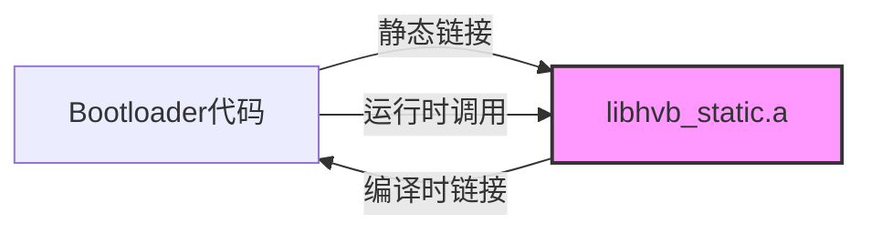
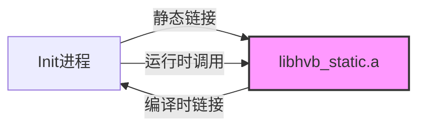
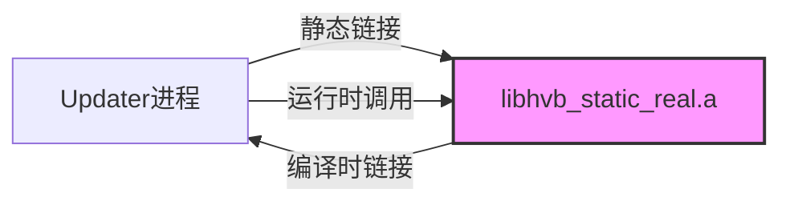

# 编译产物

## 目的

本文档说明 HVB 组件的编译产物、输出文件、安装路径和运行时加载关系。

---

## 适用范围

- 目标读者：构建工程师、Bootloader 开发者、系统集成者
- 知识储备：编译系统、静态库链接

---

## 核心结论

1. **2 个静态库**：libhvb_static.a 和 libhvb_static_real.a
- **1 个工具**：hvbtool.py（Python 脚本，无需编译）
2. **无共享库或可执行文件**：所有代码静态链接到调用方
3. **安装路径**：`/usr/lib/`（具体路径因产品而异）
4. **运行时加载**：通过静态链接，无动态加载

---

## 编译产物清单

### 静态库产物

| 产物名称 | 类型 | GN Target | 大小 | 使用方 | 链接方式 |
|----------|------|-----------|------|----------|----------|
| `libhvb_static.a` | 静态库 | libhvb_static | ~3MB ROM | Bootloader、init | 静态链接 |
| `libhvb_static_real.a` | 静态库 | libhvb_static_real | ~3MB ROM | updater、sys_installer | 静态链接 |

**证据**：`bundle.json:18-19`（ROM/RAM 占用 3072 KB）

---

### 工具产物

| 产物名称 | 类型 | 源文件 | 用途 |
|----------|------|----------|------|
| `hvbtool.py` | Python 脚本 | tools/hvbtool.py | 镜像签名工具 |

**特点**：
- 无需编译，直接解释执行
- 需要 Python 3.0+
- 依赖 OpenSSL（通过 `subprocess` 调用）

**证据**：`tools/readme.md:103-104`

---

## 输出目录结构

### 典型输出路径（示例）

```
out/<product>/
├── packages/
│   └── phone/
│       └── system/
│           └── lib/
│               ├── libhvb_static.a
│               └── libhvb_static_real.a
```

**注意**：实际路径因产品配置不同而异。

---

## 安装位置

### 系统安装路径

| 产物 | 安装路径 | 集成点 |
|------|----------|----------|
| `libhvb_static.a` | `/system/lib/libhvb_static.a` | Bootloader、init |
| `libhvb_static_real.a` | `/system/lib/libhvb_static_real.a` | updater、sys_installer |

**证据**：`bundle.json:28-48`（inner_kits 头文件路径 `/system/lib/`）

---

### 工具安装路径

| 产物 | 安装路径 | 集成点 |
|------|----------|----------|
| `hvbtool.py` | 开发工具链 | 构建系统（通过 PATH 或绝对路径调用） |

---

## 运行时加载关系

### Bootloader 场景



**流程**：
1. Bootloader 编译时静态链接 `libhvb_static.a`
2. 运行时直接调用 libhvb 函数
3. 无动态加载或符号解析

**链接命令示例**（伪代码）：
```ld
gcc bootloader.o -L /system/lib -lhvb_static -o bootloader
```

---

### Init 场景



**流程**：
1. init 编译时静态链接 `libhvb_static.a`
2. 启动时调用 `hvb_chain_verify()` 校验镜像
3. 调用 `hvb_creat_cmdline()` 生成 dm-verity 参数

**链接命令示例**：
```ld
gcc init.o -L /system/lib -lhvb_static -o init
```

---

### Updater 场景



**流程**：
1. updater 编译时静态链接 `libhvb_static_real.a`
2. OTA 升级时调用 `hvb_chain_verify()` 校验新镜像
3. 使用 `libsec_static` 进行完整边界检查

**链接命令示例**：
```ld
gcc updater.o -L /system/lib -lhvb_static_real -o updater
```

---

## 镜像签名产物

### hvbtool 生成的镜像结构

```
原始镜像（如 boot.img）
    ↓ 添加 verity footer
签名镜像（包含签名、哈希、公钥）
```

### Verity Footer 布局

```
┌─────────────────────────────────┐
│     原始镜像数据          │
├─────────────────────────────────┤
│   HVB 证书结构            │
│   - 版本信息               │
│   - 分区名称               │
│   - 防回滚索引            │
│   - 哈希算法               │
│   - salt/digest             │
│   - hashtree 数据           │
│   - FEC 纠错码            │
│   - 签名信息               │
│     - 公钥                │
│     - 签名                │
│     - user_id              │
├─────────────────────────────────┤
│   Footer 魔数与偏移       │
│   - "HVB\0\0\0\0"         │
│   - 证书偏移               │
│   - 镜像大小               │
└─────────────────────────────────┘
```

**证据**：`README_zh.md:43-52`（verity 信息结构）

---

## RVT 镜像结构

```
┌─────────────────────────────────┐
│   RVT 头部               │
│   - 魔数 "rot"           │
│   - 镜像数量               │
│   - 每个镜像公钥数         │
├─────────────────────────────────┤
│   公钥描述符数组            │
│   - 分区名称               │
│   - 公钥偏移               │
│   - 公钥长度               │
│   - 公钥数据               │
│   - 备用公钥（若有）      │
└─────────────────────────────────┘
```

**证据**：`libhvb/include/hvb_rvt.h:40-69`

---

## 集成方式

### 集成到 Bootloader

1. **静态链接**：
```makefile
LDFLAGS += -L$(OUT_DIR)/system/lib -lhvb_static
```

2. **实现 hvb_ops**：
```c
struct hvb_ops ops = {
    .read_partition = my_read_partition,
    .valid_rvt_key = my_valid_rvt_key,
    .read_rollback = my_read_rollback,
    .write_rollback = my_write_rollback,
    // ... 其他实现
};
```

3. **调用链式校验**：
```c
struct hvb_verified_data *vd = NULL;
enum hvb_errno ret = hvb_chain_verify(&ops, "rvt", ptn_list, &vd);
if (ret != HVB_OK) {
    // 处理校验失败
}
```

**证据**：`README_zh.md:88-112`

---

### 集成到 init

1. **静态链接**：
```makefile
LDFLAGS += -L$(OUT_DIR)/system/lib -lhvb_static
```

2. **实现 hvb_ops**（类似 Bootloader）

3. **校验镜像并生成启动参数**：
```c
struct hvb_verified_data *vd = NULL;
hvb_chain_verify(&ops, "rvt", ptn_list, &vd);

// 获取启动参数
char *cmdline = vd->cmdline.buf;
// 传递给内核...

// 清理
hvb_chain_verify_data_free(vd);
```

4. **挂载文件系统**：init 根据 fstab 配置和 `ohos.boot.hvb.enable` 参数使能 dm-verity

**证据**：`README_zh.md:119-152`（fstab 配置）

---

### 集成到构建系统

**方式 1：调用 hvbtool.py**

```python
import subprocess

subprocess.run([
    'python3', 'tools/hvbtool.py',
    'make_hash_footer',
    '--image', 'boot.img',
    '--partition', 'boot',
    '--pubkey', 'boot_pub.pem',
    '--privkey', 'boot_priv.pem',
    '--algorithm', 'SHA256_RSA2048',
    '--output', 'signed_boot.img'
])
```

**方式 2：集成到 GN 构建脚本**

```gn
# 在镜像构建规则中添加签名步骤
action("sign_boot_image") {
  script = "tools/hvbtool.py make_hash_footer ..."
  outputs = [ "$target_out_dir/signed_boot.img" ]
}
```

**证据**：`tools/readme.md:10-53`（使用方法）

---

## 产物验证

### 验证静态库完整性

```bash
# 查看符号
nm -D libhvb_static.a | grep "hvb_"

# 查看依赖
otool -L libhvb_static.a

# 查看架构
file libhvb_static.a
```

### 验证签名镜像

```bash
# 解析镜像
python3 tools/hvbtool.py parse_image --image signed_boot.img

# 验证签名（需公钥）
python3 tools/hvbtool.py --verify --image signed_boot.img --pubkey boot_pub.pem
```

**证据**：`tools/readme.md:87-92`

---

## 常见问题

### Q: 静态库 vs 共享库？

**A**: HVB 使用静态库，原因：
1. Bootloader 环境受限，无动态加载器
2. 避免版本冲突
3. 减小运行时依赖

---

### Q: libhvb_static vs libhvb_static_real？

**A**: 区别：
- `libhvb_static.a`：使用 `libsec_shared`（共享边界检查库）
- `libhvb_static_real.a`：使用 `libsec_static`（静态边界检查库）

使用场景：
- Bootloader/init：使用 `libhvb_static.a`
- Updater：使用 `libhvb_static_real.a`（更严格的边界检查）

**证据**：`libhvb/BUILD.gn:50,66`

---

### Q: hvbtool.py 需要编译吗？

**A**: 不需要。`hvbtool.py` 是 Python 脚本：
- 直接解释执行
- 需要 Python 3.0+
- 通过 `subprocess` 调用 OpenSSL

**证据**：`tools/readme.md:103`

---

## 相关跳转

- [GN Targets](06_GN_Targets.md) - 构建目标详解
- [对外 API](04_Public_API.md) - 如何使用静态库
- [常见问题](09_FAQ.md) - 集成问题排查

---

*最后更新: 2026-02-06*
