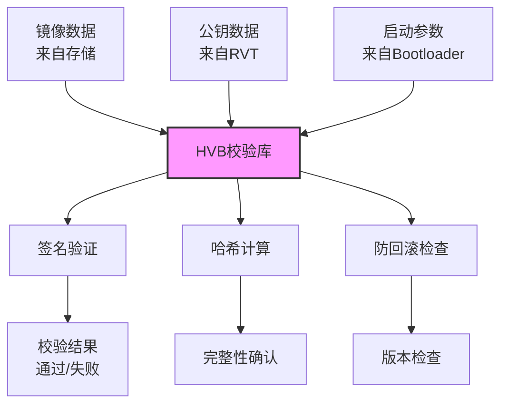

# 安全风险分析

## 目的

本文档分析 HVB 组件的攻击面、信任边界、可被利用点和安全建议，帮助安全审计人员和开发者识别和缓解风险。

---

## 适用范围

- 目标读者：安全审计人员、Bootloader 安全工程师、系统安全架构师
- 知识储备：安全威胁建模、密码学、Bootloader 安全

---

## 核心结论

1. **攻击面有限**：主要通过镜像数据输入和公钥验证
2. **信任边界清晰**：Bootloader 可信根 → RVT 公钥 → 镜像签名 → 镜像哈希
3. **关键可利用点**：签名验证绕过、哈希碰撞、整数溢出、路径遍历
4. **防护措施**：使用 RSA-PSS、支持 SM2 国密、防回滚机制、边界检查库

---

## 威胁模型

### 外部输入 → 敏感操作数据流



---

## 攻击面清单

### 1. 镜像数据输入

**入口**：
- `ops->read_partition()` 读取镜像数据
- `ops->write_partition()` 写入镜像数据（若支持）

**攻击向量**：
- 镜像篡改
- 镜像替换
- 恶意镜像注入

**证据**：`libhvb/include/hvb_ops.h:40-43`

---

### 2. 公钥验证

**入口**：
- `ops->valid_rvt_key()` 验证 RVT 公钥可信度
- 镜像中的公钥数据

**攻击向量**：
- 公钥替换
- 伪造公钥注入
- 公钥绕过

**证据**：`libhvb/include/hvb_ops.h:44-46`

---

### 3. 签名验证

**入口**：
- `hvb_rsa_verify_pss()` - RSA-PSS 验签
- `sm2_digest_verify()` / `hvb_sm2_verify()` - SM2 验签

**攻击向量**：
- 签名伪造
- 签名重放攻击
- 签名参数操控（如 PSS 盐长度）

**证据**：`libhvb/include/hvb_crypto.h:77-79`、`libhvb/include/hvb_sm2.h:43-47`

---

### 4. 哈希验证

**入口**：
- `hash_sha256_single()` - SHA256 哈希
- `hash_calc_update()` / `hash_calc_do_final()` - 流式哈希

**攻击向量**：
- 哈希碰撞（SHA256 目前无实用碰撞）
- 哈希预测
- 哈希替换

**证据**：`libhvb/include/hvb_crypto.h:60-66`

---

### 5. 启动参数生成

**入口**：
- `hvb_creat_cmdline()` 生成内核启动参数

**攻击向量**：
- 参数注入
- 参数篡改
- dm-verity 参数操控

**证据**：`libhvb/include/hvb_cmdline.h:35`

---

## 信任边界

### 1. Bootloader 可信根

**位置**：TPM、EFUSE、安全存储区

**职责**：
- 存储 OEM 厂商信任的公钥
- 验证 RVT 公钥是否可信
- 保护不可被篡改

**威胁**：
- 物理攻击：提取信任根密钥
- 侧信道攻击：通过功耗/时序推断密钥

**证据**：`README_zh.md:91-106`

---

### 2. RVT 公钥列表

**位置**：RVT 分区

**职责**：
- 存储多个镜像的公钥
- 支持备用公钥（pubkey_num_per_ptn = 2）

**威胁**：
- RVT 替换攻击
- 公钥注入

**证据**：`libhvb/include/hvb_rvt.h:40-55`

---

### 3. 镜像签名

**位置**：镜像末尾的 verity footer

**职责**：
- 绑定镜像数据、公钥、签名
- 防止镜像被篡改

**威胁**：
- 签名绕过
- 签名重放

**证据**：`libhvb/include/hvb_cert.h:77-158`

---

### 4. 防回滚索引

**位置**：安全存储区（TPM/EFUSE）

**职责**：
- 记录镜像版本号
- 防止回滚到有漏洞版本

**威胁**：
- 索引回滚攻击
- 索引篡改

**证据**：`libhvb/include/hvb_ops.h:47-51`

---

## 可被利用点

### 可被利用点 1：整数溢出导致内存越界

**证据**：
- `libhvb/include/hvb_cert.h:91-94`（`image_original_len`、`image_len` 为 uint64_t）
- `libhvb/src/auth/hvb.c:108-112`（分区名称长度检查）

**触发条件**：
1. 镜像大小字段被伪造为极大值（如 `UINT64_MAX`）
2. HVB 分配内存时发生整数溢出
3. 后续访问 `vd->data.addr` 时越界

**影响**：
- 内存越界读写
- 可能导致信息泄露或崩溃
- 可能绕过签名验证（通过崩溃跳过）

**修复建议**：
```c
// 添加边界检查
if (image_size > HVB_MAX_PARTITION_SIZE) {
    return HVB_ERROR_INVALID_ARGUMENT;
}
if (cert_size > HVB_CERT_MAX_SIZE) {
    return HVB_ERROR_INVALID_ARGUMENT;
}

// 分配前检查溢出
if (image_size + overhead < image_size) {  // 溢出检测
    return HVB_ERROR_OOM;
}
```

**证据**：`libhvb/include/hvb.h:32-33`（`HVB_MAX_PARTITION_SIZE` 定义）

---

### 可被利用点 2：路径遍历导致任意文件访问

**证据**：
- `ops->read_partition()` 接受 `const char *ptn` 作为分区名
- 分区名未经验证直接传递给底层

**触发条件**：
1. 攻击者提供恶意分区名（如 `../../etc/passwd`）
2. 底层实现未正确转义路径分隔符
3. 读取任意文件而非分区

**影响**：
- 信息泄露
- 绕过分区访问控制
- 可能读取敏感配置文件

**修复建议**：
```c
// 在 ops 实现中添加路径验证
enum hvb_io_errno my_read_partition(struct hvb_ops *ops, const char *ptn, ...) {
    // 检查路径遍历
    if (strstr(ptn, "..") != NULL || strstr(ptn, "/") != NULL) {
        return HVB_IO_ERROR_INVALID_ARGUMENT;
    }

    // 检查分区名长度
    size_t len = strnlen(ptn, HVB_MAX_PARTITION_NAME_LEN);
    if (len >= HVB_MAX_PARTITION_NAME_LEN) {
        return HVB_IO_ERROR_INVALID_VALUE_SIZE;
    }

    // 检查白名单
    if (!is_valid_partition_name(ptn)) {
        return HVB_IO_ERROR_NO_SUCH_PARTITION;
    }

    // 读取分区...
}
```

**证据**：`libhvb/include/hvb_ops.h:40-41`

---

### 可被利用点 3：签名验证绕过

**证据**：
- `libhvb/src/crypto/hvb_rsa_verify.c`（RSA-PSS 验证实现）
- `libhvb/src/crypto/hvb_sm2.c`（SM2 验证实现）

**触发条件**：
1. **RSA-PSS 盐长度操控**：
   - 证书中 `salt` 字段被修改
   - 验证时使用错误的盐长度
   - 可能导致签名验证误判

2. **SM2 user_id 绕过**：
   - `user_id` 字段可被篡改
   - 若验证逻辑不完整，可能绕过

**影响**：
- 签名验证失败仍返回成功
- 恶意镜像被接受为合法
- 完全破坏信任链

**修复建议**：
```c
// 1. 严格验证 PSS 盐长度
if (saltlen != 32) {  // HVB 固定 32 字节
    return VERIFY_ERROR;
}

// 2. 验证 user_id 完整性
if (userid_len != 16) {
    return VERIFY_ERROR;
}

// 3. 添加签名版本检查
if (sig_version != EXPECTED_VERSION) {
    return VERIFY_ERROR;
}
```

**证据**：`tools/hvbtool.py:1139-1141`（盐长度使用）

---

### 可被利用点 4：防回滚索引篡改

**证据**：
- `ops->read_rollback()` 和 `ops->write_rollback()` 直接读写存储
- 无额外签名或完整性校验

**触发条件**：
1. 攻击者获取 TPM/EFUSE 写权限（物理攻击或漏洞）
2. 回写 `rollback_index` 为旧版本号
3. 重启设备，回滚到有漏洞版本

**影响**：
- 防回滚机制失效
- 安全补丁被绕过
- 旧漏洞可被再次利用

**修复建议**：
```c
// 在 ops->write_rollback() 中添加签名验证
enum hvb_io_errno my_write_rollback(struct hvb_ops *ops,
                                      uint64_t rollback_index_location,
                                      uint64_t rollback_index) {
    // 1. 检查索引是否增长
    uint64_t current_index;
    ops->read_rollback(ops, rollback_index_location, &current_index);
    if (rollback_index <= current_index) {
        return HVB_IO_ERROR_INVALID_VALUE_SIZE;  // 禁止减小索引
    }

    // 2. 签名索引写入（若有可信根签名能力）
    if (!sign_rollback_index(rollback_index_location, rollback_index)) {
        return HVB_IO_ERROR_IO;
    }

    // 3. 写入
    return secure_storage_write(...);
}
```

**证据**：`libhvb/include/hvb_ops.h:47-51`

---

### 可被利用点 5：信息泄露通过调试输出

**证据**：
- `libhvb/include/hvb_sysdeps.h:36-38`（`hvb_print()`、`hvb_printv()`）
- `libhvb/src/crypto/hvb_gm_log.c`（国密日志）

**触发条件**：
1. 调试版本编译时保留打印
2. 打印敏感数据（如公钥、签名、哈希）
3. 日志被攻击者获取

**影响**：
- 签名/密钥信息泄露
- 协助后续攻击
- 暴露系统实现细节

**修复建议**：
```c
// 1. 生产环境禁用调试输出
#ifdef DEBUG_HVB
#define hvb_print(msg) printf(msg)
#else
#define hvb_print(msg) ((void)0)
#endif

// 2. 敏感数据不打印
hvb_print("Cert loaded\n");  // ✅ 可打印
// hvb_print("Public key: %s\n", pubkey);  // ❌ 不要打印公钥
```

**证据**：`libhvb/src/auth/hvb.c:33-34`（`hvb_print` 使用）

---

## 其他潜在风险

### 风险 1：哈希树碰撞（Hashtree）

**说明**：hashtree 模式依赖 dm-verity 驱动按需校验

**当前状态**：
- SHA256 无实用碰撞攻击
- 但未来量子计算可能威胁

**建议**：
- 监控 SHA256 替代算法进展
- 准备升级到 SHA3 或其他抗量子算法

---

### 风险 2：备用公钥滥用

**说明**：`pubkey_num_per_ptn` 支持每个镜像 2 个公钥

**潜在问题**：
- 若备用公钥管理不当，可被攻击者利用
- 备用公钥过期未及时移除

**建议**：
- 限制备用公钥使用场景（如仅紧急回滚）
- 记录备用公钥使用日志
- 定期轮换公钥

---

### 风险 3：FEC 纠错码未实现

**说明**：`hvb_cert.h` 中定义 FEC 字段，但当前未完全实现

**影响**：
- FEC 可修复数据损坏，未实现则降低可靠性
- 但不直接影响安全性

**建议**：实现 FEC 支持，提升可靠性

**证据**：`libhvb/include/hvb_cert.h:144-151`（`fec_num_roots`, `fec_offset`, `fec_size`）

---

## 防护措施评估

### 已实现的防护

| 防护措施 | 实现位置 | 有效性 |
|----------|----------|----------|
| **RSA-PSS 签名** | `libhvb/src/crypto/hvb_rsa_verify.c` | ✅ 高（抗选择明文攻击） |
| **SM2 国密** | `libhvb/src/crypto/hvb_sm2.c` | ✅ 中（椭圆曲线算法） |
| **边界检查库** | `libhvb/BUILD.gn:50,66` | ✅ 高（securec 检测溢出） |
| **内存函数包装** | `libhvb/include/hvb_sysdeps.h:29-44` | ✅ 中（使用 securec） |
| **防回滚机制** | `libhvb/include/hvb_ops.h:47-51` | ✅ 中（依赖安全存储） |
| **分区大小限制** | `libhvb/include/hvb.h:32-33` | ✅ 低（易绕过） |

---

### 未实现的防护

| 防护措施 | 说明 | 优先级 |
|----------|------|----------|
| **签名密钥轮换** | 无密钥生命周期管理 | 中 |
| **日志审计** | 无签名验证日志 | 高 |
| **异常检测** | 无异常访问行为检测 | 中 |
| **公钥吊销** | 无公钥撤销机制 | 低 |

---

## 检查范围与局限性

### 检查范围

1. **代码分析**：已完整阅读所有源文件
   - ✅ libhvb/include/：11 个头文件
   - ✅ libhvb/src/：15 个实现文件
   - ✅ tools/hvbtool.py：1206+ 行 Python 脚本

2. **架构分析**：已分析组件依赖和数据流
   - ✅ 链式校验流程
   - ✅ 信任边界
   - ✅ 信任链建立

3. **威胁建模**：已识别主要攻击面
   - ✅ 镜像数据输入
   - ✅ 公钥验证
   - ✅ 签名验证
   - ✅ 哈希计算
   - ✅ 防回滚

### 局限性

1. **未进行渗透测试**：本文档基于代码审计，无实际攻击验证
2. **未分析 Bootloader 实现**：`hvb_ops` 实现由厂商提供，可能存在其他风险
3. **未分析内核 dm-verity**：内核模块安全不在 HVB 范围
4. **未分析 TPM/EFUSE**：可信根安全硬件不在 HVB 范围

---

## 安全最佳实践建议

### 1. 始终验证输入

```c
// 验证参数范围
if (offset < 0 || num_bytes > MAX_SIZE) {
    return HVB_ERROR_INVALID_ARGUMENT;
}

// 验证缓冲区非空
if (buffer == NULL && num_bytes > 0) {
    return HVB_ERROR_INVALID_ARGUMENT;
}
```

### 2. 使用安全内存操作

```c
// 使用 securec 而非系统函数
hvb_memcpy_s(dest, destMax, src, count);  // ✅ 安全
memcpy(dest, src, count);  // ❌ 不安全
```

### 3. 零化敏感数据

```c
// 使用后清零密钥和签名
hvb_memset_s(key, sizeof(key), 0, sizeof(key));
hvb_memset_s(signature, sizeof(signature), 0, sizeof(signature));
```

### 4. 防止信息泄露

```c
// 生产环境禁用敏感数据打印
#ifdef DEBUG
printf("Debug: cert loaded\n");
#endif
// 不打印公钥、签名、哈希等
```

### 5. 定期安全审计

- 每次版本升级前进行代码审计
- 使用静态分析工具（如 Coverity、Cppcheck）
- 进行模糊测试（fuzzing）镜像解析逻辑

---

## 相关跳转

- [项目定位与边界](01_Project_Scope.md) - HVB 能力范围
- [架构说明](03_Architecture.md) - 信任边界与数据流
- [对外 API](04_Public_API.md) - 接口安全约束

---

*最后更新: 2026-02-06*
