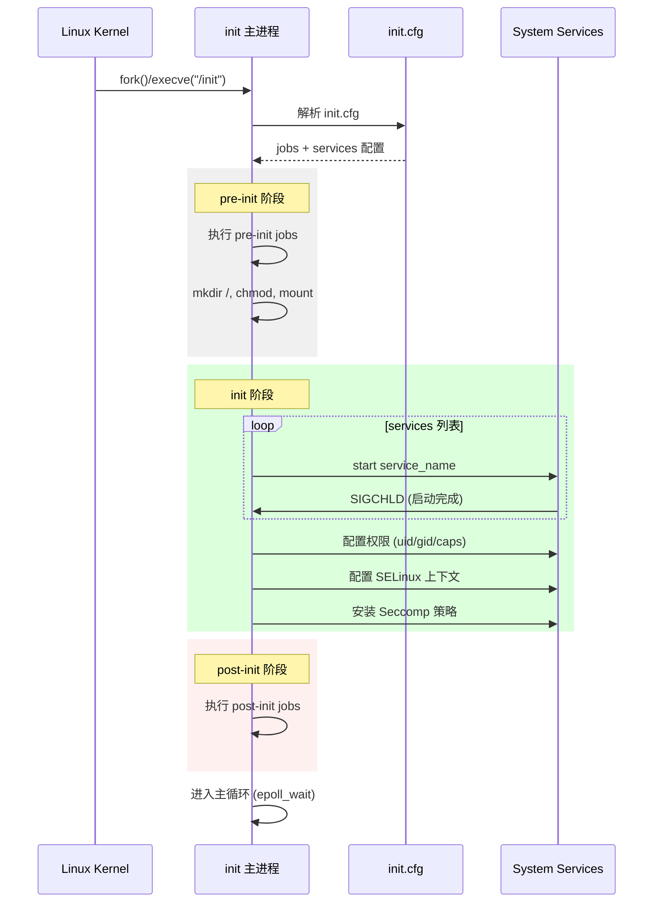

# 架构说明

## 组件图

```
┌────────────────────────────────────────────────────────────────┐
│                      OpenHarmony init 模块                       │
├────────────────────────────────────────────────────────────────┤
│  ┌─────────────────┐  ┌─────────────────┐  ┌─────────────────┐ │
│  │   device_info   │  │    ueventd      │  │    watchdog     │ │
│  │   设备信息服务   │  │   设备事件守护   │  │    看门狗服务    │ │
│  └─────────────────┘  └─────────────────┘  └─────────────────┘ │
├────────────────────────────────────────────────────────────────┤
│                        services/                               │
│  ┌─────────────────────────────────────────────────────────┐   │
│  │                     init 主进程                           │   │
│  │  ┌───────────┐ ┌───────────┐ ┌───────────┐ ┌───────────┐│   │
│  │  │ init.cfg  │ │  Job 执行  │ │ Service   │ │  权限配置  ││   │
│  │  │   解析    │ │   引擎     │ │   管理     │ │   模块     ││   │
│  │  └───────────┘ └───────────┘ └───────────┘ └───────────┘│   │
│  └─────────────────────────────────────────────────────────┘   │
│  ┌───────────────┐  ┌───────────────┐  ┌───────────────────┐ │
│  │  参数服务      │  │   事件循环     │  │    功能模块        │ │
│  │  (param)      │  │ (loopevent)   │  │  (modules/*)      │ │
│  │  - 参数读写    │  │  - epoll       │  │  - bootevent      │ │
│  │  - 参数监听    │  │  - socket      │  │  - crashhandler   │ │
│  │               │  │  - signal      │  │  - seccomp        │ │
│  │               │  │  - timer       │  │  - selinux       │ │
│  └───────────────┘  └───────────────┘  └───────────────────┘ │
├────────────────────────────────────────────────────────────────┤
│  ┌─────────────────┐  ┌─────────────────────────────────────┐ │
│  │   sandbox       │  │              interfaces/             │ │
│  │   沙箱服务       │  │  ┌─────────────┐  ┌─────────────┐  │ │
│  │                 │  │  │  innerkits  │  │    kits      │  │ │
│  │                 │  │  │  (内部接口)  │  │  (N-API)     │  │ │
│  └─────────────────┘  │  └─────────────┘  └─────────────┘  │ │
│                      └─────────────────────────────────────┘ │
└────────────────────────────────────────────────────────────────┘
                          ↑
                    [SystemAbility IPC]
                          ↓
              ┌───────────────────────────────┐
              │     samgr (服务管理框架)       │
              └───────────────────────────────┘
```

## 数据流

```
                            init.cfg (JSON)
                                ↓
                    ┌─────────────────────┐
                    │   Init 配置解析器     │
                    │ (init_config.c)      │
                    └─────────────────────┘
                            │
          ┌─────────────────┼─────────────────┐
          ↓                 ↓                 ↓
    ┌─────────┐      ┌─────────────┐   ┌─────────┐
    │ Job 引擎 │      │ Service 管理 │   │权限配置 │
    │(jobs)   │      │(services)   │   │(DAC/    │
    │         │      │             │   │Caps)    │
    └─────────┘      └─────────────┘   └─────────┘
          │                 │                 │
          ↓                 ↓                 ↓
    pre-init          start service      setuid gid
    init              restart           setcap
    post-init         monitor            selinux
                                         seccomp
```

## 线程模型

```
init 主进程线程结构:

┌─────────────────────────────────────────┐
│           init 主线程                    │
│   - 配置解析                             │
│   - Job 执行                            │
│   - Service 生命周期管理                 │
│   - SIGCHLD 信号处理                     │
├─────────────────────────────────────────┤
│      (可选) 子线程                        │
│   - logd 通信线程                        │
│   - 参数监听线程                         │
├─────────────────────────────────────────┤
│      (可选) 独立进程                     │
│   - ueventd (独立守护进程)               │
│   - watchdog (独立守护进程)              │
│   - param_sa (独立 SA 进程)              │
└─────────────────────────────────────────┘
```

## 关键时序

### 启动时序



### 参数读写时序

```mermaid
sequenceDiagram
    participant J as JS/ArkTS
    participant N as N-API (native_parameters_js.cpp)
    participant P as param 服务
    participant K as Kernel
    
    J->>N: systemparameter.set(key, value)
    N->>P: SetParameter(key, value)
    P->>K: sysprop_set(key, value)
    K-->>P: 返回结果
    P-->>N: 返回状态
    N-->>J: Promise/Callback
    
    Note over J,N,P,K: 异步路径
    
    J->>N: systemparameter.getSync(key)
    N->>P: GetParameter(key, default)
    P->>K: sysprop_get(key)
    K-->>P: 返回值
    P-->>N: 返回值
    N-->>J: 返回结果
    
    Note over J,N,P,K: 同步路径 (getSync)
```

## 模块依赖关系

```
                    ┌─────────────────┐
                    │   init (主进程)   │
                    └────────┬────────┘
                             │
           ┌─────────────────┼─────────────────┐
           ↓                 ↓                 ↓
     ┌────────────┐   ┌────────────┐   ┌────────────┐
     │ loopevent  │   │   modules  │   │   param    │
     │ (事件循环)  │   │ (功能模块)  │   │ (参数服务)  │
     └────────────┘   └─────┬──────┘   └──────┬─────┘
                            │                 │
                            ↓                 ↓
               ┌─────────────────────┐  ┌─────────────────┐
               │   services/utils    │  │ samgr (IPC)     │
               │   (工具函数库)      │  │                 │
               └─────────────────────┘  └─────────────────┘
```

**依赖说明**:

| 模块 | 被依赖 | 依赖 |
|------|--------|------|
| init | begetctl, modules | loopevent, param, sandbox |
| loopevent | init | - |
| modules | - | loopevent |
| param | init, modules | - |
| sandbox | init | - |

---

## IPC 机制详解

### SystemAbility 框架

Init 模块通过 SystemAbility 框架与其他系统服务通信：

| 组件 | 文件 | 说明 |
|------|------|------|
| `WatcherManager` | `services/param/watcher/proxy/watcher_manager.h` | 继承 SystemAbility，作为参数观察者服务 |
| `DeviceInfoLoad` | `device_info/device_info_load.h` | 继承 SystemAbilityLoadCallbackStub，实现异步加载回调 |
| `ISystemAbilityManager` | 多个文件 | 系统能力管理器接口 |

**调用示例**:

```cpp
// watcher_manager_kits.cpp
sptr<IRemoteObject> sa = GetSystemAbility(参数观察者服务ID);
```

### Binder 设备配置

| 设备节点 | 配置文件 | 说明 |
|----------|----------|------|
| `/dev/binder` | `ueventd/etc/ueventd.config` | 主 Binder 通信 |
| `/dev/hwbinder` | `ueventd/etc/ueventd.config` | 硬件 Binder |
| `/dev/vndbinder` | `ueventd/etc/ueventd.config` | 虚拟 Binder |

---

## 权限管理机制

### DAC (自主访问控制)

| 配置项 | 文件 | 说明 |
|--------|------|------|
| `uid` | `init_service_manager.c` | 用户 ID 解析 |
| `gid` | `init_service_manager.c` | 组 ID 解析 |
| `gIDArray` | `init_service.h` | 附加组数组 |

**关键函数**:

```c
// services/init/init_service_manager.c
int DecodeUid(const char *uidStr);    // UID 解析
int DecodeGid(const char *gidStr);    // GID 解析
int GetServiceUid(const char *name);  // 获取服务 UID
int GetServiceGid(const char *name); // 获取服务 GID
```

### Capabilities

| 配置项 | 文件 | 说明 |
|--------|------|------|
| `caps` | `init_capability.c` | 服务能力配置 |

**关键常量**:

```c
// services/init/include/init_service.h
#define FULL_CAP 0xFFFFFFFF              // 全能力掩码
#define MAX_CAPS_CNT_FOR_ONE_SERVICE 100  // 单服务最大能力数

// services/init/init_capability.c
int InitServiceCaps(const char *serviceName, int *caps, int capCount);
int GetCapByString(const char *capStr);  // 字符串转能力值
```

### SELinux

| 组件 | 文件 | 说明 |
|------|------|------|
| `selinux_adp.c` | `services/modules/selinux/` | SELinux 适配层 |

**关键函数**:

```c
// services/modules/selinux/selinux_adp.c
int setexeccon(const char *con);        // 设置执行上下文
int load selinux_policy();               // 加载策略
```

**配置文件**:

```json
// init.cfg services 配置
{
    "name": "console",
    "secon": "u:r:console:s0"
}
```

### Seccomp

| 组件 | 文件 | 说明 |
|------|------|------|
| `seccomp_policy.c` | `services/modules/seccomp/` | 策略加载和安装 |

**策略文件位置**:

```
services/modules/seccomp/seccomp_policy/
├── system.seccomp.policy      // 系统服务策略
├── app.seccomp.policy         // 普通应用策略
├── spawn.seccomp.policy       // 应用孵化策略
├── nwebspawn.seccomp.policy   // Web 渲染进程策略
└── app_privilege.seccomp.policy  // 特权应用策略
```

**关键函数**:

```c
// services/modules/seccomp/seccomp_policy.c
int SetSeccompPolicyWithName(const char *name, int type);
```

---

## 相关跳转

- [N-API 接口](03_NAPI.md)
- [Inner API](04_InnerAPI.md)
- [安全机制](06_Security.md)
