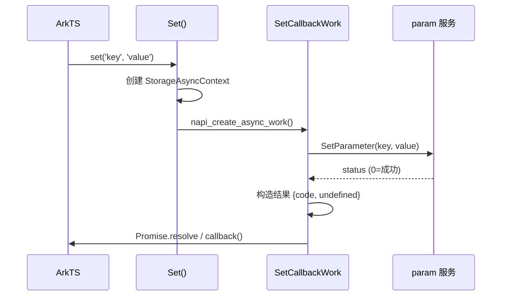
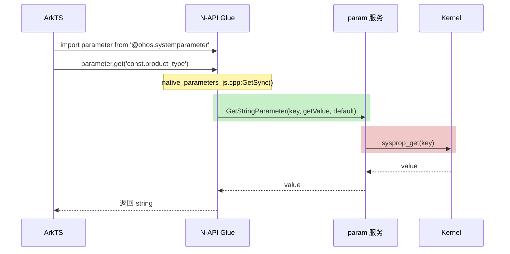
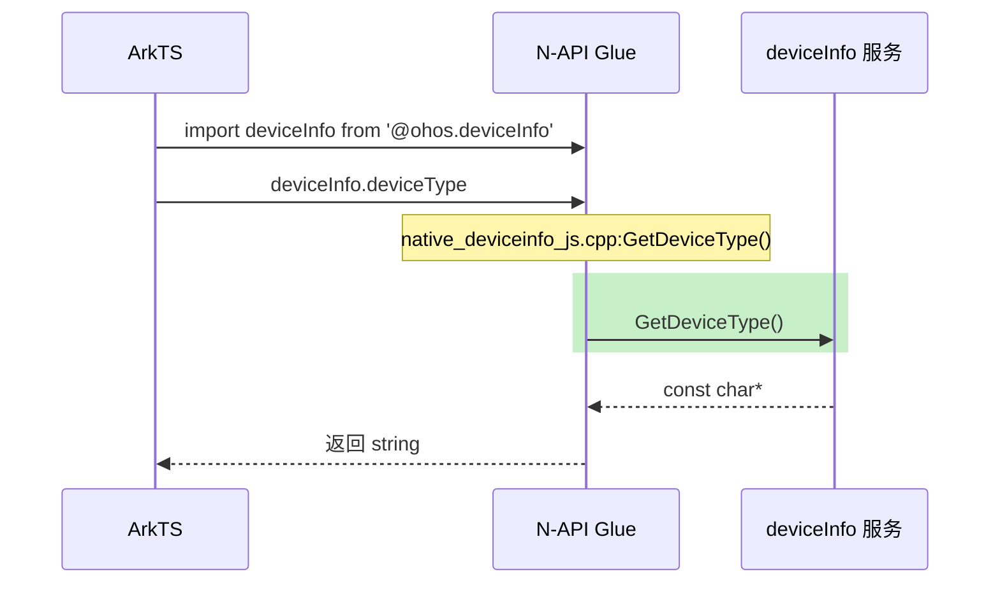

# N-API 对外接口

本章节描述 init 模块对外暴露的 JavaScript/ArkTS API，基于源码分析。

## API 清单

| 模块 | API 数量 | 文件路径 | 注册行号 |
|------|----------|----------|----------|
| **systemparameter** | 6+ | `interfaces/kits/jskits/src/native_parameters_js.cpp` | :349 |
| **deviceInfo** | 43+ | `interfaces/kits/jskits/src/native_deviceinfo_js.cpp` | :723 |
| **systemParameterEnhance** | 4-6 | `interfaces/kits/jskits/src_enhance/native_parameters_js.cpp` | :441 |
| **systemParameterV9** | 4-6 | `interfaces/kits/jskits/src_enhance/native_parameters_js.cpp` | :442 |
| **canIUse** (全局) | 1 | `interfaces/kits/syscap_ts/src/syscap_ts.cpp` | - |

---

## 1. systemparameter 模块

### 模块信息

| 属性 | 值 |
|------|-----|
| **源文件** | `native_parameters_js.cpp` |
| **模块名** | `systemparameter` |
| **注册函数** | `napi_module_register(&_module)` |
| **注册位置** | 第 349 行 |
| **N-API 版本** | 1 |

### 关键常量定义

```cpp
// native_parameters_js.cpp:18-21
static constexpr int MAX_LENGTH = 128;        // key 最大长度
static constexpr int ARGC_NUMBER = 2;          // 参数数量
static constexpr int ARGC_THREE_NUMBER = 3;    // 最大参数数量
static constexpr int BUF_LENGTH = 256;         // 缓冲区大小
```

### API 详细说明

#### 1.1 set(key, value, callback?)

**C++ 实现**: `Set()` (第 86 行)

**功能**: 异步设置系统参数

**参数解析**:
```cpp
// argv[0] -> key (string, 长度 < 128)
// argv[1] -> value (string, 长度 < 256)  
// argv[2] -> callback (function, optional)
```

**异步工作流程**:


**类型校验**:
```cpp
// 第 97-111 行
napi_valuetype valueType = napi_null;
napi_typeof(env, argv[i], &valueType);

if (i == 0 && valueType == napi_string) {
    // key 解析
} else if (i == 1 && valueType == napi_string) {
    // value 解析
} else if (i == 2 && valueType == napi_function) {
    // callback 引用
}
```

#### 1.2 setSync(key, value)

**C++ 实现**: `SetSync()` (第 125 行)

**功能**: 同步设置系统参数，直接抛出异常

**错误处理**:
```cpp
// 第 157-163 行
int setResult = SetParameter(keyStr.c_str(), valueStr.c_str());
if (setResult != 0) {
    std::stringstream ss;
    ss << "set: " << keyStr << " failed, error code: " << setResult;
    napi_throw_error(env, nullptr, ss.str().c_str());
}
```

#### 1.3 get(key, value?, callback?)

**C++ 实现**: `Get()` (第 265 行)

**功能**: 异步获取参数

**参数说明**:
- `key`: 必填，参数名
- `value`: 选填，默认值
- `callback`: 选填，回调函数

**返回值**: Promise\<string>

#### 1.4 getSync(key, default?)

**C++ 实现**: `GetSync()` (第 167 行)

**功能**: 同步获取参数

**内部实现**:
```cpp
// 第 207 行
int ret = OHOS::system::GetStringParameter(keyStr, getValue, valueStr);

// 成功时返回参数值
// 失败时返回 undefined
```

#### 1.5 wait(key, value, timeout?)

**C++ 实现**: `ParamWait()` (条件编译: `PARAM_SUPPORT_WAIT`)

**功能**: 等待参数达到指定值

**参数说明**:
- `key`: 必填，参数名
- `value`: 必填，期望值
- `timeout`: 选填，超时时间(ms)

#### 1.6 getWatcher(key)

**C++ 实现**: `GetWatcher()` (条件编译: `PARAM_SUPPORT_WAIT`)

**功能**: 创建参数监视器

---

### 内部结构: StorageAsyncContext

```cpp
// native_parameters_js.cpp:23-36
typedef struct StorageAsyncContext {
    napi_env env = nullptr;
    napi_async_work work = nullptr;
    
    char key[BUF_LENGTH] = { 0 };      // 参数键
    size_t keyLen = 0;
    char value[BUF_LENGTH] = { 0 };     // 参数值/默认值
    size_t valueLen = 0;
    napi_deferred deferred = nullptr;   // Promise 延迟对象
    napi_ref callbackRef = nullptr;      // 回调引用
    
    int status = -1;                    // 执行状态
    std::string getValue;               // 获取结果
} StorageAsyncContext;
```

---

### 参数校验规则

| 参数 | 类型要求 | 长度限制 | 校验位置 |
|------|----------|----------|----------|
| `key` | string | ≤ 127 字符 | 第 140-142 行 |
| `value` | string | ≤ 255 字符 | 第 146-149 行 |
| `timeout` | number | - | - |

**校验失败处理**:
- `key` 过长: 返回 `nullptr` (第 141, 148 行)
- 类型不匹配: `NAPI_ASSERT` 抛出异常 (第 93, 110 行)

---

## 2. deviceInfo 模块

### 模块信息

| 属性 | 值 |
|------|-----|
| **源文件** | `native_deviceinfo_js.cpp` |
| **模块名** | `deviceInfo` |
| **注册函数** | `napi_module_register(&_module)` |
| **注册位置** | 第 723 行 |
| **日志标签** | `DEVICEINFO_JS` |

### 设备类型常量

```cpp
// native_deviceinfo_js.cpp:51-62
typedef enum {
    DEV_INFO_OK,
    DEV_INFO_ENULLPTR,
    DEV_INFO_EGETODID,
    DEV_INFO_ESTRCOPY
} DevInfoError;

typedef enum {
    CLASS_LEVEL_HIGH,
    CLASS_LEVEL_MEDIUM,
    CLASS_LEVEL_LOW
} PerformanceClassLevel;
```

### 设备信息属性 (43+)

| JS 属性 | C++ 实现函数 | 返回类型 | 定义行号 |
|---------|--------------|----------|----------|
| `deviceType` | `GetDeviceType()` | string | :65 |
| `manufacture` | `GetManufacture()` | string | :76 |
| `brand` | `GetBrand()` | string | :88 |
| `marketName` | `GetMarketName()` | string | :100 |
| `productSeries` | `GetProductSeries()` | string | :112 |
| `productModel` | `GetProductModel()` | string | :124 |
| `productModelAlias` | `GetProductModelAlias()` | string | :136 |
| `softwareModel` | `GetSoftwareModel()` | string | :148 |
| `hardwareModel` | `GetHardwareModel()` | string | :160 |
| `hardwareProfile` | `GetHardwareProfile()` | string | :172 |
| `serial` | `GetSerial()` | string | :184 |
| `bootloaderVersion` | `GetBootloaderVersion()` | string | :196 |
| `abiList` | `GetAbiList()` | string | :208 |
| `securityPatchTag` | `GetSecurityPatchTag()` | string | :220 |
| `displayVersion` | `GetDisplayVersion()` | string | :232 |
| `incrementalVersion` | `GetIncrementalVersion()` | string | :244 |
| `osReleaseType` | `GetOsReleaseType()` | string | :256 |
| `osFullName` | `GetOSFullName()` | string | :268 |
| `majorVersion` | `GetMajorVersion()` | int32 | :280 |
| `seniorVersion` | `GetSeniorVersion()` | int32 | :292 |
| `featureVersion` | `GetFeatureVersion()` | int32 | :304 |
| `buildVersion` | `GetBuildVersion()` | int32 | :316 |
| `sdkApiVersion` | `GetSdkApiVersion()` | int32 | :328 |
| `sdkMinorApiVersion` | `GetSdkMinorApiVersion()` | int32 | :340 |
| `sdkPatchApiVersion` | `GetSdkPatchApiVersion()` | int32 | :352 |
| `firstApiVersion` | `GetFirstApiVersion()` | int32 | :364 |
| `versionId` | `GetVersionId()` | string | :376 |
| `buildType` | `GetBuildType()` | string | :388 |
| `buildUser` | `GetBuildUser()` | string | :400 |
| `buildHost` | `GetBuildHost()` | string | :412 |
| `buildTime` | `GetBuildTime()` | string | :424 |
| `buildRootHash` | `GetBuildRootHash()` | string | :436 |
| `udid` | `GetDevUdid()` | string | :448 |
| `distributionOSName` | `NAPI_GetDistributionOSName()` | string | :460 |
| `distributionOSVersion` | `NAPI_GetDistributionOSVersion()` | string | :472 |
| `distributionOSApiVersion` | `NAPI_GetDistributionOSApiVersion()` | int32 | :484 |
| `distributionOSApiName` | `NAPI_GetDistributionOSApiName()` | string | :496 |
| `distributionOSReleaseType` | `NAPI_GetDistributionOSReleaseType()` | string | :508 |
| `ODID` | `GetDevOdid()` | string | :520 |
| `diskSN` | `GetDiskSN()` | string | :532 |
| `performanceClass` | `GetPerformanceClass()` | int32 | :630 |
| `chipType` | `GetChipType()` | string | :642 |
| `bootCount` | `GetBootCount()` | int32 | :654 |

### 属性注册模式

```cpp
// native_deviceinfo_js.cpp:648-695
napi_property_descriptor desc[] = {
    {"deviceType", nullptr, nullptr, GetDeviceType, nullptr, nullptr, napi_default, nullptr},
    {"manufacture", nullptr, nullptr, GetManufacture, nullptr, nullptr, napi_default, nullptr},
    // ... 更多属性
};

NAPI_CALL(env, napi_define_properties(env, exports, 
    sizeof(desc) / sizeof(napi_property_descriptor), desc));
```

---

## 3. systemParameterEnhance / systemParameterV9 模块

与 `systemparameter` 模块 API 相同，但增加了错误处理增强。

**注册位置**: `native_parameters_js.cpp:441-442`

```cpp
napi_module_register(&_module);      // systemParameterEnhance
napi_module_register(&_module_old);  // systemParameterV9
```

**条件编译**:

```cpp
#ifdef PARAM_SUPPORT_WAIT
    // 支持 wait/getWatcher
#endif
```

---

## 4. syscap (canIUse)

### 全局函数

| JS API | C++ 实现 | 文件 | 说明 |
|--------|----------|------|------|
| `canIUse(capabilityName)` | `CanIUse()` | `syscap_ts.cpp` | 查询系统能力 |

---

## N-API 注册模式详解

### 标准注册代码

```cpp
// native_parameters_js.cpp (通用模式)
static napi_module _module = {
    .nm_version = 1,           // N-API 版本
    .nm_flags = 0,              // 标志位
    .nm_filename = NULL,        // 模块文件名
    .nm_register_func = Init,  // 初始化函数
    .nm_modname = "模块名",     // 模块名
    .nm_priv = ((void *)0),    // 私有数据
    .reserved = { 0 }           // 保留字段
};

extern "C" __attribute__((constructor)) void RegisterModule(void) {
    napi_module_register(&_module);
}
```

### Init 函数模式

```cpp
// native_deviceinfo_js.cpp:643-703
static napi_value Init(napi_env env, napi_value exports)
{
    // 1. 定义属性描述符数组
    napi_property_descriptor desc[] = {
        {"属性名", getter, setter, getter函数, setter函数, 
         napi_default, 私有数据},
        DECLARE_NAPI_FUNCTION("apiName", CppFunction),
    };
    
    // 2. 定义属性
    napi_define_properties(env, exports, 
        sizeof(desc) / sizeof(napi_property_descriptor), desc);
    
    // 3. 创建枚举/类 (如有)
    CreateEnumLevelState(env, exports);
    CreateDeviceTypes(env, exports);
    
    return exports;
}
```

---

## 调用链图示

### systemparameter.get 调用链



### deviceInfo 调用链



---

## 相关跳转

- [概览](01_Overview.md)
- [架构](02_Architecture.md)
- [Inner API](04_InnerAPI.md)
