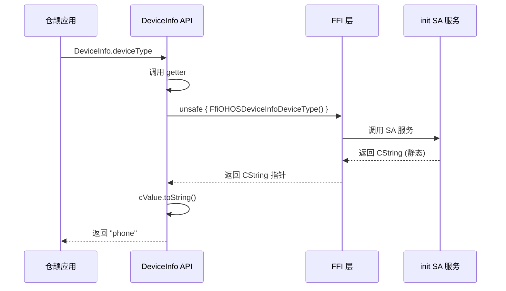
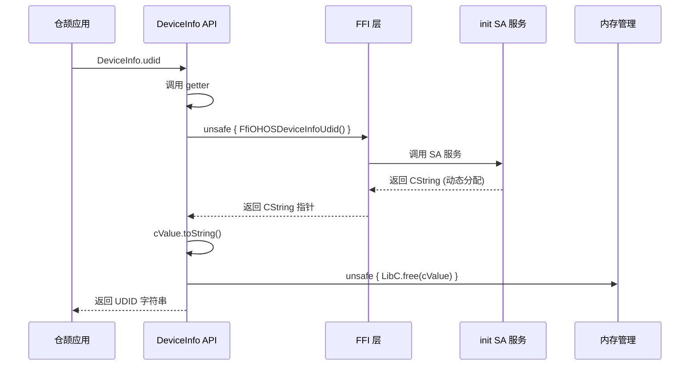

# 架构说明

## 目的

本文档详细说明 startup_cangjie_wrapper 的架构，包括组件图、数据流、线程模型和关键时序。

## 适用范围

- 需要深入理解系统架构的开发者
- 准备进行性能优化或故障排查的工程师

---

## 整体架构

### 分层架构

```
┌──────────────────────────────────────────────────────────┐
│                仓颉应用（用户代码）                    │
│                                                      │
│  import ohos.device_info                               │
│  let deviceType = DeviceInfo.deviceType                  │
└─────────────────────┬──────────────────────────────────┘
                      │
                      ↓ API 调用
┌──────────────────────────────────────────────────────────┐
│              接口层（Interface Layer）                │
│                                                      │
│  ohos.device_info.DeviceInfo                           │
│  - public static prop deviceType: String                │
│  - public static prop manufacture: String               │
│  - ... (32 个公开属性)                                │
│                                                      │
│  注解: @APILevel(since: "22",                       │
│         syscap: "SystemCapability.Startup.SystemInfo")   │
└─────────────────────┬──────────────────────────────────┘
                      │
                      ↓ unsafe FFI 调用
┌──────────────────────────────────────────────────────────┐
│              框架层（Framework Layer）               │
│                                                      │
│  DeviceInfo Wrapper（device_info.cj）                  │
│  - foreign func FfiOHOSDeviceInfoDeviceType(): CString  │
│  - foreign func FfiOHOSDeviceInfoManufacture(): CString│
│  - ... (34 个 FFI 函数)                              │
│                                                      │
│  内存管理:                                            │
│  - 大部分: 静态 CString，无需 free                    │
│  - udid: 动态分配，需 LibC.free()                    │
└─────────────────────┬──────────────────────────────────┘
                      │
                      ↓ SA 服务调用
┌──────────────────────────────────────────────────────────┐
│           依赖层（Dependency Layer）                  │
│                                                      │
│  init 组件设备信息 SA 服务                             │
│  (cj_device_info_ffi)                                 │
│  - 提供设备信息查询能力                                │
│  - 实现设备信息采集和存储                              │
└──────────────────────────────────────────────────────────┘
```

**证据**:
- 架构图: `figures/startup_cangjie_wrapper_architecture_zh.png`
- README 架构说明: `README_zh.md:13-25`

---

## 组件详解

### 1. 接口层（Interface Layer）

#### ohos.device_info.DeviceInfo 类

**类型**: 静态类（static class）

**职责**: 暴露设备信息查询 API

**特点**:
- 所有属性均为 `public static`
- 无实例化，通过类名直接访问
- 返回类型为 `String` 或 `Int32`
- 使用 `@APILevel` 注解标注 API 级别

**代码示例**:
```cangjie
// Line 103-118 in device_info.cj
@!APILevel[
    since: "22",
    syscap: "SystemCapability.Startup.SystemInfo"
]
public class DeviceInfo {
    @!APILevel[
        since: "22",
        syscap: "SystemCapability.Startup.SystemInfo"
    ]
    public static prop deviceType: String {
        get() {
            let cValue = unsafe { FfiOHOSDeviceInfoDeviceType() }
            cValue.toString()
        }
    }
}
```

**证据**: `ohos/device_info/device_info.cj:103-118`

---

### 2. 框架层（Framework Layer）

#### DeviceInfo Wrapper

**实现文件**: `ohos/device_info/device_info.cj`

**职责**: 实现 FFI 桥接

#### FFI 函数

**类型**: foreign func

**命名模式**: `FfiOHOSDeviceInfo*()`

**返回类型**: `CString` 或 `Int64`

**总数**: 34 个

**代码示例**:
```cangjie
// Line 22-94 in device_info.cj
foreign {
    func FfiOHOSDeviceInfoDeviceType(): CString
    func FfiOHOSDeviceInfoManufacture(): CString
    func FfiOHOSDeviceInfoUdid(): CString
    func FfiOHOSDeviceInfoMajorVersion(): Int64
    ...
}
```

**证据**: `ohos/device_info/device_info.cj:22-94`

---

### 3. 依赖层（Dependency Layer）

#### init 组件 SA 服务

**依赖项**: `init:cj_device_info_ffi`

**职责**: 提供设备信息 SA 服务

**说明**:
- 实现设备信息的实际采集
- 维护设备信息的存储
- 提供 FFI 接口供上层调用

**证据**:
- `ohos/device_info/BUILD.gn:28`
- `bundle.json:24-26`

---

## 数据流

### 典型调用流程（deviceType）

```
1. 用户代码
   ↓
   DeviceInfo.deviceType
   ↓
2. 接口层（device_info.cj:112）
   public static prop deviceType: String {
       get() {
           let cValue = unsafe { FfiOHOSDeviceInfoDeviceType() }
           cValue.toString()
       }
   }
   ↓
3. FFI 调用（device_info.cj:25）
   FfiOHOSDeviceInfoDeviceType() -> CString
   ↓
4. init SA 服务
   返回静态 CString 指针
   ↓
5. 类型转换
   cValue.toString() -> String
   ↓
6. 返回用户
   "phone" 或其他设备类型
```

**证据**: `ohos/device_info/device_info.cj:112-118,25`

### 特殊调用流程（udid - 需要内存管理）

```
1. 用户代码
   ↓
   DeviceInfo.udid
   ↓
2. 接口层（device_info.cj:545-552）
   public static prop udid: String {
       get() {
           let cValue = unsafe { FfiOHOSDeviceInfoUdid() }
           let value = cValue.toString()
           unsafe { LibC.free(cValue) }  // 手动释放内存
           return value
       }
   }
   ↓
3. FFI 调用（device_info.cj:33）
   FfiOHOSDeviceInfoUdid() -> CString (动态分配)
   ↓
4. init SA 服务
   返回动态分配的 CString 指针
   ↓
5. 类型转换
   cValue.toString() -> String
   ↓
6. 内存释放
   LibC.free(cValue)
   ↓
7. 返回用户
   "dff3cdfd-7beb-1e7d-fdf7-1dbfddd7d30c"
```

**证据**: `ohos/device_info/device_info.cj:545-552,33`

---

## 线程模型

### 同步调用模式

**特点**: 所有 API 均为同步调用

**无异步设计**:
- 无 Promise 模式
- 无 Callback 模式
- 无工作队列
- 无线程池

**执行流程**:
```
调用线程
  ↓
DeviceInfo.xxx
  ↓
unsafe FFI 调用（阻塞等待）
  ↓
init SA 服务返回
  ↓
返回结果
```

**证据**: `ohos/device_info/device_info.cj` - 所有属性均为 `get()` 方法，无异步标记

---

## 资源生命周期

### CString 管理

| API | 返回类型 | 内存管理策略 | 证据 |
|------|---------|-------------|------|
| deviceType | CString | 静态变量，无需 free | `device_info.cj:115` |
| manufacture | CString | 静态变量，无需 free | `device_info.cj:130` |
| ... | CString | 静态变量，无需 free | ... |
| udid | CString | 动态分配，需 LibC.free() | `device_info.cj:549` |

### Int64 管理

| API | 返回类型 | 内存管理策略 | 证据 |
|------|---------|-------------|------|
| majorVersion | Int64 | 值类型，无需管理 | `device_info.cj:368` |
| seniorVersion | Int64 | 值类型，无需管理 | `device_info.cj:384` |
| ... | Int64 | 值类型，无需管理 | ... |

---

## 权限控制流程

### ACCESS_UDID 权限检查

```
1. 用户调用 DeviceInfo.udid
   ↓
2. DeviceInfo.udid getter
   ↓
3. 注解: @APILevel permission: "ohos.permission.sec.ACCESS_UDID"
   ↓
4. 系统框架层检查
   - 是否声明了 ohos.permission.sec.ACCESS_UDID？
   - 应用是否有权限？
   ↓
5. 检查通过 → 执行 FFI 调用
   检查失败 → 抛出异常（由系统框架层处理）
   ↓
6. 返回结果或异常
```

**证据**:
- `ohos/device_info/device_info.cj:540-544` - 注解
- `README_zh.md:49` - 权限说明

---

## 依赖关系图

### 模块级依赖

```
ohos.device_info
  │
  ├─ external_deps
  │   └─ init:cj_device_info_ffi
  │
  └─ cj_external_deps
      └─ cangjie_ark_interop:ohos.labels
```

**证据**: `ohos/device_info/BUILD.gn:28-32`

### 包级依赖

```
ohos.device_info
  │
  ├─ import ohos.labels.{APILevel, Hide}
  │
  └─ foreign func (34 个 FFI 函数)
      └─ init 组件 SA 服务
```

**证据**: `ohos/device_info/device_info.cj:18-94`

---

## 关键时序图

### 获取设备类型



### 获取 UDID（带内存管理）



---

## 模拟实现架构

### mock/ohos.device_info.cj

**用途**: Windows/Mac 开发环境

**特点**:
- 无 FFI 函数声明
- 所有属性返回默认值
- 无内存管理逻辑

**调用流程**:
```
1. Windows/Mac 环境
2. 编译时选择 mock/ohos.device_info.cj
3. DeviceInfo.xxx getter 返回默认值
   - String 类型的返回 String()
   - Int32 类型的返回 0
```

**证据**: `ohos/device_info/BUILD.gn:22-24`, `mock/ohos.device_info.cj:1-416`

---

## 关键结论

1. **三层架构**: 接口层、框架层、依赖层，职责清晰
2. **同步设计**: 所有 API 均为同步调用，无异步模式
3. **FFI 桥接**: 通过 34 个 FFI 函数桥接到 init SA 服务
4. **内存管理**: 大部分属性无需手动释放，udid 需要手动 free
5. **权限控制**: 通过注解声明权限，实际检查在系统框架层
6. **无状态**: DeviceInfo 为静态类，无实例化，无状态
7. **平台适配**: 通过编译配置切换实现不同平台的适配

---

## 相关跳转链接

- [00_Overview.md](00_Overview.md) - 项目概览
- [01_Project_Positioning.md](01_Project_Positioning.md) - 项目定位
- [04_Cangjie_API.md](04_Cangjie_API.md) - API 清单
- [05_Internal_API.md](05_Internal_API.md) - 内部 API
- [appendix/Callgraphs.md](appendix/Callgraphs.md) - 调用链

---

## 参考资料

- [OpenHarmony FFI 开发指南](https://developer.openharmony.cn/cn/docs/documentation/guide)
- [仓颉语言 unsafe 块](https://developer.openharmony.cn/cn/doc/cangjie-unsafe)
- [OpenHarmony SA 服务开发](https://docs.openharmony.cn/application-dev/ability/sa-service)

---

*最后更新: 2026-02-06*
