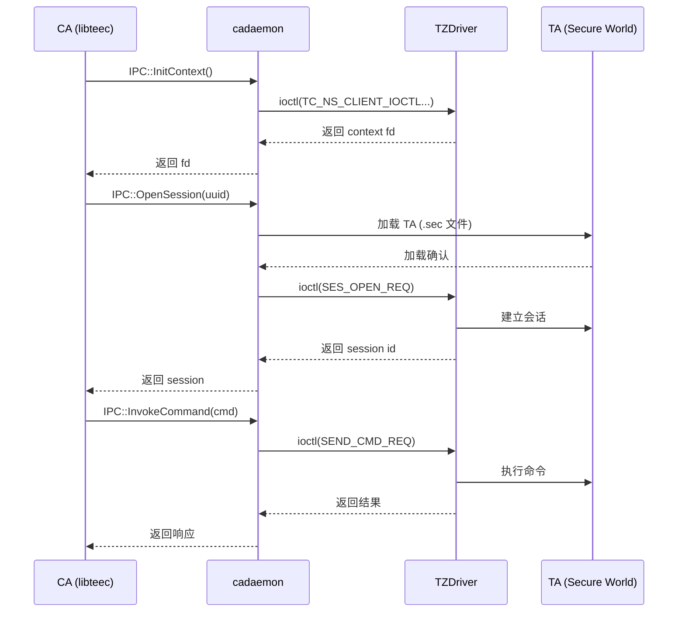
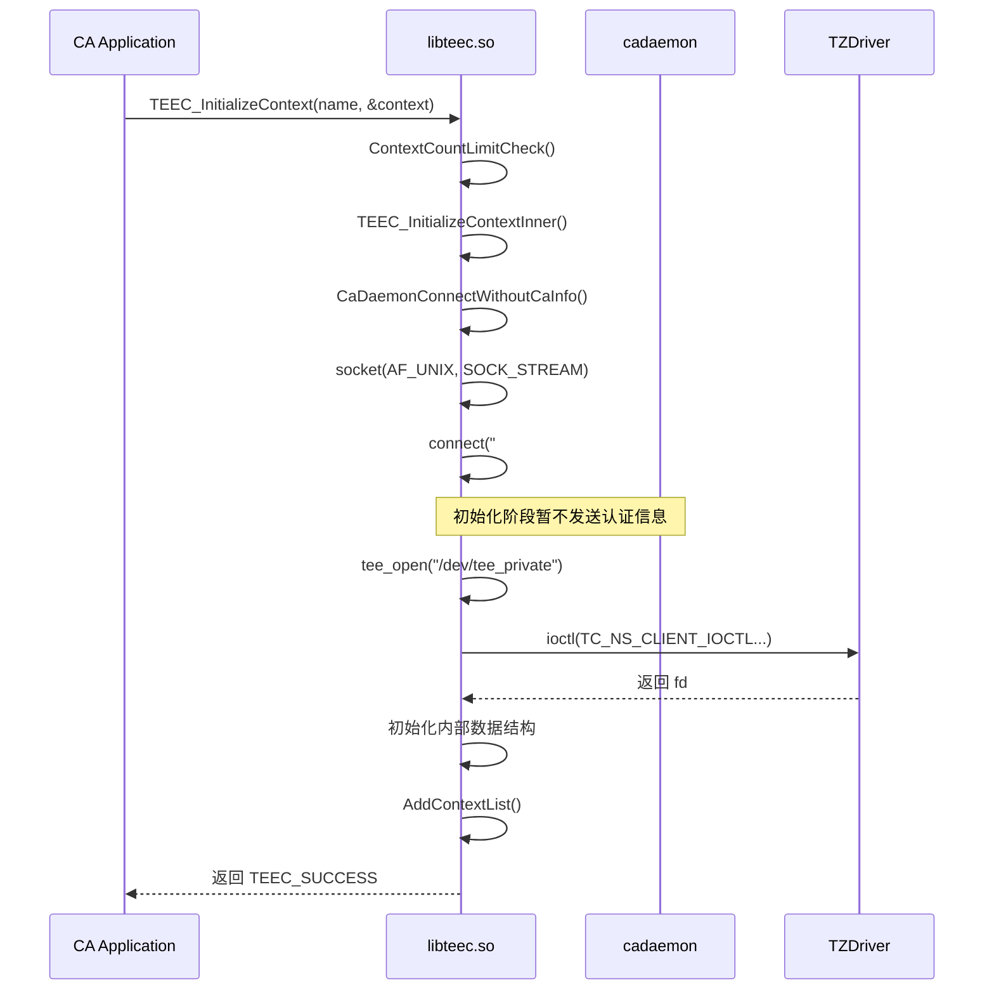
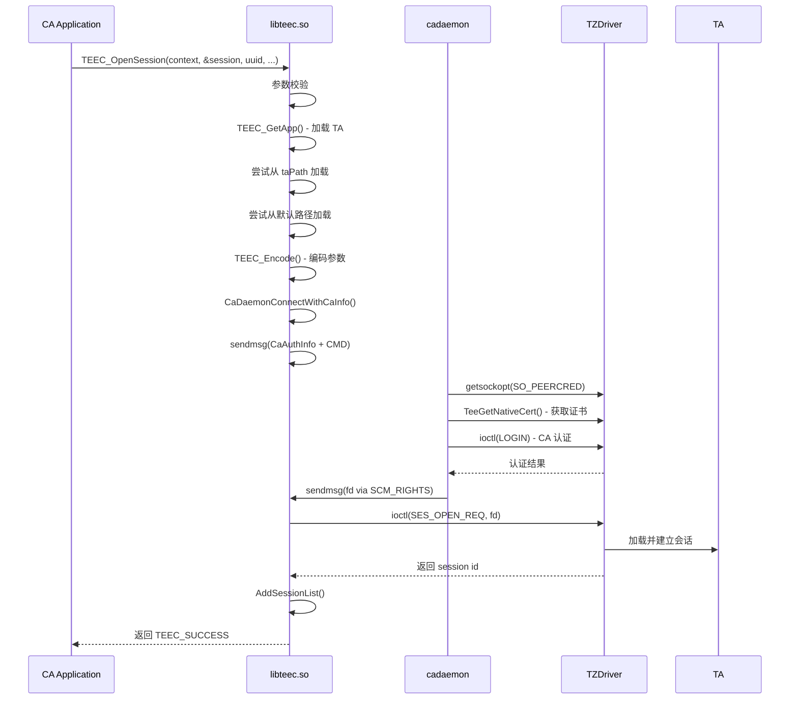
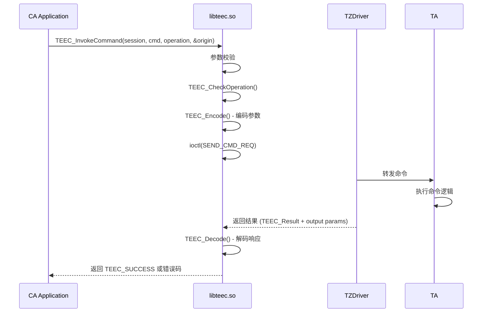

# TEE Client 架构说明

## 1. 整体架构

### 1.1 架构概览

```
┌─────────────────────────────────────────────────────────────────────────────┐
│                          REE (Rich Execution Environment)                   │
│                                                                            │
│  ┌─────────────────────────────────────────────────────────────────────┐   │
│  │                        CA (Client Application)                       │   │
│  │          ┌─────────────────────┐  ┌─────────────────────┐            │   │
│  │          │   libteec.so        │  │  libteec_vendor.so  │            │   │
│  │          │  (系统组件/HAP用)    │  │   (芯片组件用)        │            │   │
│  │          └──────────┬──────────┘  └──────────┬──────────┘            │   │
│  │                     │                         │                        │   │
│  └────────────────────┼─────────────────────────┼────────────────────────┘   │
│                        │                         │                           │
│                        ▼                         ▼                           │
│              ┌───────────────┐         ┌─────────────────┐                  │
│              │  cadaemon      │         │    teecd        │                  │
│              │  (SA 8001)     │◄────────│  (守护进程)      │                  │
│              │  IPC框架       │  Socket │  CA认证         │                  │
│              └───────┬───────┘         └────────┬────────┘                  │
│                      │                          │                            │
│                      ▼                          ▼                            │
│              ┌─────────────────────────────────────────────────────────┐    │
│              │              TZDriver (/dev/tee*)                       │    │
│              │              (内核态 TEE 驱动)                           │    │
│              └────────────────────────┬────────────────────────────────┘    │
│                                       │                                     │
│                                       ▼                                     │
│              ┌─────────────────────────────────────────────────────────┐    │
│              │                   TEE Secure World                       │    │
│              │                   (可信执行环境)                          │    │
│              │    ┌─────────────┐  ┌─────────────┐  ┌─────────────┐   │    │
│              │    │   TA 1      │  │   TA 2      │  │   ...       │   │    │
│              │    │  (安全应用)  │  │  (安全应用)  │  │             │   │    │
│              │    └─────────────┘  └─────────────┘  └─────────────┘   │    │
│              └─────────────────────────────────────────────────────────┘    │
│                                                                            │
└─────────────────────────────────────────────────────────────────────────────┘
```

### 1.2 模块职责

| 模块 | 职责 | 位置 |
|------|------|------|
| **libteec.so** | 为系统组件/HAP应用提供 TEE Client API，直接与 TZDriver 通信 | `frameworks/libteec_client/` |
| **libteec_vendor.so** | 为芯片组件提供 TEE Client API，通过 Unix Socket 与 teecd 通信 | `frameworks/libteec_vendor/` |
| **cadaemon** | CA 守护进程，作为 System Ability (SA 8001) 提供 IPC 服务 | `services/cadaemon/` |
| **teecd** | TEE 代理服务，处理 CA 认证、安全存储、日志等功能 | `services/teecd/` |
| **tlogcat** | TEE 日志服务，负责打印 TEE 日志 | `services/tlogcat/` |

## 2. 组件间通信

### 2.1 通信方式总览

| 通信路径 | 方式 | 协议 | 说明 |
|----------|------|------|------|
| CA → cadaemon | IPC | OHOS IPC | System Ability 框架 |
| CA → teecd | Socket | Unix Domain Socket | Abstract 命名空间 |
| cadaemon → TZDriver | ioctl | 设备节点 `/dev/tee*` | 系统调用 |
| teecd → TZDriver | ioctl | 设备节点 `/dev/tee*` | 系统调用 |

### 2.2 Unix Domain Socket 通信

**Socket 路径**: `#tc_ns_socket`（抽象命名空间）

**消息结构** (`CaRevMsg`):
```c
struct CaRevMsg {
    int cmd;                    // 操作命令
    CaAuthInfo caAuthInfo;      // CA 认证信息
};

struct CaAuthInfo {
    uint32_t type;              // CA 类型
    uint32_t uid;              // 用户 ID
    uint32_t pid;              // 进程 ID
    uint8_t certs[];           // 证书数据
};
```

**FD 传递机制**: 使用 `SCM_RIGHTS` 控制消息传递 `/dev/tee*` 文件描述符

### 2.3 IPC 接口操作码

```cpp
enum class CadaemonOperationInterfaceCode {
    INIT_CONTEXT = 0,      // 初始化 TEE 上下文
    FINAL_CONTEXT,        // 结束 TEE 上下文
    OPEN_SESSION,         // 打开 TA 会话
    CLOSE_SESSION,       // 关闭 TA 会话
    INVOKE_COMMND,       // 调用 TA 命令
    REGISTER_MEM,        // 注册共享内存
    ALLOC_MEM,          // 分配共享内存
    RELEASE_MEM,         // 释放共享内存
    SET_CALL_BACK,      // 设置死亡回调
    SEND_SECFILE,       // 发送安全文件
    GET_TEE_VERSION     // 获取 TEE 版本
};
```

## 3. 数据流分析

### 3.1 会话建立流程



### 3.2 参数传递机制

对于小数据量（≤ 4MB + 256B），使用 **Ashmem** (Android Shared Memory) 传递：

```
┌─────────────────────────────────────────────────────────────┐
│                      MessageParcel                           │
├─────────────────────────────────────────────────────────────┤
│ TEEC_Context (结构体)                                        │
├─────────────────────────────────────────────────────────────┤
│ TEEC_Operation (结构体, 指针清零)                            │
├─────────────────────────────────────────────────────────────┤
│ Ashmem (共享内存, 存放参数数据)                               │
├─────────────────────────────────────────────────────────────┤
│ 文件描述符 (可选, ION/TA 文件)                               │
└─────────────────────────────────────────────────────────────┘
```

## 4. 线程模型

### 4.1 cadaemon 线程模型

```
┌─────────────────────────────────────────────────────────────────┐
│                      cadaemon 进程                               │
│                                                                  │
│  ┌─────────────────────────────────────────────────────────────┐│
│  │                   主线程 (IPC Handler)                       ││
│  │   OnRemoteRequest() ──► 各操作码处理函数                     ││
│  │        │                                                     ││
│  │        ├── InitContextRecvProc()                            ││
│  │        ├── OpenSessionRecvProc()                            ││
│  │        ├── InvokeCommandRecvProc()                          ││
│  │        └── ...                                              ││
│  └─────────────────────────────────────────────────────────────┘│
│                                                                  │
│  ┌─────────────────────────────────────────────────────────────┐│
│  │                   TUI 线程 (独立)                           ││
│  │   TeeTuiThreadWork()                                        ││
│  │        │                                                     ││
│  │        └── 监听 /sys/kernel/tui/c_state                      ││
│  └─────────────────────────────────────────────────────────────┘│
│                                                                  │
│  全局锁:                                                        │
│  ├── mProcDataLock (mutex) - 进程数据保护                       │
│  ├── mClientLock (mutex) - 客户端列表保护                       │
│  └── g_mutexTidList (pthread_mutex) - TID 列表保护              │
└─────────────────────────────────────────────────────────────────┘
```

### 4.2 teecd 线程模型

```
┌─────────────────────────────────────────────────────────────────┐
│                      teecd 进程                                   │
│                                                                  │
│  ┌─────────────────────────────────────────────────────────────┐│
│  │                CA Server Work Thread                         ││
│  │   CaServerWorkThread()                                      ││
│  │        │                                                     ││
│  │        └── accept() 循环监听 CA 连接                          ││
│  └─────────────────────────────────────────────────────────────┘│
│                                                                  │
│  ┌─────────────────────────────────────────────────────────────┐│
│  │                Fs Work Thread (Agent 0x46536673)            ││
│  │   FsWorkThread()                                           ││
│  │        │                                                     ││
│  │        └── ioctl(WAIT_EVENT) 循环处理文件系统请求             ││
│  └─────────────────────────────────────────────────────────────┘│
│                                                                  │
│  ┌─────────────────────────────────────────────────────────────┐│
│  │                Misc Work Thread (Agent 0x4D495343)          ││
│  │   MiscWorkThread()                                         ││
│  │        │                                                     ││
│  │        └── 处理时间同步、NV信息等杂项请求                       ││
│  └─────────────────────────────────────────────────────────────┘│
│                                                                  │
│  ┌─────────────────────────────────────────────────────────────┐│
│  │             Secfile Load Thread (Agent 0x4C4F4144)          ││
│  │   SecfileLoadWorkThread()                                  ││
│  │        │                                                     ││
│  │        └── 处理 TA/动态库加载请求                              ││
│  └─────────────────────────────────────────────────────────────┘│
└─────────────────────────────────────────────────────────────────┘
```

## 5. 关键时序图

### 5.1 InitializeContext 时序



### 5.2 OpenSession 时序



### 5.3 InvokeCommand 时序



## 6. 共享内存管理

### 6.1 共享内存类型

| 类型 | 说明 | 使用场景 |
|------|------|----------|
| **Temp Memory Reference** | 临时内存引用 | 小数据块的输入/输出 |
| **Registered Memory Reference** | 已注册内存引用 | CA 预先注册的内存区域 |
| **ION Reference** | ION 内存引用 | 大块连续内存（DMA 友好） |
| **Value** | 32位值传递 | 简单的输入/输出参数 |

### 6.2 共享内存操作流程

```
┌─────────────────────────────────────────────────────────────────┐
│                    TEEC_RegisterSharedMemory                      │
│  1. CA 调用注册接口                                               │
│  2. cadaemon 验证参数                                             │
│  3. 创建共享内存映射                                              │
│  4. 返回 offset 和 fd                                             │
└─────────────────────────────────────────────────────────────────┘

┌─────────────────────────────────────────────────────────────────┐
│                   TEEC_AllocateSharedMemory                       │
│  1. CA 调用分配接口                                               │
│  2. cadaemon 分配内存并映射                                       │
│  3. 返回 buffer 地址、size 和 fd                                  │
│  4. CA 通过 fd 直接访问                                          │
└─────────────────────────────────────────────────────────────────┘

┌─────────────────────────────────────────────────────────────────┐
│                   TEEC_ReleaseSharedMemory                        │
│  1. CA 调用释放接口                                               │
│  2. 解除内存映射                                                 │
│  3. 释放内存资源（如果是 Allocate）                               │
└─────────────────────────────────────────────────────────────────┘
```

## 7. 依赖关系

### 7.1 模块依赖

```
libteec.so
├── interfaces/inner_api/ (头文件)
│   ├── tee_client_api.h
│   ├── tee_client_type.h
│   └── tee_client_constants.h
├── frameworks/libteec_client/
│   └── tee_client.cpp
└── 外部依赖
    ├── ipc (IPC 框架)
    ├── hilog (日志)
    └── c_utils (工具库)

libteec_vendor.so
├── interfaces/inner_api/ (头文件)
├── frameworks/libteec_vendor/
│   ├── tee_client_api.c
│   ├── tee_client_socket.c
│   ├── load_sec_file.c
│   └── tee_client_app_load.c
└── 外部依赖
    ├── hilog (日志)
    └── hisysevent (事件上报)

cadaemon (SA 8001)
├── frameworks/libteec_vendor/ (源码)
├── services/cadaemon/src/
│   ├── ca_daemon/
│   │   ├── cadaemon_service.cpp
│   │   └── cadaemon_stub.cpp
│   └── tui_daemon/
└── 外部依赖
    ├── safwk (System Ability)
    ├── ipc (IPC)
    └── access_token (权限)

teecd
├── frameworks/tee_file/
├── services/authentication/
│   └── tee_auth_*.c
└── services/teecd/src/
    ├── tee_agent.c
    ├── tee_ca_daemon.c
    └── *_agent.c
```

## 8. 安全边界与信任模型

### 8.1 信任边界

| 边界 | 说明 | 信任级别 |
|------|------|----------|
| **REE / TEE 边界** | REE 与 TEE 之间的隔离 | 硬件强制 |
| **CA / TA 边界** | 不同 CA/TA 之间的隔离 | TEE 内核强制 |
| **进程边界** | 不同进程之间的隔离 | Linux 内核强制 |

### 8.2 数据流安全

```
CA (REE)                    TZDriver                    TA (TEE)
   │                           │                           │
   │  1. 参数编码              │                           │
   │──────────────────────────►│  2. 参数验证              │
   │                           │──────────────────────────►│
   │                           │                           │ 3. 执行逻辑
   │                           │◄──────────────────────────│
   │                           │  4. 结果编码              │
   │◄──────────────────────────│                           │
   │  5. 结果解码              │                           │
   │                           │                           │
```

**安全保证**:
- 所有跨边界数据都经过编码/解码
- 指针在 IPC 过程中被清零
- 文件描述符通过 SCM_RIGHTS 安全传递
