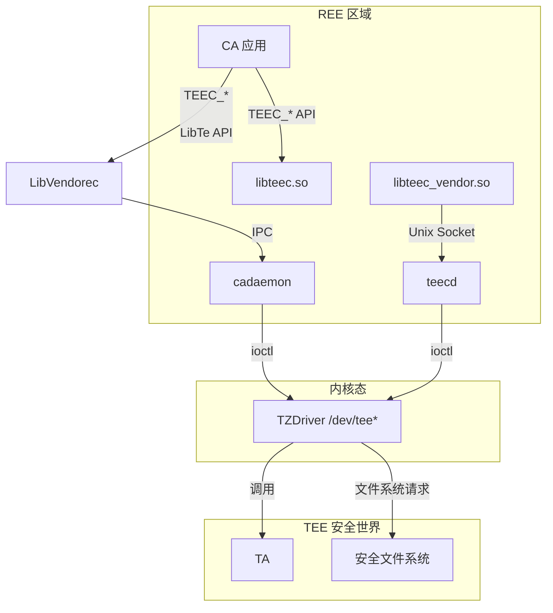
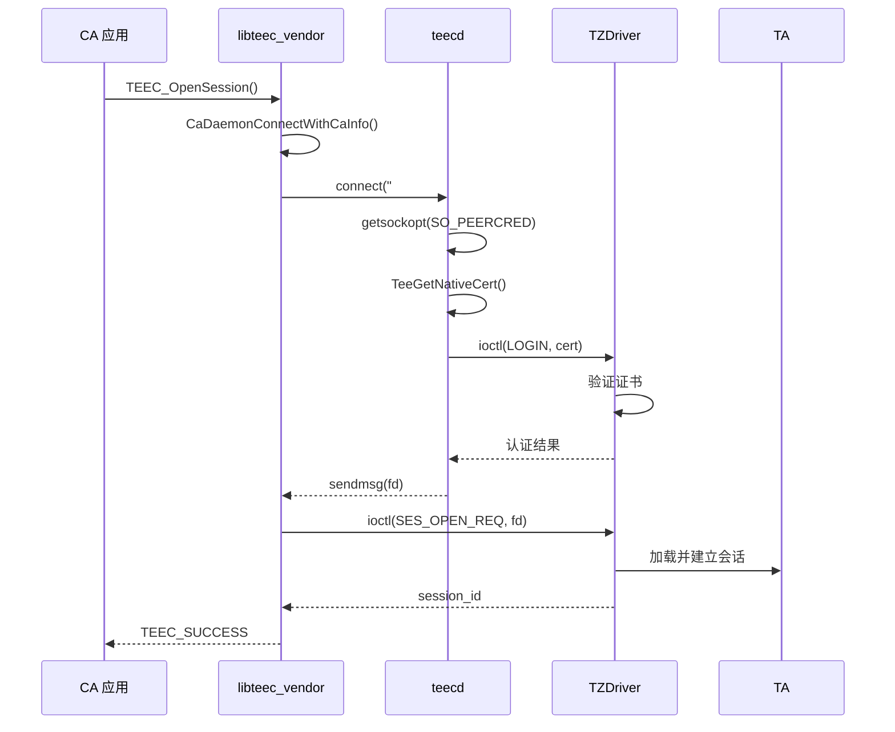

# 附录：关键调用链

## 1. 调用链概述

本文档描述 TEE Client 组件的关键调用链，覆盖从 CA 应用到底层 TEE 驱动的完整路径。

## 2. CA 初始化调用链

### 2.1 TEEC_InitializeContext 调用链

```
CA Application
    │
    ▼
libteec.so / libteec_vendor.so
    │
    ├── [1] TEEC_InitializeContext()
    │       │
    │       ├── ContextCountLimitCheck()
    │       │       └── 检查 g_teecContextList 中上下文数量
    │       │           限制: MAX_CXTCNT_ONECA = 16
    │       │
    │       ├── TEEC_InitializeContextInner()
    │       │       │
    │       │       ├── CaDaemonConnectWithoutCaInfo() [libteec_vendor]
    │       │       │       │
    │       │       │       ├── socket(AF_UNIX, SOCK_STREAM)
    │       │       │       ├── connect("#tc_ns_socket")
    │       │       │       └── 建立 Unix Domain Socket 连接
    │       │       │
    │       │       ├── CaDaemonConnectWithCaInfo() [libteec]
    │       │       │       │
    │       │       │       ├── IPC::GetSystemAbility(8001)
    │       │       │       └── 建立 IPC 连接
    │       │       │
    │       │       ├── tee_open("/dev/tee_private")
    │       │       │       │
    │       │       │       └── ioctl(TC_NS_CLIENT_IOCTL_OPEN_SESSION)
    │       │       │
    │       │       ├── InitContextConfig()
    │       │       │       └── 初始化上下文配置
    │       │       │
    │       │       ├── ListInit()
    │       │       │       └── 初始化 session_list 和 shrd_mem_list
    │       │       │
    │       │       └── MutexInit()
    │       │               └── 初始化互斥锁
    │       │
    │       └── AddContextList()
    │               └── 将上下文添加到全局链表
    │
    └── 返回 TEEC_Result
            │
            ├── TEEC_SUCCESS (0x0)
            │       context->fd 已初始化
            │
            └── 其他错误码
                    ├── TEEC_ERROR_BAD_PARAMETERS
                    └── TEEC_ERROR_GENERIC

【代码证据】
- 入口: interfaces/inner_api/tee_client_api.h:78
- 实现: frameworks/libteec_vendor/tee_client_api.c:932
- 上下文限制: frameworks/include/tee_client_inner.h:68
```

### 2.2 TEEC_FinalizeContext 调用链

```
CA Application
    │
    ▼
libteec.so / libteec_vendor.so
    │
    ├── TEEC_FinalizeContext(context)
    │       │
    │       ├── 检查 context 是否有效
    │       │
    │       ├── 检查 session_list 是否为空
    │       │       └── 如果不为空，返回错误
    │       │
    │       ├── 检查 shrd_mem_list 是否为空
    │       │       └── 如果不为空，返回错误
    │       │
    │       ├── TEEC_FinalizeContextInner()
    │       │       │
    │       │       ├── tee_close(context->fd)
    │       │       │       └── 关闭 /dev/tee_private
    │       │       │
    │       │       ├── RemoveContextList()
    │       │       │       └── 从全局链表移除上下文
    │       │       │
    │       │       └── MutexDestroy()
    │       │               └── 销毁互斥锁
    │       │
    │       └── free(context)
    │               └── 释放上下文内存
    │
    └── 返回 void

【代码证据】
- 入口: interfaces/inner_api/tee_client_api.h:89
```

## 3. 会话管理调用链

### 3.1 TEEC_OpenSession 调用链

```
CA Application
    │
    ▼
libteec.so / libteec_vendor.so
    │
    ├── [1] TEEC_OpenSession(context, &session, destination, method, data, operation, &origin)
    │       │
    │       ├── [A] 参数校验
    │       │       ├── 检查 context != NULL
    │       │       ├── 检查 session != NULL
    │       │       ├── 检查 destination != NULL
    │       │       └── 检查 connectionMethod == TEEC_LOGIN_IDENTIFY
    │       │
    │       ├── [B] 获取内部上下文
    │       │       └── GetBnContext(context->fd)
    │       │
    │       ├── [C] 加载 TA 文件
    │       │       └── TEEC_GetApp()
    │       │               │
    │       │               ├── [C1] 尝试从 taPath 加载
    │       │               │       └── TEEC_ReadApp(taPath)
    │       │               │
    │       │               └── [C2] 尝试从默认路径加载
    │       │                       ├── TEE_FEIMA_DEFAULT_PATH (/vendor/etc/passthrough/teeos/ta)
    │       │                       └── TEE_DEFAULT_PATH (/vendor/bin)
    │       │                               │
    │       │                               └── 生成文件名: {uuid}.sec
    │       │
    │       ├── [D] 检查操作参数
    │       │       └── TEEC_CheckOperation(operation)
    │       │
    │       ├── [E] 编码参数
    │       │       └── TEEC_Encode()
    │       │               └── 序列化参数到共享内存
    │       │
    │       ├── [F] 打开会话
    │       │       └── TEEC_OpenSessionInner()
    │       │               │
    │       │               ├── [F1] libteec_vendor 路径
    │       │               │       ├── CaDaemonConnectWithCaInfo()
    │       │               │       │       ├── sendmsg(CaAuthInfo)
    │       │               │       │       └── RecvFileDescriptor() [SCM_RIGHTS]
    │       │               │       │
    │       │               │       └── ioctl(TC_NS_CLIENT_IOCTL_SES_OPEN_REQ)
    │       │               │               └── 发送会话打开请求
    │       │               │
    │       │               └── [F2] libteec 路径
    │       │                       └── IPC 调用 cadaemon
    │       │
    │       └── [G] 添加会话到链表
    │               └── AddSessionList()
    │
    └── 返回 TEEC_Result
            │
            ├── TEEC_SUCCESS
            │       session->session_id 已设置
            │
            ├── TEEC_ERROR_TRUSTED_APP_LOAD_ERROR
            │       TA 文件加载失败
            │
            ├── TEEC_ERROR_ACCESS_DENIED
            │       权限验证失败
            │
            └── TEEC_ERROR_SESSION_MAXIMUM
                    会话数量超过限制

【代码证据】
- 入口: interfaces/inner_api/tee_client_api.h:120
- TA 加载: frameworks/libteec_vendor/tee_client_app_load.c:39
- Socket 通信: frameworks/libteec_vendor/tee_client_socket.c:210
```

### 3.2 TEEC_InvokeCommand 调用链

```
CA Application
    │
    ▼
libteec.so / libteec_vendor.so
    │
    ├── [1] TEEC_InvokeCommand(session, commandID, operation, &origin)
    │       │
    │       ├── [A] 参数校验
    │       │       ├── 检查 session != NULL
    │       │       ├── 检查 session->context != NULL
    │       │       └── 检查 operation 格式正确
    │       │
    │       ├── [B] 获取内部上下文
    │       │       └── GetBnContext(session->context->fd)
    │       │
    │       ├── [C] 获取内部会话
    │       │       └── GetBnSession()
    │       │
    │       ├── [D] 编码操作参数
    │       │       └── TEEC_Encode()
    │       │               └── 将 operation 序列化
    │       │
    │       ├── [E] 发送命令
    │       │       └── TEEC_InvokeCommandInner()
    │       │               │
    │       │               ├── [E1] libteec_vendor 路径
    │       │               │       └── ioctl(TC_NS_CLIENT_IOCTL_SEND_CMD_REQ)
    │       │               │               │
    │       │               │               ├── 发送 commandID
    │       │               │               ├── 发送参数
    │       │               │               └── 接收返回值
    │       │               │
    │       │               └── [E2] libteec 路径
    │       │                       └── IPC 调用 cadaemon
    │       │
    │       └── [F] 解码响应
    │               └── TEEC_Decode()
    │                       └── 反序列化返回值
    │
    └── 返回 TEEC_Result
            │
            ├── TEEC_SUCCESS
            │       operation->params 已更新
            │
            ├── TEEC_ERROR_TARGET_DEAD
            │       TA 已崩溃
            │
            └── 其他错误码

【代码证据】
- 入口: interfaces/inner_api/tee_client_api.h:152
- 命令发送: frameworks/libteec_vendor/tee_client_api.c:1398
```

### 3.3 TEEC_CloseSession 调用链

```
CA Application
    │
    ▼
libteec.so / libteec_vendor.so
    │
    ├── TEEC_CloseSession(session)
    │       │
    │       ├── 检查 session != NULL
    │       │
    │       ├── TEEC_CloseSessionInner()
    │       │       │
    │       │       ├── ioctl(TC_NS_CLIENT_IOCTL_SES_CLOSE_REQ)
    │       │       │       └── 发送会话关闭请求
    │       │       │
    │       │       └── RemoveSessionList()
    │       │               └── 从链表移除会话
    │       │
    │       └── free(session)
    │               └── 释放会话内存
    │
    └── 返回 void

【代码证据】
- 入口: interfaces/inner_api/tee_client_api.h:132
```

## 4. 共享内存调用链

### 4.1 TEEC_RegisterSharedMemory 调用链

```
CA Application
    │
    ▼
libteec.so / libteec_vendor.so
    │
    ├── TEEC_RegisterSharedMemory(context, sharedMem)
    │       │
    │       ├── [A] 参数校验
    │       │       ├── 检查 context != NULL
    │       │       ├── 检查 sharedMem != NULL
    │       │       └── 检查 sharedMem->buffer != NULL && size > 0
    │       │
    │       ├── [B] 获取内部上下文
    │       │       └── GetBnContext(context->fd)
    │       │
    │       ├── [C] 检查大小限制
    │       │       └── sharedMem->size <= MAX_SHAREDMEM_LEN (0x10000000)
    │       │
    │       ├── [D] 初始化共享内存
    │       │       ├── sharedMem->ops_cnt = 0
    │       │       ├── sharedMem->is_allocated = false
    │       │       └── sharedMem->context = context
    │       │
    │       └── [E] 添加到链表
    │               └── AddShmToContext()
    │
    └── 返回 TEEC_Result

【代码证据】
- 入口: interfaces/inner_api/tee_client_api.h:170
```

### 4.2 TEEC_AllocateSharedMemory 调用链

```
CA Application
    │
    ▼
libteec.so / libteec_vendor.so
    │
    ├── TEEC_AllocateSharedMemory(context, sharedMem)
    │       │
    │       ├── [A] 参数校验
    │       │       ├── 检查 context != NULL
    │       │       └── 检查 sharedMem != NULL
    │       │
    │       ├── [B] 获取内部上下文
    │       │       └── GetBnContext(context->fd)
    │       │
    │       ├── [C] 分配内存
    │       │       ├── malloc(sharedMem->size)
    │       │       └── sharedMem->buffer = 分配结果
    │       │
    │       ├── [D] 初始化
    │       │       ├── sharedMem->is_allocated = true
    │       │       └── memset(sharedMem->buffer, 0, size)
    │       │
    │       └── [E] 添加到链表
    │               └── AddShmToContext()
    │
    └── 返回 TEEC_Result
            │
            ├── TEEC_SUCCESS
            │       sharedMem->buffer 指向已分配内存
            │
            └── TEEC_ERROR_OUT_OF_MEMORY
                    内存分配失败

【代码证据】
- 入口: interfaces/inner_api/tee_client_api.h:190
```

### 4.3 TEEC_ReleaseSharedMemory 调用链

```
CA Application
    │
    ▼
libteec.so / libteec_vendor.so
    │
    ├── TEEC_ReleaseSharedMemory(sharedMem)
    │       │
    │       ├── [A] 参数校验
    │       │       └── 检查 sharedMem != NULL
    │       │
    │       ├── [B] 从链表移除
    │       │       └── RemoveShmFromContext()
    │       │
    │       └── [C] 释放内存
    │               │
    │               ├── 如果 is_allocated == true
    │               │       └── free(sharedMem->buffer)
    │               │
    │               └── 如果 is_allocated == false
    │                       └── 不释放（由调用者管理）
    │
    └── 返回 void

【代码证据】
- 入口: interfaces/inner_api/tee_client_api.h:202
```

## 5. 守护进程调用链

### 5.1 cadaemon IPC 请求处理调用链

```
CA Application (libteec.so)
    │
    ├── IPC::SendRequest(OPEN_SESSION)
    │       │
    │       └── MessageParcel 序列化
    │               ├── Interface Token
    │               ├── TEEC_Context
    │               ├── TEEC_UUID
    │               ├── Operation (可选)
    │               └── Ashmem (可选)
    │
    ▼
IPC Framework (OHOS)
    │
    ├── GetSystemAbility(8001)
    │       └── 获取 cadaemon 的 RemoteObject
    │
    └── SendRequest()
            └── 发送 IPC 请求
                    │
                    ▼
CaDaemonStub::OnRemoteRequest()
    │
    ├── [1] EnforceInterceToken()
    │       └── 验证 Interface Token
    │
    ├── [2] switch(code)
    │       │
    │       ├── INIT_CONTEXT
    │       │       └── InitContextRecvProc()
    │       │
    │       ├── OPEN_SESSION
    │       │       └── OpenSessionRecvProc()
    │       │               │
    │       │               ├── [A] 解析 MessageParcel
    │       │               │       ├── GetContextFromData()
    │       │               │       ├── GetOperationFromData()
    │       │               │       └── GetOptMemFromData()
    │       │               │
    │       │               ├── [B] 验证参数
    │       │               │       └── IsValidContext()
    │       │               │
    │       │               ├── [C] 调用内部 API
    │       │               │       └── CaDaemonService::OpenSession()
    │       │               │               │
    │       │               │               ├── TEEC_OpenSessionInner()
    │       │               │               │       └── ioctl(TC_NS_CLIENT_IOCTL...)
    │       │               │               │
    │       │               │               └── WriteResponse()
    │       │               │                       └── 序列化响应
    │       │               │
    │       │               └── [D] 清理资源
    │       │                       └── CloseFd()
    │       │
    │       ├── INVOKE_COMMAND
    │       │       └── InvokeCommandRecvProc()
    │       │
    │       ├── CLOSE_SESSION
    │       │       └── CloseSessionRecvProc()
    │       │
    │       └── ...
    │
    └── 返回结果

【代码证据】
- IPC 处理: services/cadaemon/src/ca_daemon/cadaemon_stub.cpp:30
- 服务实现: services/cadaemon/src/ca_daemon/cadaemon_service.cpp
```

### 5.2 teecd Socket 请求处理调用链

```
CA Application (libteec_vendor.so)
    │
    ├── CaDaemonConnectWithCaInfo()
    │       │
    │       ├── socket(AF_UNIX, SOCK_STREAM)
    │       │
    │       ├── connect("#tc_ns_socket")
    │       │
    │       └── sendmsg()
    │               │
    │               ├── [1] CaRevMsg (cmd + CaAuthInfo)
    │               └── [2] SCM_RIGHTS (fd)
    │
    ▼
teecd (CaServerWorkThread)
    │
    ├── [1] accept()
    │       └── 接受 CA 连接
    │
    ├── [2] getsockopt(SO_PEERCRED)
    │       └── 获取 CA 的 uid 和 pid
    │
    ├── [3] RecvCaMsg()
    │       └── 接收 CA 消息
    │
    ├── [4] ProcessCaMsg()
    │       │
    │       ├── [A] tee_open("/dev/tc_ns_client")
    │       │       └── 打开 TEE 设备
    │       │
    │       ├── [B] SendLoginInfo()
    │       │       │
    │       │       ├── TeeGetNativeCert(pid, uid)
    │       │       │       └── 获取 CA 原生证书
    │       │       │
    │       │       └── ioctl(TC_NS_CLIENT_IOCTL_LOGIN)
    │       │               └── 发送认证信息到 TEE
    │       │
    │       └── [C] SendFileDescriptor()
    │               │
    │               └── sendmsg(fd via SCM_RIGHTS)
    │                       └── 将 TEE fd 传递给 CA
    │
    └── 返回结果

【代码证据】
- Socket 处理: services/teecd/src/tee_ca_daemon.c:150
- 认证流程: services/teecd/src/tee_ca_auth.c
```

## 6. Agent 调用链

### 6.1 文件系统 Agent 调用链

```
TEE Secure World (文件系统操作请求)
    │
    ▼
TZDriver (ioctl)
    │
    └── TC_NS_CLIENT_IOCTL_WAIT_EVENT
            │
            ▼
teecd (FsWorkThread)
    │
    ├── [1] ioctl(WAIT_EVENT)
    │       └── 等待文件系统请求
    │
    ├── [2] 处理请求
    │       └── switch (cmd)
    │               ├── SEC_OPEN
    │               │       └── fs_work_agent.c: SecFileOpen()
    │               ├── SEC_READ
    │               │       └── fs_work_agent.c: SecFileRead()
    │               ├── SEC_WRITE
    │               │       └── fs_work_agent.c: SecFileWrite()
    │               └── ...
    │
    ├── [3] 安全检查
    │       ├── ValidatePath()
    │       │       └── 检查路径遍历
    │       │
    │       └── CheckPermission()
    │               └── 检查文件权限
    │
    ├── [4] 执行文件系统操作
    │       └── 调用标准文件系统 API
    │               ├── open(), close()
    │               ├── read(), write()
    │               └── ...
    │
    └── [5] ioctl(SEND_EVENT_RESPONSE)
            └── 发送响应到 TEE

【代码证据】
- Agent 入口: services/teecd/src/fs_work_agent.c
- 路径验证: fs_work_agent.c 中的路径检查逻辑
```

## 7. 调用链图示

### 7.1 完整数据流



### 7.2 CA 认证流程


