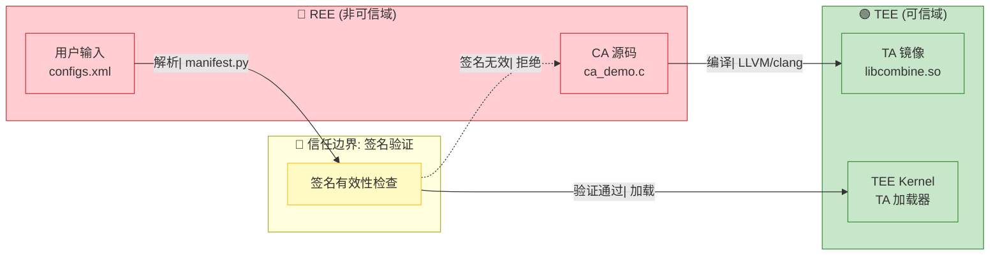
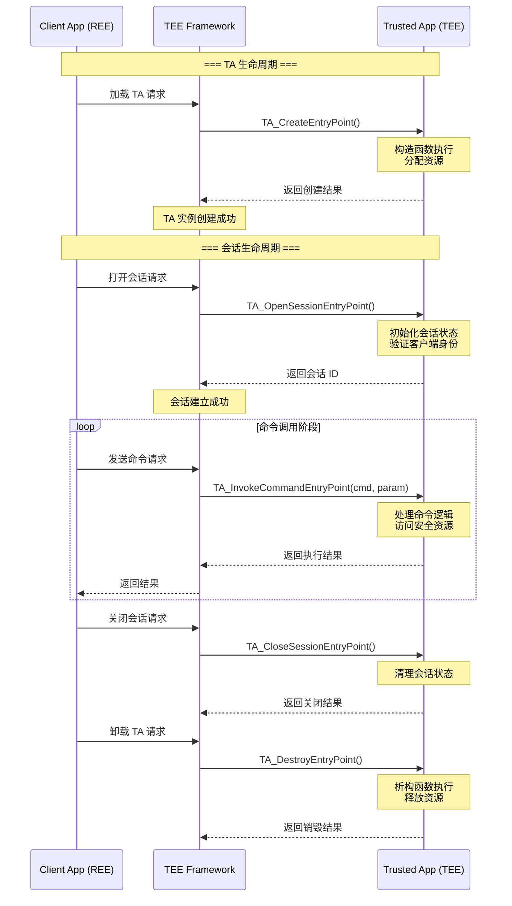
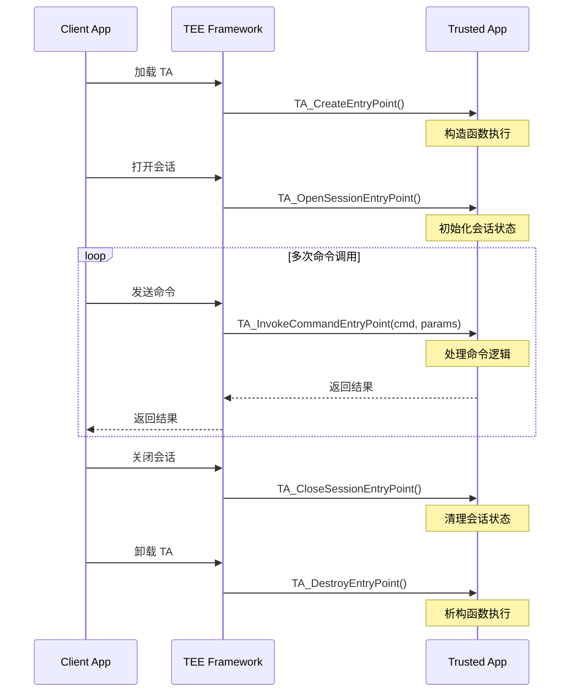

# 架构说明

> **阅读时间**: 15 分钟 | **目标**: 理解 CA ↔ TEE 通信架构、数据流和线程模型

---

## 架构概览图

```mermaid
graph TB
    subgraph REE["REE (富执行环境) - 非可信域"]
        CA["Client Application (CA)
            - helloworld_demo/ca_demo.c
            - aes_demo/aes_demo_ca.c
            - rsa_demo/rsa_demo_ca.c"]
    end

    subgraph TrustBoundary["🤝 信任边界: TEE Client API"]
        Direction1["CA ↔ TEE 通信"]
    end

    subgraph SDK["TEE SDK (tee_dev_kit) - 开发工具"]
        Build["构建系统
            - CMake: cmake/*.cmake
            - Make: mk/*.mk
            - GN: BUILD.gn"]
        Sign["签名工具
            - signtool_sec.py
            - generate_signature.py
            - manifest.py"]
        Config["配置管理
            - configs.xml
            - ta_sign_algo_config.ini"]
    end

    subgraph TEE["TEE OS (OpenTrustee) - 可信域"]
        TA["Trusted Application (TA)
            libcombine.so → uuid.sec"]
        Kernel["TEE Kernel / Framework
            - TA 加载器
            - 会话管理
            - 命令分发"]
    end

    CA -->|"TEE Client API"| SDK
    SDK -->|"TEE Internal API"| TA
    TA --> Kernel

    classDef trust fill:#e8f5e9,stroke:#4caf50,stroke-width:2px;
    classDef untrust fill:#ffebee,stroke:#f44336,stroke-width:2px;
    classDef tool fill:#e3f2fd,stroke:#2196f3,stroke-width:2px;
    class REE,CA TrustBoundary trust;
    class SDK,Build,Sign,Config tool;
    class TEE,TA,Kernel trust;
```

**图例说明**:
- 🟢 **绿色区域**: 可信域 (Trusted Environment)
- 🔴 **红色区域**: 非可信域 (Untrusted Environment)
- 🔵 **蓝色区域**: 开发工具域

**证据**: `README.md:1-20` - SDK 定位和架构说明

---

## 系统组件图

```
┌─────────────────────────────────────────────────────────────────┐
│                    REE (Rich Execution Environment)              │
│  ┌───────────────────────────────────────────────────────────┐  │
│  │                    Client Application (CA)                 │  │
│  │  - helloworld_demo/ca_demo.c                             │  │
│  │  - aes_demo/aes_demo_ca.c                                │  │
│  │  - rsa_demo/rsa_demo_ca.c                                │  │
│  │  - mac_demo/mac_demo_ca.c                                │  │
│  │  - secstorage_demo/secstorage_demo_ca.c                  │  │
│  └───────────────────────────────────────────────────────────┘  │
│                              ↑                                  │
│                          TEE Client API                          │
└──────────────────────────────┼──────────────────────────────────┘
                                │
┌──────────────────────────────┼──────────────────────────────────┐
│                              ↓                                  │
│  ┌───────────────────────────────────────────────────────────┐  │
│  │                    TEE SDK (tee_dev_kit)                  │  │
│  │  ┌─────────────────────────────────────────────────────┐  │  │
│  │  │                   构建系统                          │  │  │
│  │  │  - CMake: cmake/*.cmake                            │  │  │
│  │  │  - Make: mk/*.mk                                   │  │  │
│  │  │  - GN: BUILD.gn                                    │  │  │
│  │  └─────────────────────────────────────────────────────┘  │  │
│  │  ┌─────────────────────────────────────────────────────┐  │  │
│  │  │                   签名工具                          │  │  │
│  │  │  - signtool_sec.py                                 │  │  │
│  │  │  - generate_signature.py                            │  │  │
│  │  │  - manifest.py                                      │  │  │
│  │  └─────────────────────────────────────────────────────┘  │  │
│  │  ┌─────────────────────────────────────────────────────┐  │  │
│  │  │                   配置管理                          │  │  │
│  │  │  - configs.xml                                      │  │  │
│  │  │  - config_ta_public.ini                            │  │  │
│  │  │  - ta_sign_algo_config.ini                         │  │  │
│  │  └─────────────────────────────────────────────────────┘  │  │
│  └───────────────────────────────────────────────────────────────┘  │
│                              ↑                                  │
│                        TEE Internal API                          │
└──────────────────────────────┼──────────────────────────────────┘
                                │
┌──────────────────────────────┼──────────────────────────────────┐
│                              ↓                                  │
│  ┌─────────────────────────────────────────────────────────────┐ │
│  │              TEE OS (OpenTrustee)                           │ │
│  │  ┌─────────────────────────────────────────────────────┐ │ │
│  │  │               Trusted Application (TA)               │ │ │
│  │  │  - libcombine.so (编译产物)                         │ │ │
│  │  │  - uuid.sec (签名后的安装包)                         │ │ │
│  │  └─────────────────────────────────────────────────────┘ │ │
│  │  ┌─────────────────────────────────────────────────────┐ │ │
│  │  │              TEE Kernel / Framework                 │ │ │
│  │  │  - TA 加载器                                        │ │ │
│  │  │  - 会话管理                                         │ │ │
│  │  │  - 命令分发                                         │ │ │
│  │  └─────────────────────────────────────────────────────┘ │ │
│  └─────────────────────────────────────────────────────────────┘ │
│                                                                 │
└─────────────────────────────────────────────────────────────────┘
```
┌─────────────────────────────────────────────────────────────────┐
│                    REE (Rich Execution Environment)              │
│  ┌───────────────────────────────────────────────────────────┐  │
│  │                    Client Application (CA)                 │  │
│  │  - helloworld_demo/ca_demo.c                             │  │
│  │  - aes_demo/aes_demo_ca.c                                │  │
│  │  - rsa_demo/rsa_demo_ca.c                                │  │
│  │  - mac_demo/mac_demo_ca.c                                │  │
│  │  - secstorage_demo/secstorage_demo_ca.c                  │  │
│  └───────────────────────────────────────────────────────────┘  │
│                              ↑                                  │
│                          TEE Client API                          │
└──────────────────────────────┼──────────────────────────────────┘
                               │
┌──────────────────────────────┼──────────────────────────────────┐
│                              ↓                                  │
│  ┌───────────────────────────────────────────────────────────┐  │
│  │                    TEE SDK (tee_dev_kit)                 │  │
│  │  ┌─────────────────────────────────────────────────────┐  │  │
│  │  │                   构建系统                          │  │  │
│  │  │  - CMake: cmake/*.cmake                            │  │  │
│  │  │  - Make: mk/*.mk                                   │  │  │
│  │  │  - GN: BUILD.gn                                    │  │  │
│  │  └─────────────────────────────────────────────────────┘  │  │
│  │  ┌─────────────────────────────────────────────────────┐  │  │
│  │  │                   签名工具                          │  │  │
│  │  │  - signtool_sec.py                                 │  │  │
│  │  │  - generate_signature.py                            │  │  │
│  │  │  - manifest.py                                      │  │  │
│  │  └─────────────────────────────────────────────────────┘  │  │
│  │  ┌─────────────────────────────────────────────────────┐  │  │
│  │  │                   配置管理                          │  │  │
│  │  │  - configs.xml                                      │  │  │
│  │  │  - config_ta_public.ini                            │  │  │
│  │  │  - ta_sign_algo_config.ini                         │  │  │
│  │  └─────────────────────────────────────────────────────┘  │  │
│  └───────────────────────────────────────────────────────────────┘  │
│                              ↑                                  │
│                        TEE Internal API                          │
└──────────────────────────────┼──────────────────────────────────┘
                               │
┌──────────────────────────────┼──────────────────────────────────┐
│                              ↓                                  │
│  ┌─────────────────────────────────────────────────────────────┐ │
│  │              TEE OS (OpenTrustee)                         │ │
│  │  ┌─────────────────────────────────────────────────────┐ │ │
│  │  │               Trusted Application (TA)               │ │ │
│  │  │  - libcombine.so (编译产物)                         │ │ │
│  │  │  - uuid.sec (签名后的安装包)                         │ │ │
│  │  └─────────────────────────────────────────────────────┘ │ │
│  │  ┌─────────────────────────────────────────────────────┐ │ │
│  │  │              TEE Kernel / Framework                 │ │ │
│  │  │  - TA 加载器                                        │ │ │
│  │  │  - 会话管理                                         │ │ │
│  │  │  - 命令分发                                         │ │ │
│  │  └─────────────────────────────────────────────────────┘ │ │
│  └─────────────────────────────────────────────────────────────┘ │
│                                                                 │
└─────────────────────────────────────────────────────────────────┘
```

## 数据流

### 信任边界与数据流



**信任边界说明**:
- 🔴 **输入边界**: CA 源码、配置文件在 REE 侧生成，可能被篡改
- 🤝 **验证边界**: 签名验证是唯一信任传递机制
- 🟢 **可信边界**: 通过签名验证的 TA 镜像在 TEE 内执行

### TA 编译与签名流程

```
┌──────────┐     ┌──────────┐     ┌──────────┐     ┌──────────┐
│  TA 源码 │────▶│  编译器   │────▶│ libcombine│────▶│ 签名工具  │
│ ta_*.c   │     │ LLVM/    │     │   .so    │     │signtool_ │
│ configs. │     │ GCC      │     │          │     │ sec.py   │
│ xml      │     │          │     │          │     │          │
└──────────┘     └──────────┘     └──────────┘     └────┬─────┘
                                                        │
┌──────────┐     ┌──────────┐                           │
│ 签名密钥 │────▶│ 签名验证 │                           ↓
│ 私钥     │     │ 公钥     │                    ┌──────────┐
│ .pem     │     │ ta_verify│                    │ uuid.sec │
└──────────┘     │ _key.c   │                    │ (安装包) │
                  └──────────┘                    └──────────┘
```

**代码证据**:
- 签名脚本: `sdk/build/script/signtool_sec.py:27-33` (加密库导入)
- 签名算法配置: `sdk/build/config/ta_sign_algo_config.ini:1-10`
- 密钥路径: `sdk/build/signkey/ta_sign_priv_key.pem`

### CA ↔ TA 调用流程

```
┌──────────────────┐                              ┌──────────────────┐
│  CA (REE侧)      │                              │  TA (TEE侧)      │
│                  │                              │                  │
│ 1. 初始化 TEEC_  │                              │                  │
│    Context       │                              │                  │
│                  │                              │                  │
│ 2. 打开会话      │  ──IPC 调用────────────────▶ │ 4. TA_Open      │
│    TEEC_OpenSession│                           │    SessionEntry │
│                  │                              │                  │
│ 3. 发送命令      │  ──IPC 调用────────────────▶ │ 5. TA_Invoke    │
│    TEEC_Invoke   │     (cmd_id, params)         │    CommandEntry │
│                  │                              │                  │
│                  │  ◀──IPC 返回────────────────  │ 6. 返回结果     │
│                  │     (return_code)            │                  │
│                  │                              │                  │
│ 7. 关闭会话      │  ──IPC 调用────────────────▶ │ 8. TA_Close    │
│    TEEC_Close   │                              │    SessionEntry │
│    Session      │                              │                  │
│                  │                              │                  │
└──────────────────┘                              └──────────────────┘
```

**代码证据**:
- CA 示例代码: `sdk/src/CA/helloworld_demo/ca_demo.c:1-100`
- TA 入口实现: `sdk/src/TA/helloworld_demo/ta_demo.c:50-158`
- TEEC API 定义: `sysroot/usr/include/tee_api.h` (需导入 third_party_musl)

### GP TEE 标准入口函数时序



**入口函数说明**:

| 入口函数 | 参数 | 返回值 | 职责 |
|---------|------|--------|------|
| `TA_CreateEntryPoint` | `paramTypes`, `paramValue`, `memRefs` | `TEE_Result` | TA 实例构造函数，仅调用一次 |
| `TA_OpenSessionEntryPoint` | `paramTypes`, `paramValue`, `memRefs`, `sessionId` | `TEE_Result` | 会话打开，验证客户端 |
| `TA_InvokeCommandEntryPoint` | `sessionId`, `cmdId`, `paramTypes`, `paramValue` | `TEE_Result` | 核心命令处理 |
| `TA_CloseSessionEntryPoint` | `sessionId` | void | 会话清理 |
| `TA_DestroyEntryPoint` | void | void | TA 实例析构 |

**代码证据**:
- `sdk/src/TA/helloworld_demo/ta_demo.c:50-158` - 五大入口函数完整实现
- GP TEE 标准 API: `sysroot/usr/include/tee_api.h`

---

## 线程模型

### TA 线程限制

**证据**: `sdk/build/TA_demo/configs.xml`, `sdk/build/script/manifest.py`

| 限制项 | 默认值 | 配置项 |
|--------|--------|--------|
| 栈大小 | 8192 bytes | `stack_size` |
| 堆大小 | 0 bytes | `heap_size` |
| 单实例 | true | `single_instance` |
| 多会话 | false | `multi_session` |

### TA 内部线程

```
                    ┌─────────────────────┐
                    │   TA Main Thread    │
                    │  (调用入口所在线程)  │
                    └──────────┬──────────┘
                               │
              ┌────────────────┼────────────────┐
              ↓                ↓                ↓
     ┌─────────────┐   ┌─────────────┐   ┌─────────────┐
     │   会话 1    │   │   会话 2    │   │   会话 N    │
     │ (可选多会话) │   │             │   │             │
     └─────────────┘   └─────────────┘   └─────────────┘
```

**说明**:
- 默认情况下，TA 以单线程模式运行
- 命令调用 (`TA_InvokeCommandEntryPoint`) 在调用方线程执行
- TA 内部不应创建额外线程（除非显式支持）

---

## 关键时序图

### TA 生命周期时序



**代码证据**: `sdk/src/TA/helloworld_demo/ta_demo.c:50-158` (所有入口函数实现)

### 构建脚本调用关系

```mermaid
flowchart TB
    subgraph Input["输入文件"]
        Src["TA 源码
            ta_*.c"]
        Config["配置文件
            configs.xml"]
        Key["签名密钥
            ta_sign_priv_key.pem"]
    end

    subgraph Build["编译阶段"]
        Compile["编译器
            clang/arm-linux-gnueabi-gcc"]
        Link["链接器
            ld.lld/ld"]
    end

    subgraph Sign["签名阶段"]
        Manifest["manifest.py
            配置解析"]
        Hash["generate_hash.py
            Hash 计算"]
        SignTool["signtool_sec.py
            RSA 签名"]
    end

    subgraph Output["输出"]
        Lib["libcombine.so
            TA 镜像"]
        Sec["uuid.sec
            签名安装包"]
    end

    Src --> Compile
    Config --> Manifest
    Compile --> Link
    Link --> Lib
    Key --> SignTool
    Manifest --> SignTool
    Hash --> SignTool
    SignTool --> Sec

    classDef process fill:#e3f2fd,stroke:#1565c0;
    classDef file fill:#f3e5f5,stroke:#7b1fa2;
    class Compile,Link,Manifest,Hash,SignTool process;
    Src,Config,Key,Lib,Sec file;
```

**脚本调用链**:

| 阶段 | 主脚本 | 依赖脚本 | 证据位置 |
|------|-------|---------|---------|
| **配置解析** | `manifest.py` | `xml_trans_manifest.py` | `sdk/build/script/manifest.py:1-200` |
| **编译** | `build_ta.sh` | `Makefile`, `common.mk` | `sdk/build/TA_demo/build_ta.sh:1-100` |
| **Hash 计算** | `generate_hash.py` | - | `sdk/build/script/generate_hash.py:1-50` |
| **签名** | `signtool_sec.py` | `generate_signature.py` | `sdk/build/script/signtool_sec.py:1-800` |

---

## 模块职责

### sdk/build/ 核心模块

| 模块 | 职责 | 关键文件 | 代码行数 |
|------|------|---------|---------|
| **cmake/** | CMake 构建配置 | `common.cmake`, `llvm_toolchain.cmake` | ~500 行 |
| **mk/** | Make 构建配置 | `common.mk`, `common_llvm.mk` | ~400 行 |
| **ld/** | 链接器脚本 | `ta_link.ld`, `ta_link_64.ld` | ~300 行 |
| **script/** | 签名和配置脚本 | `signtool_sec.py`, `manifest.py` | ~1500 行 |
| **config/** | 配置文件 | `ta_sign_algo_config.ini` | ~50 行 |
| **signkey/** | 签名密钥 | `ta_sign_priv_key.pem` | 私钥文件 |
| **tools/** | 辅助工具 | `calc_ca_caller_hash.py` | ~200 行 |

**代码证据**:
- 构建配置: `sdk/build/cmake/README.md:1-30`
- 签名脚本: `sdk/build/script/signtool_sec.py:1-100`
- 链接脚本: `sdk/build/ld/ta_link.ld:1-100`

### sdk/src/ 示例代码

| 模块 | 职责 | 关键文件 | 代码行数 |
|------|------|---------|---------|
| **TA/helloworld_demo** | 入门示例 | `ta_demo.c`, `configs.xml` | ~200 行 |
| **TA/aes_demo** | AES 加密示例 | `aes_demo_ta.c` | ~400 行 |
| **TA/rsa_demo** | RSA 签名示例 | `rsa_demo_ta.c` | ~350 行 |
| **TA/mac_demo** | MAC 计算示例 | `mac_demo.c` | ~250 行 |
| **TA/secstorage_demo** | 安全存储示例 | `secstorage_demo.c` | ~300 行 |
| **CA/*_demo** | 对应 CA 端代码 | `ca_demo.c` | ~100 行/示例 |

**代码证据**:
- TA 入口实现: `sdk/src/TA/helloworld_demo/ta_demo.c:50-158`
- CA 调用示例: `sdk/src/CA/helloworld_demo/ca_demo.c:1-100`
- AES 示例: `sdk/src/TA/aes_demo/aes_demo_ta.c:1-200`

---

## 线程模型

### TA 线程限制

**证据**: `sdk/build/TA_demo/configs.xml:1-25`, `sdk/build/script/manifest.py:50-100`

| 限制项 | 默认值 | 配置项 | 最大值 |
|--------|--------|--------|--------|
| **栈大小** | 8192 bytes | `stack_size` | 1048576 bytes |
| **堆大小** | 0 bytes | `heap_size` | 10485760 bytes |
| **单实例** | true | `single_instance` | 仅支持 true |
| **多会话** | false | `multi_session` | false |

**配置示例**:

```xml
<TA_Manifest_Info>
  <stack_size>8192</stack_size>
  <heap_size>81920</heap_size>
  <multi_session>false</multi_session>
  <single_instance>true</single_instance>
</TA_Manifest_Info>
```

### TA 内部线程模型

```
                          ┌─────────────────────┐
                          │   TA Main Thread    │
                          │  (调用入口所在线程)  │
                          └──────────┬──────────┘
                                     │
                ┌────────────────────┼────────────────────┐
                ↓                    ↓                    ↓
       ┌─────────────┐    ┌─────────────┐    ┌─────────────┐
       │   会话 1    │    │   会话 2    │    │   会话 N    │
       │ (Session 1) │    │ (Session 2) │    │ (Session N) │
       │  cmd_id=0   │    │  cmd_id=1   │    │  cmd_id=N   │
       └─────────────┘    └─────────────┘    └─────────────┘
```

**关键约束**:
- ✅ 默认情况下，TA 以单线程模式运行
- ✅ 命令调用 (`TA_InvokeCommandEntryPoint`) 在调用方线程执行
- ❌ TA 内部不应创建额外线程（除非显式支持）
- ❌ `multi_session` 当前仅支持 `false`

**代码证据**:
- `sdk/src/TA/helloworld_demo/ta_demo.c:100-150` - 单线程入口实现

---

## 相关跳转

### 继续阅读

| 文档 | 阅读时间 | 目标 |
|------|---------|------|
| [00_Overview.md](00_Overview.md) | 5 分钟 | 项目定位和快速开始 |
| [02_TA_Development_Guide.md](02_TA_Development_Guide.md) | 30 分钟 | 开发第一个 TA |
| [03_Build_System.md](03_Build_System.md) | 20 分钟 | 理解构建和签名流程 |
| [04_Security_Review.md](04_Security_Review.md) | 30 分钟 | 安全风险分析 |

### 问题排查

遇到问题？请参考 [06_Troubleshooting.md](06_Troubleshooting.md)

---

## 变更历史

| 版本 | 日期 | 变更说明 |
|------|------|---------|
| 1.0.0 | 2026-02-07 | 初始版本 |

---

*最后更新: 2026-02-07*
