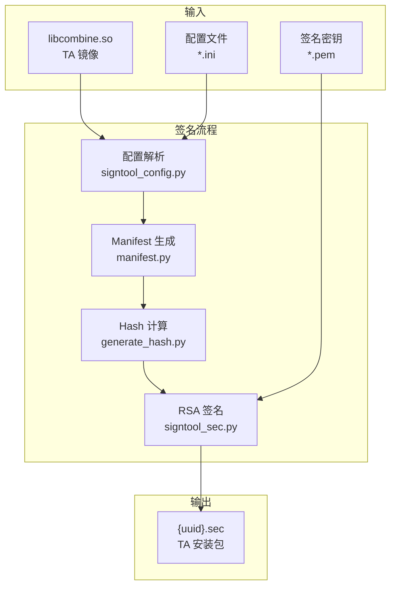

# 构建系统详解

> **阅读时间**: 20 分钟 | **目标**: 深入理解构建系统、签名工具和 GN 配置

---

## 概述

tee_dev_kit 支持三种构建系统，满足不同开发场景的需求：

| 构建系统 | 适用场景 | 配置方式 | 证据位置 |
|---------|---------|---------|---------|
| **GN** | OpenHarmony 系统构建 | `BUILD.gn` | `sdk/build/BUILD.gn` |
| **CMake** | 跨平台项目、现代 C++ | `CMakeLists.txt` | `sdk/build/cmake/` |
| **Make** | 传统嵌入式项目 | `Makefile` | `sdk/build/mk/` |

**代码证据**: `sdk/build/README.md:1-30`

---

## 构建流程概述

```mermaid
flowchart LR
    subgraph Input["输入"]
        Src["TA 源码
            ta_*.c"]
        Config["配置文件
            configs.xml"]
        Key["签名密钥
            *.pem"]
    end

    subgraph Compile["编译阶段"]
        Preprocess["预处理"]
        Compile["编译"]
        Link["链接"]
    end

    subgraph Sign["签名阶段"]
        Parse["配置解析"]
        Hash["Hash 计算"]
        Sign["RSA 签名"]
    end

    subgraph Output["输出"]
        SO["libcombine.so"]
        SEC["{uuid}.sec"]
    end

    Src --> Preprocess
    Config --> Parse
    Compile --> Link
    Preprocess --> Compile
    Link --> SO
    Parse --> Hash
    Hash --> Sign
    Sign --> SEC
    Key --> Sign

    classDef process fill:#e3f2fd,stroke:#1565c0;
    classDef file fill:#f3e5f5,stroke:#7b1fa2;
    class Preprocess,Compile,Link,Parse,Hash,Sign process;
    Src,Config,Key,SO,SEC file;
```

---

## GN 构建系统 (OpenHarmony 原生)

## GN 构建系统 (OpenHarmony 原生)

### BUILD.gn 入口文件

**证据**: `sdk/build/BUILD.gn`

```python
# Copyright (C) 2024 Huawei Technologies Co., Ltd.
import("//build/ohos.gni")
import("//build/ohos/ndk/ndk.gni")

# TA Linux 编译目标组
group("tee_ndk_ta_linux_compile") {
    deps = [
        ":tee_ndk_make",
        ":tee_ndk_cmake",
        ":tee_ndk_config",
        ":tee_ndk_script",
        ":tee_ndk_ld",
        ":tee_ndk_src",
        ":tee_ndk_tools",
        ":tee_ndk_import_shell",
    ]
}
```

### GN Targets 详细说明

| Target | 类型 | 功能 | 输出目录 | 证据位置 |
|--------|------|------|---------|---------|
| `tee_ndk_make` | copy | 复制 Make 构建配置 | `$ndk_os_irrelevant_out_dir/build/teekit/mk/` | `sdk/build/mk/` |
| `tee_ndk_cmake` | copy | 复制 CMake 构建配置 | `$ndk_os_irrelevant_out_dir/build/teekit/cmake/` | `sdk/build/cmake/` |
| `tee_ndk_config` | copy | 复制配置文件 | `$ndk_os_irrelevant_out_dir/build/teekit/config/` | `sdk/build/config/` |
| `tee_ndk_script` | copy | 复制签名脚本 | `$ndk_os_irrelevant_out_dir/build/teekit/script/` | `sdk/build/script/` |
| `tee_ndk_ld` | copy | 复制链接器脚本 | `$ndk_os_irrelevant_out_dir/build/teekit/ld/` | `sdk/build/ld/` |
| `tee_ndk_src` | copy | 复制 TA 示例 | `$ndk_os_irrelevant_out_dir/build/teekit/TA_demo/` | `sdk/build/TA_demo/` |
| `tee_ndk_tools` | copy | 复制辅助工具 | `$ndk_os_irrelevant_out_dir/build/teekit/tools/` | `sdk/build/tools/` |
| `tee_ndk_import_shell` | copy | 复制头文件导入脚本 | `$ndk_os_irrelevant_out_dir/build/teekit/thirdparty/` | `thirdparty/open_source/` |

### GN 构建产物

当使用 OpenHarmony 构建系统时，SDK 组件会被打包到 NDK (Native Development Kit) 中：

```
${OUT_DIR}/
└── ndk/
    └── teekit/
        ├── build/
        │   ├── mk/           # Make 构建配置
        │   ├── cmake/        # CMake 构建配置
        │   ├── script/       # 签名脚本
        │   ├── ld/           # 链接脚本
        │   └── config/       # 配置文件
        ├── TA_demo/          # TA 示例
        ├── tools/            # 辅助工具
        └── thirdparty/       # 头文件导入脚本
```

---

## 签名工具链详解

### 依赖关系

```
tee_ndk_ta_linux_compile
├── tee_ndk_make
├── tee_ndk_cmake
├── tee_ndk_config
├── tee_ndk_script
├── tee_ndk_ld
├── tee_ndk_src
├── tee_ndk_tools
└── tee_ndk_import_shell
```

---

## CMake 构建系统

### 工具链配置

| 文件 | 架构 | 说明 |
|------|------|------|
| `cmake/arm_toolchain.cmake` | ARM (32位) | ARM 工具链配置 |
| `cmake/aarch64_toolchain.cmake` | AArch64 (64位) | AArch64 工具链配置 |
| `cmake/llvm_toolchain.cmake` | 通用 | LLVM 工具链配置 |

**证据**: `sdk/build/cmake/arm_toolchain.cmake`

### 公共配置

**证据**: `sdk/build/cmake/common.cmake`

```cmake
# 公共构建配置
set(CMAKE_C_COMPILER "clang")
set(CMAKE_CXX_COMPILER "clang++")

# 包含目录
include_directories(${TEE_SDK_ROOT}/sysroot/usr/include)

# 安全编译选项
add_compile_options(-fpie -fpic -D_GNU_SOURCE)
```

### 安全特性

**证据**: `sdk/build/cmake/security_features.cmake`

```cmake
# 安全编译选项
if(ENABLE_STACK_PROTECTOR)
    add_compile_options(-fstack-protector-strong)
endif()

# PIE 位置无关可执行文件
add_link_options(-pie)
```

---

## Make 构建系统

### 核心 Makefile

| 文件 | 功能 |
|------|------|
| `mk/common.mk` | 公共构建逻辑 |
| `mk/common_flags.mk` | 编译标志配置 |
| `mk/common_llvm.mk` | LLVM 构建逻辑 |
| `mk/common_gcc.mk` | GCC 构建逻辑 |
| `mk/security_features.mk` | 安全特性配置 |

**证据**: `sdk/build/mk/common.mk`

```makefile
# TA 编译公共配置
TA_SOURCES ?= $(wildcard *.c)
TA_INCLUDES ?= -I$(TEE_SDK_ROOT)/sysroot/usr/include

# 目标文件
OBJECTS := $(TA_SOURCES:.c=.o)
TARGET := libcombine.so

# 默认规则
all: $(TARGET)

$(TARGET): $(OBJECTS)
    $(LD) $(LDFLAGS) -o $@ $^

%.o: %.c
    $(CC) $(CFLAGS) $(TA_INCLUDES) -c -o $@ $<

clean:
    rm -f $(OBJECTS) $(TARGET)
```

---

## 签名工具链详解

签名工具链是 TEE 安全体系的核心组件，确保 TA 镜像的真实性和完整性。

**代码证据**: `sdk/build/script/signtool_sec.py:1-200`

### 签名工具架构



### 签名脚本说明

| 脚本 | 功能 | 证据位置 |
|------|------|---------|
| `signtool_sec.py` | 核心签名工具 | `sdk/build/script/signtool_sec.py:1-100` |
| `signtool_config.py` | 配置解析 | `sdk/build/script/signtool_config.py:1-50` |
| `manifest.py` | Manifest 生成 | `sdk/build/script/manifest.py:1-100` |
| `generate_hash.py` | Hash 计算 | `sdk/build/script/generate_hash.py:1-50` |
| `generate_signature.py` | 签名生成 | `sdk/build/script/generate_signature.py:1-50` |

### 密钥管理

**证据**: `sdk/build/signkey/`, `sdk/build/config/ta_sign_algo_config.ini`

#### 密钥类型

| 密钥类型 | 文件路径 | 用途 | 安全等级 |
|---------|---------|------|---------|
| **调试私钥** | `sdk/build/signkey/ta_sign_priv_key.pem` | 开发调试签名 | ⚠️ 仅供调试 |
| **验证公钥** | TEE OS 端 `ta_verify_key.c` | 运行时验证 | ✅ 生产必需 |

#### 签名算法配置

**证据**: `sdk/build/config/ta_sign_algo_config.ini:1-20`

```ini
[Sdefault]
sign_algo = RSA              # 签名算法
key_length = 4096            # 密钥长度
hash_algo = SHA256           # Hash 算法
padding_type = 1             # 填充类型
```

#### 配置参数说明

| 参数 | 说明 | 可选值 | 默认值 |
|------|------|--------|--------|
| `sign_algo` | 签名算法 | RSA, ECDSA | RSA |
| `key_length` | 密钥长度 | 2048, 3072, 4096 | 4096 |
| `hash_algo` | Hash 算法 | SHA256, SHA384, SHA512 | SHA256 |
| `padding_type` | 填充类型 | 1: PKCS1_OAEP | 1 |

### 签名验证

签名工具在签名过程中会自动验证：

| 验证项 | 说明 | 错误处理 |
|-------|------|---------|
| 镜像完整性 | 验证 libcombine.so 完整性 | 签名失败 |
| 配置有效性 | 验证配置项范围 | 配置错误 |
| 密钥有效性 | 验证密钥格式 | 密钥错误 |

**警告**: `README.md:83-85` - 调试密钥仅供开发使用，生产环境必须替换。

---

## 链接器脚本

### 32位链接脚本

**证据**: `sdk/build/ld/ta_link.ld`

```ld
/* TA 32位链接器脚本 */
OUTPUT_FORMAT("elf32-littlearm")
ENTRY(TA_Entry)

SECTIONS {
    .text : {
        *(.text*)
        *(.rodata*)
    }
    .data : {
        *(.data*)
    }
    .bss : {
        *(.bss*)
        *(COMMON)
    }
}
```

### 64位链接脚本

**证据**: `sdk/build/ld/ta_link_64.ld`

```ld
/* TA 64位链接器脚本 */
OUTPUT_FORMAT("elf64-littleaarch64")
ENTRY(TA_Entry)

SECTIONS {
    .text : {
        *(.text*)
        *(.rodata*)
    }
    /* ... 其他段定义 ... */
}
```

---

## 签名配置

### 公共配置

**证据**: `sdk/build/config/config_ta_public.ini`

```ini
[signSecPublicCfg]
secReleaseType = 1                    # 发布类型
secSignType = 4                         # 签名类型
configPath = ./config.mk               # 配置路径
```

### 签名算法配置

**证据**: `sdk/build/config/ta_sign_algo_config.ini`

```ini
[signSecPrivateCfg]
secHashType = 1                        # 哈希算法类型
secSignKeyLen = 4096                   # 签名密钥长度
secPaddingType = 1                     # 填充类型
secSignAlg = RSA                       # 签名算法
```

### 签名参数说明

| 参数 | 说明 | 可选值 |
|------|------|--------|
| `secReleaseType` | 发布类型 | 0: 测试, 1: 正式 |
| `secSignType` | 签名类型 | 4: 无证书签名 |
| `secSignAlg` | 签名算法 | RSA, ECDSA |
| `secSignKeyLen` | 密钥长度 | 2048, 3072, 4096 |
| `secHashType` | 哈希算法 | 1: SHA256 |
| `secPaddingType` | 填充类型 | 1: PKCS1_OAEP |

---

## 编译产物

### 产物清单

| 阶段 | 产物 | 说明 |
|------|------|------|
| 编译 | `libcombine.so` | ELF 共享对象文件 |
| 签名 | `{uuid}.sec` | 签名后的 TA 安装包 |

### 产物映射

```
sdk/src/TA/helloworld_demo/
├── ta_demo.c ─────┐
├── configs.xml ───┼──▶ 编译 ──▶ libcombine.so ──▶ 签名 ──▶ {uuid}.sec
└── Makefile ──────┘
```

---

## 继续阅读

### 推荐阅读路径

| 文档 | 阅读时间 | 目标 |
|------|---------|------|
| [02_TA_Development_Guide.md](02_TA_Development_Guide.md) | 30 分钟 | 开发第一个 TA |
| [04_Security_Review.md](04_Security_Review.md) | 30 分钟 | 安全机制深度分析 |
| [05_Examples.md](05_Examples.md) | 20 分钟 | 参考完整示例 |

### 问题排查

遇到问题？请参考 [06_Troubleshooting.md](06_Troubleshooting.md)

---

## 变更历史

| 版本 | 日期 | 变更说明 |
|------|------|---------|
| 1.0.0 | 2026-02-07 | 初始版本 |

---

*最后更新: 2026-02-07*
