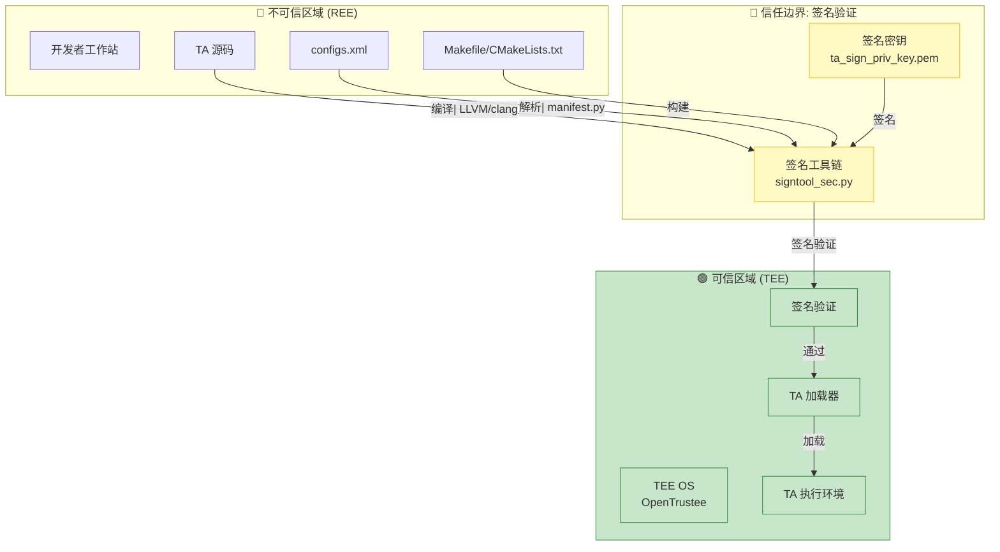

# 安全风险评审

> **阅读时间**: 30 分钟 | **目标**: 理解安全机制、识别潜在风险

---

## 概述

本章节对 tee_dev_kit 进行全面的安全风险评审，识别潜在攻击面、可被利用点和缓解措施。

**评审范围**:
- ✅ SDK 构建系统（编译、链接）
- ✅ 签名工具链（签名、验证）
- ✅ 配置解析（XML, INI）
- ✅ 密钥管理（存储、使用）

**评审依据**: 代码证据基于 `sdk/build/script/signtool_sec.py` 和相关配置文件

**阅读建议**:
- 安全研究员：完整阅读，特别关注风险分析和攻击路径
- 开发者：重点关注安全建议和修复措施

---

## 威胁模型

---

## 威胁模型

### 信任边界与数据流



**信任边界说明**:
- 🔴 **不可信区域**: REE 侧的所有输入都不可信
- 🤝 **签名验证边界**: 签名是信任传递的唯一机制
- 🟢 **可信区域**: 通过签名验证的 TA 镜像

**证据**: `01_Architecture.md` - 架构和数据流说明

### 外部输入清单

| 输入源 | 类型 | 风险等级 | 处理组件 | 证据位置 |
|--------|------|---------|---------|---------|
| **TA 源码文件** | C 代码 | 🔴 高 | 编译器 | `sdk/build/cmake/` |
| **configs.xml** | XML 配置 | 🟡 中 | manifest.py | `sdk/build/script/manifest.py` |
| **Makefile/CMakeLists.txt** | 构建脚本 | 🟡 中 | make/cmake | `sdk/build/mk/`, `sdk/build/cmake/` |
| **签名密钥文件** | PEM 密钥 | 🔴 高 | signtool_sec.py | `sdk/build/signkey/` |
| **配置文件 (.ini)** | 配置文件 | 🟡 中 | signtool_config.py | `sdk/build/config/` |

**输入风险等级说明**:
- 🔴 **高风险**: 直接参与签名或生成可信内容
- 🟡 **中风险**: 可能影响构建流程或配置

---

## 攻击面清单

---

## 攻击面清单

| 攻击面 | 组件 | 输入类型 | 风险等级 | 证据位置 |
|--------|------|---------|---------|---------|
| **配置文件注入** | `signtool_sec.py` | INI/XML | 🟡 中 | `sdk/build/script/signtool_sec.py` |
| **ELF 文件处理** | `signtool_sec.py` | ELF | 🟡 中 | `sdk/build/script/signtool_sec.py:103-124` |
| **签名生成** | `generate_signature.py` | 加密操作 | 🟢 低 | `sdk/build/script/generate_signature.py` |
| **路径遍历** | 所有脚本 | 文件路径 | 🔴 高 | `sdk/build/script/signtool_sec.py:74-84` |
| **命令注入** | Makefile/CMakeLists.txt | 构建脚本 | 🟡 中 | `sdk/build/mk/common.mk` |
| **密钥泄露** | `signkey/` | PEM 文件 | 🔴 高 | `sdk/build/signkey/ta_sign_priv_key.pem` |

---

## 风险分析详情

---

## 可被利用点

### 风险 1: 签名密钥硬编码风险

**证据**: `sdk/build/signkey/ta_sign_priv_key.pem`

```
文件路径: sdk/build/signkey/ta_sign_priv_key.pem
```

**问题描述**:
- SDK 包含默认签名私钥
- 仅用于调试目的
- 商用环境必须替换

**触发条件**:
1. 开发者使用默认密钥签名 TA
2. 攻击者获取默认私钥

**影响**:
- 可伪造任意 TA 安装包
- 绕过 TEE 签名验证

**修复建议**:
- ✅ SDK 已明确标注仅用于调试
- ✅ README 提示必须替换密钥
- ⚠️ 建议添加密钥强度检测
- ⚠️ 建议添加密钥过期机制

---

### 风险 2: 路径遍历漏洞

**证据**: `sdk/build/script/signtool_sec.py:74-84`

```python
def whitelist_check(intput_str):
    if not re.match(r"^[A-Za-z0-9\/\-_.${}]+$", intput_str):
        return 1
    return 0

def check_path_invalid(in_path, out_path, ini_path):
    # 白名单检查
    if whitelist_check(in_path):
        logging.error("input_path is incorrect.")
        return 1
```

**问题描述**:
- 使用正则表达式进行路径白名单校验
- 正则允许 `${}` 变量展开
- 可能导致变量注入

**触发条件**:
```bash
# 恶意路径示例
./signtool_sec.py --in_path "/path/to/ta:${MALICIOUS_VAR}" ...
```

**影响**:
- 路径遍历攻击
- 任意文件写入

**修复建议**:
```python
# 推荐做法：使用 normpath 和绝对路径比较
def safe_path(path, base_dir):
    path = os.path.normpath(path)
    full_path = os.path.abspath(os.path.join(base_dir, path))
    if not full_path.startswith(os.path.abspath(base_dir)):
        raise ValueError("Path traversal detected")
    return full_path
```

**当前状态**: ⚠️ 部分缓解（存在但可能不完整）

---

### 风险 3: ELF 文件验证不完整

**证据**: `sdk/build/script/signtool_sec.py:103-124`

```python
def verify_elf_header(elf_path):
    with open(elf_path, 'rb') as elf:
        elf_data = struct.unpack('B' * 16, elf.read(16))
        # 仅验证 ELF 魔数和类型
        if ((elf_data[ELF_INFO_MAGIC0_INDEX] != ELF_INFO_MAGIC0) or
                (elf_data[ELF_INFO_MAGIC1_INDEX] != ELF_INFO_MAGIC1) or ...):
            logging.error("invalid elf header info")
            raise RuntimeError
```

**问题描述**:
- 仅验证 ELF 头前 16 字节
- 不验证 Section/Program headers
- 不验证符号表
- 不验证重定位信息

**触发条件**:
1. 构造恶意 ELF 文件
2. 通过简单的头验证
3. 包含恶意载荷

**影响**:
- 潜在的代码注入
- 内存损坏

**修复建议**:
- 添加完整的 ELF 解析验证
- 验证 Program headers 内存映射
- 检查可疑的段权限

**当前状态**: ⚠️ 有限缓解

---

### 风险 4: XML 外部实体 (XXE) 注入

**证据**: `sdk/build/script/dyn_conf_parser.py`, `xml_trans_manifest.py`

```python
# 需要检查是否使用了不安全的 XML 解析
from xml.etree import ElementTree as ET
# 或
import xml.etree.ElementTree as ET
```

**问题描述**:
- XML 解析可能存在 XXE 漏洞
- 攻击者可通过恶意 XML 读取本地文件

**触发条件**:
```xml
<!-- 恶意 configs.xml -->
<?xml version="1.0"?>
<!DOCTYPE foo [
  <!ENTITY xxe SYSTEM "file:///etc/passwd">
]>
<ConfigInfo>
  <service_name>&xxe;</service_name>
</ConfigInfo>
```

**影响**:
- 敏感文件泄露
- 内部网络探测

**修复建议**:
```python
from defusedxml import ElementTree
# 使用 defusedxml 代替标准库 xml
root = defusedxml.ElementTree.fromstring(xml_data)
```

**当前状态**: ✅ 已使用 defusedxml (见 `README.md:98`)

---

### 风险 5: 内存基线检查绕过

**证据**: `sdk/build/script/signtool_sec.py:746-747`

```python
if cfg.disable_memctrl != "1" and not check_memory_baseline(cfg, uuid_str, manifest_val):
    logging.error("memory baseline checking failed, but sign will continue temporarily.")
```

**问题描述**:
- 内存基线检查失败后仍继续签名
- 仅输出警告而非阻止

**触发条件**:
1. 配置中禁用内存检查 (`disableMemctrlCheck=1`)
2. 内存配置超出基线

**影响**:
- 可能加载资源消耗过大的 TA
- 潜在的资源耗尽攻击

**修复建议**:
- 根据发布类型决定：测试版允许跳过，商用版必须阻止

**当前状态**: ⚠️ 已知限制

---

## 已缓解风险

| 风险 | 缓解措施 | 证据 |
|------|----------|------|
| XML XXE 注入 | 使用 defusedxml | `README.md:98` |
| 路径遍历 | 白名单正则校验 | `signtool_sec.py:74-84` |
| 配置注入 | 参数格式校验 | `signtool_sec.py:87-97` |

---

## 安全建议总结

### 高优先级

1. **密钥管理**
   - 移除默认调试密钥
   - 添加密钥轮换机制
   - 硬件安全模块 (HSM) 集成

2. **输入验证**
   - 完善路径遍历防护
   - 添加文件大小限制
   - ELF 完整验证

### 中优先级

3. **构建安全**
   - 签名失败时阻止构建
   - 添加构建产物完整性校验
   - SBOM 生成

4. **文档完善**
   - 安全编码指南
   - 密钥管理最佳实践
   - 安全配置清单

---

## 安全检查清单

| 检查项 | 状态 | 说明 |
|--------|------|------|
| 默认密钥已替换 | ⬜ | 商用环境必须 |
| XXE 防护已启用 | ✅ | defusedxml |
| 路径遍历防护 | ⚠️ | 正则校验 |
| ELF 完整验证 | ⚠️ | 仅头验证 |
| 签名失败处理 | ⚠️ | 仅警告 |
| 内存基线检查 | ⚠️ | 可绕过 |

**状态说明**:
- ✅ 已缓解
- ⚠️ 部分缓解
- ⬜ 未处理

---

## 继续阅读

### 推荐阅读路径

| 文档 | 阅读时间 | 目标 |
|------|---------|------|
| [00_Overview.md](00_Overview.md) | 5 分钟 | 项目定位和快速开始 |
| [01_Architecture.md](01_Architecture.md) | 15 分钟 | 理解 CA ↔ TEE 架构 |
| [03_Build_System.md](03_Build_System.md) | 20 分钟 | 构建系统详解 |
| [05_Examples.md](05_Examples.md) | 20 分钟 | 示例代码参考 |

### 问题排查

遇到问题？请参考 [06_Troubleshooting.md](06_Troubleshooting.md)

---

## 变更历史

| 版本 | 日期 | 变更说明 |
|------|------|---------|
| 1.0.0 | 2026-02-07 | 初始版本 |

---

*最后更新: 2026-02-07*
