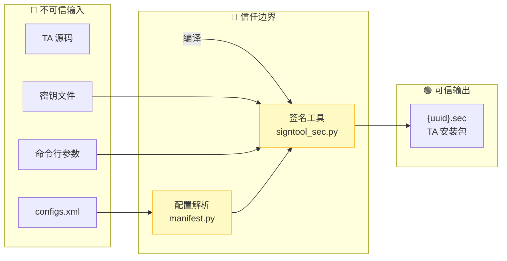

# 攻击面分析

> **阅读时间**: 15 分钟 | **目标**: 快速识别所有外部输入点和敏感操作

---

## 概述

本文档系统性地分析 tee_dev_kit 的攻击面，帮助安全研究员快速定位潜在的安全风险点。

**分析范围**:
- ✅ SDK 构建系统
- ✅ 签名工具链
- ✅ 配置解析模块
- ✅ 文件操作接口

**使用建议**:
1. 先阅读本章节获取攻击面全景
2. 参考 [04_Security_Review.md](04_Security_Review.md) 了解详细风险分析
3. 根据风险等级优先审计高风险组件

---

## 外部输入清单

所有来自不可信区域的输入都可能是攻击向量。

### 输入分类

| 输入类型 | 来源 | 处理组件 | 风险等级 | 证据位置 |
|---------|------|---------|---------|---------|
| **TA 源码** | 开发者编写 | 编译器 | 🔴 高 | `sdk/build/cmake/`, `sdk/build/mk/` |
| **配置文件** | XML 文件 | manifest.py | 🟡 中 | `sdk/build/script/manifest.py` |
| **签名密钥** | PEM 文件 | signtool_sec.py | 🔴 高 | `sdk/build/signkey/ta_sign_priv_key.pem` |
| **构建脚本** | Makefile/CMakeLists.txt | make/cmake | 🟡 中 | `sdk/build/mk/`, `sdk/build/cmake/` |
| **INI 配置** | 配置文件 | signtool_config.py | 🟡 中 | `sdk/build/config/` |
| **命令行参数** | 用户输入 | signtool_sec.py | 🟡 中 | `sdk/build/script/signtool_sec.py:776-788` |

### 详细输入说明

#### 1. TA 源码输入

**描述**: 开发者编写的 C 源代码文件

**处理流程**:
```
ta_*.c → 预处理 → 编译 → 链接 → libcombine.so
```

**风险说明**:
- 源代码可能包含恶意代码
- 编译器漏洞可能被利用
- 链接过程可能注入恶意目标文件

**证据位置**:
- 编译器配置: `sdk/build/cmake/common_flags.cmake`
- 链接配置: `sdk/build/ld/ta_link.ld`

#### 2. XML 配置文件输入

**描述**: `configs.xml` 文件，定义 TA 属性

**处理流程**:
```
configs.xml → manifest.py → Manifest 二进制
```

**风险说明**:
- XML 解析可能存在注入
- 配置项可能超出安全范围
- UUID 可能格式错误

**证据位置**:
- XML 解析: `sdk/build/script/manifest.py:50-150`
- XXE 防护: `sdk/build/script/dyn_conf_parser.py`

#### 3. 签名密钥输入

**描述**: RSA 私钥文件 (PEM 格式)

**处理流程**:
```
ta_sign_priv_key.pem → signtool_sec.py → RSA 签名
```

**风险说明**:
- 密钥文件可能被窃取
- 密钥硬编码在代码库中
- 调试密钥可能被误用

**证据位置**:
- 密钥路径: `sdk/build/signkey/ta_sign_priv_key.pem`
- 签名配置: `sdk/build/config/ta_sign_algo_config.ini`

#### 4. 命令行参数输入

**描述**: 签名工具的命令行参数

**处理流程**:
```
命令行参数 → argparse → 路径处理 → 文件操作
```

**风险说明**:
- 路径遍历攻击
- 命令注入
- 参数注入

**证据位置**:
- 参数解析: `sdk/build/script/signtool_sec.py:776-788`
- 路径检查: `sdk/build/script/signtool_sec.py:74-84`

---

## 敏感操作清单

在 TEE 环境中执行的操作具有高风险。

### 操作分类

| 操作类型 | 涉及组件 | 风险等级 | 说明 |
|---------|---------|---------|------|
| **文件写入** | 所有脚本 | 🔴 高 | 输出 .sec 文件 |
| **加密操作** | signtool_sec.py | 🔴 高 | RSA 签名生成 |
| **密钥加载** | signtool_sec.py | 🔴 高 | 私钥读取和使用 |
| **ELF 处理** | signtool_sec.py | 🟡 中 | TA 镜像解析 |
| **配置解析** | manifest.py | 🟡 中 | XML/INI 解析 |
| **内存操作** | signtool_sec.py | 🟡 中 | Hash 计算 |

### 详细操作说明

#### 敏感操作 1: 签名密钥加载

**操作**: 读取 PEM 格式私钥文件

**代码位置**:
```python
# sdk/build/script/signtool_sec.py
def load_private_key(key_path):
    with open(key_path, 'rb') as f:
        private_key = serialization.load_pem_private_key(
            f.read(),
            password=None,
            backend=default_backend()
        )
    return private_key
```

**风险**:
- 密钥文件权限泄露
- 内存中的密钥可能被读取
- 密钥硬编码风险

**缓解措施**:
- 文件权限设置为 600
- 内存保护机制（操作系统级别）

#### 敏感操作 2: ELF 文件解析

**操作**: 验证和解析 TA 镜像

**代码位置**:
```python
# sdk/build/script/signtool_sec.py:103-124
def verify_elf_header(elf_path):
    with open(elf_path, 'rb') as elf:
        elf_data = struct.unpack('B' * 16, elf.read(16))
        # 仅验证前 16 字节
        if ((elf_data[ELF_INFO_MAGIC0_INDEX] != ELF_INFO_MAGIC0) or
                (elf_data[ELF_INFO_MAGIC1_INDEX] != ELF_INFO_MAGIC1) or ...):
            raise RuntimeError("invalid elf header info")
```

**风险**:
- ELF 解析漏洞
- 恶意构造的 ELF
- 不完整的验证

**缓解措施**:
- 添加完整 ELF 解析
- 验证 Program headers

#### 敏感操作 3: Hash 计算

**操作**: 计算 TA 镜像 Hash

**代码位置**:
```python
# sdk/build/script/generate_hash.py
def calculate_hash(file_path):
    sha256_hash = hashlib.sha256()
    with open(file_path, "rb") as f:
        for byte_block in iter(lambda: f.read(4096), b""):
            sha256_hash.update(byte_block)
    return sha256_hash.hexdigest()
```

**风险**:
- Hash 碰撞攻击（理论上）
- 文件读取路径外泄

**缓解措施**:
- 使用 SHA256（当前安全）
- 添加文件大小限制

---

## 信任边界图



### 边界说明

| 边界 | 说明 | 跨越机制 |
|------|------|---------|
| **不可信 → 边界** | 所有外部输入 | 签名验证 |
| **边界 → 可信** | 可信输出 | 签名生成 |

---

## 攻击向量清单

### 高风险攻击向量

| # | 攻击向量 | 输入类型 | 利用可能性 | 影响 |
|---|---------|---------|-----------|------|
| **1** | 签名密钥泄露 | 密钥文件 | 中 | 完整绕过高安全 |
| **2** | 路径遍历 | 命令行参数 | 中 | 任意文件写入 |
| **3** | 配置注入 | XML 配置 | 低 | 配置篡改 |
| **4** | ELF 注入 | TA 源码 | 低 | 代码注入 |

### 中风险攻击向量

| # | 攻击向量 | 输入类型 | 利用可能性 | 影响 |
|---|---------|---------|-----------|------|
| **5** | 密钥弱配置 | INI 配置 | 中 | 签名强度不足 |
| **6** | 内存基线绕过 | 配置文件 | 中 | 资源耗尽 |
| **7** | 编译器注入 | TA 源码 | 低 | 恶意代码编译 |
| **8** | XXE 注入 | XML 配置 | 低（已防护） | 文件读取 |

---

## 安全审计清单

使用此清单进行快速安全审计。

### 输入验证检查

| 检查项 | 状态 | 说明 |
|--------|------|------|
| XML 解析使用 defusedxml | ✅ | `sdk/build/script/dyn_conf_parser.py` |
| 路径白名单校验 | ⚠️ | `sdk/build/script/signtool_sec.py:74-84` |
| ELF 头完整验证 | ⚠️ | 仅验证前 16 字节 |
| 命令行参数过滤 | ⬜ | 需要增强 |

### 密钥安全检查

| 检查项 | 状态 | 说明 |
|--------|------|------|
| 调试密钥已替换 | ⬜ | 商用环境必需 |
| 密钥文件权限正确 | ⬜ | 应为 600 |
| 密钥强度足够 | ⚠️ | 默认 4096 位 |

### 配置安全检查

| 检查项 | 状态 | 说明 |
|--------|------|------|
| 栈大小限制 | ✅ | 配置项存在 |
| 堆大小限制 | ✅ | 配置项存在 |
| 内存基线检查 | ⚠️ | 可被禁用 |

---

## 继续阅读

### 详细分析

| 文档 | 阅读时间 | 目标 |
|------|---------|------|
| [04_Security_Review.md](04_Security_Review.md) | 30 分钟 | 详细风险分析 |
| [03_Build_System.md](03_Build_System.md) | 20 分钟 | 构建系统详解 |
| [02_TA_Development_Guide.md](02_TA_Development_Guide.md) | 30 分钟 | 开发指南 |

### 问题排查

遇到问题？请参考 [06_Troubleshooting.md](06_Troubleshooting.md)

---

## 变更历史

| 版本 | 日期 | 变更说明 |
|------|------|---------|
| 1.0.0 | 2026-02-07 | 初始版本 |

---

*最后更新: 2026-02-07*
