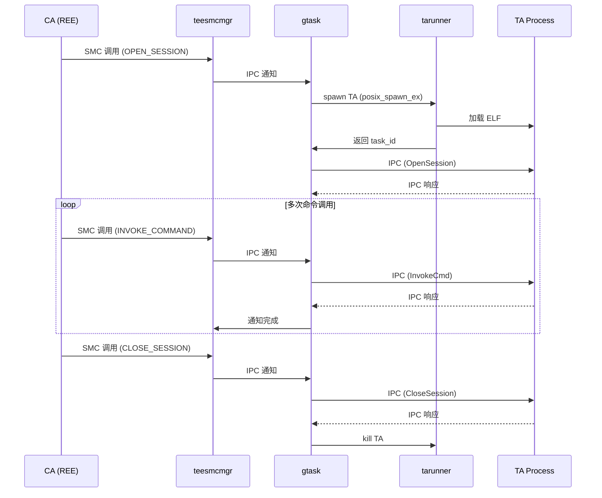
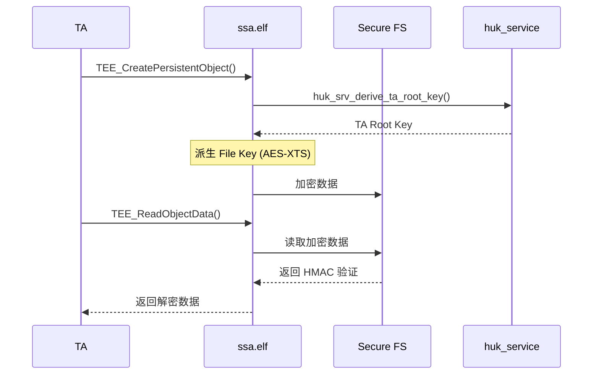

# 架构设计

## 1. 整体架构

### 1.1 系统架构图

```
┌─────────────────────────────────────────────────────────────────────────────┐
│                         OpenHarmony (REE - Rich Execution Environment)       │
│  ┌─────────────────────────────────────────────────────────────────────┐   │
│  │                      OpenHarmony Framework (N-API层)                  │   │
│  │                         (位于独立仓库)                               │   │
│  └─────────────────────────────────────────────────────────────────────┘   │
│                                      │                                     │
│                                      ▼                                     │
│  ┌─────────────────────────────────────────────────────────────────────┐   │
│  │                     CA (Client Application)                          │   │
│  │                         Native C/C++ 应用                            │   │
│  └─────────────────────────────────────────────────────────────────────┘   │
│                                      │ SMC                                │
└──────────────────────────────────────┼────────────────────────────────────┘
                                       │
                                       ▼
┌─────────────────────────────────────────────────────────────────────────────┐
│                         TEE (Trusted Execution Environment)                  │
│  ┌─────────────────────────────────────────────────────────────────────┐   │
│  │                      teesmcmgr (SMC 管理)                            │   │
│  │           SMC 命令接收 → IPC 通知 → gtask                            │   │
│  └─────────────────────────────────────────────────────────────────────┘   │
│                                      │                                     │
│                    ┌─────────────────┼─────────────────┐                    │
│                    ▼                 ▼                 ▼                    │
│  ┌───────────────────┐ ┌───────────────────┐ ┌───────────────────┐       │
│  │     gtask         │ │     drvmgr       │ │     tarunner      │       │
│  │  (TA 生命周期)     │ │  (驱动管理)      │ │  (ELF 加载)       │       │
│  └───────────────────┘ └───────────────────┘ └───────────────────┘       │
│                                                                             │
│  ┌─────────────────────────────────────────────────────────────────────┐   │
│  │                         Services                                      │   │
│  │  ┌──────────────┐ ┌──────────────┐ ┌──────────────┐                │   │
│  │  │permission_svr│ │     ssa      │ │  huk_service │                │   │
│  │  │  (权限服务)   │ │ (安全存储)   │ │  (根密钥)    │                │   │
│  │  └──────────────┘ └──────────────┘ └──────────────┘                │   │
│  └─────────────────────────────────────────────────────────────────────┘   │
│                                                                             │
│  ┌─────────────────────────────────────────────────────────────────────┐   │
│  │                         Drivers                                        │   │
│  │  ┌──────────────┐ ┌──────────────┐                                 │   │
│  │  │ crypto_mgr   │ │ tee_misc_drv │                                 │   │
│  │  │ (加解密)     │ │ (基础驱动)    │                                 │   │
│  │  └──────────────┘ └──────────────┘                                 │   │
│  └─────────────────────────────────────────────────────────────────────┘   │
│                                                                             │
│  ┌─────────────────────────────────────────────────────────────────────┐   │
│  │                     TA Processes (每个 TA 独立进程)                   │   │
│  │                                                                      │   │
│  │    TA_1 ──┐    TA_2 ──┐    TA_3 ──┐                               │   │
│  │    (GP API)  (GP API)  (GP API)                                    │   │
│  │                                                                      │   │
│  └─────────────────────────────────────────────────────────────────────┘   │
└─────────────────────────────────────────────────────────────────────────────┘
```

### 1.2 组件职责

| 组件 | 职责 | 证据位置 |
|------|------|----------|
| **teesmcmgr** | 接收 REE 的 SMC 调用，通知 gtask 处理 | `framework/teesmcmgr/src/teesmc.c` |
| **gtask** | TA 生命周期管理、会话管理、命令分发 | `framework/gtask/src/framework/global_task.c` |
| **drvmgr** | 驱动进程管理、驱动访问控制 | `framework/drvmgr/src/drv_dispatch.c` |
| **tarunner** | ELF 加载器，加载 TA/驱动/服务二进制 | `framework/tarunner/src/main.c` |
| **permission_service** | SEC 文件验签、权限控制 | `services/permission_service/src/main.c:538` |
| **ssa** | 安全存储（AES-256-XTS 加密） | `services/ssa/src/secure_storage_agent/sfs.c` |
| **huk_service** | 硬件根密钥派生 | `services/huk_service/src/huk_derive_takey.c` |

---

## 2. 数据流

### 2.1 CA → TA 通信流程

```
┌──────────┐     SMC      ┌───────────┐    IPC Notify    ┌─────────┐
│   CA     │ ───────────→ │ teesmcmgr │ ──────────────→ │  gtask  │
│  (REE)   │              │           │                 │         │
└──────────┘              └───────────┘                 └────┬────┘
                                                           │
                         ┌────────────────────────────────┘
                         ▼
                  ┌─────────────┐
                  │ IPC 消息接收  │
                  │ ipc_msg_rcv()│
                  └──────┬──────┘
                         ▼
                  ┌─────────────┐
                  │ get_last_in │
                  │ _cmd()      │ ←─ 从 SMC 队列读取
                  └──────┬──────┘
                         ▼
                  ┌─────────────┐
                  │dispatch_ns_ │
                  │   cmd()     │ ←─ 分发命令
                  └──────┬──────┘
                         ▼
                  ┌─────────────┐
                  │start_ta_    │
                  │   task()    │ ←─ 启动 TA
                  └──────┬──────┘
                         ▼
                  ┌─────────────┐
                  │async_call_  │
                  │ta_entry()   │ ←─ IPC 发送到 TA
                  └──────┬──────┘
                         ▼ IPC
                  ┌─────────────┐
                  │    TA       │
                  │  Process    │
                  │(GP API 调用) │
                  └──────┬──────┘
                         ▼ IPC 响应
                  ┌─────────────┐
                  │handle_s_    │
                  │  cmd()      │ ←─ 处理 TA 响应
                  └──────┬──────┘
                         ▼
                  ┌─────────────┐
                  │put_last_    │
                  │out_cmd()    │ ←─ 写入响应队列
                  └──────┬──────┘
                         │
                         ▼ 返回 REE
                  ┌─────────────┐
                  │   CA        │
                  └─────────────┘
```

**证据**：`framework/gtask/src/include/gtask_inner.h:60-73`
```c
typedef struct {
    DECLEAR_BITMAP(in_bitmap, MAX_SMC_CMD);      // 输入命令位图
    DECLEAR_BITMAP(doing_bitmap, MAX_SMC_CMD);   // 处理中位图
    DECLEAR_BITMAP(out_bitmap, MAX_SMC_CMD);     // 输出响应位图
    volatile uint32_t last_in;
    smc_cmd_t in[MAX_SMC_CMD];                   // 输入命令数组
    volatile uint32_t last_out;
    smc_cmd_t out[MAX_SMC_CMD];                  // 输出响应数组
} nwd_cmd_t;  // SMC 命令队列（18 个槽位）
```

### 2.2 TA → Driver 通信流程

```
┌──────────┐    IPC Call    ┌─────────┐    IPC Call    ┌─────────┐
│   TA     │ ─────────────→ │  drvmgr │ ─────────────→ │  Driver │
│          │                │         │                │ Process │
└──────────┘                └────┬────┘                └─────────┘
                                  │
                       ┌──────────┴──────────┐
                       ▼                     ▼
                权限检查            驱动进程创建
                (MAC/ACL)          (tarunner 加载)
```

**证据**：`framework/drvmgr/src/drv_auth.c`
- `caller_open_auth_check()`: 调用者权限检查
- `drv_mac_open_auth_check()`: MAC 列表检查

### 2.3 SMC 命令处理

| 命令类型 | 命令 ID | 描述 |
|----------|---------|------|
| `GLOBAL_CMD_ID_OPEN_SESSION` | 0x2 | 打开 TA 会话 |
| `GLOBAL_CMD_ID_CLOSE_SESSION` | 0x3 | 关闭 TA 会话 |
| `GLOBAL_CMD_ID_LOAD_SECURE_APP` | 0x4 | 加载动态 TA |
| `GLOBAL_CMD_ID_REGISTER_AGENT` | 0x6 | 注册 Agent |
| `GLOBAL_CMD_ID_KILL_TASK` | 0x10 | 杀死任务 |

**证据**：`lib/teelib/libteeos/include/tee/tee_common.h`

---

## 3. 线程模型

### 3.1 gtask 线程模型

```
gtask 进程 (单线程事件循环)
│
├── 主线程: gtask_main()
│   ├── 接收 SMC 通知 (ipc_msg_rcv_a)
│   ├── 处理命令 (dispatch_ns_cmd)
│   └── 响应返回 (put_last_out_cmd)
│
├── TA 工作线程 (每个会话)
│   ├── 接收 gtask 命令 (ipc_msg_rcv)
│   ├── 调用 TA 入口点
│   └── 发送响应 (ipc_msg_snd)
│
└── 同步机制
    ├── SMC 缓冲区锁 (spinlock)
    ├── 会话位图 (session_bitmap)
    └── 内存屏障 (dmb/dsb/isb)
```

**证据**：`framework/gtask/src/include/gtask_core.h:43-72`
```c
struct session_struct {
    uint32_t task_id;              // TA 任务 ID
    uint32_t session_id;           // 会话 ID
    uint64_t session_context;      // 会话上下文
    uint32_t login_method;          // 登录方法
    struct dlist_node locked_agents; // 锁定的 Agent 列表
    smc_cmd_t cmd_in;              // 输入命令副本
};
```

### 3.2 teesmcmgr 线程模型

```
teesmcmgr 进程
│
├── SMC 处理线程 (tee_smc_thread)
│   ├── 高优先级
│   └── 等待 REE 的 SMC 调用 (smc_wait_switch_req)
│
└── Idle 线程 (tee_idle_thread)
    ├── 低优先级
    └── 系统休眠/唤醒管理 (smc_switch_req)
```

### 3.3 drvmgr 线程模型

```
drvmgr 进程
│
├── 主线程 (drv_thread_init)
│   ├── 接收驱动请求
│   ├── 权限检查
│   └── 分发到工作线程
│
├── 工作线程池
│   └── 处理驱动操作
│
└── 同步机制
    └── 驱动创建互斥锁 (g_drv_spawn_mtx)
```

---

## 4. 关键时序图

### 4.1 TA 会话生命周期



### 4.2 安全存储操作



---

## 5. 信任边界

### 5.1 边界定义

```
┌─────────────────────────────────────────────────────────────────┐
│                    信任边界层次                                   │
│                                                                  │
│  ┌─────────────────────────────────────────────────────────┐    │
│  │ 边界 1: REE ↔ TEE                                        │    │
│  │   - SMC 指令是唯一入口                                    │    │
│  │   - 共享内存由内核控制                                    │    │
│  └─────────────────────────────────────────────────────────┘    │
│                            │                                    │
│                            ▼                                    │
│  ┌─────────────────────────────────────────────────────────┐    │
│  │ 边界 2: gtask ↔ Services                                 │    │
│  │   - GLOBAL_HANDLE 标识 gtask                             │    │
│  │   - 只有 gtask 可请求 ELF 验证                            │    │
│  └─────────────────────────────────────────────────────────┘    │
│                            │                                    │
│                            ▼                                    │
│  ┌─────────────────────────────────────────────────────────┐    │
│  │ 边界 3: gtask ↔ TA                                       │    │
│  │   - 每个 TA 独立进程                                      │    │
│  │   - 会话隔离                                              │    │
│  │   - Agent 锁定机制                                        │    │
│  └─────────────────────────────────────────────────────────┘    │
│                            │                                    │
│                            ▼                                    │
│  ┌─────────────────────────────────────────────────────────┐    │
│  │ 边界 4: TA ↔ Driver                                      │    │
│  │   - drvmgr 作为中间层                                    │    │
│  │   - MAC 访问控制列表                                     │    │
│  │   - 权限检查                                              │    │
│  └─────────────────────────────────────────────────────────┘    │
│                            │                                    │
│                            ▼                                    │
│  ┌─────────────────────────────────────────────────────────┐    │
│  │ 边界 5: TA ↔ SSA (安全存储)                              │    │
│  │   - TA Root Key 隔离                                     │    │
│  │   - 每个 TA 有独立加密密钥                                 │    │
│  └─────────────────────────────────────────────────────────┘    │
└─────────────────────────────────────────────────────────────────┘
```

### 5.2 边界跨越点

| 跨越方向 | 机制 | 校验 |
|----------|------|------|
| REE → TEE | SMC | 由 ATF/内核控制 |
| gtask → Permission Service | IPC | `sender_taskid == GLOBAL_HANDLE` |
| TA → SSA | IPC Agent | `tee_lock_agent(FS_AGENT)` |
| TA → Driver | drvmgr | `caller_open_auth_check()` |

**证据**：`services/permission_service/src/main.c:164`
```c
bool is_access_perm = (sndr_taskid == GLOBAL_HANDLE) || check_file_cmd_perm(sndr_taskid, cmd_id);
if (is_access_perm == false) {
    rsp.reply.ret = TEE_ERROR_ACCESS_DENIED;
    goto end;
}
```

---

## 6. 关键数据结构

### 6.1 SMC 命令结构

```c
// 证据: lib/teelib/libteeos/include/tee/ta_framework.h
typedef struct {
    uint8_t uuid[sizeof(TEE_UUID)];     // TA UUID
    unsigned int cmd_type;               // CMD_TYPE_GLOBAL/TA/TA_AGENT
    unsigned int cmd_id;                 // 命令 ID
    unsigned int dev_file_id;            // 设备文件 ID
    unsigned int context;               // 上下文 (high=service_idx, low=session_id)
    unsigned int operation_phys;         // 操作参数物理地址
    unsigned int login_method;           // 登录方法
    unsigned int err_origin;            // 错误来源
    unsigned int ret_val;               // 返回值
    unsigned int event_nr;              // SMC 队列索引
    unsigned int uid;                   // 用户 ID
    unsigned int ca_pid;                // CA 进程 ID
} __attribute__((__packed__)) smc_cmd_t;
```

### 6.2 会话结构

```c
// 证据: framework/gtask/src/include/gtask_core.h
struct session_struct {
    struct dlist_node session_list;      // 会话链表
    uint32_t task_id;                     // TA 任务 ID
    uint32_t session_id;                  // 会话 ID
    uint64_t session_context;            // 会话上下文
    uint32_t login_method;               // 登录方法
    char name[SERVICE_NAME_MAX + SESSION_ID_LEN];
    uint32_t ta2ta_from_taskid;          // TA2TA 调用者
    bool agent_pending;                   // Agent 等待标志
    struct dlist_node locked_agents;     // 锁定的 Agent
    smc_cmd_t cmd_in;                    // 输入命令
};
```

---

## 相关文档

- 模块详情 → `02_Module_Detail.md`
- Native API → `03_Native_API.md`
- 安全评审 → `05_Security_Review.md`
