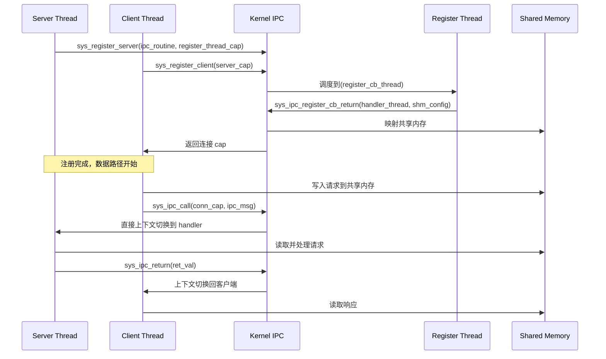
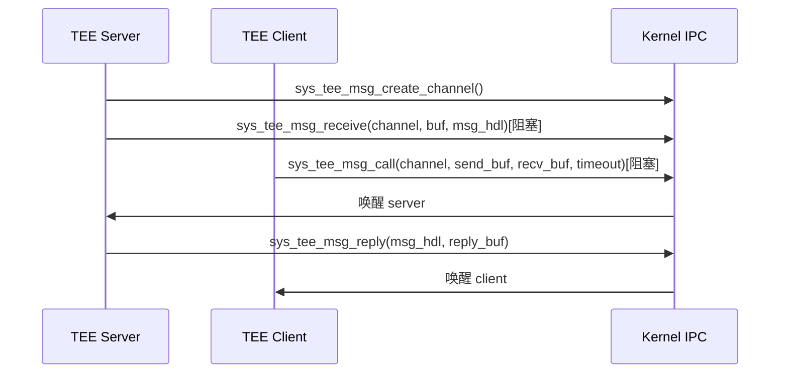

# 架构设计

> **文档版本**: 1.0
> **生成时间**: 2026-02-06
> **适用范围**: OpenHarmony TEE OS Kernel 架构设计

---

## 文档目的

本文档详细描述 tee_os_kernel 的架构设计，包括组件关系、数据流、线程模型和关键时序。

---

## 目录

- [总体架构](#总体架构)
- [微内核设计](#微内核设计)
- [组件图](#组件图)
- [线程模型](#线程模型)
- [内存模型](#内存模型)
- [IPC 架构](#ipc-架构)
- [启动流程](#启动流程)
- [关键时序](#关键时序)

---

## 总体架构

### 1.1 层次结构

```
┌─────────────────────────────────────────────────────────┐
│              用户空间（User Space）                  │
│                                                      │
│  ┌────────────────┐  ┌──────────────┐   │
│  │   procmgr    │  │   chanmgr     │   │
│  │ (进程管理）   │  │ (Channel 管理）│   │
│  └────────────────┘  └──────────────┘   │
│  ┌────────────────┐  ┌──────────────┐   │
│  │   fsm         │  │   tmpfs       │   │
│  │ (FSM)       │  │ (内存 FS）    │   │
│  └────────────────┘  └──────────────┘   │
│  ┌────────────────┐                       │
│  │   fs_base     │                       │
│  │ (VFS 基础） │                       │
│  └────────────────┘                       │
└───────────────────────────────────────────────────┘
                    ↕ SVC (系统调用，256 个）
┌─────────────────────────────────────────────────┐
│              内核空间（Kernel）                   │
│                                                      │
│  ┌──────────┐  ┌──────────┐  ┌──────┐  │
│  │  sched   │  │   mm     │  │  ipc  │  │
│  │ (调度）  │  │ (内存）  │  │ (IPC） │  │
│  └──────────┘  └──────────┘  └──────┘  │
│  ┌──────────┐  ┌──────────┐  ┌──────┐  │
│  │  object   │  │  syscall │  │  irq   │  │
│  │ (对象）  │  │ (系统调用）│  │ (中断）│  │
│  └──────────┘  └──────────┘  └──────┘  │
│  ┌──────────┐                       │
│  │  trustzone│                       │
│  │ (TZ SMC）│                       │
│  └──────────┘                       │
│                                      │
└─────────────────────────────────────────────┘
            ↕ SMC (TrustZone 安全监控调用）
┌─────────────────────────────────────────────────┐
│            安全监控器（Secure Monitor）          │
│            （BL31/OP-TEE）                 │
└─────────────────────────────────────────────────┘
```

### 1.2 TrustZone 安全边界

```
┌──────────────────────────────────────┐
│     非安全世界（Normal World）    │
│     (REE - Rich Execution Environment） │
│                                    │
│         ↕ SMC 调用               │
│                                    │
└──────────────────────────────────────┘
           EL3（Secure EL3）


┌──────────────────────────────────────┐
│     安全世界（Secure World）        │
│     (TEE - Trusted Execution Env）  │
│    - tee_os_kernel (BL32）         │
│    - TEE Applications               │
│                                    │
│         ↕ SMC 返回                │
│                                    │
└──────────────────────────────────────┘
```

---

## 微内核设计

### 2.1 核心原则

| 原则 | 说明 | 实现证据 |
|------|------|----------|
| **最小内核** | 仅调度、内存管理、IPC 等核心功能在内核 | `kernel/sched/`, `kernel/mm/`, `kernel/ipc/` |
| **服务用户态化** | 文件系统、进程管理等在用户态运行 | `user/system-services/` |
| **能力安全** | 所有资源通过 Capability 控制 | `kernel/object/capability.c` |
| **地址隔离** | 每个进程独立的 VMSpace | `kernel/mm/vmspace.c` |
| **对象管理** | 统一的内核对象系统 | `kernel/include/object/object.h` |

### 2.2 内核对象系统

**基类结构**（`kernel/include/object/object.h:20-38`）：
```c
struct object {
    u64 type;              // 对象类型（CAP_GROUP, THREAD, PMO 等）|
    u64 size;              // 对象大小
    struct list_head copies_head;  // Capability 副本链表
    struct lock copies_lock;
    unsigned long refcount;    // 引用计数（0 时释放）|
    u64 opaque[];          // 实际对象数据（可变长度）|
};
```

**对象类型**：
- `TYPE_CAP_GROUP` - 进程容器（Capability Group）
- `TYPE_THREAD` - 线程对象
- `TYPE_CONNECTION` - IPC 连接对象
- `TYPE_NOTIFICATION` - 通知对象
- `TYPE_IRQ` - 中断对象
- `TYPE_PMO` - 物理内存对象
- `TYPE_VMSPACE` - 虚拟地址空间
- `TYPE_CHANNEL` - TEE 专用通道（CHCORE_OH_TEE）
- `TYPE_MSG_HDL` - 消息句柄（CHCORE_OH_TEE）

---

## 组件图

### 3.1 内核模块关系

```mermaid
graph TB
    subgraph UserSpace[用户空间]
        PROCMGR[procmgr<br/>进程管理器]
        FSM[fsm<br/>文件系统管理器]
        TMPFS[tmpfs<br/>内存文件系统]
        CHANMGR[chanmgr<br/>Channel 管理器]
        LIBOHTEE[libohtee<br/>TEE 库]
        LIBCHCORE[libchcore<br/>ChCore libc]

    subgraph Kernel[内核空间]
        SCHED[sched<br/>线程调度器]
        MM[mm<br/>内存管理]
        IPC[ipc<br/>进程间通信]
        OBJ[object<br/>对象管理]
        SYSCALL[syscall<br/>系统调用]
        IRQ[irq<br/>中断管理]
        TZ[trustzone<br/>TrustZone]

    subgraph Arch[架构相关]
        BOOT[arch/aarch64/boot<br/>启动代码]
        PLAT[arch/aarch64/plat<br/>平台代码]
        IRQ_ARCH[arch/aarch64/irq<br/>中断处理]
        MM_ARCH[arch/aarch64/mm<br/>内存管理]
        SYNC[arch/aarch64/sync<br/>同步原语]

    %% 用户态依赖
    PROCMGR --> LIBCHCORE
    FSM --> LIBCHCORE
    TMPFS --> LIBCHCORE
    CHANMGR --> LIBOHTEE

    %% 系统调用路径
    LIBCHCORE -->|SVC|SYSCALL
    LIBOHTEE -->|SVC|SYSCALL

    %% 内核依赖
    SYSCALL --> OBJ
    SYSCALL --> MM
    SYSCALL --> SCHED
    SYSCALL --> IPC
    SYSCALL --> IRQ

    OBJ --> SCHED
    OBJ --> MM
    OBJ --> IPC

    SCHED --> THREAD
    MM --> PMO
    IPC --> CONNECTION

    %% 架构依赖
    SCHED --> SCHED_ARCH
    MM --> MM_ARCH
    IRQ --> IRQ_ARCH
    SYNC --> TZ

    BOOT --> PLAT
```

---

## 线程模型

### 4.1 线程类型

**定义位置**：`kernel/include/sched/sched.h:46-63`

```c
enum thread_type {
    TYPE_IDLE = 0,     // IDLE 线程 - 无栈，暂停 CPU
    TYPE_KERNEL = 1,   // KERNEL 线程 - 有栈，无 FPU/TLS
    TYPE_USER = 2,     // USER 线程 - 完整用户上下文
    TYPE_SHADOW = 3,   // SHADOW 线程 - 用于迁移 IPC
    TYPE_REGISTER = 4, // REGISTER 线程 - IPC 注册回调线程
    TYPE_TESTS = 5     // TESTS 线程 - 内核测试用
};
```

### 4.2 线程状态

```c
enum thread_state {
    TS_INIT = 0,      // 初始状态
    TS_READY,         // 就绪队列
    TS_INTER,         // 中间态（调试）
    TS_RUNNING,       // 当前执行
    TS_EXIT,          // 退出（调试）
    TS_WAITING,       // 等待 IPC 或通知
};
```

### 4.3 调度算法：优先级轮转（PBRR）

**实现位置**：`kernel/sched/policy_pbrr.c`

**特性**：
- **优先级范围**：0-255（`MAX_PRIO=255`, `MIN_PRIO=0`）
- **默认优先级**：10
- **时间片**：10ms（`DEFAULT_BUDGET=1` tick，`TICK_MS=10`）
- **O(1) 选择**：使用位图快速选择最高优先级线程
- **每 CPU 就绪队列**：支持 CPU 亲和性（`NO_AFF=-1` 表示无亲和性）

**调度器接口**（`kernel/include/sched/sched.h:68-75`）：
```c
struct sched_ops {
    int (*sched_init)(void);
    int (*sched)(void);
    int (*sched_enqueue)(struct thread *thread);
    int (*sched_dequeue)(struct thread *thread);
    void (*sched_top)(void);
};
```

### 4.4 上下文切换

**关键结构**（`kernel/include/sched/context.h`）：
```c
struct thread_ctx {
    unsigned int budget;  // 剩余时间片
    unsigned int prio;    // 优先级
};
```

**切换流程**：
```
sched() 选择新线程
    ↓
switch_context() 保存当前上下文
    ↓
eret_to_thread(new_sp) 恢复新线程上下文
```

---

## 内存模型

### 5.1 PMO（物理内存对象）

**定义位置**：`kernel/include/object/memory.h:21-32`

```c
typedef unsigned pmo_type_t;

#define PMO_ANONYM       0 /* 懒分配（按需分页）*/
#define PMO_DATA         1 /* 立即分配 */
#define PMO_FILE         2 /* 文件支持 */
#define PMO_SHM          3 /* 共享内存 */
#define PMO_USER_PAGER   4 /* 支持用户分页器 */
#define PMO_DEVICE       5 /* 设备寄存器映射 */
#define PMO_DATA_NOCACHE 6 /* 不可缓存立即分配 */
#define PMO_TZ_NS        7 /* TrustZone 非安全内存 */
```

**PMO 结构**：
```c
struct pmobject {
    paddr_t start;           // 起始物理地址
    size_t size;            // 大小
    pmo_type_t type;        // 类型
    struct radix *radix;     // 按需分页的物理页
    void *private;          // 类型相关的私有数据
#ifdef CHCORE_OH_TEE
    struct lock owner_lock;     // 所有者锁
    struct cap_group *owner;     // PMO 所有者（TEE UUID）|
#endif /* CHCORE_OH_TEE */
};
```

### 5.2 VMSpace（虚拟地址空间）

**定义位置**：`kernel/include/mm/vmspace.h:35-61`

```c
struct vmspace {
    struct list_head vmr_list;      // VMRegion 链表
    struct rb_root vmr_tree;       // VMRegion 红黑树
    void *pgtbl;                 // 根页表
    unsigned long pcid;            // 地址空间 ID（避免 TLB 冲突）|
    struct lock vmspace_lock;       // VMRegion 操作锁
    struct lock pgtbl_lock;        // 页表操作锁
    unsigned char history_cpus[PLAT_CPU_NUM]; // TLB 刷新历史
    struct vmregion *heap_vmr;     // 堆区域
    unsigned long rss;             // 已映射内存大小
};
```

**VMRegion 权限**（`kernel/include/arch/aarch64/arch/mmu.h`）：
```c
#define VMR_READ    (1 << 0)   // 读权限
#define VMR_WRITE   (1 << 1)   // 写权限
#define VMR_EXEC    (1 << 2)   // 执行权限
#define VMR_DEVICE  (1 << 3)   // 设备内存
#define VMR_NOCACHE (1 << 4)   // 不可缓存
#define VMR_COW     (1 << 5)   // 写时复制
#define VMR_TZ_NS   (1 << 6)   // TrustZone 非安全内存
```

### 5.3 内存分配器

| 分配器 | 职责 | 文件 |
|--------|------|------|
| **Buddy 分配器** | 物理页分配（按 2^n 大小）| `kernel/mm/buddy.c` |
| **Slab 分配器** | 小对象分配（固定大小）| `kernel/mm/slab.c` |
| **kmalloc** | 内核通用分配器 | `kernel/mm/kmalloc.c` |

---

## IPC 架构

### 6.1 ChCore IPC（Connection-based）

**注册流程**：


**关键结构**（`kernel/include/ipc/connection.h`）：
```c
struct ipc_connection {
    struct thread *current_client_thread;
    struct thread *server_handler_thread;
    badge_t client_badge;              // 客户端进程标识
    struct shm_for_ipc_connection shm;   // 共享内存
    struct lock ownership;
};
```

### 6.2 TEE IPC Channel

**消息流程**：


---

## 启动流程

### 7.1 启动序列

**代码位置**：`kernel/arch/aarch64/boot/rk3568/init/start.c`

```
BL1 启动
    ↓
head.S (早期启动汇编)
    ↓
init_boot_page_table()  // 初始化启动页表
    ↓
el1_mmu_activate()    // 激活 MMU
    ↓
start_kernel(paddr_t start_pa)  // 跳转到 C 内核入口
    ↓
main.c: kmain()
    ↓
内核初始化序列:
  - arch_interrupt_init()     // 中断初始化
  - plat_interrupt_init()    // 平台中断初始化
  - sched_init()           // 调度器初始化
  - mm_init()             // 内存管理初始化
  - object_init()         // 对象系统初始化
  - init_cap_group()      // Capability 系统初始化
  - init_root_cap_group()  // 创建根进程
    ↓
启动第一个用户进程 (procmgr)
    ↓
调度器接管
```

### 7.2 根进程初始化

**代码位置**：`kernel/object/cap_group.c` + `user/system-services/system-servers/procmgr/`

```
init_root_cap_group("procmgr", HEAP_SIZE)
    ↓
创建根进程 (badge = 1)
    ↓
加载 procmgr 二进制到内核
    ↓
创建第一个用户线程
    ↓
procmgr 开始运行
    ↓
procmgr: 注册服务 (fsm, tmpfs, chanmgr)
    ↓
系统就绪
```

---

## 关键时序

### 8.1 系统调用时序

```
用户程序
    ↓ svc (系统调用号)
异常入口
    ↓
保存寄存器
    ↓
检查系统调用号
    ↓
调用 syscall_table[syscall_num]()
    ↓
参数验证与检查
    ↓
执行系统调用逻辑
    ↓
设置返回值 (x0)
    ↓
eret (返回用户空间)
用户程序继续
```

### 8.2 TrustZone 切换时序

```
TEE 内核 (BL32)
    ↓
sys_tee_switch_req(args)
    ↓
SMC 调用 (SMC_STD_REQUEST)
    ↓
进入非安全世界（Normal World）
    ↓
非安全世界执行任务
    ↓
SMC 返回 (SMC_STD_RESPONSE)
    ↓
返回 TEE 内核
    ↓
恢复执行
```

### 8.3 IPC 调用时序

```
Client 线程
    ↓
sys_ipc_call(conn, msg)
    ↓
内核保存当前线程上下文
    ↓
内核切换到 Server Handler 线程
    ↓
Server Handler 处理请求
    ↓
sys_ipc_return(ret_val)
    ↓
内核恢复 Client 线程上下文
    ↓
Client 线程继续
```

---

## 相关跳转

- [项目概览](00_Overview.md) - 核心能力与关键概念
- [目录结构](01_Directory_Structure.md) - 代码组织与模块职责
- [系统调用接口](03_Syscall_Interfaces.md) - 完整的系统调用清单
- [内部 API](04_Internal_APIs.md) - 模块接口与依赖
- [安全评审](07_Security_Review.md) - TrustZone 与安全机制

---

**文档维护**: OpenHarmony TEE OS Kernel 开发团队
**最后更新**: 2026-02-06
