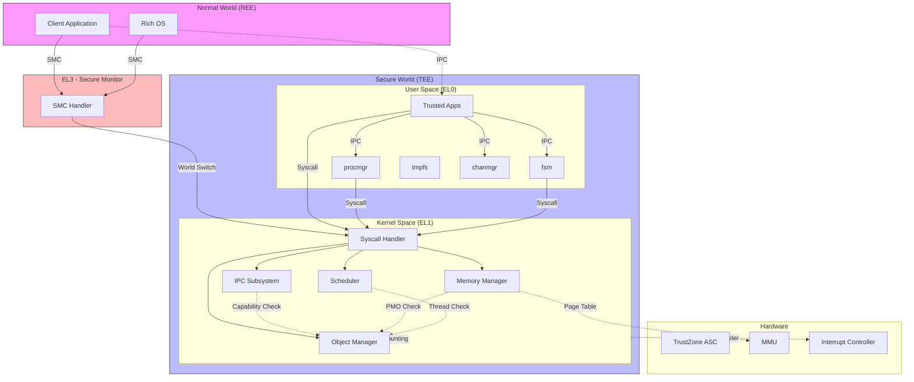

# 05 - 攻击面分析 (Attack Surface Analysis)

> 文档版本: 1.0  
> 更新日期: 2025-02-07  
> 风险等级: 🔴 高危 | 🟡 中危 | 🟢 低危

---

## 1. 执行摘要

OpenTrustee TEE OS Kernel 作为运行在 ARM TrustZone 安全世界中的微内核，其攻击面主要集中在：
- **256 个系统调用**的输入验证
- **IPC 消息传递**的参数解析
- **Capability 权限**的传递与检查
- **TrustZone SMC 接口**的安全边界

本文档识别了 **6 大类外部输入入口**和 **20+ 敏感操作点**，为安全研究提供系统性的分析框架。

---

## 2. 外部输入清单

### 2.1 系统调用接口（🔴 高危险）

**入口数量**: 256 个系统调用  
**入口点**: `kernel/arch/aarch64/irq/irq_entry.S:el0_syscall`  
**分发器**: `kernel/syscall/syscall.c:syscall_table`

#### 高危险系统调用

| 系统调用 | 编号 | 输入类型 | 风险描述 | 代码位置 |
|----------|------|----------|----------|----------|
| `sys_create_cap_group` | 80 | 进程参数结构体 | 创建新进程，可执行任意代码 | `object/cap_group.c:254` |
| `sys_map_pmo` | 12 | 虚拟地址 + PMO | 控制地址空间映射 | `object/memory.c:237` |
| `sys_create_device_pmo` | 11 | 物理地址 + 大小 | 直接访问硬件内存 | `object/memory.c:418` |
| `sys_irq_register` | 150 | IRQ 号 + 处理函数 | 注册中断处理程序 | `object/irq.c:TODO` |
| `sys_transfer_caps` | 62 | Capability 数组 | 跨进程权限传递 | `object/capability.c:367` |
| `sys_cache_flush` | 180 | 地址范围 | 特权 cache 操作 | `arch/*/mm/cache.c:TODO` |

#### TEE 专用高危险调用

| 系统调用 | 编号 | 风险描述 | 代码位置 |
|----------|------|----------|----------|
| `sys_tee_switch_req` | 251 | SMC 调用，Normal World 可触发 | `arch/*/trustzone/spd/*/smc.c` |
| `sys_tee_create_ns_pmo` | 252 | 创建非安全内存映射 | `object/memory.c:900` |
| `sys_tee_msg_call` | 144 | TEE 消息调用 | `ipc/channel.c:563` |
| `sys_tee_msg_create_channel` | 141 | 创建跨世界通道 | `ipc/channel.c:467` |

### 2.2 IPC 消息接口（🔴 高危险）

#### Connection IPC

**入口**: `sys_ipc_call` (编号 123)  
**处理**: `kernel/ipc/connection.c:650`

```c
// 关键输入点
struct ipc_msg {
    u64 data_len;           // 数据长度
    u64 cap_slot_number;    // Capability 槽数量
    u64 data_offset;        // 数据偏移
    u64 cap_slots_offset;   // Capability 槽偏移
};
```

**验证链**:
1. `check_ipc_msg_in_shm()` - 验证消息在共享内存内
2. `check_user_addr_range()` - 验证用户地址范围
3. `ipc_send_cap()` - 验证 Capability 传输

#### Channel IPC (TEE)

**入口**: `sys_tee_msg_*` 系列调用  
**处理**: `kernel/ipc/channel.c`

| 调用 | 输入类型 | 风险点 |
|------|----------|--------|
| `sys_tee_msg_create_msg_hdl` | recv_buf, info | 用户缓冲区映射 | `channel.c:437` |
| `sys_tee_msg_call` | send_buf, recv_buf | 双向数据传输 | `channel.c:563` |
| `sys_tee_msg_reply` | reply_buf | 回复数据验证 | `channel.c:592` |

### 2.3 内存管理接口（🟡 中危险）

| 调用 | 输入 | 验证点 | 代码 |
|------|------|--------|------|
| `sys_write_pmo` | user_buf, size, offset | check_user_addr_range | `memory.c:112` |
| `sys_read_pmo` | user_buf, size, offset | copy_to_user | `memory.c:178` |
| `sys_handle_brk` | addr | 地址空间检查 | `memory.c:668` |
| `sys_handle_mprotect` | addr, len, prot | 权限验证 | `memory.c:TODO` |

### 2.4 中断/异常接口（🟡 中危险）

| 调用 | 输入 | 风险 | 代码 |
|------|------|------|------|
| `sys_irq_register` | irq_num, cap | 无效 IRQ 号 | `object/irq.c:TODO` |
| `sys_user_fault_register` | fault_addr, handler | 任意地址注册 | `object/user_fault.c:TODO` |
| `sys_user_fault_map` | pmo_cap, addr | 内存映射 | `object/user_fault.c:TODO` |

### 2.5 用户态服务 IPC（🟡 中危险）

**procmgr 服务** (`user/system-services/system-servers/procmgr/`):

| 消息类型 | 输入 | 风险 |
|----------|------|------|
| `PROC_REQ_NEWPROC` | ELF 路径、参数 | 加载任意程序 |
| `PROC_REQ_SPAWN` | 进程属性结构体 | 权限提升 |
| `PROC_REQ_KILL` | PID | 进程终止 |

**fsm/fs_base 服务**:

| 操作 | 输入 | 风险 |
|------|------|------|
| `FS_REQ_OPEN` | 路径名 | 路径遍历 |
| `FS_REQ_READ` | 文件描述符 | 越界读取 |
| `FS_REQ_WRITE` | 文件描述符 | 越界写入 |

**chanmgr 服务**:

| 消息类型 | 输入 | 风险 |
|----------|------|------|
| `CHAN_REQ_CREATE_CHANNEL` | 名称、能力 | 资源耗尽 |
| `CHAN_REQ_HUNT_BY_NAME` | 任务名 | 信息泄露 |

### 2.6 TrustZone SMC 接口（🔴 高危险）

**位置**: `kernel/arch/aarch64/trustzone/spd/`

| 接口 | 方向 | 输入 | 风险 |
|------|------|------|------|
| `teed_smc_handler` | NS→S | 寄存器组 x0-x7 | 参数验证 |
| `opteed_smc_handler` | NS→S | 寄存器组 x0-x7 | 参数验证 |
| `sys_tee_pull_kernel_var` | S→NS | 内核变量地址 | 信息泄露 |

---

## 3. 敏感操作清单

### 3.1 权限操作（Capability 系统）

| 操作 | 文件 | 行号 | 说明 |
|------|------|------|------|
| Capability 分配 | `object/capability.c` | 91 | `cap_alloc()` |
| Capability 复制 | `object/capability.c` | 239 | `cap_copy()` - 跨进程传递 |
| Capability 撤销 | `object/capability.c` | 421 | `sys_revoke_cap()` |
| Capability 转移 | `object/capability.c` | 367 | `sys_transfer_caps()` - MAX 16 |

### 3.2 内存敏感操作

| 操作 | 文件 | 行号 | 说明 |
|------|------|------|------|
| 物理内存映射 | `object/memory.c` | 237 | `sys_map_pmo()` |
| 设备内存访问 | `object/memory.c` | 418 | `sys_create_device_pmo()` |
| 页表修改 | `arch/*/mm/page_table.c` | TODO | 地址空间修改 |
| Cache 刷新 | `arch/*/mm/cache.c` | TODO | 特权操作 |

### 3.3 IPC 敏感操作

| 操作 | 文件 | 行号 | 说明 |
|------|------|------|------|
| 服务器注册 | `ipc/connection.c` | 456 | `sys_register_server()` |
| 客户端连接 | `ipc/connection.c` | 463 | `sys_register_client()` |
| IPC 调用 | `ipc/connection.c` | 650 | `sys_ipc_call()` - 线程切换 |
| IPC 返回 | `ipc/connection.c` | 758 | `sys_ipc_return()` |
| 通道创建 | `ipc/channel.c` | 467 | `sys_tee_msg_create_channel()` |

### 3.4 调度敏感操作

| 操作 | 文件 | 行号 | 说明 |
|------|------|------|------|
| 线程创建 | `object/thread.c` | 388 | `sys_create_thread()` |
| 线程终止 | `object/thread.c` | 450 | `sys_terminate_thread()` |
| 进程创建 | `object/cap_group.c` | 254 | `sys_create_cap_group()` |
| 进程退出 | `object/cap_group.c` | TODO | `sys_exit_group()` |

---

## 4. 信任边界图



### 信任边界说明

| 边界 | 跨越点 | 安全机制 |
|------|--------|----------|
| **REE ↔ TEE** | SMC 调用 | Secure Monitor 验证、World 切换 |
| **EL1 ↔ EL0** | 系统调用 | Syscall 表、Capability 检查 |
| **进程 ↔ 进程** | IPC | Connection/Channel、Capability 传递 |
| **用户 ↔ 内核** | 内存访问 | check_user_addr_range、页表权限 |
| **NS ↔ S 内存** | PMO 映射 | PMO_TZ_NS 类型、TrustZone 控制器 |

---

## 5. 攻击向量汇总

### 5.1 输入验证缺陷

| 向量 | 目标 | 潜在影响 | 检测方法 |
|------|------|----------|----------|
| 整数溢出 | `check_user_addr_range` | 内核空间访问 | 检查 `start + len` |
| 越界读写 | `copy_from_user/to_user` | 内存破坏 | 长度验证 |
| 类型混淆 | `obj_get()` | UAF/非法访问 | 类型检查 |
| 空指针 | Capability 解引用 | 崩溃/DoS | NULL 检查 |

### 5.2 权限提升

| 向量 | 目标 | 潜在影响 | 防御机制 |
|------|------|----------|----------|
| Capability 伪造 | `sys_transfer_caps` | 权限窃取 | 源 Capability 验证 |
| Badge 重用 | Connection IPC | 身份伪造 | PID 唯一性 |
| 父进程欺骗 | `sys_create_cap_group` | 特权继承 | Badge 范围检查 |
| 回收绕过 | `sys_revoke_cap` | 权限残留 | Refcount 检查 |

### 5.3 内存安全

| 向量 | 目标 | 潜在影响 | 缓解措施 |
|------|------|----------|----------|
| Use-After-Free | Capability 释放 | 代码执行 | Refcount 管理 |
| Double Free | `kfree()` | 堆破坏 | slab 检测 |
| 缓冲区溢出 | `copy_from_user` | 栈/堆破坏 | 长度检查 |
| 信息泄露 | `copy_to_user` | 内核数据泄露 | 清零敏感数据 |

### 5.4 拒绝服务

| 向量 | 目标 | 潜在影响 | 缓解措施 |
|------|------|----------|----------|
| 资源耗尽 | `sys_create_pmo` | 内存耗尽 | 配额限制 |
| 死锁 | IPC 连接 | 系统挂起 | Try-lock 超时 |
| 无限递归 | Channel 消息 | 栈溢出 | 深度限制 |
| IRQ 风暴 | `sys_irq_register` | CPU 耗尽 | IRQ 节流 |

### 5.5 TrustZone 特定

| 向量 | 目标 | 潜在影响 | 防御机制 |
|------|------|----------|----------|
| SMC 参数注入 | SMC Handler | 安全世界代码执行 | 参数白名单 |
| NS 内存污染 | `PMO_TZ_NS` | TEE 数据污染 | PMO 类型检查 |
| World 切换漏洞 | Context Switch | 寄存器泄露 | 上下文清除 |
| 侧信道攻击 | Cache/Timing | 密钥泄露 | 常量时间算法 |

---

## 6. 安全监控点

### 6.1 建议监控的系统调用

```c
// 高风险调用审计点
sys_create_cap_group      // 进程创建
sys_map_pmo               // 内存映射
sys_create_device_pmo     // 设备访问
sys_irq_register          // 中断注册
sys_transfer_caps         // 权限传递
sys_tee_switch_req        // TrustZone 切换
sys_tee_create_ns_pmo     // NS 内存创建
```

### 6.2 建议监控的内核事件

```c
// 关键事件日志
PMO_FORBID_ACCESS         // 禁止内存访问尝试
INVALID_CAPABILITY        // 无效 Capability 访问
IPC_LOCK_TIMEOUT          // IPC 锁超时
SYSCALL_HOOK_BLOCKED      // Syscall hook 拦截
DOUBLE_FREE_DETECTED      // Double-free 检测
```

---

## 7. 参考文档

- [06_SecurityReview.md](06_SecurityReview.md) - 详细安全风险评估
- [04_Interface.md](04_Interface.md) - 系统调用接口文档
- [02_Architecture.md](02_Architecture.md) - 架构设计文档

---

*本文档基于代码静态分析生成，所有路径均为相对于仓库根目录的相对路径。*
