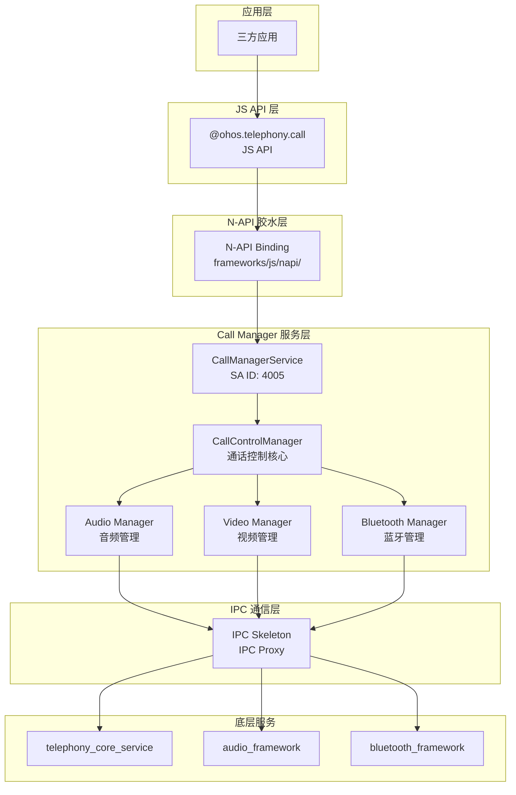
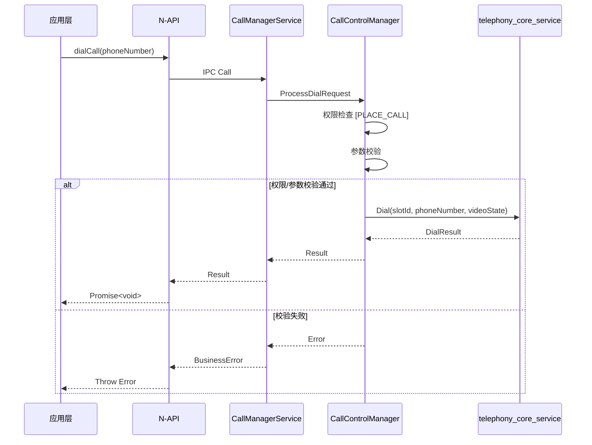

# 架构说明

**目的**: 描述模块的整体架构、组件关系和数据流向

---

## 整体架构图



---

## 组件职责

### 入口点分析

| 层级 | 入口 | 证据 |
|------|------|------|
| JS API | `interfaces/kits/js/@ohos.telephony.call.d.ts` | 模块定义 |
| N-API | `frameworks/js/napi/src/native_module.cpp:33` | `RegisterCallManagerFunc` |
| SA | `services/call_manager_service/src/call_manager_service.cpp:81` | `CallManagerService` 构造函数 |

### 服务初始化流程

```
1. SA 框架加载 libtel_call_manager.z.so
2. 调用 CallManagerService::OnStart()
3. 初始化 CallControlManager
4. 初始化各子模块:
   - CellularCallConnection
   - CallRecordsManager
   - BluetoothConnection
   - DistributedCallManager
   - DistributedCommunicationManager (if SUPPORT_DSOFTBUS)
5. 监听系统能力:
   - AUDIO_POLICY_SERVICE_ID
   - DISTRIBUTED_HARDWARE_DEVICEMANAGER_SA_ID
```

**证据**: `call_manager_service.cpp:92-116`

---

## 数据流向

### 拨号流程（简化）



---

## 线程模型

### 线程划分

| 线程/任务池 | 职责 | 证据 |
|-------------|------|------|
| 主线程 | SA OnStart/OnStop | `call_manager_service.cpp:151-191` |
| FFRT 线程池 | 异步任务处理 | `callmanager.gni:238` |
| IPC 线程 | IPC 请求处理 | IPC Skeleton |

### 关键同步机制

- **DelayedSingleton**: 核心管理器单例化（`call_manager_service.cpp:77`）
- **互斥锁**: 蓝牙回调保护（`call_manager_service.cpp:145-148`）
- **FFRT**: 异步任务调度

---

## 模块依赖关系

### 依赖方向图

```
                    ┌─────────────────┐
                    │ telephony_core  │
                    │    service      │
                    └────────┬────────┘
                             │ IPC
            ┌────────────────┼────────────────┐
            │                │                │
    ┌───────▼───────┐ ┌──────▼──────┐ ┌───────▼───────┐
    │ CallControl   │ │ Audio       │ │    Video      │
    │   Manager     │ │   Manager   │ │    Manager    │
    └───────┬───────┘ └──────┬──────┘ └───────┬───────┘
            │                │                │
            └────────────────┼────────────────┘
                             │ Internal API
                    ┌────────▼────────┐
                    │ CallManagerService│
                    │     (SA 4005)    │
                    └────────┬────────┘
                             │
                    ┌────────▼────────┐
                    │    N-API JS     │
                    │     Binding     │
                    └─────────────────┘
```

### 关键依赖

| 依赖模块 | 依赖类型 | 用途 |
|----------|----------|------|
| safwk | external | System Ability 框架 |
| samgr | external | 服务管理 |
| ipc | external | 进程间通信 |
| audio_framework | external | 音频资源 |
| access_token | external | 权限校验 |
| core_service | external | 电话核心服务 |

**证据**: `callmanager.gni:213-255`

---

## 相关文档

- [API 参考](02_API_Reference.md)
- [构建系统](03_Build_System.md)
- [安全评审](04_Security_Review.md)
