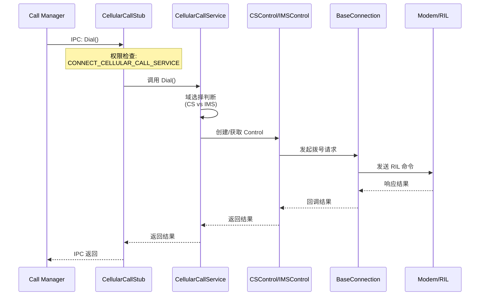
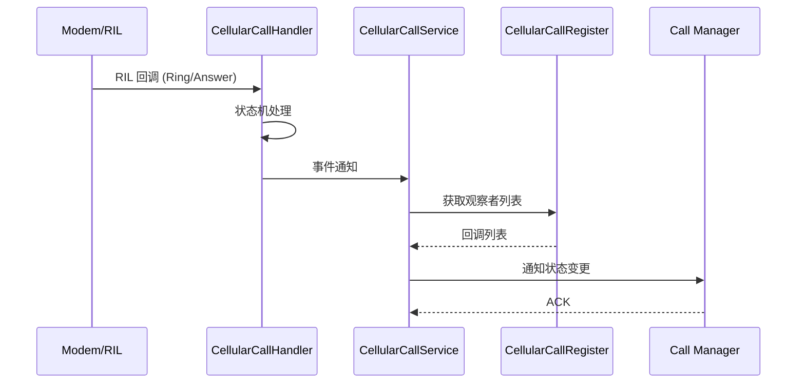

# 03 - 架构说明

## 目的

本文档描述 Cellular Call 模块的**三层架构设计、数据流设计、线程模型**，帮助开发者从宏观角度理解系统的组织方式和运行机制。

## 适用范围

- **读者对象**：架构师、系统开发者
- **前置知识**：了解 OpenHarmony SA 架构、IPC 机制
- **使用场景**：
  - 理解系统设计
  - 分析调用链路
  - 排查系统问题

---

## 3.1 三层架构模型

### 3.1.1 架构总览

```
┌─────────────────────────────────────────────────────────────────────────────┐
│                         Cellular Call 模块                                   │
│                           (SA ID: 4006)                                     │
├─────────────────────────────────────────────────────────────────────────────┤
│                                                                             │
│  ┌─────────────────────────────────────────────────────────────────────┐   │
│  │                      🔷 Cellular Call Management Layer              │   │
│  │                         (管理层 - Manager)                         │   │
│  │  ┌─────────────────┐ ┌─────────────────┐ ┌─────────────────┐      │   │
│  │  │ CellularCall    │ │ CellularCall    │ │ CellularCall    │      │   │
│  │  │ Service         │ │ Stub            │ │ Handler         │      │   │
│  │  │ (主服务)        │ │ (IPC 存根)      │ │ (RIL 回调)      │      │   │
│  │  └─────────────────┘ └─────────────────┘ └─────────────────┘      │   │
│  └─────────────────────────────────────────────────────────────────────┘   │
│                                    ↓                                        │
│  ┌─────────────────────────────────────────────────────────────────────┐   │
│  │                    🔷 Cellular Call Service Layer                    │   │
│  │                       (服务层 - Control)                             │   │
│  │  ┌─────────────────┐ ┌─────────────────┐ ┌─────────────────┐      │   │
│  │  │   CSControl    │ │   IMSControl    │ │  CellularCall   │      │   │
│  │  │  (2G/3G 控制)  │ │  (4G/5G 控制)   │ │    Config       │      │   │
│  │  └─────────────────┘ └─────────────────┘ └─────────────────┘      │   │
│  │  ┌─────────────────┐                                                 │   │
│  │  │ CellularCall    │                                                 │   │
│  │  │ Supplement       │                                                 │   │
│  │  │ (补充业务)       │                                                 │   │
│  │  └─────────────────┘                                                 │   │
│  └─────────────────────────────────────────────────────────────────────┘   │
│                                    ↓                                        │
│  ┌─────────────────────────────────────────────────────────────────────┐   │
│  │                   🔷 Cellular Call Connection Layer                  │   │
│  │                        (连接层 - Connection)                        │   │
│  │  ┌─────────────────┐ ┌─────────────────┐ ┌─────────────────┐      │   │
│  │  │  BaseConnection │ │  ConfigRequest  │ │ Supplement      │      │   │
│  │  │   (连接基类)     │ │  (配置请求)      │ │   Request       │      │   │
│  │  └─────────────────┘ └─────────────────┘ └─────────────────┘      │   │
│  └─────────────────────────────────────────────────────────────────────┘   │
│                                                                             │
├─────────────────────────────────────────────────────────────────────────────┤
│                              外部依赖                                       │
│  ┌─────────────────┐ ┌─────────────────┐ ┌─────────────────┐              │
│  │   Core Service  │ │  Call Manager   │ │     Modem       │              │
│  │    (SA 4010)   │ │   (调用方)      │ │    / RIL        │              │
│  └─────────────────┘ └─────────────────┘ └─────────────────┘              │
└─────────────────────────────────────────────────────────────────────────────┘
```

### 3.1.2 各层职责

| 层级 | 职责 | 核心组件 | 证据位置 |
|------|------|----------|----------|
| **Management** | SA 生命周期、IPC 接收、权限检查、事件分发 | `CellularCallService`, `CellularCallStub`, `CellularCallHandler` | `services/manager/include/*.h` |
| **Service** | 通话控制逻辑、域选择、状态管理 | `CSControl`, `IMSControl`, `CellularCallConfig` | `services/control/include/*.h` |
| **Connection** | 与 Modem/RIL 通信、请求发送、响应处理 | `BaseConnection`, `ConfigRequest`, `SupplementRequest` | `services/connection/include/*.h` |

---

## 3.2 数据流设计

### 3.2.1 通话建立数据流

```
┌──────────┐     ┌──────────────────┐     ┌───────────────────┐     ┌───────┐
│  Call    │     │ CellularCall     │     │   Control Layer   │     │ Modem │
│ Manager  │────▶│    Service       │────▶│   (CS/IMS)        │────▶│ /RIL  │
│          │     │  (SA 4006)       │     │                   │     │        │
└──────────┘     └──────────────────┘     └───────────────────┘     └───────┘
                         ↑                        ↑
                         │                        │
                         │     ┌──────────────────┘
                         │     │
                    ┌────┴────┴────┐
                    │  权限检查    │
                    │  状态验证    │
                    │  参数校验    │
                    └─────────────┘
```

### 3.2.2 回调事件数据流

```
┌───────┐     ┌───────────────────┐     ┌──────────────────┐     ┌──────────┐
│ Modem │────▶│   Handler         │────▶│  Handler         │────▶│  Call    │
│ /RIL  │     │  (RIL 回调)       │     │  (事件处理)      │     │ Manager  │
└───────┘     └───────────────────┘     └──────────────────┘     └──────────┘
                        ↑                        ↑
                        │                        │
                   ┌────┴────────────────────┴────┐
                   │      状态机处理              │
                   │      事件分发               │
                   │      回调通知               │
                   └────────────────────────────┘
```

---

## 3.3 线程模型

### 3.3.1 线程架构

```
┌─────────────────────────────────────────────────────────────────┐
│                     Cellular Call 线程模型                       │
├─────────────────────────────────────────────────────────────────┤
│                                                                  │
│  ┌──────────────────────────────────────────────────────────┐  │
│  │                    主线程 (EventRunner)                   │  │
│  │  ┌────────────────────────────────────────────────────┐  │  │
│  │  │  • SA 生命周期 (OnStart/OnStop)                   │  │  │
│  │  │  • IPC 请求处理 (OnRemoteRequest)                  │  │  │
│  │  │  • 状态机管理                                      │  │  │
│  │  │  • 回调通知                                        │  │  │
│  │  └────────────────────────────────────────────────────┘  │  │
│  └──────────────────────────────────────────────────────────┘  │
│                              ↓                                   │
│  ┌──────────────────────────────────────────────────────────┐  │
│  │                    FFRT 线程池 (异步任务)                   │  │
│  │  ┌────────────────┐ ┌────────────────┐ ┌──────────────┐ │  │
│  │  │ 拨号请求        │ │ 补充业务请求    │ │ RIL 通信    │ │  │
│  │  │ (Dial)         │ │ (Supplement)   │ │ 异步处理     │ │  │
│  │  └────────────────┘ └────────────────┘ └──────────────┘ │  │
│  └──────────────────────────────────────────────────────────┘  │
│                                                                  │
├─────────────────────────────────────────────────────────────────┤
│                      外部线程 (IPC 调用方)                        │
│  ┌────────────────┐                                              │
│  │  Call Manager  │  ──▶ IPC 调用 (跨进程)                      │
│  │  (调用方)       │                                              │
│  └────────────────┘                                              │
└─────────────────────────────────────────────────────────────────┘
```

### 3.3.2 线程安全机制

| 组件 | 线程安全机制 | 证据位置 |
|------|--------------|----------|
| `handlerMap_` | `handlerMapMutex_` 互斥锁 | `cellular_call_service.h:783` |
| `csControlMap_` | 互斥锁保护 | `cellular_call_service.h:785-786` |
| `imsControlMap_` | 互斥锁保护 | `cellular_call_service.h:786` |
| `mutex_` | `mutex_` 互斥锁 | `cellular_call_service.h:794` |

**证据位置**: `services/manager/include/cellular_call_service.h:782-795`

```cpp
std::mutex handlerMapMutex_;
std::map<int32_t, std::shared_ptr<CellularCallHandler>> handlerMap_;
std::map<int32_t, std::shared_ptr<CSControl>> csControlMap_;
std::map<int32_t, std::shared_ptr<IMSControl>> imsControlMap_;
std::mutex mutex_;
```

---

## 3.4 关键时序

### 3.4.1 拨号时序



### 3.4.2 来电回调时序



---

## 3.5 核心组件交互

### 3.5.1 CellularCallService 生命周期

```
┌─────────────────────────────────────────────────────────────┐
│                 CellularCallService 生命周期                 │
├─────────────────────────────────────────────────────────────┤
│                                                              │
│  [静态/动态启动]                                              │
│        ↓                                                     │
│  ┌─────────┐    ┌─────────┐    ┌─────────┐                 │
│  │ OnStart │───▶│ Running │───▶│ OnStop │                 │
│  └─────────┘    └─────────┘    └─────────┘                 │
│       │              │              │                        │
│       ↓              ↓              ↓                        │
│  • 注册 SA      • 处理 IPC      • 清理资源                  │
│  • Init()       • 事件循环      • 注销 SA                  │
│  • Handler      • 等待请求       • 停止循环                  │
│                                                              │
├─────────────────────────────────────────────────────────────┤
│  依赖: Core Service (SA 4010)                               │
│  配置: cellular_call_dynamic_start 决定静态/动态启动          │
└─────────────────────────────────────────────────────────────┘
```

### 3.5.2 IPC 接口分发

```
┌─────────────────────────────────────────────────────────────┐
│              CellularCallStub IPC 分发机制                  │
├─────────────────────────────────────────────────────────────┤
│                                                              │
│  OnRemoteRequest(code, data, reply, option)                 │
│         │                                                   │
│         ├───▶ 1. Descriptor 检查                            │
│         │     └─▶ 不匹配 → 返回错误                         │
│         │                                                   │
│         ├───▶ 2. 权限检查                                   │
│         │     ├─▶ FOUNDATION_UID (5523) → 免检            │
│         │     └─▶ 其他 UID → CheckPermission()            │
│         │           └─▶ 无权限 → 返回错误                   │
│         │                                                   │
│         └───▶ 3. 请求分发                                   │
│               └─▶ requestFuncMap_[code]                     │
│                     ├─▶ DIAL → OnDialInner()               │
│                     ├─▶ HANG_UP → OnHangUpInner()         │
│                     ├─▶ ANSWER → OnAnswerInner()           │
│                     └─▶ ... (50+ 接口)                     │
│                                                              │
├─────────────────────────────────────────────────────────────┤
│  证据位置: services/manager/src/cellular_call_stub.cpp     │
│           services/manager/include/cellular_call_stub.h     │
└─────────────────────────────────────────────────────────────┘
```

---

## 3.6 域选择逻辑

### 3.6.1 CS/IMS 域选择决策树

```
                    开始拨号请求
                          │
                          ↓
              ┌─────────────────────────┐
              │   是否紧急呼叫 (ECC)?   │
              └───────────┬─────────────┘
                    Yes   │   No
                      ↓   │
              ┌───────────────┐
              │ IMS 可用?     │
              └───────┬───────┘
                Yes  │   No
                  ↓   │
         ┌─────────────────┐
         │ 用户/策略选择?  │
         └────────┬────────┘
            │     │
       IMS  │     │  CS
         ↓   │     ↓
    ┌───────┐  ┌───────┐
    │ IMS   │  │  CS   │
    │ 拨号  │  │ 拨号  │
    └───────┘  └───────┘
```

### 3.6.2 切换场景

| 场景 | 触发条件 | 切换方向 |
|------|----------|----------|
| **CS → IMS** | IMS 注册成功、用户发起呼叫 | 上行切换 |
| **IMS → CS** | IMS 不可用、SRVCC 触发 | 下行切换 |
| **SRVCC** | 4G → 2G/3G 切换 | IMS → CS |

---

## 3.7 状态管理

### 3.7.1 通话状态机

| 状态 | 说明 | 证据位置 |
|------|------|----------|
| **CALL_STATUS_ACTIVE** | 通话激活中 | - |
| **CALL_STATUS_HOLDING** | 通话保持中 | - |
| **CALL_STATUS_DIALING** | 正在拨号 | - |
| **CALL_STATUS_RINGING** | 来电响铃 | - |
| **CALL_STATUS_INCOMING** | 来电等待 | - |
| **CALL_STATUS_DISCONNECTED** | 已挂断 | - |

### 3.7.2 SRVCC 状态

| 状态 | 说明 |
|------|------|
| **SRVCC_NONE** | 无 SRVCC (-1) |
| **STARTED** | SRVCC 开始 (0) |
| **COMPLETED** | SRVCC 完成 (1) |
| **FAILED** | SRVCC 失败 (2) |
| **CANCELED** | SRVCC 取消 (3) |

**证据位置**: `interfaces/innerkits/ims/ims_call_types.h:59-82`

---

## 相关跳转

| 目标 | 链接 |
|------|------|
| 目录结构 | [02_Directory_Structure.md](./02_Directory_Structure.md) |
| 接口规范 | [04_Interfaces.md](./04_Interfaces.md) |
| 内部 API | [05_Inner_API.md](./05_Inner_API.md) |
| 安全评审 | [07_Security_Review.md](./07_Security_Review.md) |

---

*最后更新：2026-02-06*
